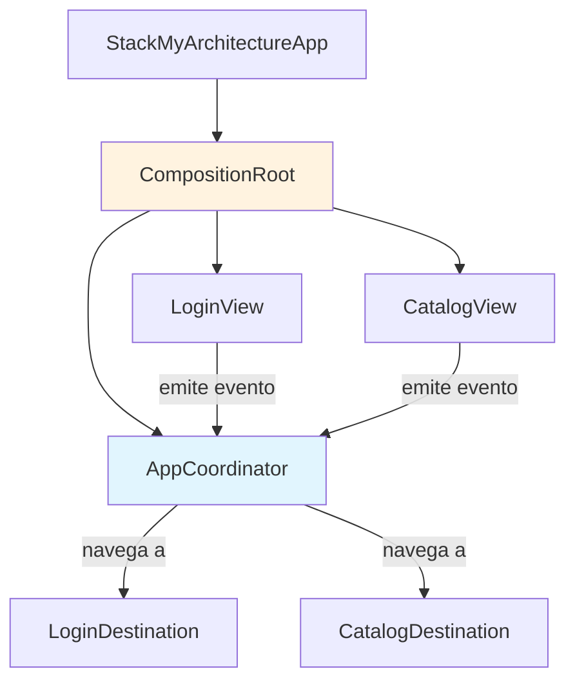

# App Final Etapa 2: Login + Catalog Funcionando Juntos

## El cierre visual de la integración

Has completado la Etapa 2: construiste la feature Catalog con sus 4 capas, implementaste navegación por eventos con `AppCoordinator`, y conectaste Login con Catalog mediante contratos desacoplados. Los tests pasan, la arquitectura es sólida.

Pero ¿has visto todo funcionando junto? Esta lección es el **cierre visual** de la Etapa 2: vamos a actualizar el `CompositionRoot` y `StackMyArchitectureApp` para que tengas una app real con navegación entre Login y Catalog. Cuando termines, tendrás:

- Login que, al autenticarse, navega automáticamente a Catalog
- Catalog que muestra productos (reales o simulados)
- Navegación fluida y desacoplada entre ambas features

> **Objetivo:** Una app compilable y visible que demuestra que tus dos features integradas realmente cooperan.

---

## Diagrama: Cómo se conecta todo al final de E2



El `AppCoordinator` es el centro de todo. Recibe eventos de las features y decide a qué pantalla navegar.

---

## Paso 1: Actualizar el AppCoordinator para múltiples features

Primero, asegúrate de que tu `AppCoordinator` (creado en la lección de navegación) pueda manejar destinos de ambas features:

**Archivo:** `App/AppCoordinator.swift`

```swift
import SwiftUI

// AppDestination enum que define TODAS las pantallas de la app.
// Centralizamos la navegación aquí para que las features no se conozcan.
enum AppDestination: Hashable, Sendable {
    case login
    case catalog
    case productDetail(id: String)  // Para futuras expansiones
}

// AppCoordinator es el único lugar que sabe cómo navegar.
// Las features le dicen "quiero ir a catalog", pero no saben cómo.
@MainActor
@Observable
final class AppCoordinator {
    // NavigationPath es la pila de navegación de SwiftUI moderno.
    // Usamos @Observable para que SwiftUI detecte cambios automáticamente.
    var navigationPath = NavigationPath()
    
    // El destino actual, útil para debugging y lógica condicional
    private(set) var currentDestination: AppDestination = .login
    
    // Navegar a un destino específico
    func navigate(to destination: AppDestination) {
        currentDestination = destination
        navigationPath.append(destination)
    }
    
    // Volver atrás
    func navigateBack() {
        guard !navigationPath.isEmpty else { return }
        navigationPath.removeLast()
    }
    
    // Ir a la raíz (logout)
    func navigateToRoot() {
        navigationPath.removeLast(navigationPath.count)
        currentDestination = .login
    }
    
    // MARK: - Factory methods para vistas
    
    // Crea la vista correspondiente a cada destino.
    // Este es el único lugar que instancia vistas concretas.
    @ViewBuilder
    func view(for destination: AppDestination) -> some View {
        switch destination {
        case .login:
            // Login no se usa directamente aquí, es la raíz
            EmptyView()
            
        case .catalog:
            // CatalogView necesita su propio ViewModel
            CatalogView(viewModel: makeCatalogViewModel())
            
        case .productDetail(let id):
            // Placeholder para futura implementación
            Text("Producto: \(id)")
        }
    }
    
    // MARK: - Private helpers
    
    private func makeCatalogViewModel() -> CatalogViewModel {
        // Stub con productos de ejemplo para que el estudiante vea algo
        let stubRepository = StubProductRepository(products: [
            Product(
                id: "1",
                name: "iPhone 16 Pro",
                description: "El mejor iPhone hasta ahora",
                price: Price(value: Decimal(999)),
                imageURL: URL(string: "https://store.apple.com/iphone.jpg")!
            ),
            Product(
                id: "2",
                name: "MacBook Air M3",
                description: "Ligera potencia",
                price: Price(value: Decimal(1299)),
                imageURL: URL(string: "https://store.apple.com/macbook.jpg")!
            ),
            Product(
                id: "3",
                name: "AirPods Pro 2",
                description: "Audio de alta fidelidad",
                price: Price(value: Decimal(249)),
                imageURL: URL(string: "https://store.apple.com/airpods.jpg")!
            )
        ])
        
        return CatalogViewModel(
            loadProductsUseCase: LoadProductsUseCase(repository: stubRepository),
            onProductSelected: { [weak self] product in
                self?.navigate(to: .productDetail(id: product.id))
            }
        )
    }
}
```

---

## Paso 2: Actualizar StackMyArchitectureApp con NavigationStack

Ahora conectamos el `AppCoordinator` con la UI usando `NavigationStack`:

**Archivo:** `App/StackMyArchitectureApp.swift`

```swift
import SwiftUI

@main
struct StackMyArchitectureApp: App {
    // Creamos el coordinador una sola vez, vive durante toda la app
    @State private var coordinator = AppCoordinator()
    
    var body: some Scene {
        WindowGroup {
            NavigationStack(path: $coordinator.navigationPath) {
                // Vista raíz: Login
                LoginView(
                    viewModel: makeLoginViewModel()
                )
                .navigationDestination(for: AppDestination.self) { destination in
                    // SwiftUI usa esta closure para renderizar destinos
                    coordinator.view(for: destination)
                }
            }
        }
    }
    
    // MARK: - Factory methods
    
    private func makeLoginViewModel() -> LoginViewModel {
        let stubGateway = StubAuthGateway(
            behaviour: .successAfterDelay(
                token: "demo-token",
                delay: .seconds(1)
            )
        )
        
        return LoginViewModel(
            loginUseCase: LoginUseCase(gateway: stubGateway),
            onLoginSucceeded: { [coordinator] session in
                // Cuando login tiene éxito, navegamos a catalog
                print("✅ Login exitoso: \(session.token)")
                coordinator.navigate(to: .catalog)
            }
        )
    }
}
```

**Cambios clave desde E1:**
1. Ahora usamos `NavigationStack` con `path: $coordinator.navigationPath`
2. Añadimos `.navigationDestination(for: AppDestination.self)` para manejar navegación
3. El `onLoginSucceeded` ahora llama a `coordinator.navigate(to: .catalog)`

---

## Paso 3: Crear el StubProductRepository (si no existe)

Para que Catalog funcione sin backend, creamos un stub:

**Archivo:** `Features/Catalog/Infrastructure/StubProductRepository.swift`

```swift
import Foundation

// StubProductRepository implementa el protocolo ProductRepository
// devolviendo datos de ejemplo. Útil para desarrollo y demos.
actor StubProductRepository: ProductRepository {
    private let products: [Product]
    private let delay: Duration
    
    init(
        products: [Product] = StubProductRepository.sampleProducts,
        delay: Duration = .milliseconds(500)
    ) {
        self.products = products
        self.delay = delay
    }
    
    func getAll() async throws -> [Product] {
        // Simulamos latencia de red
        try await Task.sleep(for: delay)
        return products
    }
    
    // Productos de ejemplo para que el estudiante vea algo inmediatamente
    static var sampleProducts: [Product] {
        [
            Product(
                id: "1",
                name: "Swift Programming Book",
                description: "Aprende Swift desde cero con ejemplos prácticos",
                price: Price(value: Decimal(39.99)),
                imageURL: URL(string: "https://picsum.photos/200/300?random=1")!
            ),
            Product(
                id: "2",
                name: "iOS Architecture Patterns",
                description: "Clean Architecture, MVVM, y más",
                price: Price(value: Decimal(49.99)),
                imageURL: URL(string: "https://picsum.photos/200/300?random=2")!
            ),
            Product(
                id: "3",
                name: "SwiftUI Mastery",
                description: "Construye interfaces modernas",
                price: Price(value: Decimal(44.99)),
                imageURL: URL(string: "https://picsum.photos/200/300?random=3")!
            ),
            Product(
                id: "4",
                name: "Combine Framework Guide",
                description: "Programación reactiva en iOS",
                price: Price(value: Decimal(34.99)),
                imageURL: URL(string: "https://picsum.photos/200/300?random=4")!
            ),
            Product(
                id: "5",
                name: "Core Data Advanced",
                description: "Persistencia de datos en iOS",
                price: Price(value: Decimal(54.99)),
                imageURL: URL(string: "https://picsum.photos/200/300?random=5")!
            )
        ]
    }
}
```

---

## Paso 4: Asegurar que LoginViewModel emite el evento

Verifica que tu `LoginViewModel` tenga el closure `onLoginSucceeded`:

```swift
// En Features/Login/Interface/LoginViewModel.swift

@MainActor
@Observable
class LoginViewModel {
    private let loginUseCase: LoginUseCase
    private let onLoginSucceeded: (Session) -> Void
    
    var email: String = ""
    var password: String = ""
    var isLoading: Bool = false
    var errorMessage: String?
    
    init(
        loginUseCase: LoginUseCase,
        onLoginSucceeded: @escaping (Session) -> Void
    ) {
        self.loginUseCase = loginUseCase
        self.onLoginSucceeded = onLoginSucceeded
    }
    
    func submit() async {
        isLoading = true
        errorMessage = nil
        
        do {
            let emailVO = try Email(value: email)
            let passwordVO = try Password(value: password)
            let credentials = Credentials(email: emailVO, password: passwordVO)
            
            let session = try await loginUseCase.execute(credentials: credentials)
            
            // ÉXITO: Emitimos el evento al coordinador
            onLoginSucceeded(session)
            
        } catch let error as AuthError {
            errorMessage = error.localizedDescription
        } catch {
            errorMessage = "Error desconocido"
        }
        
        isLoading = false
    }
}
```

---

## Paso 5: Build y Run - La prueba de fuego

**Instrucciones:**

1. **Compila:** `Cmd + B`
   - Debe dar "Build Succeeded"
   - Si hay errores de "Cannot find in scope", verifica los imports y targets

2. **Ejecuta:** `Cmd + R`
   - El simulador se abrirá con el formulario de Login

3. **Prueba el flujo completo:**
   - Email: `user@test.com`
   - Password: `password123`
   - Pulsa "Iniciar sesión"
   - Verás el spinner por 1 segundo
   - **Automáticamente** navegarás a la pantalla de Catalog
   - Deberías ver una lista de 5 productos con imágenes y precios

4. **Verifica la navegación:**
   - En Catalog, pulsa un producto
   - Debería ir a la vista de detalle (placeholder por ahora)
   - Pulsa "Back" en la navegación
   - Debería volver a Catalog

---

## Troubleshooting: Problemas comunes

| Problema | Causa probable | Solución |
|----------|---------------|----------|
| "NavigationPath not found" | iOS 16+ requerido | Verifica deployment target ≥ iOS 16 |
| No navega después de login | Closure no llamado | Revisa que `onLoginSucceeded(session)` se ejecute |
| Catalog vacío | Stub no tiene datos | Verifica que `StubProductRepository` devuelva productos |
| Imágenes no cargan | URL inválida | Usa URLs de picsum.photos o placeholders locales |
| "Cannot find 'AppCoordinator'" | Archivo no en target | Selecciona archivo → Inspector → Target membership |

---

## Captura de pantalla esperada

Tu app debe verse así:

**Login:**
```
┌─────────────────────────┐
│  StackMyArchitecture    │
│                         │
│  ┌───────────────────┐  │
│  │ user@test.com     │  │  ← Campo email
│  └───────────────────┘  │
│  ┌───────────────────┐  │
│  │ ••••••••••••      │  │  ← Campo password
│  └───────────────────┘  │
│                         │
│  ┌───────────────────┐  │
│  │ Iniciar sesión    │  │  ← Botón azul
│  └───────────────────┘  │
│                         │
└─────────────────────────┘
```

**Catalog (después de login):**
```
┌─────────────────────────┐
│  ⌄ Catalog              │
│                         │
│ ┌─────┐ Swift Prog... │
│ │ 📚  │ $39.99         │
│ └─────┘                │
│ ┌─────┐ iOS Arch...   │
│ │ 📱  │ $49.99         │
│ └─────┘                │
│ ┌─────┐ SwiftUI Ma... │
│ │ 🎨  │ $44.99         │
│ └─────┘                │
│         ...             │
└─────────────────────────┘
```

---

## Checkpoint: ¿Todo funciona?

- [ ] App compila sin errores
- [ ] Veo formulario de login en simulador
- [ ] Login con credenciales válidas navega a Catalog
- [ ] Veo lista de productos en Catalog
- [ ] Puedo hacer tap en un producto (va a detalle)
- [ ] Navegación "Back" funciona

**Si todo está ✅, has completado la Etapa 2.** Tienes:
- Dos features completas (Login + Catalog)
- Navegación desacoplada por eventos
- Una app ejecutable y visible

---

## ¿Qué sigue?

La **Etapa 3 (Evolución)** añadirá:
- Caching local con SwiftData
- Sincronización offline/online
- Observabilidad (logging, métricas)
- Tests de integración reales

Pero primero, revisa los entregables de la Etapa 2.

---

**Siguiente paso:** [Entregables Etapa 2](entregables-etapa-2.md)
