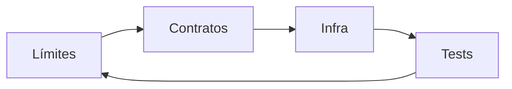

# Entregables — Etapa 2: Integración

## Para qué sirve este documento

Este documento define cómo se cierra de verdad la etapa de integración. No es una lista de archivos para "cumplir"; es una guía para comprobar que el alumno ha pasado de construir features aisladas a diseñar un sistema modular que coopera bien.

Si Etapa 2 se aprueba sin criterio fuerte, el alumno puede creer que integra bien cuando solo está moviendo dependencias de sitio. Si se aprueba con evidencia operativa, el alumno desarrolla reflejos que sí sirven en un equipo enterprise.

---

## Resultado global esperado de la etapa

Al terminar Etapa 2, el sistema debe poder demostrar:

1. **Colaboración desacoplada** entre Login y Catalog.
2. **Navegación event-driven** con coordinador central.
3. **Infraestructura real mínima** sin contaminar core.
4. **Contratos compartidos mínimos y estables**.
5. **Pruebas de integración útiles** además de unit tests.

---

## Entregables técnicos obligatorios

## 1) Feature Catalog completa

Debe existir implementación por capas:

- Domain: modelos, invariantes, errores de negocio.
- Application: puertos y casos de uso.
- Infrastructure: repositorio remoto/stub y mapeo de DTO.
- Interface: ViewModel y vistas SwiftUI.

Criterio de aceptación:
- cada capa cumple una responsabilidad clara,
- sin imports que violen límites Clean.

## 2) Mecanismo de navegación por eventos

Debe existir:

- un coordinador (o equivalente) que decide rutas,
- eventos emitidos desde features,
- lógica de navegación fuera de vistas y use cases de dominio.

Criterio de aceptación:
- Login no conoce internals de Catalog,
- Catalog no conoce internals de Login,
- el cambio de flujo se realiza por evento/contrato.

## 3) Contratos entre features

Debe existir una zona de contratos compartidos con mínimo acoplamiento.

Criterio de aceptación:
- se comparte solo lo imprescindible,
- cada tipo compartido tiene propósito claro,
- no existe “shared” inflado sin ownership.

## 4) Infraestructura real mínima

Debe existir `HTTPClient` real con implementación de transporte.

Criterio de aceptación:
- traducción explícita de errores externos,
- mapeo DTO -> dominio sin filtrar detalles de red al core.

## 5) Integration tests

Debe existir al menos un conjunto de tests que validen colaboración real entre componentes.

Criterio de aceptación:
- prueban comportamiento entre capas,
- detectan problemas que unit tests no detectan.

---

## Evidencia mínima por entregable

Cada entregable debe incluir cuatro piezas:

1. **Decisión**: por qué se hizo así y no de otra manera.
2. **Implementación**: código final relevante.
3. **Validación**: tests que prueban comportamiento.
4. **Operación**: señal de diagnóstico o criterio de mantenimiento.

Sin estas cuatro piezas, el entregable está incompleto.

---

## Rubrica de evaluación (junior -> mid real)

## Dimensión A: diseño de integración

Nivel básico:
- integra por llamadas directas entre features.

Nivel esperado:
- integra por eventos/contratos con coordinador.

Nivel fuerte:
- explica trade-offs y protege límites con pruebas/reglas.

## Dimensión B: calidad de pruebas

Nivel básico:
- solo unit tests aislados.

Nivel esperado:
- unit + integration para rutas críticas.

Nivel fuerte:
- integration tests estables, útiles y trazables a BDD.

## Dimensión C: claridad de contratos

Nivel básico:
- tipos compartidos ambiguos.

Nivel esperado:
- contratos mínimos con semántica de negocio.

Nivel fuerte:
- contratos preparados para evolucionar sin romper consumidores.

## Dimensión D: criterio arquitectónico

Nivel básico:
- decisiones por intuición.

Nivel esperado:
- decisiones razonadas con alternativas.

Nivel fuerte:
- decisiones documentadas con triggers de cambio.

---

## Mapa de skills aplicadas en Etapa 2

| Skill | Dónde se aplica | Evidencia que debe dejar |
| --- | --- | --- |
| `swift-concurrency` | Coordinador, eventos, boundaries async | aislamiento justificado, eventos `Sendable`, cancelación correcta |
| `swiftui-expert-skill` | Interface de Catalog y navegación | flujo de estado correcto, vistas sin lógica de negocio, APIs modernas |
| `windsurf-rules-ios` (si aplica) | consistencia de arquitectura iOS | reglas Clean + BDD/TDD mantenidas durante integración |

La skill está aplicada solo si cambia decisiones y resultados verificables.

---

## Quality gates de cierre de Etapa 2

Etapa 2 se considera cerrada cuando pasan todos:

1. **Gate de límites arquitectónicos**
   - No hay dependencia interna cruzada entre features.

2. **Gate de contratos y navegación**
   - Eventos/contratos gobiernan integración y rutas.

3. **Gate de infraestructura**
   - Infra real mínima integrada con errores/mapeo explícitos.

4. **Gate de pruebas**
   - Unit + integration en verde para flujos críticos.

Si uno falla, la etapa no está cerrada.

---

## Señales de que el alumno ya está en nivel Mid

El alumno sube de nivel cuando puede:

- diseñar integración sin atajos de dependencia directa,
- argumentar qué prueba va en unit y cuál en integration,
- detectar acoplamientos ocultos antes de que exploten,
- mantener velocidad de entrega sin romper coherencia arquitectónica.

---

## Anti-patrones que invalidan el cierre

- “Integración” basada en imports laterales entre features.
- Shared kernel convertido en repositorio de utilidades sin dueño.
- Tests de integración inexistentes o puramente cosméticos.
- Navegación con reglas dispersas en cada vista.
- Decisiones críticas sin rastro documental.

Si aparece uno de estos de forma relevante, la etapa debe reabrirse.

---

## Métricas de control recomendadas para esta etapa

| Métrica | Qué mide | Alerta roja |
| --- | --- | --- |
| Cambios cross-feature por historia | Acoplamiento real | Cada cambio toca ambos módulos sin necesidad |
| Incidencias por navegación inconsistente | Salud de coordinación | Aumento sostenido tras integrar Catalog |
| Bugs de mapping DTO/dominio | Calidad de infraestructura | Fallos repetidos en integración real |
| Tiempo medio de arreglar integración | Operabilidad de arquitectura | Sube sprint tras sprint |

---

## Checklist final de entrega

- [ ] Feature Catalog completa por capas y con tests.
- [ ] Navegación por eventos implementada y validada.
- [ ] Contratos compartidos mínimos, claros y trazables.
- [ ] Infra real mínima integrada con mapeo y errores tipados.
- [ ] Integration tests en rutas críticas.
- [ ] ADR/decisiones de etapa documentadas.
- [ ] Skills aplicadas con evidencia en código y pruebas.

---

## Cierre

Etapa 2 no termina cuando “funciona el catálogo”. Termina cuando el sistema demuestra que puede crecer por features sin degradarse. Ese es el primer gran salto de madurez profesional.

**Anterior:** [Integration Tests ←](05-integration-tests.md) · **Siguiente:** [Etapa 3: Evolución →](../03-evolucion/00-introduccion.md)
