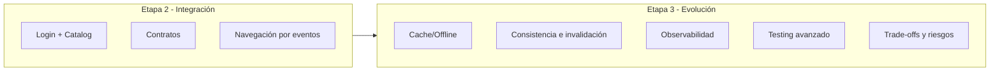
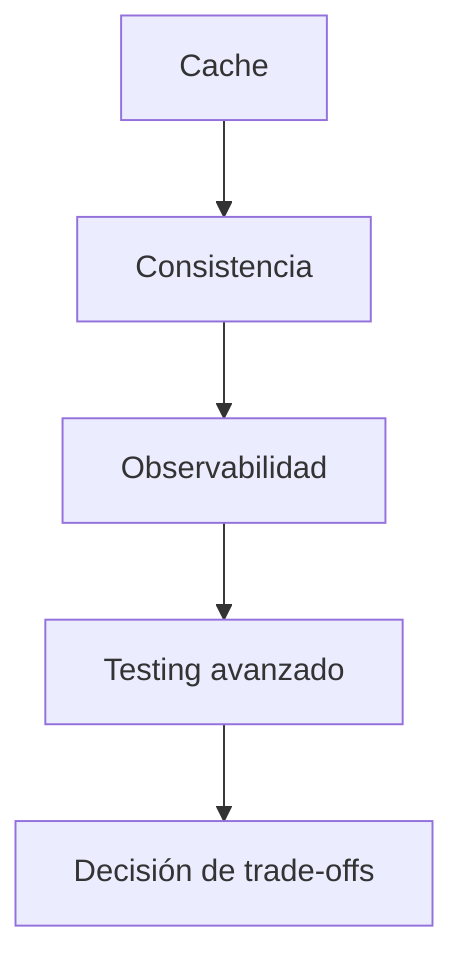
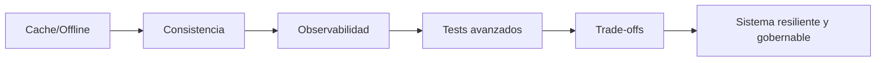

# Etapa 3: Evolución — Resiliencia y calidad de producción

## Por qué esta etapa separa a un equipo “correcto” de un equipo “confiable”

Hasta Etapa 2 ya tienes arquitectura limpia, integración entre features, navegación desacoplada y base de tests. Eso es mucho. Pero todavía hay una diferencia importante entre "funciona" y "resiste":

- Funciona cuando todo sale bien.
- Resiste cuando el mundo real se comporta mal.

Etapa 3 es exactamente esa frontera. Aquí entrenamos al alumno para diseñar **bajo incertidumbre operativa**: red intermitente, latencia alta, datos desactualizados, eventos que no se ven, bugs que aparecen solo en producción y decisiones con coste no trivial.

En términos de progresión:

- Etapa 1: aprender a construir una feature.
- Etapa 2: aprender a integrar features.
- Etapa 3: aprender a **evolucionar un sistema vivo sin romperlo**.

---

## Objetivo de etapa (definido en lenguaje de negocio y operación)

Al cerrar esta etapa, el sistema debe cumplir simultáneamente:

1. **Disponibilidad funcional en condiciones degradadas**.
   - Si falla red, el usuario debe recibir comportamiento útil cuando sea razonable.

2. **Consistencia explícita, no implícita**.
   - Debe existir una política clara para decidir cuándo un dato cacheado sigue siendo aceptable.

3. **Observabilidad mínima operable**.
   - El equipo debe poder responder “qué pasó” sin abrir el código a ciegas.

4. **Capacidad de decisión arquitectónica con trade-offs documentados**.
   - Cada mejora debe justificar su coste y trigger de revisión.

---

## Qué cambia respecto a Etapa 2

En Etapa 2 integraste dos features. En Etapa 3 no añadimos tantas pantallas nuevas; añadimos **capacidades transversales** que sostienen la operación.

Mensaje clave para el alumno:
- Ya no se trata solo de “añadir código”,
- se trata de **transformar comportamiento bajo fallo** sin romper contratos existentes.

---

## Contrato pedagógico de Etapa 3 (aplica a cada lección)

Cada lección de esta etapa debe cumplir estas 6 capas:

1. Definición simple (nivel junior / 14 años).
2. Modelo mental interno (cómo funciona por dentro).
3. Cuándo sí / cuándo no (límites y anti-patrones).
4. Ejemplo mínimo (mecánica base).
5. Ejemplo realista enterprise (flujo completo).
6. Depuración y riesgos (cómo falla y cómo se corrige).

Además, cada lección debe dejar evidencia en 4 piezas:

- decisión,
- implementación,
- validación,
- operación.

Si falta una pieza, la lección no está cerrada.

---

## Mapa operativo de la etapa

## Lección 1 — Caching/offline

Pregunta que resuelve:
- ¿Cómo damos continuidad de experiencia cuando no hay red?

Capacidad que añade:
- fallback a datos locales bajo política explícita.

## Lección 2 — Consistencia e invalidación

Pregunta que resuelve:
- ¿Cómo evitamos que cache útil se convierta en mentira peligrosa?

Capacidad que añade:
- reglas de frescura (TTL, refresh, invalidación por eventos).

## Lección 3 — Observabilidad

Pregunta que resuelve:
- ¿Cómo reconstruimos un fallo de producción sin adivinar?

Capacidad que añade:
- logging estructurado y correlación de flujo.

## Lección 4 — Tests avanzados

Pregunta que resuelve:
- ¿Cómo probamos cancelación, concurrencia y tiempo sin tests flaky?

Capacidad que añade:
- pruebas deterministas para condiciones no triviales.

## Lección 5 — Trade-offs

Pregunta que resuelve:
- ¿Cuándo una mejora técnica realmente compensa su complejidad?

Capacidad que añade:
- marco de decisión para arquitectura bajo presión.

El orden no es accidental: cada bloque prepara el siguiente.

---

## Modelo mental de resiliencia (explicado de forma simple)

Piensa en la app como un coche:

- Etapa 1 te dio motor (feature bien hecha).
- Etapa 2 te dio transmisión (features coordinadas).
- Etapa 3 te da frenos, cinturón y panel de diagnóstico.

Sin eso, el coche corre… hasta que algo falla.

Con eso, el coche sigue siendo controlable cuando el entorno se vuelve hostil.

---

## Skills aplicadas en Etapa 3

## `swift-concurrency`

Se aplica en:
- cancelación de tareas,
- límites de aislamiento en cache/repositorios,
- tests concurrentes deterministas.

Resultado esperado:
- no usar `@MainActor` como parche,
- ownership claro de tareas.

## `swiftui-expert-skill`

Se aplica en:
- estados de pantalla coherentes (`loading/loaded/empty/error`),
- refresh y transiciones de UI sin estados imposibles,
- coste de render bajo control al crecer la complejidad.

Resultado esperado:
- ViewModel gobierna estado,
- vista representa estado, no reglas de negocio.

## `windsurf-rules-ios` (si aplica al repositorio objetivo)

Se aplica en:
- mantener Clean Architecture bajo presión de cambios,
- decisiones explícitas de dominio/aplicación/infra,
- continuidad de BDD->TDD en capacidades transversales.

Resultado esperado:
- evolución sin erosión arquitectónica.

---

## Riesgos típicos de esta etapa (y cómo anticiparlos)

## Riesgo 1: convertir cache en “verdad absoluta”

Síntoma:
- el sistema prioriza cache siempre aunque exista red y datos nuevos.

Mitigación:
- política explícita (network-first o cache-first) + documentación.

## Riesgo 2: confundir observabilidad con spam de logs

Síntoma:
- cientos de logs inútiles, sin contexto de negocio.

Mitigación:
- esquema de eventos y campos mínimos obligatorios.

## Riesgo 3: tests avanzados inestables

Síntoma:
- pasan/fallan aleatoriamente por timing.

Mitigación:
- control de tiempo inyectado y eliminación de dependencias no deterministas.

## Riesgo 4: aumentar complejidad sin beneficio de usuario

Síntoma:
- se añade infraestructura “por arquitectura”, no por necesidad.

Mitigación:
- matriz de trade-offs con trigger claro para adoptar/cambiar.

---

## Criterio de éxito de Etapa 3

Etapa 3 está cerrada solo si se puede demostrar:

1. El usuario recibe experiencia útil ante fallos previsibles de red.
2. La política de consistencia está escrita y probada.
3. El equipo puede diagnosticar fallos con señales concretas.
4. Las mejoras están justificadas por costo/beneficio, no por moda.
5. Todo esto se implementó sin romper la base de etapas 1 y 2.

---

## Checklist de autoevaluación

- [ ] Puedo explicar por qué la estrategia de cache elegida es la correcta para este dominio.
- [ ] Puedo defender cuándo un dato cacheado aún es aceptable.
- [ ] Puedo seguir un fallo de catálogo de extremo a extremo con logs/trazas.
- [ ] Puedo escribir tests de cancelación/TTL sin flakiness.
- [ ] Puedo justificar una decisión técnica con trade-off y trigger de cambio.

---

## Siguiente paso

Empieza por `01-caching-offline.md` con mentalidad de sistema, no de feature. Vas a aprender a diseñar comportamiento degradado sin romper contratos.

**Siguiente:** [Caching y offline →](01-caching-offline.md)

---

## Indicadores prácticos de que Etapa 3 está funcionando

No basta con “tenemos cache y logs”. Necesitas señales de resultado.

Indicadores recomendados:

- menor tasa de errores visibles en rutas críticas sin red;
- reducción del tiempo medio para diagnosticar incidentes;
- disminución de regresiones por concurrencia en PRs;
- mejora de confianza del equipo al refactorizar.

Supuesto de medición inicial simple:

- llevar registro por sprint de incidentes de fallback, consistencia y cancelación.

---

## Secuencia recomendada de estudio para el alumno

1. estudiar estrategia de cache/offline;
2. practicar invalidación y consistencia con ejemplos temporales;
3. montar observabilidad mínima;
4. diseñar tests avanzados deterministas;
5. cerrar con decisiones A/B/C y ADRs de etapa.

No cambies el orden. Cada lección depende de la anterior.

---

## Errores de aprendizaje típicos en esta etapa

### Error 1: implementar cache sin política

Consecuencia:

- comportamiento impredecible bajo fallo.

### Error 2: observar demasiado tarde

Consecuencia:

- no saber por qué falla lo que ya desplegaste.

### Error 3: confundir tests avanzados con tests lentos

Consecuencia:

- evitar escenarios críticos por miedo al coste.

Corrección transversal:

- mantener enfoque determinista y por riesgo, no por volumen.

---

## Diagrama de cierre de etapa

---

## Cierre extendido

Etapa 3 enseña una habilidad clave de ingeniería profesional: sostener calidad cuando el entorno es imperfecto. Esa habilidad es la base para entrar en gobernanza de plataforma en Etapa 4 con criterio real, no teórico.

---

## Plan recomendado por sprint (aplicación real)

### Sprint A

- implementar cache/offline y consistencia básica;
- cubrir casos críticos con tests de fallback y TTL.

### Sprint B

- introducir observabilidad estructurada y correlación;
- añadir tests avanzados de cancelación/backpressure.

### Sprint C

- consolidar trade-offs con ADRs;
- preparar transición de aprendizajes a gobernanza de Etapa 4.

Este plan evita intentar resolver toda resiliencia en una sola iteración.

---

## Evidencias mínimas para pasar a Etapa 4

- matriz de pruebas de etapa aplicada en flujos reales;
- política de consistencia documentada y validada;
- runbook de observabilidad funcional;
- ADRs de trade-offs con triggers claros.

Si faltan estas evidencias, la etapa no está madura aunque el código compile.

---

## Anti-objetivos de la etapa

Para evitar desviaciones:

- no optimizar micro-performance sin evidencia;
- no añadir tooling de observabilidad compleja sin necesidad;
- no cubrir casos irrelevantes solo para subir conteo de tests.

El foco es resiliencia útil y sostenible, no complejidad ornamental.
