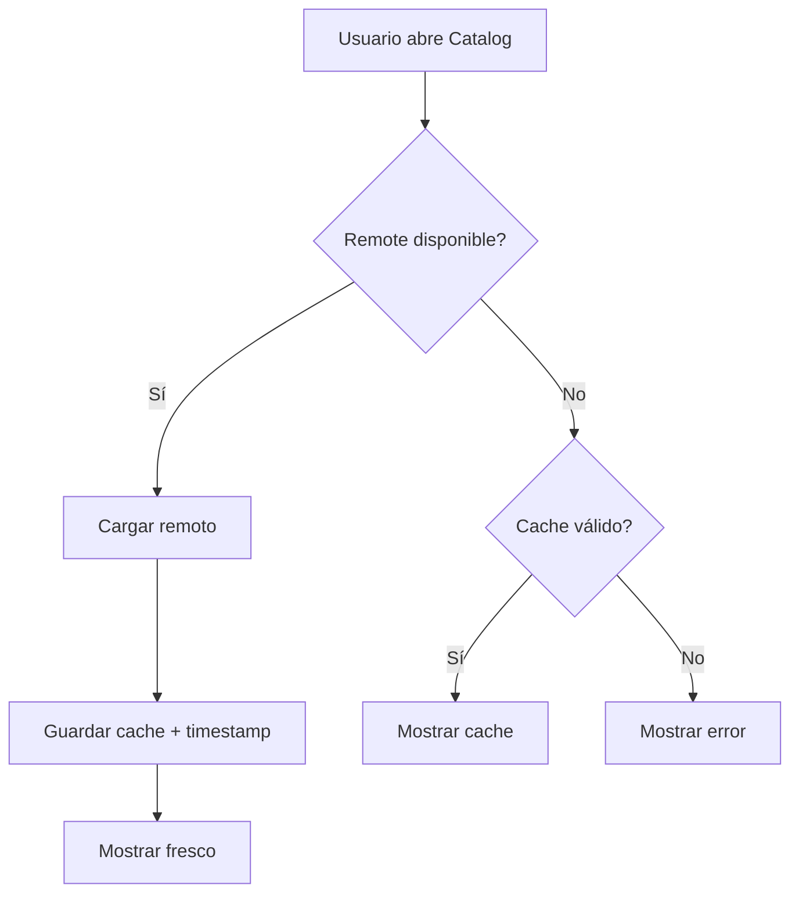
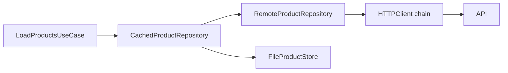
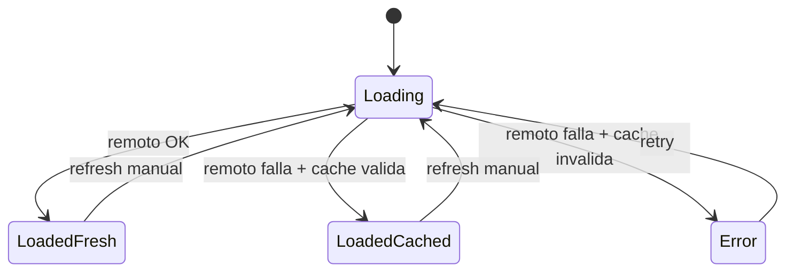

# Caching y offline

> **Nota de nomenclatura:** Esta lección usa nombres genéricos (`ProductRepository`, `ProductStore`, `CachedProductRepository`) para explicar el patrón. En el scaffold real (`apps/ios/ArchitectureKit`), los equivalentes son `CatalogRepository`, `CatalogCacheStore` y `CachedCatalogRepository`. El patrón es idéntico; los nombres reflejan que el dominio concreto es Catalog.

## Qué problema resolvemos realmente

Si una app móvil solo funciona con red perfecta, no está lista para producción. El usuario entra al metro, cambia de zona de cobertura, recibe latencia alta o pierde conexión por segundos. En esos momentos, el sistema no debe derrumbarse en "error y reintentar" si tiene datos recientes que todavía aportan valor.

Esta lección define cómo incorporar cache/offline de forma profesional:

- sin contaminar el core de negocio,
- sin esconder inconsistencias,
- sin convertir la arquitectura en un laberinto.

---

## Definición simple

Cache es guardar una copia local de datos para responder rápido o degradar bien cuando falla la fuente principal.

Offline-friendly no significa “funciona todo sin internet”. Significa “las rutas críticas siguen siendo útiles en escenarios de conectividad degradada”.

```swift
// ❌ Sin cache: cualquier fallo de red deja la pantalla vacía
func fetchCatalog() async throws -> [Product] {
    try await remote.fetchProducts()  // Timeout, 500, sin cobertura → .error
}

// ✅ Con cache: degrada con dignidad cuando la red falla
func fetchCatalog() async throws -> [Product] {
    do {
        let fresh = try await remote.fetchProducts()
        try? await store.save(products: fresh, timestamp: now())
        return fresh
    } catch {
        guard let cached = try? await store.load(), isValid(cached) else {
            throw error  // Sin cache útil → propaga el error
        }
        return cached.products  // Datos de hace N minutos, mejores que nada
    }
}
```

La diferencia no es complejidad: es una decisión de diseño sobre qué le pasa al usuario cuando el servidor falla.

---

## Modelo mental interno

Piensa en tres niveles de verdad:

1. **Fuente primaria**: backend remoto (verdad canónica).
2. **Fuente secundaria**: caché local (verdad temporal).
3. **UI**: representación con contexto de frescura/error.

La clave no es esconder que el dato puede estar viejo. La clave es decidir cuándo ese dato temporal sigue siendo mejor que no mostrar nada.


```mermaid
flowchart TD
    U["Usuario abre Catalog"] --> R{"Remote disponible?"}
    R -->|"Sí"| REM["Cargar remoto"]
    REM --> SAVE["Guardar cache + timestamp"]
    SAVE --> SHOW_FRESH["Mostrar fresco"]

    R -->|"No"| CACHE{"Cache válido?"}
    CACHE -->|"Sí"| SHOW_CACHE["Mostrar cache"]
    CACHE -->|"No"| SHOW_ERR["Mostrar error"]
```

Lectura del diagrama:

→ **Punto de entrada**: el usuario abre Catalog. El ViewModel llama `fetchCatalog()` — una sola operación desde la perspectiva de la UI.

→ **Bifurcación 1** (¿Remote disponible?): el sistema comprueba conectividad antes de hacer la petición de red. Esto evita timeouts innecesarios cuando el dispositivo está claramente offline.

→ **Ruta feliz** (Remote OK): datos frescos → guardar con timestamp → mostrar. El timestamp es crítico: es la "fecha de nacimiento" del dato en cache. Sin él, no hay TTL posible.

→ **Ruta de fallo, bifurcación 2** (¿Cache válido?): si el remote falla, el sistema no se rinde todavía. Comprueba si hay cache y si está dentro del TTL. Dos condiciones independientes: existencia Y frescura.

→ **Cache válido → mostrar**: el usuario ve datos de hace N minutos. No hay red, pero hay información útil. La UI debe indicar que los datos pueden no ser recientes.

→ **Sin cache útil → error**: sin red y sin cache aprovechable, el sistema es honesto. Mostrar error es la respuesta correcta — mejor que mostrar datos que pueden estar gravemente desactualizados.

---

## Cuándo sí / cuándo no usar cache en este contexto

### Cuándo sí

- Catálogo de productos que cambia moderadamente.
- Experiencia donde “algo útil” es mejor que “pantalla vacía”.
- Dominio donde una ventana corta de desactualización es aceptable.

```swift
// ✅ Cache apropiada — catálogo de productos con TTL de 5 minutos
// Si el usuario pierde cobertura en el metro, ve productos de hace 4 minutos.
// Eso es mejor que “Error: sin conexión” en una pantalla de compras.
let ttl: TimeInterval = 5 * 60  // 5 minutos

func fetchCatalog() async throws -> [Product] {
    do {
        let fresh = try await remote.fetchProducts()
        await store.save(fresh, timestamp: .now)
        return fresh
    } catch {
        guard let cached = await store.load(),
              Date.now.timeIntervalSince(cached.timestamp) < ttl else {
            throw error
        }
        return cached.products  // Dato de hace <5 min: aceptable para este dominio
    }
}
```

### Cuándo no (o con más cuidado)

- Datos financieros en tiempo real.
- Operaciones críticas con impacto legal/contable inmediato.
- Flujos donde stale data puede inducir decisiones erróneas graves.

```swift
// ❌ Cache inapropiada — saldo bancario o tipo de cambio en tiempo real
// Un usuario podría confirmar una transferencia basándose en un saldo de hace 10 minutos.
// El coste de la información desactualizada supera el coste de la mala UX.
func fetchBalance() async throws -> Balance {
    // Si hay cache → devolverla sin preguntar... ❌
    if let cached = await store.load() { return cached }
    return try await remote.fetchBalance()
    // Si falla: mostrar error. No hay alternativa aceptable con stale data.
}

// ✅ En dominios críticos: sin cache, o cache solo para display con aviso explícito
func fetchBalance() async throws -> BalanceResult {
    do {
        return .current(try await remote.fetchBalance())
    } catch {
        if let cached = await store.load() {
            // Mostrar el dato viejo pero con contexto claro en UI
            return .stale(cached, lastUpdated: cached.timestamp)
            // La UI muestra: “Saldo actualizado el HH:MM — actualiza para ver el valor real”
        }
        throw error
    }
}
```

La regla práctica: si el usuario puede tomar una decisión irreversible basándose en el dato, no uses cache silenciosa.

---

## Estrategia elegida para Etapa 3

Estrategia base de la etapa:

- **Network-first**.
- Fallback a cache si falla remoto.
- Validez por TTL explícito.

Por qué:

- mantiene frescura cuando hay red,
- mantiene continuidad cuando no la hay,
- y su complejidad es manejable para el nivel actual.

---

## Diseño por capas (Clean + DDD)

## Domain

- `Product`, `Price`, `CatalogError`.
- Sin detalles de archivo, JSON o HTTP.

## Application

- caso de uso `LoadProductsUseCase` depende de `ProductRepository`.
- no sabe si hay cache o remoto.

## Infrastructure

- `RemoteProductRepository`.
- `ProductStore` (persistencia local).
- `CachedProductRepository` como decorador.

## Interface

- estado UI coherente (`loading/loaded/empty/error`).
- mensaje adecuado según política de fallback.

---

## Implementación mínima (mecánica)

```swift
final class CachedProductRepository: ProductRepository, @unchecked Sendable {
    private let remote: any ProductRepository
    private let store: any ProductStore
    private let maxAge: TimeInterval
    private let now: @Sendable () -> Date

    init(
        remote: any ProductRepository,
        store: any ProductStore,
        maxAge: TimeInterval = 300,
        now: @Sendable @escaping () -> Date = { Date() }
    ) {
        self.remote = remote
        self.store = store
        self.maxAge = maxAge
        self.now = now
    }

    func loadAll() async throws -> [Product] {
        do {
            let fresh = try await remote.loadAll()
            try? await store.save(fresh, timestamp: now())
            return fresh
        } catch {
            if let cached = try? await store.load(), isValid(cached.timestamp) {
                return cached.products
            }
            throw error
        }
    }

    private func isValid(_ timestamp: Date) -> Bool {
        now().timeIntervalSince(timestamp) < maxAge
    }
}
```

Este código demuestra el patrón central:
- primero remoto,
- si falla remoto, fallback condicionado por validez de cache.

---

## Implementación realista enterprise (composición)


```mermaid
flowchart LR
    UC["LoadProductsUseCase"] --> CACHED["CachedProductRepository"]
    CACHED --> REMOTE["RemoteProductRepository"]
    CACHED --> STORE["FileProductStore"]
    REMOTE --> HTTP["HTTPClient chain"]
    HTTP --> NET["API"]
```

Lectura del diagrama:

→ `LoadCatalogUseCase → CachedCatalogRepository`: el UseCase llama a su dependencia (`CatalogRepository`) sin saber que hay cache. El contrato es idéntico: "dame los productos". Esta es la clave del decorador.

→ `CachedCatalogRepository → RemoteCatalogRepository`: si hay red, el decorador delega en el repositorio remoto. El repositorio remoto no sabe que existe un decorador encima de él.

→ `CachedCatalogRepository → CatalogCacheStore`: en paralelo, el decorador lee y escribe el store local. Ninguna otra capa sabe que existe este store.

→ `RemoteCatalogRepository → HTTPClient → API`: la pila de red es independiente. El HTTPClient no sabe nada de cache.

Punto crítico de diseño: el UseCase **no cambia** al introducir cache. Solo cambia el Composition Root, que inyecta `CachedCatalogRepository` en vez de `RemoteCatalogRepository` directamente. La evolución es por composición, no por modificación.

Esto es exactamente lo que buscábamos desde Etapa 1: evolución por composición, no por reescritura.

---

## Concurrencia y seguridad

### Aislamiento

`CachedCatalogRepository` es un `struct`. En Swift, un `struct` con todas las propiedades `Sendable` (incluyendo los protocolos marcados `Sendable`) es automáticamente `Sendable`. No necesita `actor` ni `@unchecked Sendable`.

El store (`CatalogCacheStore`) sí puede necesitar `actor` si tiene estado mutable. La decisión la toma la implementación concreta, no el protocolo:

```swift
// Protocolo: solo dice que es Sendable
public protocol CatalogCacheStore: Sendable {
    func load() async throws -> CachedCatalog?
    func save(products: [Product], timestamp: Date) async throws
}

// Implementación de test: actor para estado mutable seguro
actor InMemoryCatalogCacheStore: CatalogCacheStore {
    private var cached: CachedCatalog?
    func load() async throws -> CachedCatalog? { cached }
    func save(products: [Product], timestamp: Date) async throws {
        cached = CachedCatalog(products: products, timestamp: timestamp)
    }
}
```

El protocolo no dicta la implementación de seguridad — la garantiza en la frontera.

### Cancelación

Cuando el usuario navega atrás mientras carga, el `.task { await viewModel.load() }` se cancela. La cadena de cancelación llega hasta `fetchCatalog()`. Hay un caso delicado: el `save` en el store:

```swift
let fresh = try await remote.fetchProducts()
try? await store.save(products: fresh, timestamp: now())  // ¿Y si se cancela aquí?
return fresh
```

El `try?` en el `save` es intencional: si el guardado falla (o se cancela), los datos frescos ya están disponibles para devolver. No bloquear la devolución por un fallo de persistencia es la decisión correcta aquí — la persistencia es un efecto secundario, no el objetivo principal.

### Sendable

La cadena completa debe ser `Sendable`:

```swift
CachedCatalogRepository (struct, Sendable automático)
    ↓ almacena
CatalogRemoteDataSource (protocolo: Sendable)
    ↓ almacena
CatalogCacheStore (protocolo: Sendable)
    ↓ almacena
@Sendable () -> Date  // El reloj inyectado
```

Si cualquier eslabón no es `Sendable`, el compilador de Swift 6 lo detecta al intentar cruzar fronteras de `Task`. El patrón del scaffold garantiza que la cadena completa cumple.

---

## El puerto ProductStore

Antes de los tests, necesitamos el protocolo que define la persistencia local:

```swift
protocol ProductStore: Sendable {
    func load() async throws -> CachedProducts?
    func save(_ products: [Product], timestamp: Date) async throws
}

struct CachedProducts: Sendable {
    let products: [Product]
    let timestamp: Date
}
```

**Linea por linea:**

- `load()` — Devuelve los productos guardados con su timestamp, o `nil` si no hay nada en cache.
- `save(_:timestamp:)` — Guarda productos con la fecha en que se obtuvieron. El timestamp es clave para el TTL.
- `CachedProducts` — Agrupa productos + timestamp. El timestamp no es "cuando se guardo", sino "cuando se obtuvo del servidor".

En Etapa 3 implementaremos este protocolo con SwiftData. Por ahora los tests usan un stub.

## Helper makeSUT para tests de cache

```swift
private func makeSUT(
    remoteResult: Result<[Product], CatalogError> = .success([]),
    cached: CachedProducts? = nil,
    maxAge: TimeInterval = 300,
    now: @escaping @Sendable () -> Date = { Date() }
) -> CachedProductRepository {
    let remote = ProductRepositoryStub(result: remoteResult)
    let store = ProductStoreStub(cached: cached)
    return CachedProductRepository(
        remote: remote,
        store: store,
        maxAge: maxAge,
        now: now
    )
}
```

**Por que tantos parametros con valores por defecto:** Cada test solo configura lo que le importa. Si un test verifica el TTL, pasa `maxAge` y `now`. Si verifica el happy path, solo pasa `remoteResult`. Los valores por defecto cubren el caso mas comun (exito, sin cache, 5 minutos de TTL, reloj real).

**`now: @escaping @Sendable () -> Date`** — En vez de usar `Date()` directamente, inyectamos un closure que devuelve la fecha. En tests, pasamos una fecha fija. Esto hace que los tests de tiempo sean **deterministas**: no dependen de cuando ejecutes el test.

## Pruebas que no pueden faltar

### 1) Remoto exito: devuelve fresco + guarda cache

```swift
func test_loadAll_onRemoteSuccess_returnsFreshAndSavesToStore() async throws {
    let products = [makeProduct(id: "1"), makeProduct(id: "2")]
    let store = ProductStoreSpy()
    let remote = ProductRepositoryStub(result: .success(products))
    let fixedDate = Date(timeIntervalSince1970: 1000)
    let sut = CachedProductRepository(
        remote: remote,
        store: store,
        maxAge: 300,
        now: { fixedDate }
    )

    let result = try await sut.loadAll()

    // ASSERT 1: devuelve los productos del remoto
    XCTAssertEqual(result, products)
    // ASSERT 2: los guardo en el store con el timestamp correcto
    XCTAssertEqual(store.savedProducts, products)
    XCTAssertEqual(store.savedTimestamp, fixedDate)
}
```

**Que verifica:** Cuando el remoto responde con exito, el `CachedProductRepository` hace dos cosas: (1) devuelve los productos frescos, y (2) los guarda en el store para uso futuro. Si alguien borrara la linea `try? await store.save(...)`, el segundo assert fallaria.

**ProductStoreSpy:** Es un spy (no un stub) porque ademas de devolver datos, **registra** que se guardo y cuando. Tiene propiedades `savedProducts` y `savedTimestamp` que los tests verifican.

### 2) Remoto fallo + cache valido: devuelve cache

```swift
func test_loadAll_onRemoteFailureWithValidCache_returnsCached() async throws {
    let cachedProducts = [makeProduct(id: "cached-1")]
    let cacheTime = Date(timeIntervalSince1970: 1000)
    let now = Date(timeIntervalSince1970: 1200) // 200s despues (< 300s TTL)

    let sut = makeSUT(
        remoteResult: .failure(.connectivity),
        cached: CachedProducts(products: cachedProducts, timestamp: cacheTime),
        maxAge: 300,
        now: { now }
    )

    let result = try await sut.loadAll()

    XCTAssertEqual(result, cachedProducts)
}
```

**Que verifica:** Si el remoto falla pero hay cache guardado hace menos de 300 segundos (el TTL), devuelve el cache. El usuario ve productos "un poco viejos" en vez de una pantalla de error. Esto es el **fallback**.

**Los numeros:** `cacheTime = 1000`, `now = 1200`. La diferencia es 200 segundos. El TTL es 300. Como `200 < 300`, el cache es valido.

### 3) Remoto fallo + cache expirado: propaga error

```swift
func test_loadAll_onRemoteFailureWithExpiredCache_throwsError() async {
    let cachedProducts = [makeProduct(id: "old")]
    let cacheTime = Date(timeIntervalSince1970: 1000)
    let now = Date(timeIntervalSince1970: 1401) // 401s despues (> 300s TTL)

    let sut = makeSUT(
        remoteResult: .failure(.connectivity),
        cached: CachedProducts(products: cachedProducts, timestamp: cacheTime),
        maxAge: 300,
        now: { now }
    )

    do {
        _ = try await sut.loadAll()
        XCTFail("Expected error but got success")
    } catch let error as CatalogError {
        XCTAssertEqual(error, .connectivity)
    } catch {
        XCTFail("Unexpected error type: \(error)")
    }
}
```

**Que verifica:** Si el remoto falla Y el cache ha expirado (401 > 300), **no** devuelve datos viejos. Propaga el error. Esto protege al usuario de ver datos que ya no son confiables.

**La diferencia con el test anterior:** Solo cambia `now`. En el test 2, `now = 1200` (cache valido). Aqui, `now = 1401` (cache expirado). Un solo segundo de diferencia en la logica cambia el comportamiento completo.

### 4) Remoto fallo + sin cache: propaga error

```swift
func test_loadAll_onRemoteFailureWithNoCache_throwsError() async {
    let sut = makeSUT(
        remoteResult: .failure(.connectivity),
        cached: nil
    )

    do {
        _ = try await sut.loadAll()
        XCTFail("Expected error but got success")
    } catch let error as CatalogError {
        XCTAssertEqual(error, .connectivity)
    } catch {
        XCTFail("Unexpected error type: \(error)")
    }
}
```

**Que verifica:** Si no hay cache guardado (primera vez que se abre la app, o se borro el cache), y el remoto falla, se propaga el error. No hay magia: si no tienes datos ni remotos ni locales, no puedes mostrar nada.

### 5) TTL determinista: el reloj inyectado decide la validez

```swift
func test_loadAll_cacheExactlyAtTTL_isStillValid() async throws {
    let cacheTime = Date(timeIntervalSince1970: 1000)
    let now = Date(timeIntervalSince1970: 1300) // Exactamente 300s = TTL

    let cachedProducts = [makeProduct(id: "edge")]
    let sut = makeSUT(
        remoteResult: .failure(.connectivity),
        cached: CachedProducts(products: cachedProducts, timestamp: cacheTime),
        maxAge: 300,
        now: { now }
    )

    let result = try await sut.loadAll()
    XCTAssertEqual(result, cachedProducts)
}
```

**Que verifica:** Un edge case critico: el cache tiene exactamente la edad del TTL (300s). La decisión de diseño es que `< maxAge` es valido, asi que exactamente 300 esta **en el limite**. Si la condicion fuera `<=`, este test pasaria. Si fuera `<`, fallaria. El test documenta explicitamente que decisión tomamos.

**Clave de los tests de cache:**

- **Nunca usar reloj real** (`Date()`) en tests de tiempo. Si lo haces, el test puede pasar o fallar dependiendo de la velocidad del CI.
- **Inyectar `now`** con un closure que devuelve una fecha fija. Asi el test es determinista.
- **Probar los limites** (exactamente en el TTL, un segundo antes, un segundo despues).
- **Usar spy para el store** para verificar que se guarda correctamente, no solo que se lee.

---

## Trade-offs A/B/C de estrategia de cache

## Opción A — network-first + fallback (actual)

Ventaja:
- máxima frescura cuando hay red.

Coste:
- latencia inicial depende de red.

Riesgo:
- UX más lenta en conexiones pobres aunque exista cache válido.

## Opción B — cache-first + refresh en background

Ventaja:
- respuesta inmediata.

Coste:
- más complejidad de estado (mostrar stale + actualizar luego).

Riesgo:
- mayor riesgo de mostrar datos viejos como actuales.

## Opción C — stale-while-revalidate avanzado

Ventaja:
- UX muy fluida + consistencia progresiva.

Coste:
- complejidad alta (versionado, invalidaciones finas, conflictos).

Riesgo:
- sobreingeniería temprana.

Decisión de etapa:
- A, con trigger claro para pasar a B/C cuando métricas de latencia/UX lo exijan.

---

## Anti-patrones (y corrección)

## Anti-patrón 1: cache global sin ownership

Corrección:
- encapsular en repositorio/store con contrato claro.

## Anti-patrón 2: TTL hardcoded en múltiples sitios

Corrección:
- centralizar política en configuración/constructor.

## Anti-patrón 3: cache usado como sustituto de dominio

Corrección:
- mantener mapeo y validación en infraestructura/domain adecuados.

## Anti-patrón 4: fallback silencioso sin observabilidad

Corrección:
- loggear transición “remote fail -> cached response”.

---

## Skills aplicadas en esta lección

- `swift-concurrency`: cancelación, aislamiento y sendability en ruta de carga.
- `swiftui-expert-skill`: estado de UI coherente ante fallback.
- `ios-enterprise-rules` (si aplica): composición limpia y separación de responsabilidades.

---

## Checklist de cierre

- [ ] Existe `CachedProductRepository` por composición, no acoplamiento.
- [ ] Política TTL explícita y testeada.
- [ ] Fallback offline cubierto por tests.
- [ ] Core (Domain/Application) sin contaminación de detalles de cache.
- [ ] Decisión de estrategia documentada con trade-offs.

---

## Siguiente paso

Con cache funcional, toca resolver una pregunta crítica: **cuánta desactualización es aceptable y cuándo invalidar datos**.
---

## Máquina de estados de UI para cache/offline

Cuando introduces cache, UI necesita modelar claramente qué está ocurriendo. Si no, aparecen estados ambiguos.


```mermaid
stateDiagram-v2
    [*] --> Loading
    Loading --> LoadedFresh: remoto OK
    Loading --> LoadedCached: remoto falla + cache valida
    Loading --> Error: remoto falla + cache invalida
    LoadedFresh --> Loading: refresh manual
    LoadedCached --> Loading: refresh manual
    Error --> Loading: retry
```

Esta máquina evita frases ambiguas como “está cargando pero también mostrando error”.

---

## Wiring en Composition Root

Para mantener arquitectura limpia, el wiring de cache vive fuera del core.

```swift
import Foundation

struct CatalogComposer {
    let baseURL: URL
    let httpClient: any HTTPClient
    let store: any ProductStore

    func makeUseCase() -> LoadProductsUseCase {
        let remote = RemoteProductRepository(httpClient: httpClient, baseURL: baseURL)
        let cached = CachedProductRepository(
            remote: remote,
            store: store,
            maxAge: 300
        )
        return LoadProductsUseCase(repository: cached)
    }
}
```

Con este patrón puedes reemplazar estrategia de cache sin tocar Domain/Application.

---

## Runbook de depuración para fallos de cache

Si en producción reportan “a veces veo productos viejos”:

1. verificar política TTL vigente y valor configurado;
2. revisar logs de decisión (`remote`, `fallback`, `cache age`);
3. comprobar timestamps reales guardados;
4. reproducir con clock fijo en tests;
5. validar si UI comunica frescura o no.

Si reportan “nunca uso cache aunque no haya red”:

1. revisar condición de validez;
2. comprobar lectura/escritura del store;
3. validar traducción de error remoto;
4. verificar que cancelación no interrumpe guardado.

---

## Métricas básicas para decidir evolución de estrategia

Métricas sugeridas:

- `fallback_rate`: porcentaje de cargas servidas desde cache;
- `stale_error_rate`: porcentaje de fallos por cache inválida + remoto fallido;
- `catalog_load_p95`: latencia p95 percibida por usuario.

Con estas métricas puedes decidir cuándo mantener `network-first` o pasar a `cache-first`.

---

## Cierre extendido

Caching/offline bien diseñado no trata de esconder problemas de red; trata de diseñar una experiencia honesta y resistente. Esa diferencia marca el paso de “app que funciona en demo” a “app confiable en la vida real”.

---

## Modelo de coste de estrategia de cache

Evalúa cada estrategia en tres costes:

- coste de implementación;
- coste de mantenimiento;
- coste de incidente por dato stale.

Con esta visión, eliges políticas de cache por impacto total, no por preferencia técnica.

---

## Criterio de UX mínimo

Si se sirve cache, la interfaz nunca debe dar impresión de “dato en tiempo real” sin indicador o semántica de frescura adecuada.

---

## Ejercicio guiado: verificar política network-first con TTL

**Objetivo:** Confirmar que `CachedProductRepository` sirve datos de cache cuando la red falla y que respeta el TTL configurado.

**Instrucciones:**

1. Abre `Tests/FeatureCatalogDataIntegrationTests/` en el scaffold.
2. Localiza los tests de `CachedProductRepository` (o créalos si no existen).
3. Escribe un test que simule este escenario:
   - El repositorio remoto devuelve `[Product(name: "Widget", price: 9.99)]`.
   - Se llama `loadProducts()` → debe devolver los productos remotos y guardarlos en cache.
   - Se configura el repositorio remoto para lanzar error de conectividad.
   - Se llama `loadProducts()` de nuevo → debe devolver los productos cacheados.
4. Escribe un segundo test que verifique TTL:
   - Guarda productos con timestamp de hace 10 minutos.
   - Configura TTL a 5 minutos.
   - Llama `loadProducts()` con red disponible → debe ir a red (cache expirado), no servir cache.

**Criterios de éxito:**

- Ambos tests pasan con `swift test --filter CachedProductRepository`.
- El `CachedProductRepository` no importa SwiftData ni ningún detalle de persistencia concreto.
- El test usa stubs/fakes para red y store, no implementaciones reales.

<details>
<summary>Solución de referencia</summary>

```swift
// Tests/FeatureCatalogDataIntegrationTests/CachedProductRepositoryPolicyTests.swift

import XCTest
@testable import FeatureCatalogData

final class CachedProductRepositoryPolicyTests: XCTestCase {

    // Test 1: fallback a cache cuando la red falla
    func test_loadAll_returnsCache_whenRemoteFails() async throws {
        let remoteProducts = [
            Product(
                id: "p-1",
                name: "Widget",
                price: Price(amount: Decimal(string: "9.99")!, currency: "EUR"),
                imageURL: URL(string: "https://example.com/widget.png")!
            )
        ]
        let fixedNow = Date(timeIntervalSince1970: 1_000)
        let stubRemote = StubProductRepository(result: .success(remoteProducts))
        let memoryStore = InMemoryProductStore()
        let sut = CachedProductRepository(
            remote: stubRemote,
            store: memoryStore,
            maxAge: 300,
            now: { fixedNow }
        )

        // Primera carga: red OK → guarda en cache
        let first = try await sut.loadAll()
        XCTAssertEqual(first.map(\.id), ["p-1"])

        // Red falla
        stubRemote.stubbedResult = .failure(CatalogError.connectivity)

        // Segunda carga: cache dentro del TTL → sirve cache
        let second = try await sut.loadAll()
        XCTAssertEqual(second.map(\.id), ["p-1"])
    }

    // Test 2: cache expirado fuerza recarga remota
    func test_loadAll_ignoresExpiredCache_andGoesToRemote() async throws {
        let staleProducts = [
            Product(
                id: "old",
                name: "Producto viejo",
                price: Price(amount: Decimal(string: "1.00")!, currency: "EUR"),
                imageURL: URL(string: "https://example.com/old.png")!
            )
        ]
        let freshProducts = [
            Product(
                id: "new",
                name: "Producto nuevo",
                price: Price(amount: Decimal(string: "2.00")!, currency: "EUR"),
                imageURL: URL(string: "https://example.com/new.png")!
            )
        ]
        let memoryStore = InMemoryProductStore()
        // Simular cache guardado hace 10 min (> TTL de 5 min)
        let staleTimestamp = Date(timeIntervalSince1970: 0)
        try await memoryStore.save(
            CachedProducts(products: staleProducts, timestamp: staleTimestamp)
        )

        let now = Date(timeIntervalSince1970: 601) // 10 min y 1 s después
        let stubRemote = StubProductRepository(result: .success(freshProducts))
        let sut = CachedProductRepository(
            remote: stubRemote,
            store: memoryStore,
            maxAge: 300,
            now: { now }
        )

        let result = try await sut.loadAll()
        XCTAssertEqual(result.map(\.id), ["new"], "Cache expirado: debe ir a red")
    }
}
```

La clave es que `CachedProductRepository` depende de los protocolos `ProductRepository` (remote) y `ProductStore` (local), no de implementaciones concretas. El reloj se inyecta como closure `now: () -> Date`, lo que hace los tests de TTL completamente deterministas: no hay `Date()` real ni `Task.sleep` en los tests.

**Resultado esperado**: ambos tests pasan con `swift test --filter CachedProductRepository`, y el repositorio no contiene `import SwiftData` ni `import FirebaseFirestore`.

</details>

---

## Implementación en tu proyecto

El scaffold tiene implementación completa de cache. Lo que la lección enseña es la mecánica del patrón; el scaffold añade una capa de sofisticación que conviene conocer antes de abrirlo.

### Archivos del scaffold

| Archivo | Qué contiene |
|---|---|
| `Sources/FeatureCatalogData/CachedCatalogRepository.swift` | `struct CachedCatalogRepository: CatalogRepository` — el decorador completo |
| `Sources/FeatureCatalogData/CatalogDataContracts.swift` | `CatalogCacheStore`, `ConnectivityChecking`, `CatalogObservability` — los protocolos de soporte |
| `Sources/FeatureCatalogData/CachedCatalog.swift` | `CachedCatalog` (el equivalente de `CachedProducts` de la lección) |
| `Sources/FeatureCatalogData/InMemoryCatalogStores.swift` | Stubs en memoria para tests |
| `Sources/FeatureCatalogPersistenceSwiftData/SwiftDataCatalogCacheStore.swift` | Implementación real con SwiftData (Etapa 3) |

### Divergencias críticas respecto a los ejemplos del curso

**1. Nombres diferentes**

| Lección | Scaffold real |
|---|---|
| `CachedProductRepository` | `CachedCatalogRepository` |
| `ProductStore` | `CatalogCacheStore` |
| `CachedProducts` | `CachedCatalog` |
| `store.save(_:timestamp:)` | `store.save(products:timestamp:)` |
| `loadAll()` | `fetchCatalog()` |
| `CatalogError.connectivity` | `CatalogError.network` / `.offlineNoCache` / `.staleCacheUnavailable` |

**2. El scaffold tiene `ConnectivityChecking` como dependencia explícita**

La lección usa `try/catch` para detectar fallo de red. El scaffold inyecta un `ConnectivityChecking` que pregunta explícitamente si hay red antes de intentar la petición:

```swift
// ✅ Scaffold real — ConnectivityChecking decide la ruta
if await connectivity.isOnline() {
    // intentar remoto
} else {
    // ir directo a cache o lanzar offlineNoCache
}
```

Esto permite tests deterministas sin necesitar errores de red: simplemente configuras `connectivity.isOnline()` para devolver `false`.

**3. El scaffold tiene `CatalogObservability` integrado**

El scaffold registra métricas (`CatalogFetchMetric`) en cada carga: ruta usada, duración, cache hit. Esto es el contenido de la Lección 13 (Observabilidad). Si ves `.record(...)` en el código, es esto.

**4. `CachedCatalogRepository` es `struct`, no `final class`**

La lección usa `final class + @unchecked Sendable` para el ejemplo didáctico. El scaffold usa `struct` — más simple y `Sendable` automático sin el `@unchecked`. Prefiere siempre `struct` para repositorios decoradores que no tienen estado mutable propio.

### Tests que ya existen en el scaffold

Busca en `Tests/FeatureCatalogDataTests/` los tests de `CachedCatalogRepository`. Deberías encontrar los cinco escenarios de la lección (happy path, fallback válido, fallback expirado, sin cache, TTL en límite) más escenarios con `ConnectivityChecking`.

---

## Qué sigue

[**Lección 13: Consistencia e invalidación →**](./02-consistencia.md) — Cuándo y cómo invalidar el cache sin romper la UX: invalidación por evento, por tiempo, por política de dominio.

