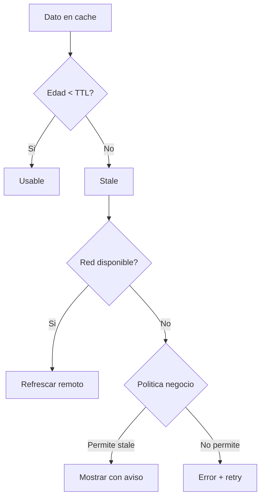

# Consistencia e invalidación

## Objetivo de aprendizaje

Al terminar esta lección vas a poder diseñar una política de consistencia para `Catalog` que sea explícita, testeable y operable: sabrás definir qué significa “dato aceptablemente fresco”, cuándo invalidarlo y cómo comunicar ese estado a UI sin engañar al usuario.

En versión simple: cache no es guardar datos, cache es gestionar confianza en esos datos con reglas claras.

---

## Definición simple

- Consistencia: cuánto se parece lo que ve el usuario a la verdad remota dentro de una tolerancia de negocio.
- Invalidación: la regla que decide cuándo un dato local deja de ser aceptable.

No existe “consistencia perfecta” gratis en móvil. Existe consistencia elegida conscientemente según coste/riesgo.

---

## Modelo mental: fecha de caducidad + contexto

Piensa en leche en la nevera.

- Si está en fecha, probablemente es válida.
- Si caducó, no la usas.
- Si estás en emergencia y no hay alternativa, quizá toleras una ventana extra con aviso.

En software, esa “fecha” suele ser `timestamp + TTL`, pero además importa el contexto de negocio.



---

## Relación con DDD y bounded contexts

La consistencia no es solo técnica. Depende del bounded context.

Ejemplo:

- `Catalog`: tolera cierto stale breve.
- `Payments`: stale puede ser inaceptable.

Por eso no copiamos la misma política de consistencia a todas las features.

Supuesto de este curso:

- estamos en `Catalog`, donde frescura alta es importante pero no crítica a nivel transaccional inmediato.

---

## Cuándo SÍ y cuándo NO usar TTL como núcleo

### Cuándo SÍ

- datos de lectura frecuentes y cambios moderados;
- necesidad de UX rápida offline/intermitente;
- equipo que prioriza simplicidad en etapa de evolución.

### Cuándo NO

- datos con impacto legal/financiero instantáneo;
- cambios remotos muy frecuentes donde TTL fijo rompe expectativas;
- escenarios donde ya dispones de invalidación por eventos en tiempo real y la necesitas.

TTL no es malo. TTL sin contexto sí.

---

## Estrategias A/B/C de consistencia

### Opción A: TTL fijo + network-first + fallback (decisión de etapa)

Ventajas:

- simple de implementar y explicar;
- buen equilibrio inicial entre frescura y resiliencia.

Costes:

- no se adapta dinámicamente;
- puede aumentar latencia en red lenta.

### Opción B: cache-first + refresh background

Ventajas:

- UX inicial muy rápida.

Costes:

- más riesgo de stale percibido;
- requiere gestión visual de frescura más cuidada.

### Opción C: invalidación por eventos (push/websocket)

Ventajas:

- frescura cercana a tiempo real.

Costes:

- complejidad alta de infraestructura/observabilidad.

Trigger para evolucionar A -> B/C:

- métricas de latencia o quejas de stale superan umbral de producto durante varias iteraciones.

---

## Diseño de política explícita

```swift
import Foundation

struct FreshnessPolicy: Sendable {
    let maxAge: TimeInterval

    func freshness(now: Date, lastUpdatedAt: Date) -> Freshness {
        let age = now.timeIntervalSince(lastUpdatedAt)
        if age < maxAge {
            return .fresh
        }
        return .stale(age: age)
    }
}

enum Freshness: Sendable, Equatable {
    case fresh
    case stale(age: TimeInterval)
}
```

La política devuelve estado semántico, no solo booleano. Esto mejora decisiones en Application/UI.

---

## Repositorio cacheado con política

```swift
import Foundation

protocol Clock: Sendable {
    func now() -> Date
}

struct SystemClock: Clock {
    func now() -> Date { Date() }
}

struct CachedProductRepository: ProductRepository, Sendable {
    private let remote: any ProductRepository
    private let store: any ProductStore
    private let policy: FreshnessPolicy
    private let clock: any Clock

    init(
        remote: any ProductRepository,
        store: any ProductStore,
        policy: FreshnessPolicy,
        clock: any Clock = SystemClock()
    ) {
        self.remote = remote
        self.store = store
        self.policy = policy
        self.clock = clock
    }

    func loadAll() async throws -> [Product] {
        do {
            let products = try await remote.loadAll()
            try await store.save(CachedProducts(products: products, timestamp: clock.now()))
            return products
        } catch {
            guard let cached = try await store.load() else {
                throw error
            }

            switch policy.freshness(now: clock.now(), lastUpdatedAt: cached.timestamp) {
            case .fresh:
                return cached.products
            case .stale:
                throw error
            }
        }
    }
}
```

Aquí se ve un principio clave:

- la política decide validez;
- el repositorio aplica la política;
- Application/UI consumen resultado sin conocer detalles internos de cache.

---

## Integración con UI: no ocultar stale data

Si decides devolver cache fresca tras fallo remoto, UI debería reflejarlo de forma legible cuando aporte valor.

Ejemplo de estado:

```swift
enum CatalogScreenState: Sendable, Equatable {
    case loading
    case loaded(products: [Product], freshness: Freshness)
    case error(CatalogError)
}
```

No siempre necesitas mostrar “actualizado hace X minutos”, pero el estado debe poder representarlo para casos de producto exigentes.

---

## BDD -> consistencia

### Happy path

- Given red disponible y payload válido,
- When cargo catálogo,
- Then guardo cache y retorno remoto.

### Sad path

- Given red falla y cache vigente,
- When cargo catálogo,
- Then retorno cache con frescura válida.

### Edge case

- Given red falla y cache expirada,
- When cargo catálogo,
- Then retorno error (sin fingir frescura).

Esta trazabilidad evita decisiones ambiguas cuando aparecen incidencias.

---

## TDD de política de consistencia

### Red

- test de `FreshnessPolicy` con timestamps exactos;
- test de fallback cache válido;
- test de rechazo cache expirado.

### Green

- implementar mínima lógica TTL.

### Refactor

- extraer `Clock` y eliminar dependencia de tiempo real;
- simplificar ramas de repositorio sin perder semántica.

---

## Tests deterministas (mínimo y realista)

```swift
import XCTest

final class FreshnessPolicyTests: XCTestCase {
    func test_freshness_isFresh_whenAgeLessThanMaxAge() {
        let policy = FreshnessPolicy(maxAge: 300)
        let now = Date(timeIntervalSince1970: 1000)
        let timestamp = Date(timeIntervalSince1970: 800)

        XCTAssertEqual(policy.freshness(now: now, lastUpdatedAt: timestamp), .fresh)
    }

    func test_freshness_isStale_whenAgeExceedsMaxAge() {
        let policy = FreshnessPolicy(maxAge: 300)
        let now = Date(timeIntervalSince1970: 1301)
        let timestamp = Date(timeIntervalSince1970: 1000)

        guard case .stale = policy.freshness(now: now, lastUpdatedAt: timestamp) else {
            return XCTFail("Expected stale")
        }
    }
}

final class CachedProductRepositoryConsistencyTests: XCTestCase {
    func test_loadAll_deliversCacheOnRemoteFailure_whenCacheIsFresh() async throws {
        let clock = FixedClock(now: Date(timeIntervalSince1970: 1000))
        let store = ProductStoreStub(cached: CachedProducts(products: [makeProduct("1")], timestamp: Date(timeIntervalSince1970: 900)))
        let remote = ProductRepositoryFailingStub(error: CatalogError.connectivity)
        let sut = CachedProductRepository(remote: remote, store: store, policy: FreshnessPolicy(maxAge: 300), clock: clock)

        let products = try await sut.loadAll()

        XCTAssertEqual(products.count, 1)
    }

    func test_loadAll_throwsOnRemoteFailure_whenCacheIsStale() async {
        let clock = FixedClock(now: Date(timeIntervalSince1970: 2000))
        let store = ProductStoreStub(cached: CachedProducts(products: [makeProduct("1")], timestamp: Date(timeIntervalSince1970: 1000)))
        let remote = ProductRepositoryFailingStub(error: CatalogError.connectivity)
        let sut = CachedProductRepository(remote: remote, store: store, policy: FreshnessPolicy(maxAge: 300), clock: clock)

        await XCTAssertThrowsErrorAsync(try await sut.loadAll())
    }
}
```

---

## Concurrencia: dónde se rompe de verdad

Riesgo típico:

- dos cargas concurrentes guardan cache con orden no determinista;
- estado final puede quedar desfasado.

Mitigación:

- store serializado en `actor`;
- política clara de resolución (última escritura gana o versión).

```swift
actor InMemoryProductStore: ProductStore {
    private var cached: CachedProducts?

    func save(_ value: CachedProducts) {
        cached = value
    }

    func load() -> CachedProducts? {
        cached
    }
}
```

No metas `@MainActor` en almacenamiento por “silenciar warnings”. Aisla donde corresponde.

---

## Anti-ejemplos y depuración

### Anti-ejemplo 1: TTL hardcoded sin explicación

Problema:

- nadie sabe por qué `maxAge = 173`.

Corrección:

- documentar criterio y trigger de revisión.

### Anti-ejemplo 2: reloj real en tests

Problema:

- tests flaky y lentos.

Corrección:

- inyectar `Clock` fijo.

### Anti-ejemplo 3: devolver stale siempre “para no fallar”

Problema:

- ocultas incidentes reales y engañas UX.

Corrección:

- separar `fresh` vs `stale` con policy explícita.

### Depuración práctica

1. loggear edad del cache y decisión de policy;
2. verificar timestamps guardados;
3. reproducir con reloj fijo;
4. ejecutar tests de concurrencia con cargas solapadas.

---

## ADR corto de la lección

```markdown
## ADR-007: Politica de consistencia de Catalog basada en TTL y fallback controlado
- Estado: Aprobado
- Contexto: necesidad de equilibrio entre disponibilidad y frescura
- Decisión: aplicar network-first con fallback a cache solo cuando politica de frescura lo permita
- Consecuencias: mejor resiliencia sin ocultar stale data expirada
- Fecha: 2026-02-07
```

---

## Matriz de pruebas de consistencia

| Tipo de prueba | Qué valida | Coste | Frecuencia |
| --- | --- | --- | --- |
| Unit policy | cálculo de frescura/expiración | Bajo | Cada cambio |
| Integration cache+repo | fallback real bajo fallos de red | Medio | Por feature |
| UI/E2E | representación de estado fresco/expirado | Alto | Selectivo |

---

## Checklist de calidad

- [ ] Política de consistencia documentada con supuestos.
- [ ] Invalidación centralizada, no repartida por capas.
- [ ] Tests deterministas de TTL con reloj inyectado.
- [ ] Concurrencia de store protegida.
- [ ] UI no disfraza stale expirado como dato fresco.

---

## Cierre

Sin política de consistencia, cache es una lotería. Con política explícita y tests sólidos, cache se convierte en una ventaja competitiva: app rápida y resiliente sin sacrificar honestidad de datos.

**Siguiente:** [Observabilidad →](03-observabilidad.md)

---

## Matriz rápida para elegir TTL

| Contexto | Volatilidad | Tolerancia stale | TTL sugerido inicial |
| --- | --- | --- | --- |
| Catalog general | Media | Media | 5 min |
| Pricing sensible | Alta | Baja | <= 1 min |
| Contenido editorial | Baja | Alta | 15-30 min |

La tabla no sustituye métricas reales, pero ayuda a arrancar con criterio explícito.
