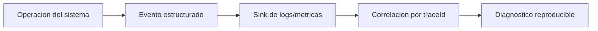
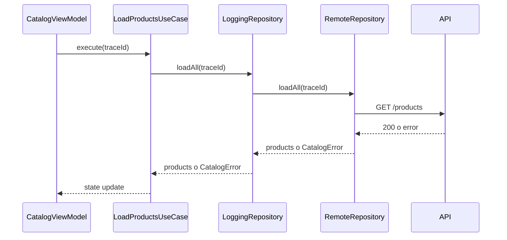

# Observabilidad

## Objetivo de aprendizaje

Al terminar esta lección vas a ser capaz de diseñar observabilidad útil para una arquitectura iOS modular sin caer en dos extremos: ni ceguera total (`print` suelto) ni sobreingeniería prematura.

En lenguaje sencillo: observabilidad es dejar migas de pan fiables para poder volver al punto donde empezó un problema.

---

## Definición simple

Observabilidad es la capacidad de entender el estado interno de tu sistema a partir de señales externas.

En este curso, las señales base serán:

- logs estructurados;
- eventos de flujo con correlación;
- métricas mínimas de éxito/error/latencia en operaciones críticas.

No arrancamos por dashboards complejos; arrancamos por disciplina de señal.

---

## Modelo mental: caja negra con instrumentos

Imagina que tu app es un avión. Puedes volarlo “a ojo”, pero cuando aparece niebla no ves nada. Observabilidad es el panel de instrumentos.

- Altitud: en qué estado está la operación.
- Velocidad: cuánto tarda cada flujo.
- Alarmas: dónde falla y por qué.



Sin estructura, todo queda en ruido difícil de filtrar.

---

## Relación con negocio (DDD)

Observabilidad no es solo técnica. Ayuda a proteger compromisos de negocio.

Ejemplos:

- “El catálogo tarda demasiado” impacta conversión.
- “Fallback a cache ocurre demasiadas veces” impacta frescura de datos.
- “Errores de invalidData crecen” puede indicar ruptura de contrato con backend.

DDD pide lenguaje ubicuo también en eventos de observabilidad. Si tus logs hablan “NetworkError42” y negocio habla “catálogo no disponible”, no hay conversación común.

---

## Qué observar en Etapa 3

Priorizamos señales con valor operativo inmediato.

1. inicio/fin de carga de catálogo;
2. fallback de network a cache;
3. error semántico final (`connectivity`, `invalidData`);
4. cancelaciones de tareas relevantes;
5. latencia por operación crítica.

No priorizamos todavía:

- trazas distribuidas cross-backend complejas;
- analítica de producto avanzada;
- series temporales de alta cardinalidad.

---

## Contrato técnico de observabilidad

Supuesto: la app ya tiene `os.Logger` disponible. Mantenemos un puerto propio para no acoplar todo a una implementación concreta.

```swift
import Foundation

enum LogLevel: String, Sendable {
    case debug
    case info
    case warning
    case error
}

struct LogEvent: Sendable {
    let message: String
    let level: LogLevel
    let context: [String: String]
}

protocol AppLogger: Sendable {
    func log(_ event: LogEvent)
}
```

Campos de contexto mínimos recomendados:

- `feature`;
- `layer`;
- `operation`;
- `traceId`;
- `outcome`.

Con eso ya puedes reconstruir un incidente sin abrir Xcode con fe ciega.

---

## Ejemplo mínimo

```swift
let event = LogEvent(
    message: "catalog.load.started",
    level: .info,
    context: [
        "feature": "Catalog",
        "layer": "Application",
        "operation": "loadProducts",
        "traceId": "t-001"
    ]
)
logger.log(event)
```

Notar que `message` no es novela; es clave semántica consistente.

---

## Ejemplo realista: decoradores de observabilidad

La estrategia más limpia en arquitectura modular es usar decoradores en infraestructura/application.

```swift
import Foundation

struct LoggingProductRepository: ProductRepository, Sendable {
    private let wrapped: any ProductRepository
    private let logger: any AppLogger

    init(wrapped: any ProductRepository, logger: any AppLogger) {
        self.wrapped = wrapped
        self.logger = logger
    }

    func loadAll() async throws -> [Product] {
        let traceId = UUID().uuidString

        logger.log(
            LogEvent(
                message: "catalog.load.started",
                level: .info,
                context: [
                    "feature": "Catalog",
                    "layer": "Infrastructure",
                    "operation": "loadAll",
                    "traceId": traceId
                ]
            )
        )

        do {
            let products = try await wrapped.loadAll()
            logger.log(
                LogEvent(
                    message: "catalog.load.succeeded",
                    level: .info,
                    context: [
                        "feature": "Catalog",
                        "layer": "Infrastructure",
                        "operation": "loadAll",
                        "traceId": traceId,
                        "count": String(products.count)
                    ]
                )
            )
            return products
        } catch {
            logger.log(
                LogEvent(
                    message: "catalog.load.failed",
                    level: .error,
                    context: [
                        "feature": "Catalog",
                        "layer": "Infrastructure",
                        "operation": "loadAll",
                        "traceId": traceId,
                        "error": String(describing: error)
                    ]
                )
            )
            throw error
        }
    }
}
```

Ventaja:

- no contaminas Domain;
- puedes activar/desactivar observabilidad por composición;
- mantienes testabilidad alta.

---

## Flujo de correlación (traceId)



Con un `traceId` estable, cada salto deja rastro conectado.

---

## Concurrencia estricta aplicada a observabilidad

### Aislamiento

El logger debe ser seguro bajo concurrencia. Una implementación fácil y robusta es actor.

```swift
import Foundation

actor InMemoryLogger: AppLogger {
    private(set) var events: [LogEvent] = []

    func log(_ event: LogEvent) {
        events.append(event)
    }

    func snapshot() -> [LogEvent] {
        events
    }
}
```

### `Sendable`

- `LogEvent` y contexto deben ser `Sendable`.
- evitar meter objetos no sendable dentro del contexto.

### Cancelación

Cuando una tarea se cancela, registrar evento explícito:

- `catalog.load.cancelled`.

Si no lo haces, en producción verás “start” sin “end” y la depuración se vuelve ambigua.

### Backpressure

Un bug típico es loggear cada frame o cada cambio mínimo de estado, saturando salida y coste.

Estrategias:

- log de eventos significativos, no de ruido;
- muestreo en operaciones de alta frecuencia;
- niveles de log configurables por entorno.

---

## Anti-ejemplo y corrección

### Anti-ejemplo

```swift
func loadProducts() async {
    print("Empieza")
    let products = try? await repository.loadAll()
    print(products)
}
```

Problemas:

- no hay niveles ni contexto;
- no hay correlación;
- `try?` borra causa del error;
- en producción esos prints casi no sirven.

### Corrección

- usar `AppLogger` con eventos estructurados;
- registrar inicio/fin/fallo;
- capturar error semántico y contexto.

---

## Cómo testear observabilidad

No basta con “lo veo en consola”. Se testea como cualquier comportamiento.

```swift
import XCTest

final class LoggingProductRepositoryTests: XCTestCase {
    func test_logsStartedAndSucceededOnSuccess() async throws {
        let logger = InMemoryLogger()
        let repo = ProductRepositorySuccessStub(products: [])
        let sut = LoggingProductRepository(wrapped: repo, logger: logger)

        _ = try await sut.loadAll()

        let events = await logger.snapshot()
        XCTAssertEqual(events.map(\.message), ["catalog.load.started", "catalog.load.succeeded"])
    }

    func test_logsFailedOnError() async {
        let logger = InMemoryLogger()
        let repo = ProductRepositoryFailingStub(error: CatalogError.connectivity)
        let sut = LoggingProductRepository(wrapped: repo, logger: logger)

        _ = try? await sut.loadAll()

        let events = await logger.snapshot()
        XCTAssertEqual(events.last?.message, "catalog.load.failed")
    }
}
```

Estos tests convierten observabilidad en contrato estable, no en “buena intención”.

---

## A/B/C de decisión para Etapa 3

### Opción A: `print` libre

Ventaja:

- rapidez instantánea.

Coste:

- cero gobernanza; diagnóstico pobre.

Riesgo:

- alta entropía de mensajes.

### Opción B: logging estructurado mínimo (decisión actual)

Ventaja:

- gran mejora diagnóstica con bajo coste.

Coste:

- disciplina de nombres/contexto.

Riesgo:

- inconsistencia si no hay guía.

### Opción C: plataforma completa desde inicio

Ventaja:

- visibilidad máxima.

Coste:

- complejidad operativa alta demasiado pronto.

Riesgo:

- sobreingeniería y freno de entrega.

Trigger para pasar de B a C:

- incidentes repetidos no reconstruibles con señal actual.

---

## ADR corto de la lección

```markdown
## ADR-005: Observabilidad estructurada mínima por eventos de capa
- Estado: Aprobado
- Contexto: incidentes difíciles de diagnosticar en flujos async cache/network
- Decisión: introducir puerto `AppLogger`, eventos estructurados y correlación por `traceId`
- Consecuencias: mejora fuerte de depuración con coste moderado de disciplina
- Fecha: 2026-02-07
```

---

## Matriz de pruebas de observabilidad

| Tipo de prueba | Qué valida | Coste | Frecuencia |
| --- | --- | --- | --- |
| Unit logger | formato y contexto de eventos | Bajo | Cada cambio |
| Integration decorators | secuencia start/end/fail por flujo | Medio | Por feature |
| UI/E2E | eventos críticos visibles en flujos reales | Alto | Selectivo |

---

## Checklist de calidad

- [ ] Existe contrato de logger desacoplado de implementación concreta.
- [ ] Eventos críticos tienen nombre estable + contexto mínimo.
- [ ] Se registra fallo semántico, no solo error técnico crudo.
- [ ] Concurrencia: logger seguro (`actor` o alternativa justificada).
- [ ] Política de niveles y ruido está definida por entorno.

---

## Cierre

La observabilidad madura no se nota cuando todo va bien. Se nota el día que algo falla a las 3 de la mañana y puedes encontrar la causa en minutos, no en horas. Esa diferencia separa un proyecto “funciona en mi máquina” de una base enterprise operable.

**Anterior:** [Consistencia ←](02-consistencia.md) · **Siguiente:** [Tests avanzados →](04-tests-avanzados.md)

---

## Runbook operativo de incidentes (práctico)

Cuando una alerta dice “Catalog fallando” usa esta secuencia estándar:

1. localizar `traceId` de una ejecución fallida;
2. reconstruir timeline `started -> failed/succeeded`;
3. clasificar fallo (`connectivity` vs `invalidData` vs cancelación);
4. verificar frecuencia y alcance (uno o muchos usuarios);
5. abrir hipótesis técnica y acción de mitigación temporal;
6. registrar aprendizaje en ADR/checklist si fue fallo de diseño.

Este runbook evita depuración caótica “cada uno a su manera”.

---

## Taxonomía de eventos recomendada

Para que logs de distintos equipos sean compatibles, usa convención uniforme de naming:

- `<feature>.<operacion>.started`
- `<feature>.<operacion>.succeeded`
- `<feature>.<operacion>.failed`
- `<feature>.<operacion>.cancelled`

Ejemplos:

- `catalog.load.started`
- `catalog.load.failed`
- `identity.login.succeeded`

Si cada feature inventa nomenclatura distinta, pierdes capacidad de consulta transversal.

---

## Señales de madurez observacional

- puedes responder “qué falló y dónde” en menos de 10 minutos;
- tus eventos están alineados con lenguaje de negocio;
- hay correlación de extremo a extremo en flujos críticos;
- los incidentes recurrentes reducen tras incorporar señales.

Cuando esas señales aparecen, la observabilidad deja de ser un adorno y se vuelve ventaja operativa real.
