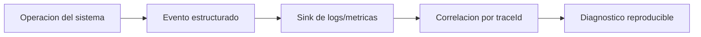
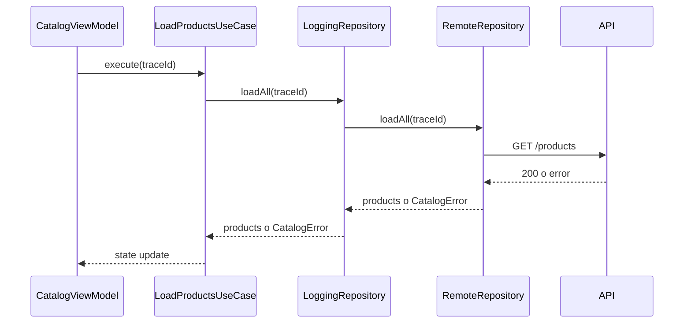

# Observabilidad

> **Nota de nomenclatura:** Esta lección usa nombres genéricos (`ProductRepository`, `LoggingProductRepository`) para explicar el patrón decorador. En el scaffold real, el repositorio es `CatalogRepository` y la observabilidad se implementa mediante `CatalogObservability` protocol.

## Objetivo de aprendizaje

Al terminar esta lección vas a ser capaz de diseñar observabilidad útil para una arquitectura iOS modular sin caer en dos extremos: ni ceguera total (`print` suelto) ni sobreingeniería prematura.

En lenguaje sencillo: observabilidad es dejar migas de pan fiables para poder volver al punto donde empezó un problema.

---

## Definición simple

Observabilidad es la capacidad de entender el estado interno de tu sistema a partir de señales externas.

En este curso, las señales base serán:

- logs estructurados;
- eventos de flujo con correlación;
- métricas mínimas de éxito/error/latencia en operaciones críticas.

No arrancamos por dashboards complejos; arrancamos por disciplina de señal.

---

## Modelo mental: caja negra con instrumentos

Imagina que tu app es un avión. Puedes volarlo “a ojo”, pero cuando aparece niebla no ves nada. Observabilidad es el panel de instrumentos.

- Altitud: en qué estado está la operación.
- Velocidad: cuánto tarda cada flujo.
- Alarmas: dónde falla y por qué.


```mermaid
flowchart LR
    OP["Operacion del sistema"] --> EV["Evento estructurado"]
    EV --> SINK["Sink de logs/metricas"]
    SINK --> TRACE["Correlacion por traceId"]
    TRACE --> DIAG["Diagnostico reproducible"]
```

Lectura del diagrama:

→ **Operación → Evento estructurado**: cada operación significativa emite un evento con `message` como clave semántica estable (`catalog.load.started`, no `"Cargando..."`) y campos de contexto. La clave semántica es lo que permite escribir consultas en logs de producción.

→ **Evento → Sink**: el sink es la implementación concreta de logging — `os.Logger` en producción, `InMemoryLogger` en tests. El evento no sabe adónde va — esto es lo que permite testear la observabilidad.

→ **Sink → Correlación por traceId**: los eventos de una misma operación comparten un `traceId` generado al inicio de la operación. Permite reconstruir el timeline completo de "esta llamada específica" a través de todas las capas.

→ **Correlación → Diagnóstico reproducible**: con traceId puedes filtrar en producción `"traceId = t-abc123"` y ver el ciclo completo: `started → load remote → fallback cache → failed`. Sin correlación, tienes eventos sueltos sin relación causal.

Sin estructura, todo queda en ruido difícil de filtrar.

---

## Relación con negocio (DDD)

Observabilidad no es solo técnica. Ayuda a proteger compromisos de negocio.

Ejemplos:

- “El catálogo tarda demasiado” impacta conversión.
- “Fallback a cache ocurre demasiadas veces” impacta frescura de datos.
- “Errores de invalidData crecen” puede indicar ruptura de contrato con backend.

DDD pide lenguaje ubicuo también en eventos de observabilidad. Si tus logs hablan “NetworkError42” y negocio habla “catálogo no disponible”, no hay conversación común.

---

## Qué observar en Etapa 3

Priorizamos señales con valor operativo inmediato.

1. inicio/fin de carga de catálogo;
2. fallback de network a cache;
3. error semántico final (`connectivity`, `invalidData`);
4. cancelaciones de tareas relevantes;
5. latencia por operación crítica.

No priorizamos todavía:

- trazas distribuidas cross-backend complejas;
- analítica de producto avanzada;
- series temporales de alta cardinalidad.

---

## Contrato técnico de observabilidad

Supuesto: la app ya tiene `os.Logger` disponible. Mantenemos un puerto propio para no acoplar todo a una implementación concreta.

```swift
import Foundation

enum LogLevel: String, Sendable {
    case debug
    case info
    case warning
    case error
}

struct LogEvent: Sendable {
    let message: String
    let level: LogLevel
    let context: [String: String]
}

protocol AppLogger: Sendable {
    func log(_ event: LogEvent)
}
```

Campos de contexto mínimos recomendados:

- `feature`;
- `layer`;
- `operation`;
- `traceId`;
- `outcome`.

Con eso ya puedes reconstruir un incidente sin abrir Xcode con fe ciega.

---

## Ejemplo mínimo

```swift
let event = LogEvent(
    message: "catalog.load.started",
    level: .info,
    context: [
        "feature": "Catalog",
        "layer": "Application",
        "operation": "loadProducts",
        "traceId": "t-001"
    ]
)
logger.log(event)
```

Notar que `message` no es novela; es clave semántica consistente.

---

## Ejemplo realista: decoradores de observabilidad

La estrategia más limpia en arquitectura modular es usar decoradores en infraestructura/application.

```swift
import Foundation

struct LoggingProductRepository: ProductRepository, Sendable {
    private let wrapped: any ProductRepository
    private let logger: any AppLogger

    init(wrapped: any ProductRepository, logger: any AppLogger) {
        self.wrapped = wrapped
        self.logger = logger
    }

    func loadAll() async throws -> [Product] {
        let traceId = UUID().uuidString

        logger.log(
            LogEvent(
                message: "catalog.load.started",
                level: .info,
                context: [
                    "feature": "Catalog",
                    "layer": "Infrastructure",
                    "operation": "loadAll",
                    "traceId": traceId
                ]
            )
        )

        do {
            let products = try await wrapped.loadAll()
            logger.log(
                LogEvent(
                    message: "catalog.load.succeeded",
                    level: .info,
                    context: [
                        "feature": "Catalog",
                        "layer": "Infrastructure",
                        "operation": "loadAll",
                        "traceId": traceId,
                        "count": String(products.count)
                    ]
                )
            )
            return products
        } catch {
            logger.log(
                LogEvent(
                    message: "catalog.load.failed",
                    level: .error,
                    context: [
                        "feature": "Catalog",
                        "layer": "Infrastructure",
                        "operation": "loadAll",
                        "traceId": traceId,
                        "error": String(describing: error)
                    ]
                )
            )
            throw error
        }
    }
}
```

Ventaja:

- no contaminas Domain;
- puedes activar/desactivar observabilidad por composición;
- mantienes testabilidad alta.

---

## Flujo de correlación (traceId)


```mermaid
sequenceDiagram
    participant UI as CatalogViewModel
    participant UC as LoadProductsUseCase
    participant LR as LoggingRepository
    participant REM as RemoteRepository
    participant API as API

    UI->>UC: execute(traceId)
    UC->>LR: loadAll(traceId)
    LR->>REM: loadAll(traceId)
    REM->>API: GET /products
    API-->>REM: 200 o error
    REM-->>LR: products o CatalogError
    LR-->>UC: products o CatalogError
    UC-->>UI: state update
```

Lectura del diagrama:

→ **UI → UseCase**: el ViewModel genera o recibe un `traceId` al inicio de la operación y lo propaga hacia abajo. Este ID es el hilo conductor.

→ **UseCase → LoggingRepository**: el UseCase no sabe que el repositorio tiene logging — recibe un `CatalogRepository` normal. El decorador de logging es invisible para el UseCase.

→ **LoggingRepository → RemoteRepository**: el decorador emite `catalog.load.started` antes de delegar, y `catalog.load.succeeded/failed` después. El repositorio real no sabe que alguien está observando.

→ **RemoteRepository → API**: la petición HTTP ocurre sin conocimiento de observabilidad. Si falla, el error sube a través de todos los decoradores.

→ **Error o éxito → UI**: el `traceId` aparece en todos los logs del camino. Si en producción alguien reporta "catálogo no cargó", buscas ese `traceId` y reconstruyes el timeline completo.

Con un `traceId` estable, cada salto deja rastro conectado.

---

## Concurrencia estricta aplicada a observabilidad

### Aislamiento

El logger debe ser seguro bajo concurrencia. Una implementación fácil y robusta es actor.

```swift
import Foundation

actor InMemoryLogger: AppLogger {
    private(set) var events: [LogEvent] = []

    func log(_ event: LogEvent) {
        events.append(event)
    }

    func snapshot() -> [LogEvent] {
        events
    }
}
```

### `Sendable`

- `LogEvent` y contexto deben ser `Sendable`.
- evitar meter objetos no sendable dentro del contexto.

### Cancelación

Cuando una tarea se cancela, registrar evento explícito:

- `catalog.load.cancelled`.

Si no lo haces, en producción verás “start” sin “end” y la depuración se vuelve ambigua.

### Backpressure

Un bug típico es loggear cada frame o cada cambio mínimo de estado, saturando salida y coste.

Estrategias:

- log de eventos significativos, no de ruido;
- muestreo en operaciones de alta frecuencia;
- niveles de log configurables por entorno.

---

## Anti-ejemplo y corrección

### Anti-ejemplo

```swift
// ❌ print suelto — cero valor en producción
func loadProducts() async {
    print("Empieza")
    let products = try? await repository.loadAll()
    print(products)
    // En producción: "Optional([...])" sin contexto, sin nivel, sin causa de fallo
}
```

Problemas: `try?` suprime el error (el `print` no lo ve), no hay correlación entre inicio y fin, y en CI/CD los prints no se enrutan a ningún sistema de observabilidad.

### Corrección

```swift
// ✅ Decorador estructurado — observable, testeable, sin contaminar dominio
func fetchCatalog() async throws -> [Product] {
    let traceId = UUID().uuidString
    await observability.record(CatalogFetchStarted(traceId: traceId))
    do {
        let products = try await wrapped.fetchCatalog()
        await observability.record(
            CatalogFetchMetric(path: .remote, durationMs: elapsed(), cacheHit: false)
        )
        return products
    } catch {
        await observability.record(
            CatalogFetchMetric(path: .networkNoCache, durationMs: elapsed(), cacheHit: false)
        )
        throw error  // El error se propaga intacto — nunca se suprime
    }
}
```

La diferencia crítica: el error se propaga (`throw error`), no se suprime. Suprimir errores con `try?` es la forma más rápida de que los problemas de producción sean invisibles.

---

## Cómo testear observabilidad

No basta con “lo veo en consola”. Se testea como cualquier comportamiento.

```swift
import XCTest

final class LoggingProductRepositoryTests: XCTestCase {
    func test_logsStartedAndSucceededOnSuccess() async throws {
        let logger = InMemoryLogger()
        let repo = ProductRepositorySuccessStub(products: [])
        let sut = LoggingProductRepository(wrapped: repo, logger: logger)

        _ = try await sut.loadAll()

        let events = await logger.snapshot()
        XCTAssertEqual(events.map(\.message), ["catalog.load.started", "catalog.load.succeeded"])
    }

    func test_logsFailedOnError() async {
        let logger = InMemoryLogger()
        let repo = ProductRepositoryFailingStub(error: CatalogError.connectivity)
        let sut = LoggingProductRepository(wrapped: repo, logger: logger)

        _ = try? await sut.loadAll()

        let events = await logger.snapshot()
        XCTAssertEqual(events.last?.message, "catalog.load.failed")
    }
}
```

Estos tests convierten observabilidad en contrato estable, no en “buena intención”.

---

## A/B/C de decisión para Etapa 3

### Opción A: `print` libre

Ventaja:

- rapidez instantánea.

Coste:

- cero gobernanza; diagnóstico pobre.

Riesgo:

- alta entropía de mensajes.

### Opción B: logging estructurado mínimo (decisión actual)

Ventaja:

- gran mejora diagnóstica con bajo coste.

Coste:

- disciplina de nombres/contexto.

Riesgo:

- inconsistencia si no hay guía.

### Opción C: plataforma completa desde inicio

Ventaja:

- visibilidad máxima.

Coste:

- complejidad operativa alta demasiado pronto.

Riesgo:

- sobreingeniería y freno de entrega.

Trigger para pasar de B a C:

- incidentes repetidos no reconstruibles con señal actual.

---

## ADR corto de la lección

```markdown
## ADR-005: Observabilidad estructurada mínima por eventos de capa
- Estado: Aprobado
- Contexto: incidentes difíciles de diagnosticar en flujos async cache/network
- Decisión: introducir puerto `AppLogger`, eventos estructurados y correlación por `traceId`
- Consecuencias: mejora fuerte de depuración con coste moderado de disciplina
- Fecha: 2026-02-07
```

---

## Matriz de pruebas de observabilidad

| Tipo de prueba | Qué valida | Coste | Frecuencia |
| --- | --- | --- | --- |
| Unit logger | formato y contexto de eventos | Bajo | Cada cambio |
| Integration decorators | secuencia start/end/fail por flujo | Medio | Por feature |
| UI/E2E | eventos críticos visibles en flujos reales | Alto | Selectivo |

---

## Checklist de calidad

- [ ] Existe contrato de logger desacoplado de implementación concreta.
- [ ] Eventos críticos tienen nombre estable + contexto mínimo.
- [ ] Se registra fallo semántico, no solo error técnico crudo.
- [ ] Concurrencia: logger seguro (`actor` o alternativa justificada).
- [ ] Política de niveles y ruido está definida por entorno.

---

## Cierre

La observabilidad madura no se nota cuando todo va bien. Se nota el día que algo falla a las 3 de la mañana y puedes encontrar la causa en minutos, no en horas. Esa diferencia separa un proyecto “funciona en mi máquina” de una base enterprise operable.
---

## Runbook operativo de incidentes (práctico)

Cuando una alerta dice “Catalog fallando” usa esta secuencia estándar:

1. localizar `traceId` de una ejecución fallida;
2. reconstruir timeline `started -> failed/succeeded`;
3. clasificar fallo (`connectivity` vs `invalidData` vs cancelación);
4. verificar frecuencia y alcance (uno o muchos usuarios);
5. abrir hipótesis técnica y acción de mitigación temporal;
6. registrar aprendizaje en ADR/checklist si fue fallo de diseño.

Este runbook evita depuración caótica “cada uno a su manera”.

---

## Taxonomía de eventos recomendada

Para que logs de distintos equipos sean compatibles, usa convención uniforme de naming:

- `<feature>.<operacion>.started`
- `<feature>.<operacion>.succeeded`
- `<feature>.<operacion>.failed`
- `<feature>.<operacion>.cancelled`

Ejemplos:

- `catalog.load.started`
- `catalog.load.failed`
- `identity.login.succeeded`

Si cada feature inventa nomenclatura distinta, pierdes capacidad de consulta transversal.

---

## Señales de madurez observacional

- puedes responder “qué falló y dónde” en menos de 10 minutos;
- tus eventos están alineados con lenguaje de negocio;
- hay correlación de extremo a extremo en flujos críticos;
- los incidentes recurrentes reducen tras incorporar señales.

Cuando esas señales aparecen, la observabilidad deja de ser un adorno y se vuelve ventaja operativa real.

---

## Ejercicio guiado: decorador de logging para ProductRepository

**Objetivo:** Crear un decorador que registre eventos de carga de productos sin modificar el repositorio original.

**Instrucciones:**

1. En `FeatureCatalogData`, crea un `LoggingProductRepository` que implemente `ProductRepository`.
2. El decorador recibe un `ProductRepository` interno y un closure `log: @Sendable (String) -> Void`.
3. Antes de llamar al repositorio interno, loguea `"catalog.load.started"`.
4. Si la carga tiene éxito, loguea `"catalog.load.succeeded count=\(products.count)"`.
5. Si falla, loguea `"catalog.load.failed error=\(error.localizedDescription)"`.
6. Escribe un test que verifique que los mensajes se emiten en el orden correcto.

**Criterios de éxito:**

- El test pasa con `swift test --filter LoggingProduct`.
- El decorador no modifica el comportamiento del repositorio interno (solo observa).
- El closure de log es `@Sendable` para ser seguro en concurrencia.

<details>
<summary>Solución de referencia</summary>

```swift
// ✅ Usando el protocolo del scaffold: CatalogObservability
// Sources/FeatureCatalogData/Logging/LoggingCatalogRepository.swift

struct LoggingCatalogRepository: CatalogRepository, Sendable {
    private let inner: any CatalogRepository  // fetchCatalog(), no loadAll()
    private let log: @Sendable (String) -> Void

    init(
        inner: any CatalogRepository,
        log: @escaping @Sendable (String) -> Void
    ) {
        self.inner = inner
        self.log = log
    }

    func fetchCatalog() async throws -> [Product] {
        log("catalog.load.started")
        do {
            let products = try await inner.fetchCatalog()
            log("catalog.load.succeeded count=\(products.count)")
            return products
        } catch {
            log("catalog.load.failed error=\(error.localizedDescription)")
            throw error
        }
    }
}

// Tests/FeatureCatalogDataTests/LoggingCatalogRepositoryTests.swift

final class LoggingCatalogRepositoryTests: XCTestCase {

    func test_loggingDecorator_emitsEventsInOrder_onSuccess() async throws {
        var logs: [String] = []
        let product = Product(id: "p-1", title: "Laptop", price: 999.99)  // title, no name
        let stub = CatalogRepositoryStub(result: .success([product]))
        let sut = LoggingCatalogRepository(inner: stub) { logs.append($0) }

        _ = try await sut.fetchCatalog()

        XCTAssertEqual(logs, [
            "catalog.load.started",
            "catalog.load.succeeded count=1"
        ])
    }

    func test_loggingDecorator_emitsFailedEvent_onError() async {
        var logs: [String] = []
        let stub = CatalogRepositoryStub(result: .failure(CatalogError.network))
        let sut = LoggingCatalogRepository(inner: stub) { logs.append($0) }

        _ = try? await sut.fetchCatalog()

        XCTAssertEqual(logs.first, "catalog.load.started")
        XCTAssertTrue(logs.last?.hasPrefix("catalog.load.failed") == true)
    }
}
```

> **Nota scaffold:** El protocolo es `CatalogRepository` con `fetchCatalog()`. El error es `CatalogError.network` (no `.connectivity`). El `struct` es suficiente — no se necesita `@unchecked Sendable`. El `Product` usa `title: String` y `price: Double`.

El patrón decorador permite componer logging sin tocar el repositorio original. En `AppCompositionRoot`, el repositorio real se envuelve con `LoggingCatalogRepository` antes de pasarlo al `LoadCatalogUseCase`.

</details>

---

## Implementación en tu proyecto

### Archivos del scaffold

| Archivo | Qué contiene |
|---|---|
| `Sources/FeatureCatalogData/CatalogDataContracts.swift` | `CatalogObservability`, `CatalogFetchMetric`, `CatalogLoadPath` — el sistema de observabilidad ya implementado |
| `Sources/FeatureCatalogData/CachedCatalogRepository.swift` | Llama a `observability.record(...)` en cada ruta — el decorador está integrado |
| `Sources/FeatureCatalogData/InMemoryCatalogStores.swift` | `InMemoryCatalogObservability` actor — para tests |

### El scaffold ya tiene `CatalogObservability`

El scaffold no usa un `AppLogger` genérico — tiene un protocolo específico de dominio más rico:

```swift
// ✅ Scaffold real — observabilidad con semántica de dominio
public protocol CatalogObservability: Sendable {
    func record(_ metric: CatalogFetchMetric) async
}

public struct CatalogFetchMetric: Equatable, Sendable {
    public let path: CatalogLoadPath  // .remote, .fallbackCache, .offlineCache, .offlineNoCache...
    public let durationMs: Double
    public let cacheHit: Bool
}
```

Esto es más rico que `AppLogger`: cada métrica dice exactamente qué ruta tomó la carga, cuánto tardó, y si hubo cache hit. Para tests, usa `InMemoryCatalogObservability`:

```swift
let observability = InMemoryCatalogObservability()
let sut = CachedCatalogRepository(..., observability: observability)

// Tras la operación:
let metrics = await observability.snapshot()
XCTAssertEqual(metrics.first?.path, .remote)
XCTAssertFalse(metrics.first?.cacheHit ?? true)
```

### Divergencias respecto a los ejemplos del curso

| Lección | Scaffold real |
|---|---|
| `AppLogger` genérico | `CatalogObservability` específico de dominio |
| `LoggingProductRepository` | Observabilidad integrada en `CachedCatalogRepository` |
| `ProductRepository.loadAll()` | `CatalogRepository.fetchCatalog()` |
| `Product(id:name:price:imageURL:)` | `Product(id:title:price:)` con `Double` |
| `CatalogError.connectivity` | `CatalogError.network` |

---

## Qué sigue

[**Lección 15: Tests avanzados →**](./04-tests-avanzados.md) — Más allá del happy path: tests de integración que usan las capas reales, property-based testing, y cómo testear observabilidad como contrato.

