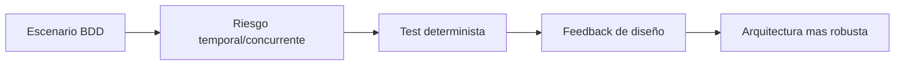
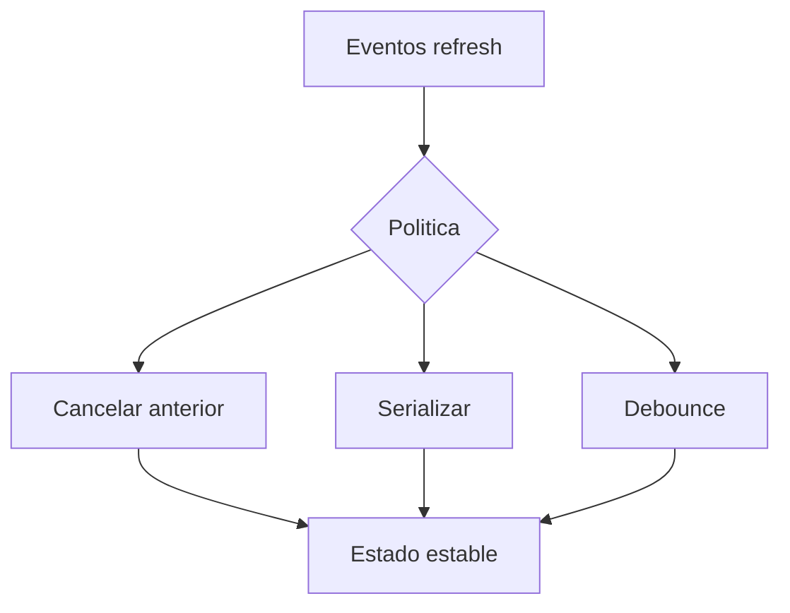
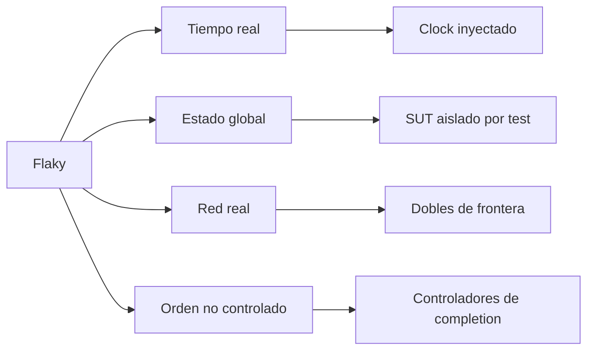

# Tests avanzados

## Objetivo de aprendizaje

Al finalizar esta lección vas a poder diseñar y escribir pruebas avanzadas para escenarios donde la mayoría de equipos rompe producción: cancelación, concurrencia, timing y backpressure. El foco es que las pruebas sean deterministas, rápidas y útiles para guiar decisiones de arquitectura.

En versión simple: si solo pruebas caminos felices, el día malo llega en producción. Las pruebas avanzadas entrenan al sistema para días malos.

---

## Definición simple

Un test avanzado valida comportamientos con dimensión temporal o concurrente que no se capturan con assertions lineales de input/output.

Ejemplos de esta etapa:

- cancelación correcta de tareas;
- expiración temporal (TTL) sin reloj real;
- aislamiento concurrente y `Sendable` en dobles/SUT;
- manejo de presión de eventos (backpressure);
- prevención de flakiness.

---

## Modelo mental: túnel de viento

Un coche bonito en parado no dice nada de su estabilidad a 120 km/h. Un test avanzado es túnel de viento para tu arquitectura.



Sin este túnel, validas estética de código, no robustez real.

---

## Relación con BDD + TDD

BDD te dice qué comportamientos importan en negocio cuando el sistema está bajo estrés.

Ejemplos BDD reales:

- Given usuario cambia de pantalla durante carga, Then no debo mostrar resultado tardío.
- Given llegan refresh seguidos, Then debo procesar con política estable.
- Given cache expirada y red falla, Then debo fallar de forma explícita.

TDD en tests avanzados:

1. Red: expresas el comportamiento bajo estrés.
2. Green: implementas lo mínimo para cumplirlo.
3. Refactor: limpias diseño (aislamiento, clocks, actores) sin romper contrato.

---

## Bloque 1: cancelación como caso de primera clase

### Qué validar

- la tarea se cancela de verdad;
- no hay side effects posteriores a la cancelación;
- el estado de UI/Application no acaba en resultado inválido.

### Ejemplo mínimo

```swift
import XCTest

final class CancellationTests: XCTestCase {
    func test_useCase_respectsCancellation() async {
        let repository = SlowProductRepositoryStub(delayNanoseconds: 3_000_000_000)
        let sut = LoadProductsUseCase(repository: repository)

        let task = Task { try await sut.execute() }
        try? await Task.sleep(nanoseconds: 100_000_000)
        task.cancel()

        let result = await task.result

        switch result {
        case .failure(let error):
            XCTAssertTrue(error is CancellationError)
        default:
            XCTFail("Expected cancellation")
        }
    }
}
```

### Error típico

- usar `Task.detached` en capa de UI/Application y perder control de cancelación.

### Corrección

- usar `.task`/task estructurada y ownership claro.

---

## Bloque 2: tiempo controlado (TTL y deadlines)

Nunca dependas del reloj de sistema para validar expiración. Inyecta reloj.

```swift
import Foundation

protocol Clock: Sendable {
    func now() -> Date
}

struct FixedClock: Clock {
    let value: Date
    func now() -> Date { value }
}
```

### Test determinista

```swift
func test_policy_marksStale_afterMaxAge() {
    let policy = FreshnessPolicy(maxAge: 300)
    let timestamp = Date(timeIntervalSince1970: 1000)
    let now = Date(timeIntervalSince1970: 1301)

    guard case .stale = policy.freshness(now: now, lastUpdatedAt: timestamp) else {
        return XCTFail("Expected stale")
    }
}
```

Si usas `sleep(300)` en tests, estás construyendo deuda de CI.

---

## Bloque 3: concurrencia y `Sendable` en dobles de prueba

Una gran fuente de falsos verdes son dobles con estado mutable no protegido.

### Anti-ejemplo

```swift
final class UnsafeSpy: ProductRepository, @unchecked Sendable {
    var callCount = 0

    func loadAll() async throws -> [Product] {
        callCount += 1
        return []
    }
}
```

Si hay llamadas concurrentes, este spy introduce carreras.

### Ejemplo correcto con actor

```swift
actor SafeProductRepositorySpy: ProductRepository {
    private(set) var callCount = 0

    func loadAll() async throws -> [Product] {
        callCount += 1
        return []
    }

    func readCallCount() -> Int {
        callCount
    }
}
```

Regla de curso:

- `@unchecked Sendable` solo con invariante escrito y alcance controlado.

---

## Bloque 4: backpressure (presión de eventos)

### Problema real

UI emite muchos eventos de refresh (scroll, pull-to-refresh repetido, navegación rápida).

Si lanzas una tarea por evento sin política, puedes:

- saturar red;
- pisar estado;
- producir resultados fuera de orden.

### Políticas típicas

- última petición gana (cancel previous);
- serializar peticiones en actor;
- debounce/throttle en input.



### Test de última petición gana

```swift
func test_viewModel_lastRequestWins_underRapidRefresh() async {
    let repository = ControlledProductRepositoryStub()
    let sut = CatalogViewModel(loadProducts: LoadProductsUseCase(repository: repository))

    await sut.refresh()
    await sut.refresh()

    await repository.completeSecondRequest(with: [makeProduct("2")])
    await repository.completeFirstRequest(with: [makeProduct("1")])

    let state = await sut.state
    XCTAssertEqual(state.products.first?.id, "2")
}
```

Este test protege contra resultados fuera de orden.

---

## Bloque 5: tests de integración avanzada

Además de unit avanzada, necesitas integración avanzada para colaboración real bajo condiciones de timing.

Casos recomendados:

1. remote tarda, cache responde, luego remote completa: verificar política final.
2. cancelación en medio de request: no persistir estado parcial.
3. fallo remoto + cache válida: fallback estable.

---

## Estrategia anti-flaky

Checklist para depurar flakes:

1. ¿usas tiempo real?
2. ¿hay estado compartido entre tests?
3. ¿dependes de red externa?
4. ¿orden de completions no controlado?
5. ¿faltan awaits explícitos?

Si cualquiera da sí, tu test aún no es fiable.



---

## A/B/C de profundidad de pruebas avanzadas

### Opción A: tests básicos solamente

Ventaja:

- rapidez inicial.

Coste:

- riesgo alto en producción bajo estrés.

### Opción B: casos avanzados en rutas críticas (decisión actual)

Ventaja:

- alto retorno con coste razonable.

Coste:

- diseño de dobles y clocks más sofisticado.

### Opción C: cobertura exhaustiva de todos los timings

Ventaja:

- robustez máxima teórica.

Coste:

- coste y complejidad elevados.

Trigger para escalar de B a C:

- incidentes concurrentes repetidos con impacto alto.

---

## Concurrencia Swift 6.2: puntos obligatorios

- identificar boundary de aislamiento por prueba (`@MainActor`, actor propio, no aislado);
- asegurar `Sendable` en fronteras;
- probar cancelación explícitamente;
- justificar cualquier `@unchecked Sendable`.

Anti-patrón:

- poner `@MainActor` global para callar warnings y esconder diseño incorrecto.

---

## Ejemplo de suite combinada (unit + integración)

```swift
final class CatalogAdvancedTestPlan {
    let unitCritical = [
        "FreshnessPolicy marks stale correctly",
        "ViewModel ignores result after cancellation"
    ]

    let integrationCritical = [
        "CachedRepository fallback on connectivity failure",
        "Last request wins under rapid refresh"
    ]
}
```

La idea no es tener 500 tests, sino tests correctos en puntos de máximo riesgo.

---

## ADR corto de la lección

```markdown
## ADR-008: Estrategia de pruebas avanzadas deterministas para concurrencia y tiempo
- Estado: Aprobado
- Contexto: riesgo de regresiones en cancelacion, timing y backpressure
- Decisión: introducir clocks inyectados, dobles seguros y casos avanzados en rutas criticas
- Consecuencias: mayor confianza en evoluciones con coste moderado de diseño de tests
- Fecha: 2026-02-07
```

---

## Matriz de pruebas avanzadas

| Tipo de prueba | Qué valida | Coste | Frecuencia |
| --- | --- | --- | --- |
| Cancelación | no side effects tardíos tras cancelación | Medio | Cada cambio crítico |
| Timing | expiración y deadlines deterministas | Bajo-Medio | Cada cambio de policy |
| Concurrencia | ausencia de carreras en rutas async | Medio | Por PR |
| Backpressure | orden y política bajo ráfagas | Medio-Alto | En features con eventos intensos |
| Integración avanzada | colaboración real en escenarios de estrés | Medio-Alto | Por iteración de feature |

---

## Checklist de calidad

- [ ] Hay pruebas explícitas de cancelación en flujos críticos.
- [ ] El tiempo está inyectado y controlado en tests de expiración.
- [ ] Dobles concurrentes son seguros (`actor` o invariante documentado).
- [ ] Existe al menos un test de backpressure por feature relevante.
- [ ] La suite evita flakiness por diseño, no por reintentos.

---

## Cierre

Las pruebas avanzadas son el puente entre “funciona hoy” y “seguirá funcionando cuando el sistema evolucione”. Cuando las dominas, puedes refactorizar con seguridad real, que es la moneda principal de la arquitectura enterprise.

**Siguiente:** [Trade-offs y riesgos →](05-trade-offs.md)

---

## Laboratorio guiado de 45 minutos

Objetivo: practicar el ciclo completo en una ruta crítica con concurrencia.

1. escoger flujo `catalog.refresh`;
2. escribir test Red para cancelación al salir de pantalla;
3. escribir test Red para `last request wins`;
4. implementar Green mínimo;
5. refactorizar dobles a `actor` donde haga falta;
6. validar que suite corre estable 10 veces seguidas.

Este laboratorio entrena una skill de producción: robustez repetible bajo presión temporal.

---

## Rubrica de calidad para tests avanzados

Puntúa cada prueba 0-2 en estas dimensiones:

- determinismo;
- relevancia de negocio;
- claridad de contrato;
- aislamiento de dependencias;
- coste de mantenimiento.

Interpretación:

- 8-10: prueba excelente;
- 5-7: útil pero mejorable;
- <5: candidata a rediseño.

Esta rúbrica evita la falsa métrica de “cantidad de tests” y prioriza valor real.

---

## Señales de dominio de la skill

- detectas flakiness por diseño antes de ejecutar CI;
- justificas cuándo usar actor en dobles y cuándo no;
- modelas cancelación como caso funcional, no excepción;
- conviertes bugs de timing en casos reproducibles y protegidos.

Cuando puedes hacer esto de forma sistemática, tus refactors dejan de ser apuestas.
