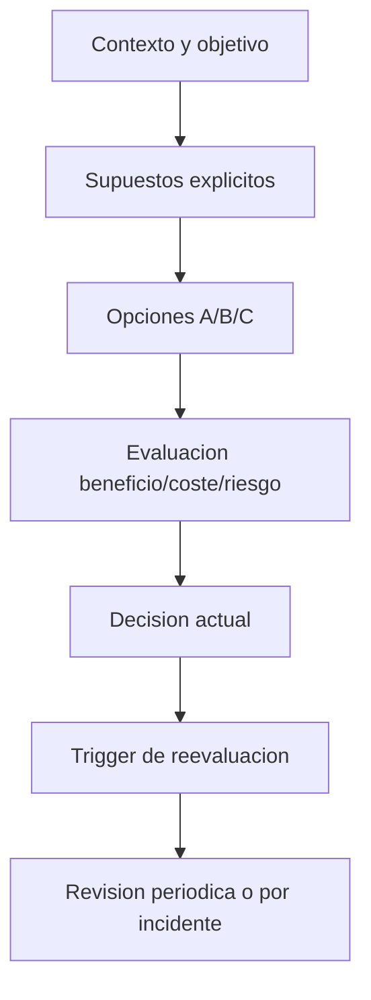

# Trade-offs y riesgos

## Objetivo de aprendizaje

Al terminar esta lección vas a poder tomar decisiones arquitectónicas bajo presión con método, sin dogmas y sin improvisación, usando una matriz A/B/C con supuestos explícitos, riesgos, costes y triggers de cambio.

En versión simple: arquitectura no es adivinar el futuro, es elegir bien hoy y dejar claro cuándo cambiar mañana.

---

## Definición simple

- Trade-off: intercambio entre ventajas y costes de una opción.
- Riesgo: posibilidad de que ocurra un resultado negativo multiplicada por su impacto.

En software enterprise no existe la opción “perfecta para siempre”. Existe la opción correcta para el contexto actual.

---

## Modelo mental: mapa de montaña

Piensa que debes cruzar una montaña.

- Ruta A: más rápida, más peligrosa.
- Ruta B: más lenta, más segura.
- Ruta C: intermedia, pero requiere mejor equipo.

El error típico de junior es elegir por intuición o moda.
El salto a senior/arquitecto es elegir por contexto, evidencia y capacidad operativa.



---

## Marco operativo del curso para decidir

Para cada decisión relevante de Etapa 3 y 4, documentamos:

1. contexto de negocio y técnico;
2. supuestos (qué creemos que es cierto hoy);
3. opciones A/B/C;
4. ventajas y costes por opción;
5. riesgos y mitigaciones;
6. trigger de invalidación;
7. plan de salida si toca cambiar.

Si falta cualquiera de estos puntos, no es decisión arquitectónica madura, es preferencia personal.

---

## Caso 1: estrategia de cache/offline en Catalog

### Contexto

Queremos que catálogo sea usable con red intermitente y sin romper consistencia básica.

### Supuestos

- Supuesto 1: mayoría de usuarios abre catálogo varias veces al día.
- Supuesto 2: cambios de precio no exigen consistencia al milisegundo.
- Supuesto 3: backend no ofrece push invalidation en tiempo real.

### Opción A: network-first + fallback cache con TTL (decisión actual)

Ventajas:

- buena frescura cuando hay red;
- fallback simple cuando no hay red;
- coste de implementación medio.

Costes:

- latencia inicial depende de red;
- lógica de fallback y TTL que mantener.

Riesgos:

- stale data breve.

Mitigación:

- TTL corto configurable y evento de stale.

### Opción B: cache-first + refresh en background

Ventajas:

- UX muy rápida al abrir;
- funciona muy bien offline.

Costes:

- mayor complejidad de invalidación;
- posibilidad de mostrar stale más tiempo.

Riesgos:

- percepción de datos antiguos en casos sensibles.

Mitigación:

- indicador visual de actualización y timestamp.

### Opción C: stale-while-revalidate avanzado con políticas por entidad

Ventajas:

- equilibrio muy fino entre frescura y disponibilidad.

Costes:

- complejidad alta;
- mayor superficie de bugs.

Riesgos:

- errores de coherencia difíciles de depurar.

Mitigación:

- observabilidad fuerte + tests avanzados.

### Trigger de cambio

Si la métrica de latencia p95 de apertura supera objetivo durante 3 releases, evaluar paso de A a B.

---

## Caso 2: nivel de observabilidad

### Contexto

Necesitamos diagnósticos reproducibles sin frenar entrega.

### Supuestos

- Supuesto 1: equipo pequeño, sin plataforma dedicada de observabilidad.
- Supuesto 2: incidentes actuales son de integración/cancelación más que de escala masiva.

### Opción A: logs libres no estructurados

Ventajas:

- velocidad inicial máxima.

Costes:

- diagnóstico lento y ambiguo.

Riesgos:

- postmortems sin causa clara.

### Opción B: logging estructurado mínimo con `traceId` (decisión actual)

Ventajas:

- salto grande de calidad diagnóstica con coste moderado.

Costes:

- disciplina de naming/context.

Riesgos:

- inconsistencia entre features si no hay guía común.

Mitigación:

- contrato `LogEvent` + checklist de PR.

### Opción C: telemetry completo desde inicio

Ventajas:

- máxima visibilidad.

Costes:

- complejidad y mantenimiento elevados.

Riesgos:

- sobreingeniería para etapa actual.

### Trigger de cambio

Si incidentes críticos no se pueden reconstruir con señal actual, escalar de B a C gradualmente.

---

## Caso 3: profundidad de tests concurrentes

### Contexto

Queremos robustez en cancelación/backpressure sin convertir la suite en cuello de botella.

### Supuestos

- Supuesto 1: la mayoría de lógica crítica está en Application/Domain.
- Supuesto 2: hay pocos flujos altamente concurrentes por feature en esta fase.

### Opción A: solo unit tests básicos

Ventajas:

- suite muy rápida.

Costes:

- baja cobertura de interacciones concurrentes.

Riesgos:

- race/cancel bugs escapando a producción.

### Opción B: unit + integración + casos concurrentes críticos (decisión actual)

Ventajas:

- equilibrio entre confianza y velocidad.

Costes:

- diseño cuidadoso de tests deterministas.

Riesgos:

- requiere más disciplina técnica.

Mitigación:

- pruebas de concurrencia enfocadas a rutas críticas, no exhaustividad ciega.

### Opción C: model checking exhaustivo de timing

Ventajas:

- máxima cobertura teórica.

Costes:

- coste altísimo y mantenimiento difícil.

Riesgos:

- saturación del equipo.

### Trigger de cambio

Si aparecen incidentes concurrentes severos repetidos, aumentar cobertura desde B hacia C en módulos concretos.

---

## Tabla comparativa rápida (A/B/C)

| Decisión | Opción actual | Ventaja principal | Coste principal | Trigger de cambio |
| --- | --- | --- | --- | --- |
| Cache | A | simplicidad + frescura razonable | latencia dependiente de red | p95 latencia alta sostenida |
| Observabilidad | B | diagnóstico útil temprano | disciplina de esquema | incidentes no reconstruibles |
| Testing concurrente | B | confianza equilibrada | diseño de pruebas más fino | fallos concurrentes recurrentes |

---

## Cómo puntuar opciones sin autoengañarte

Puedes usar una fórmula simple para comparar opciones de forma transparente.

Supuesto de escala 1-5:

- valor negocio (más alto mejor)
- impacto UX (más alto mejor)
- coste implementación (más alto peor)
- coste mantenimiento (más alto peor)
- riesgo operativo (más alto peor)

Fórmula simple:

`score = valorNegocio + impactoUX - costeImplementacion - costeMantenimiento - riesgoOperativo`

No sustituye criterio humano, pero obliga a hacer visible por qué eliges.

---

## Anti-patrones de decisión y depuración

### Anti-patrón 1: decidir por moda

Síntoma:

- “en Twitter dicen que X es mejor”.

Corrección:

- volver a contexto y supuestos del sistema actual.

### Anti-patrón 2: ADR sin costes ni riesgos

Síntoma:

- documento bonito que no ayuda cuando hay incidentes.

Corrección:

- añadir consecuencias negativas y trigger de revisión.

### Anti-patrón 3: no revisar decisiones

Síntoma:

- decisiones antiguas siguen vigentes aunque contexto cambió.

Corrección:

- revisar ADR tras incidentes o cada etapa.

### Anti-patrón 4: cambiar todo por un problema local

Síntoma:

- refactor masivo por un bug puntual.

Corrección:

- aplicar cambios de mínimo blast radius, medidos por tests.

---

## Relación con BDD + TDD

BDD define qué comportamiento importa al negocio. TDD protege implementación diaria. Trade-offs conecta ambos para decidir cuánto invertir y dónde.

Ejemplo:

- BDD dice que fallback offline es crítico.
- TDD asegura que fallback funciona.
- Trade-off decide si estrategia A/B/C es la adecuada para coste y riesgo actual.

Sin este triángulo, o sobrediseñas o subproteges.

---

## Concurrencia y trade-offs

En Swift 6.2, concurrencia segura tiene coste de diseño. No es gratis.

Opciones típicas:

- usar `actor` para estado compartido (más seguridad, más serialización);
- usar estructuras inmutables `Sendable` (simple y rápido, pero no cubre todo caso);
- usar `@unchecked Sendable` (rápido en corto plazo, alto riesgo).

Regla del curso:

- evitar atajos de riesgo alto si no hay invariante documentado + plan de retirada.

---

## ADR corto de la lección

```markdown
## ADR-006: Decisiones de arquitectura con matriz A/B/C y triggers explícitos
- Estado: Aprobado
- Contexto: decisiones implícitas generan deuda y discusiones improductivas
- Decisión: toda decisión relevante de etapa se documenta con supuestos, costes, riesgos y trigger de revisión
- Consecuencias: mayor claridad y trazabilidad; coste inicial de documentación disciplinada
- Fecha: 2026-02-07
```

---

## Checklist de calidad

- [ ] Cada decisión crítica tiene contexto y supuestos explícitos.
- [ ] Hay análisis A/B/C con ventajas, costes y riesgos.
- [ ] Existe trigger concreto para reevaluar la decisión.
- [ ] La decisión está alineada con BDD (valor) y TDD (protección).
- [ ] La decisión considera impacto en concurrencia, testabilidad y mantenibilidad.

---

## Cierre

Un arquitecto no acierta siempre. Un arquitecto reduce el coste de equivocarse porque decide con método, deja rastro y define cuándo girar el volante. Esa habilidad, repetida semana a semana, es la que transforma a un equipo junior en un equipo enterprise fiable.

**Anterior:** [Tests avanzados ←](04-tests-avanzados.md) · **Siguiente:** [Entregables Etapa 3 →](entregables-etapa-3.md)

---

## Cadencia de revisión de decisiones

Una decisión de arquitectura no se “cierra para siempre”.

Cadencia sugerida:

- revisar trade-offs tras cada incidente relevante;
- revisión obligatoria cada 6-8 semanas;
- actualizar ADR cuando cambien supuestos de negocio.

Esta rutina evita que decisiones válidas hoy se conviertan en deuda mañana.

---

## Plantilla rápida de decisión diaria

- Problema:
- Opción elegida:
- Coste aceptado:
- Riesgo asumido:
- Trigger de revisión:

Usarla en decisiones pequeñas evita acumular deuda tácita.

---

## Nota de disciplina

Decidir también es renunciar. Documentar explícitamente a qué renuncias hoy evita discusiones circulares y acelera futuras revisiones con contexto real.
