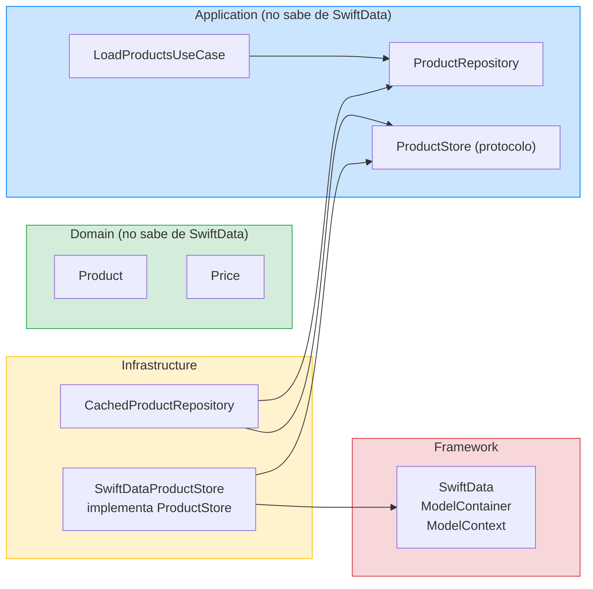

# SwiftData como ProductStore

## Objetivo de aprendizaje

Al terminar esta leccion vas a saber implementar persistencia local con SwiftData para el cache del Catalog, sin contaminar Domain ni Application, y con tests deterministas que no dependen de disco real.

En palabras simples: SwiftData es la caja donde guardas los productos para cuando no haya internet. Esta leccion te enseña a construir esa caja bien.

---

## Definicion simple

SwiftData es el framework de Apple (iOS 17+) para persistencia local. Reemplaza a Core Data con una API mas moderna basada en macros de Swift. En nuestro curso, lo usamos para implementar el protocolo `ProductStore` que definimos en la leccion de caching.

**Donde vive SwiftData en la arquitectura:**



**Regla critica:** SwiftData solo aparece en Infrastructure. Domain y Application no importan SwiftData. Si ves `import SwiftData` en Domain, hay un error de arquitectura.

---

## Modelo mental: la caja con etiqueta de fecha

Piensa en el `ProductStore` como una caja en tu casa:

- **Guardar:** Metes los productos en la caja y pegas una etiqueta con la fecha.
- **Cargar:** Abres la caja y miras la etiqueta para saber si los productos siguen frescos.
- **La caja no sabe de internet:** Solo guarda y devuelve. Quien decide si usar la caja o ir a la tienda es el `CachedProductRepository`.

---

## Cuando SI y cuando NO usar SwiftData

### Cuando SI

- Datos estructurados que necesitas persistir entre sesiones de la app.
- iOS 17+ como target minimo (nuestro caso).
- Equipo que quiere API moderna sin la complejidad de Core Data.

### Cuando NO

- Datos simples de key-value (usa `UserDefaults` o `@AppStorage`).
- Archivos grandes (imagenes, videos) — usa `FileManager`.
- Si necesitas soporte para iOS 16 o inferior — usa Core Data.
- Si necesitas migraciones muy complejas con transformaciones de datos — Core Data da mas control.

---

## El modelo SwiftData: ProductEntity

SwiftData necesita sus propios modelos marcados con `@Model`. Estos modelos son **exclusivos de Infrastructure** — son el equivalente a los DTOs pero para persistencia local.

```swift
// StackMyArchitecture/Features/Catalog/Infrastructure/Store/ProductEntity.swift

import SwiftData
import Foundation

@Model
final class ProductEntity {
    @Attribute(.unique) var productId: String
    var name: String
    var priceAmount: Decimal
    var priceCurrency: String
    var imageURLString: String
    var cachedAt: Date

    init(
        productId: String,
        name: String,
        priceAmount: Decimal,
        priceCurrency: String,
        imageURLString: String,
        cachedAt: Date
    ) {
        self.productId = productId
        self.name = name
        self.priceAmount = priceAmount
        self.priceCurrency = priceCurrency
        self.imageURLString = imageURLString
        self.cachedAt = cachedAt
    }
}
```

**Linea por linea:**

- `@Model` — Macro de SwiftData que convierte la clase en un modelo persistible. Equivale a `NSManagedObject` de Core Data pero sin el boilerplate.
- `@Attribute(.unique) var productId` — El id es unico. Si guardas un producto con el mismo id, SwiftData actualiza el existente en vez de crear un duplicado.
- `var priceAmount: Decimal` / `var priceCurrency: String` — No usamos `Price` de Domain directamente. SwiftData necesita tipos primitivos. El mapper convierte entre `ProductEntity` y `Product`.
- `var imageURLString: String` — Guardamos la URL como String porque SwiftData no persiste `URL` directamente.
- `var cachedAt: Date` — La fecha en que se guardo. Esto es clave para el TTL.

**Por que no usamos `Product` de Domain directamente:**

1. `Product` es un struct inmutable de Domain. SwiftData necesita clases mutables con `@Model`.
2. Si usaramos `Product` con `@Model`, Domain dependeria de SwiftData. Eso viola la regla de dependencia.
3. El `ProductEntity` es un "DTO de persistencia": traduce entre el formato de Domain y el formato de SwiftData.

---

## El Mapper: ProductEntity a Product (y viceversa)

```swift
// StackMyArchitecture/Features/Catalog/Infrastructure/Store/ProductEntityMapper.swift

import Foundation

struct ProductEntityMapper {

    func toDomain(_ entity: ProductEntity) throws -> Product {
        guard let url = URL(string: entity.imageURLString) else {
            throw CatalogError.invalidData
        }
        return Product(
            id: entity.productId,
            name: entity.name,
            price: Price(amount: entity.priceAmount, currency: entity.priceCurrency),
            imageURL: url
        )
    }

    func toEntity(_ product: Product, cachedAt: Date) -> ProductEntity {
        ProductEntity(
            productId: product.id,
            name: product.name,
            priceAmount: product.price.amount,
            priceCurrency: product.price.currency,
            imageURLString: product.imageURL.absoluteString,
            cachedAt: cachedAt
        )
    }
}
```

**Linea por linea:**

- `toDomain` — Convierte una entidad de SwiftData a un `Product` de Domain. Valida que la URL sea correcta (igual que el `ProductMapper` de Infrastructure remota).
- `toEntity` — Convierte un `Product` de Domain a una entidad de SwiftData. Descompone `Price` en sus campos primitivos y `URL` en String.
- `cachedAt` — El timestamp se pasa como parametro porque lo decide el `CachedProductRepository`, no el mapper.

---

## La implementacion: SwiftDataProductStore

```swift
// StackMyArchitecture/Features/Catalog/Infrastructure/Store/SwiftDataProductStore.swift

import SwiftData
import Foundation

final class SwiftDataProductStore: ProductStore, @unchecked Sendable {
    private let container: ModelContainer
    private let mapper: ProductEntityMapper

    init(container: ModelContainer, mapper: ProductEntityMapper = ProductEntityMapper()) {
        self.container = container
        self.mapper = mapper
    }

    func load() async throws -> CachedProducts? {
        let context = ModelContext(container)
        let descriptor = FetchDescriptor<ProductEntity>(
            sortBy: [SortDescriptor(\.productId)]
        )
        let entities = try context.fetch(descriptor)

        guard !entities.isEmpty else { return nil }

        let products = try entities.map(mapper.toDomain)
        let timestamp = entities.map(\.cachedAt).min() ?? Date.distantPast

        return CachedProducts(products: products, timestamp: timestamp)
    }

    func save(_ products: [Product], timestamp: Date) async throws {
        let context = ModelContext(container)

        // Borrar productos anteriores
        try context.delete(model: ProductEntity.self)

        // Insertar nuevos
        for product in products {
            let entity = mapper.toEntity(product, cachedAt: timestamp)
            context.insert(entity)
        }

        try context.save()
    }
}
```

**Linea por linea:**

- `@unchecked Sendable` — `ModelContainer` es thread-safe internamente, pero el compilador no lo sabe. Marcamos `@unchecked Sendable` con esta justificacion documentada.
- `ModelContext(container)` — Creamos un contexto nuevo para cada operacion. Esto es seguro porque `ModelContext` es ligero y `ModelContainer` maneja la concurrencia internamente.
- `FetchDescriptor<ProductEntity>` — Le dice a SwiftData que queremos todos los `ProductEntity`, ordenados por id.
- `guard !entities.isEmpty else { return nil }` — Si no hay nada guardado, devolvemos `nil`. El `CachedProductRepository` interpreta `nil` como "no hay cache".
- `entities.map(\.cachedAt).min()` — Usamos el timestamp mas antiguo como referencia. Si un producto se guardo hace 5 minutos y otro hace 3, usamos 5 (el mas conservador para el TTL).
- `try context.delete(model: ProductEntity.self)` — Estrategia "replace all": borramos todo y guardamos lo nuevo. Es simple y correcto para un catalogo completo. Si tuvieramos paginacion, usariamos una estrategia de merge.
- `context.insert(entity)` + `context.save()` — Insertamos cada entidad y guardamos los cambios en disco.

---

## Wiring en Composition Root

```swift
// En CompositionRoot, Etapa 3:

import SwiftData

extension CompositionRoot {

    func makeCatalogViewWithCache(
        onProductSelected: @MainActor @escaping (Product) -> Void
    ) -> CatalogView {
        // 1. Crear el container de SwiftData
        let container = try! ModelContainer(for: ProductEntity.self)

        // 2. Crear el store local
        let store = SwiftDataProductStore(container: container)

        // 3. Crear el repository remoto
        let remote = RemoteProductRepository(
            httpClient: httpClient,
            baseURL: baseURL
        )

        // 4. Decorar con cache
        let cached = CachedProductRepository(
            remote: remote,
            store: store,
            maxAge: 300
        )

        // 5. UseCase consume el cached (no sabe que hay cache)
        let useCase = LoadProductsUseCase(repository: cached)

        // 6. ViewModel consume el UseCase (no sabe que hay cache)
        let viewModel = CatalogViewModel(
            loadProducts: useCase,
            onProductSelected: onProductSelected
        )

        return CatalogView(viewModel: viewModel)
    }
}
```

**Punto critico:** Comparado con el Composition Root de Etapa 2, lo unico que cambia es el paso 4: insertamos `CachedProductRepository` como decorador entre el remoto y el UseCase. **El UseCase, el ViewModel y la View no cambian.** Eso demuestra que la arquitectura por capas funciona: puedes añadir cache sin tocar Domain, Application ni Interface.

---

## Comparacion con Core Data

| Aspecto | SwiftData | Core Data |
|---|---|---|
| API | Macros Swift modernas (`@Model`) | XML model + `NSManagedObject` subclasses |
| Configuracion | `ModelContainer` en 1 linea | `NSPersistentContainer` + `.xcdatamodeld` |
| Migraciones | Automaticas para cambios simples | Manuales con `NSMigrationManager` para cambios complejos |
| Control fino | Limitado (Apple decide mucho) | Total (predicados, fetch limits, batch operations) |
| Performance con datasets grandes | Buena para uso normal | Mejor para millones de registros |
| iOS minimo | 17+ | 11+ |
| Curva de aprendizaje | Baja | Media-alta |

**Cuando elegir Core Data sobre SwiftData:**

- Necesitas soporte para iOS < 17.
- Necesitas migraciones complejas con transformaciones de datos.
- Necesitas batch operations con millones de registros.
- Necesitas CloudKit sync avanzado con resolución de conflictos personalizada.

**Cuando elegir SwiftData:**

- Tu target es iOS 17+.
- Tu modelo de datos es moderado (cientos/miles de registros, no millones).
- Quieres simplicidad y rapidez de desarrollo.
- Las migraciones automaticas cubren tus necesidades.

En este curso elegimos SwiftData porque nuestro target es iOS 17+ y el catalogo de productos no requiere las capacidades avanzadas de Core Data.

---

## Tests del SwiftDataProductStore

Los tests usan un `ModelContainer` **en memoria** para no tocar disco:

```swift
import XCTest
import SwiftData
@testable import StackMyArchitecture

final class SwiftDataProductStoreTests: XCTestCase {

    private func makeContainer() throws -> ModelContainer {
        let config = ModelConfiguration(isStoredInMemoryOnly: true)
        return try ModelContainer(for: ProductEntity.self, configurations: config)
    }

    private func makeSUT() throws -> SwiftDataProductStore {
        let container = try makeContainer()
        return SwiftDataProductStore(container: container)
    }

    private func makeProduct(id: String = "1") -> Product {
        Product(
            id: id,
            name: "Product \(id)",
            price: Price(amount: Decimal(string: "9.99")!, currency: "EUR"),
            imageURL: URL(string: "https://example.com/\(id).png")!
        )
    }

    // MARK: - Load

    func test_load_onEmptyStore_returnsNil() async throws {
        let sut = try makeSUT()

        let result = try await sut.load()

        XCTAssertNil(result)
    }

    // MARK: - Save + Load

    func test_saveAndLoad_roundTripsProducts() async throws {
        let sut = try makeSUT()
        let products = [makeProduct(id: "1"), makeProduct(id: "2")]
        let timestamp = Date(timeIntervalSince1970: 1000)

        try await sut.save(products, timestamp: timestamp)
        let loaded = try await sut.load()

        XCTAssertNotNil(loaded)
        XCTAssertEqual(loaded?.products.count, 2)
        XCTAssertEqual(loaded?.products.first?.id, "1")
        XCTAssertEqual(loaded?.products.first?.price.amount, Decimal(string: "9.99")!)
    }

    func test_save_replacesExistingProducts() async throws {
        let sut = try makeSUT()
        let timestamp = Date(timeIntervalSince1970: 1000)

        try await sut.save([makeProduct(id: "old")], timestamp: timestamp)
        try await sut.save([makeProduct(id: "new")], timestamp: timestamp)

        let loaded = try await sut.load()
        XCTAssertEqual(loaded?.products.count, 1)
        XCTAssertEqual(loaded?.products.first?.id, "new")
    }

    func test_load_preservesTimestamp() async throws {
        let sut = try makeSUT()
        let timestamp = Date(timeIntervalSince1970: 42000)

        try await sut.save([makeProduct()], timestamp: timestamp)
        let loaded = try await sut.load()

        XCTAssertEqual(loaded?.timestamp, timestamp)
    }
}
```

**Explicacion de cada test:**

- **`test_load_onEmptyStore_returnsNil`** — Verifica que un store vacio devuelve `nil`, no un array vacio ni un crash. El `CachedProductRepository` interpreta `nil` como "no hay cache disponible".

- **`test_saveAndLoad_roundTripsProducts`** — El test mas importante: guarda 2 productos, los carga, y verifica que son identicos (id, nombre, precio con precision Decimal, URL). Si el mapper tiene un bug (por ejemplo, pierde precision en el precio), este test falla.

- **`test_save_replacesExistingProducts`** — Verifica la estrategia "replace all": al guardar productos nuevos, los antiguos desaparecen. Si el store hiciera append en vez de replace, este test fallaria mostrando 2 productos en vez de 1.

- **`test_load_preservesTimestamp`** — Verifica que el timestamp se guarda y se recupera correctamente. El TTL depende de este timestamp, asi que si se corrompe, todo el sistema de cache falla.

**`ModelConfiguration(isStoredInMemoryOnly: true)`** — Clave para tests: el container vive solo en RAM. No toca disco, no deja basura entre tests, y es rapido. Cada test crea su propio container aislado.

---

## ADR corto de la leccion

```markdown
## ADR-003B: SwiftData como implementacion de ProductStore
- Estado: Aprobado
- Contexto: necesidad de persistencia local para cache de Catalog en iOS 17+
- Decision: usar SwiftData con ModelContainer in-memory para tests y on-disk para produccion
- Alternativa rechazada: Core Data (mayor complejidad sin beneficio para nuestro volumen de datos)
- Consecuencias: API simple, migraciones automaticas, menor boilerplate; si necesitamos soporte iOS < 17 o migraciones complejas, reevaluamos
- Fecha: 2026-02-07
```

---

## Checklist de calidad

- [ ] SwiftData solo aparece en Infrastructure (nunca en Domain ni Application).
- [ ] `ProductEntity` es independiente de `Product` (mapper entre ambos).
- [ ] Tests usan `isStoredInMemoryOnly: true`.
- [ ] Round-trip save/load preserva todos los campos incluido Decimal.
- [ ] Timestamp se persiste y recupera correctamente para TTL.
- [ ] Composition Root cablea SwiftData sin que UseCase/ViewModel lo sepan.

---

## Cierre

SwiftData es una herramienta, no una arquitectura. Lo que importa no es que uses SwiftData o Core Data, sino que la persistencia viva detras de un protocolo (`ProductStore`) que el resto del sistema no necesita conocer. Si mañana Apple lanza "SwiftData 2" o decides migrar a SQLite directo, solo cambias un archivo en Infrastructure. El test de cache que escribimos antes sigue pasando porque no sabe que SwiftData existe.

**Anterior:** [Trade-offs y riesgos ←](05-trade-offs.md) · **Siguiente:** [Entregables Etapa 3 →](entregables-etapa-3.md)
