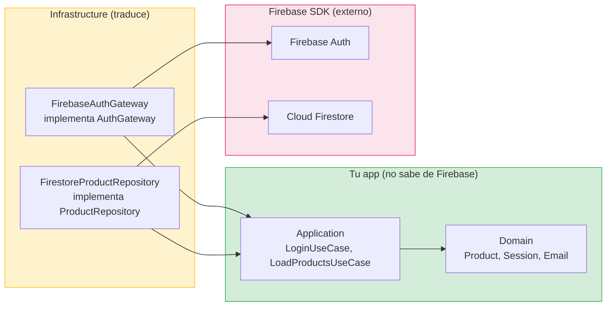

# Backend Firebase: integracion enterprise

## Objetivo de aprendizaje

Al terminar esta leccion vas a saber integrar Firebase (Auth + Firestore) en una arquitectura Clean sin contaminar Domain ni Application. Sabras encapsular los SDKs de Firebase detras de protocolos, testear la integracion con emuladores, y gestionar entornos (dev/prod) de forma segura.

En palabras simples: Firebase es un proveedor de servicios. Tu arquitectura no debe depender de el. Si mañana cambias a Supabase o a un backend propio, solo cambias un modulo.

---

## Definicion simple

Firebase es una plataforma de Google que ofrece autenticacion, base de datos en tiempo real (Firestore), storage, y mas. En este curso usamos dos servicios:

- **Firebase Auth** — para autenticar usuarios (email/password).
- **Cloud Firestore** — para almacenar y consultar datos (productos del catalogo).

Ambos tienen SDKs para iOS que se integran via Swift Package Manager.

---

## Modelo mental: Firebase como proveedor detras de un mostrador

Imagina que Domain es tu empresa. Application es tu equipo interno. Infrastructure es el mostrador que da a la calle. Firebase es un proveedor que viene a entregar paquetes al mostrador.

- Tu empresa (Domain) no sabe quien es el proveedor. Solo sabe que necesita "productos" y "sesiones de usuario".
- El mostrador (Infrastructure) recibe los paquetes del proveedor y los traduce al formato interno de la empresa.
- Si cambias de proveedor (de Firebase a Supabase), solo cambias quien viene al mostrador. La empresa sigue igual.



---

## Cuando SI y cuando NO usar Firebase

### Cuando SI

- Prototipo rapido o MVP donde necesitas backend sin escribir servidor.
- Proyecto con presupuesto limitado (plan gratuito generoso: Spark plan).
- Auth simple (email/password, Google, Apple Sign-In).
- Datos relativamente simples (documentos JSON).

### Cuando NO (o con precaucion)

- Queries complejas con JOINs (Firestore es NoSQL, no tiene JOINs nativos).
- Volumen muy alto de escrituras con consistencia transaccional fuerte.
- Necesidad de control total sobre el servidor (Firestore es serverless).
- Preocupacion por vendor lock-in (Firebase es propietario de Google).

---

## Paso 1: Configurar Firebase en el proyecto

### Prerequisitos

1. Crear un proyecto en [Firebase Console](https://console.firebase.google.com).
2. Registrar tu app iOS (bundle ID: `com.tudominio.StackMyArchitecture`).
3. Descargar `GoogleService-Info.plist` y añadirlo al target de la app.
4. Añadir Firebase SDK via SPM: `https://github.com/firebase/firebase-ios-sdk`.

### Inicializacion

```swift
// StackMyArchitecture/App/StackMyArchitectureApp.swift

import SwiftUI
import FirebaseCore

@main
struct StackMyArchitectureApp: App {
    init() {
        FirebaseApp.configure()
    }

    var body: some Scene {
        WindowGroup {
            // ... (Composition Root crea la vista)
        }
    }
}
```

**`FirebaseApp.configure()`** — Se llama UNA sola vez, al iniciar la app. Lee el `GoogleService-Info.plist` y configura los servicios. Esta es la UNICA linea de Firebase que vive fuera de Infrastructure.

---

## Paso 2: FirebaseAuthGateway (implementa AuthGateway)

```swift
// StackMyArchitecture/Features/Login/Infrastructure/FirebaseAuthGateway.swift

import Foundation
import FirebaseAuth

struct FirebaseAuthGateway: AuthGateway, Sendable {

    func authenticate(_ credentials: Credentials) async throws -> Session {
        let result: AuthDataResult
        do {
            result = try await Auth.auth().signIn(
                withEmail: credentials.email.value,
                password: credentials.password.value
            )
        } catch let error as NSError {
            throw mapAuthError(error)
        }

        guard let token = try? await result.user.getIDToken() else {
            throw LoginError.invalidCredentials
        }

        return Session(
            token: token,
            userId: result.user.uid
        )
    }

    private func mapAuthError(_ error: NSError) -> LoginError {
        switch AuthErrorCode(rawValue: error.code) {
        case .wrongPassword, .invalidEmail, .userNotFound:
            return .invalidCredentials
        case .networkError:
            return .connectivity
        case .tooManyRequests:
            return .connectivity
        default:
            return .invalidCredentials
        }
    }
}
```

**Linea por linea:**

- `struct FirebaseAuthGateway: AuthGateway, Sendable` — Implementa el mismo protocolo `AuthGateway` que usaba `RemoteAuthGateway`. El UseCase no sabe la diferencia.
- `Auth.auth().signIn(withEmail:password:)` — Llama al SDK de Firebase Auth. Es `async` nativo en versiones recientes del SDK.
- `credentials.email.value` — Usamos los Value Objects de Domain. Firebase recibe strings, pero nosotros ya validamos en el UseCase.
- `mapAuthError` — Traduce errores tecnicos de Firebase a errores semanticos de Domain (`LoginError`). El UseCase nunca ve `AuthErrorCode`; solo ve `LoginError`.
- `result.user.getIDToken()` — Obtiene el token JWT del usuario autenticado. Este token es el que se usa para autenticar peticiones a Firestore.

**Principio clave:** El SDK de Firebase (`import FirebaseAuth`) SOLO aparece en este archivo. Ningun otro archivo del proyecto importa FirebaseAuth. Si quisieras migrar a otro proveedor de auth, solo reescribes este archivo.

---

## Paso 3: FirestoreProductRepository (implementa ProductRepository)

```swift
// StackMyArchitecture/Features/Catalog/Infrastructure/FirestoreProductRepository.swift

import Foundation
import FirebaseFirestore

struct FirestoreProductRepository: ProductRepository, Sendable {
    private let db: Firestore
    private let mapper: FirestoreProductMapper

    init(
        db: Firestore = Firestore.firestore(),
        mapper: FirestoreProductMapper = FirestoreProductMapper()
    ) {
        self.db = db
        self.mapper = mapper
    }

    func loadAll() async throws -> [Product] {
        let snapshot: QuerySnapshot
        do {
            snapshot = try await db.collection("products").getDocuments()
        } catch {
            throw CatalogError.connectivity
        }

        do {
            return try snapshot.documents.map { doc in
                try mapper.toDomain(doc.data(), id: doc.documentID)
            }
        } catch {
            throw CatalogError.invalidData
        }
    }
}
```

**Linea por linea:**

- `Firestore.firestore()` — Obtiene la instancia de Firestore (configurada por `FirebaseApp.configure()`).
- `db.collection("products").getDocuments()` — Lee TODOS los documentos de la coleccion "products". En un catalogo real con miles de productos, usarias paginacion (`.limit(to: 20).start(afterDocument: lastDoc)`).
- Error de red → `CatalogError.connectivity` — Misma traduccion que haciamos con URLSession.
- Error de mapeo → `CatalogError.invalidData` — Si un documento tiene formato inesperado.
- `mapper.toDomain(doc.data(), id:)` — Convierte el diccionario de Firestore a `Product` de Domain.

### El Mapper de Firestore

```swift
// StackMyArchitecture/Features/Catalog/Infrastructure/FirestoreProductMapper.swift

import Foundation

struct FirestoreProductMapper {

    func toDomain(_ data: [String: Any], id: String) throws -> Product {
        guard
            let name = data["name"] as? String,
            let priceNumber = data["price"] as? NSNumber,
            let currency = data["currency"] as? String,
            let imageURLString = data["image_url"] as? String,
            let imageURL = URL(string: imageURLString)
        else {
            throw CatalogError.invalidData
        }

        return Product(
            id: id,
            name: name,
            price: Price(amount: priceNumber.decimalValue, currency: currency),
            imageURL: imageURL
        )
    }
}
```

**Por que `[String: Any]`:** Firestore devuelve documentos como diccionarios sin tipo. El mapper extrae cada campo con `as?` y lanza error si falta o tiene tipo incorrecto. Es similar al `ProductDTO` de la infra HTTP, pero sin `Decodable` porque Firestore no usa `JSONDecoder`.

**`priceNumber.decimalValue`** — Firestore almacena numeros como `NSNumber`. Convertimos a `Decimal` para mantener la precision que definimos en Domain.

---

## Paso 4: Firestore Security Rules

Las Security Rules de Firestore definen quien puede leer y escribir cada coleccion. Son criticas para seguridad.

```
// firestore.rules

rules_version = '2';

service cloud.firestore {
  match /databases/{database}/documents {

    // Productos: cualquier usuario autenticado puede leer
    match /products/{productId} {
      allow read: if request.auth != null;
      allow write: if false; // Solo admin (via consola o Cloud Functions)
    }

    // Usuarios: cada usuario solo puede leer/escribir su propio doc
    match /users/{userId} {
      allow read, write: if request.auth != null && request.auth.uid == userId;
    }

    // Por defecto: denegar todo
    match /{document=**} {
      allow read, write: if false;
    }
  }
}
```

**Linea por linea:**

- `request.auth != null` — Solo usuarios autenticados pueden leer productos. Un usuario anonimo no ve nada.
- `allow write: if false` — Nadie puede escribir productos desde la app. Los productos se gestionan desde Firebase Console o Cloud Functions. Esto protege contra clientes maliciosos.
- `request.auth.uid == userId` — Cada usuario solo accede a sus propios datos. Un usuario no puede leer el perfil de otro.
- Regla por defecto: **denegar todo**. Si olvidas una regla, el acceso se deniega (fail-safe).

---

## Paso 5: Emuladores locales para tests

Firebase ofrece emuladores locales que replican Auth y Firestore sin conectarse a la nube. Son esenciales para:

- Tests de integracion sin coste ni latencia de red.
- Desarrollo local sin afectar datos de produccion.

### Configuracion

```bash
# Instalar Firebase CLI (una sola vez)
npm install -g firebase-tools

# En el directorio del proyecto
firebase init emulators
# Selecciona: Auth + Firestore

# Iniciar emuladores
firebase emulators:start
```

### Conectar la app a emuladores (solo en desarrollo)

```swift
// StackMyArchitecture/App/FirebaseConfig.swift

import Foundation
import FirebaseAuth
import FirebaseFirestore

struct FirebaseConfig {
    static func configureForDevelopment() {
        #if DEBUG
        Auth.auth().useEmulator(withHost: "localhost", port: 9099)

        let settings = Firestore.firestore().settings
        settings.host = "localhost:8080"
        settings.cacheSettings = MemoryCacheSettings()
        settings.isSSLEnabled = false
        Firestore.firestore().settings = settings
        #endif
    }
}
```

**`#if DEBUG`** — Solo activa emuladores en builds de debug. En produccion, Firebase conecta con la nube automaticamente. Esto previene que un build de release accidentalmente use emuladores.

---

## Paso 6: Wiring en Composition Root

```swift
// En CompositionRoot, con Firebase:

extension CompositionRoot {

    func makeLoginViewWithFirebase(
        onLoginSucceeded: @MainActor @escaping (Session) -> Void
    ) -> LoginView {
        let authGateway = FirebaseAuthGateway()
        let loginUseCase = LoginUseCase(gateway: authGateway)
        let viewModel = LoginViewModel(
            loginUseCase: loginUseCase,
            onLoginSucceeded: onLoginSucceeded
        )
        return LoginView(viewModel: viewModel)
    }

    func makeCatalogViewWithFirebase(
        onProductSelected: @MainActor @escaping (Product) -> Void
    ) -> CatalogView {
        let repository = FirestoreProductRepository()
        let useCase = LoadProductsUseCase(repository: repository)
        let viewModel = CatalogViewModel(
            loadProducts: useCase,
            onProductSelected: onProductSelected
        )
        return CatalogView(viewModel: viewModel)
    }
}
```

**Comparacion con Etapa 2:** Lo unico que cambia es la linea de creacion del gateway/repository:

| Etapa 2 (HTTP generico) | Etapa 3 (Firebase) |
|---|---|
| `RemoteAuthGateway(httpClient: httpClient, baseURL: baseURL)` | `FirebaseAuthGateway()` |
| `RemoteProductRepository(httpClient: httpClient, baseURL: baseURL)` | `FirestoreProductRepository()` |

**UseCase, ViewModel y View no cambian.** Esa es la prueba de que la arquitectura por capas funciona.

---

## Modelo de datos en Firestore

Estructura de la coleccion `products`:

```
products/
  {productId}/
    name: "Camiseta React"       (string)
    price: 29.99                  (number)
    currency: "EUR"               (string)
    image_url: "https://..."      (string)
```

**Reglas de modelado para Firestore:**

- **Desnormalizar:** Firestore no tiene JOINs. Si necesitas el nombre de la categoria en cada producto, lo duplicas en el documento del producto.
- **IDs autogenerados:** Firestore genera IDs unicos para cada documento. Los usamos como `Product.id`.
- **Flat structure:** Evita subdocumentos profundos. Mejor colecciones separadas con referencias por ID.

---

## Entornos: dev vs prod

Nunca uses la misma base de datos para desarrollo y produccion.

### Estrategia con dos proyectos Firebase

1. **`stack-my-arch-dev`** — Proyecto Firebase para desarrollo. Datos de prueba. Emuladores locales.
2. **`stack-my-arch-prod`** — Proyecto Firebase para produccion. Datos reales. Security Rules estrictas.

### Cambio de entorno

Cada proyecto tiene su propio `GoogleService-Info.plist`. Puedes usar build configurations de Xcode o un script de build para copiar el plist correcto segun el scheme.

```
StackMyArchitecture/
  Config/
    Dev/GoogleService-Info.plist
    Prod/GoogleService-Info.plist
```

En el Build Phase, un script copia el plist correcto:

```bash
if [ "${CONFIGURATION}" == "Debug" ]; then
    cp "${PROJECT_DIR}/Config/Dev/GoogleService-Info.plist" "${BUILT_PRODUCTS_DIR}/${PRODUCT_NAME}.app/"
else
    cp "${PROJECT_DIR}/Config/Prod/GoogleService-Info.plist" "${BUILT_PRODUCTS_DIR}/${PRODUCT_NAME}.app/"
fi
```

---

## Tests de integracion con Firebase

### Con emuladores (recomendado)

```swift
final class FirebaseAuthGatewayIntegrationTests: XCTestCase {

    override func setUp() {
        super.setUp()
        // Conectar a emulador Auth local
        Auth.auth().useEmulator(withHost: "localhost", port: 9099)
    }

    func test_authenticate_withValidCredentials_returnsSession() async throws {
        // Pre-crear usuario en emulador
        try await Auth.auth().createUser(
            withEmail: "test@example.com",
            password: "Pass1234"
        )

        let sut = FirebaseAuthGateway()
        let credentials = Credentials(
            email: try Email("test@example.com"),
            password: try Password("Pass1234")
        )

        let session = try await sut.authenticate(credentials)

        XCTAssertFalse(session.token.isEmpty)
        XCTAssertFalse(session.userId.isEmpty)
    }
}
```

**Nota:** Estos tests requieren que los emuladores de Firebase esten corriendo (`firebase emulators:start`). Son mas lentos que los unit tests con stubs, pero verifican la integracion real con el SDK.

### Sin emuladores (unit tests con stubs)

Para los tests del UseCase y del ViewModel, seguimos usando stubs como siempre. Firebase no aparece en esos tests. Solo los tests de Infrastructure (contract tests) usan emuladores o mocks del SDK.

---

## Limites del plan gratuito (Spark)

| Servicio | Limite gratuito |
|---|---|
| Firebase Auth | 10K usuarios/mes (verificaciones SMS aparte) |
| Firestore reads | 50K/dia |
| Firestore writes | 20K/dia |
| Firestore storage | 1 GB |

**Para un curso y desarrollo:** Mas que suficiente. Si llegas a estos limites en produccion, migras al plan Blaze (pay-as-you-go).

**Verificar limites actualizados:** Los limites pueden cambiar. Consulta siempre la [pagina oficial de precios](https://firebase.google.com/pricing) (N/D: no puedo verificar la URL exacta en este momento, confirma en la documentacion oficial de Firebase).

---

## Errores tipicos y como depurarlos

### Error 1: FirebaseApp no configurado

Mensaje: `Default FirebaseApp is not configured. Make sure you call FirebaseApp.configure()`

Causa: Olvidaste llamar a `FirebaseApp.configure()` antes de usar cualquier servicio.

Solucion: Llamar en el `init()` de `@main App`.

### Error 2: Permission denied en Firestore

Mensaje: `Missing or insufficient permissions`

Causa: Las Security Rules no permiten la operacion. O el usuario no esta autenticado.

Solucion: Verificar que el usuario esta logueado (`Auth.auth().currentUser != nil`) y que las rules permiten la operacion.

### Error 3: Datos nil en Firestore

Mensaje: El mapper lanza `CatalogError.invalidData` inesperadamente.

Causa: Un campo del documento tiene nombre diferente al esperado, o tipo diferente.

Solucion: Verificar en Firebase Console que los documentos tienen la estructura esperada. Usar el mapper con validacion explicita (`guard let ... else throw`).

---

## ADR corto de la leccion

```markdown
## ADR-004: Firebase como backend principal encapsulado en Infrastructure
- Estado: Aprobado
- Contexto: necesidad de backend gratuito para Auth y datos de Catalog
- Decision: Firebase Auth + Firestore, encapsulados detras de AuthGateway y ProductRepository
- Alternativa: Supabase (Postgres + RLS), documentada en apendice
- Consecuencias: setup rapido, plan gratuito generoso, vendor lock-in mitigado por encapsulacion; si migramos, solo cambian archivos de Infrastructure
- Fecha: 2026-02-07
```

---

## Checklist de calidad

- [ ] `import Firebase*` solo aparece en archivos de Infrastructure.
- [ ] Domain y Application no saben que Firebase existe.
- [ ] Security Rules siguen principio de minimo privilegio.
- [ ] Entornos dev/prod separados con plists distintos.
- [ ] Emuladores configurados para tests de integracion.
- [ ] Errores de Firebase se traducen a errores de Domain.
- [ ] Composition Root puede cambiar de Firebase a HTTP generico cambiando una linea.

---

## Cierre

Firebase es una herramienta poderosa para arrancar rapido. Pero su valor real en un proyecto enterprise no es la facilidad de setup, sino lo facil que es reemplazarlo gracias a la encapsulacion. Si un dia tu empresa decide migrar a un backend propio, tu Domain, Application e Interface ni se enteran. Solo cambias los archivos de Infrastructure y el Composition Root. Esa es la garantia que te da una arquitectura bien diseñada.

**Anterior:** [SwiftData como ProductStore ←](06-swiftdata-store.md) · **Siguiente:** [Entregables Etapa 3 →](entregables-etapa-3.md)
