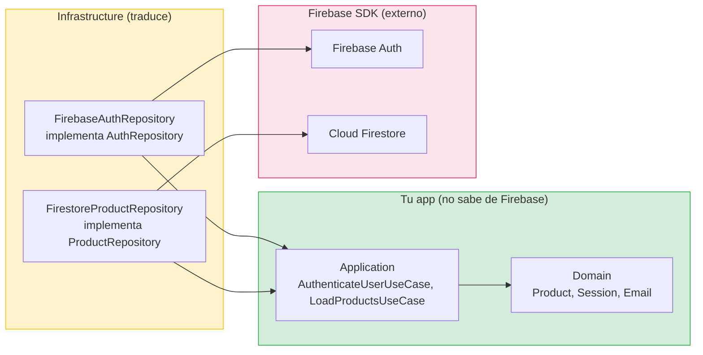

# Backend Firebase: integración enterprise

## Objetivo de aprendizaje

Al terminar esta lección vas a saber integrar Firebase (Auth + Firestore) en una arquitectura Clean sin contaminar Domain ni Application. Sabras encapsular los SDKs de Firebase detrás de protocolos, testear la integración con emuladores, y gestionar entornos (dev/prod) de forma segura.

En palabras simples: Firebase es un proveedor de servicios. Tu arquitectura no debe depender de el. Si mañana cambias a Supabase o a un backend propio, solo cambias un módulo.

---

## Definición simple

Firebase es una plataforma de Google que ofrece autenticación, base de datos en tiempo real (Firestore), storage, y más. En este curso usamos dos servicios:

- **Firebase Auth** — para autenticar usuarios (email/password).
- **Cloud Firestore** — para almacenar y consultar datos (productos del catálogo).

Ambos tienen SDKs para iOS que se integran via Swift Package Manager.

---

## Modelo mental: Firebase como proveedor detrás de un mostrador

Imagina que Domain es tu empresa. Application es tu equipo interno. Infrastructure es el mostrador que da a la calle. Firebase es un proveedor que viene a entregar paquetes al mostrador.

- Tu empresa (Domain) no sabe quien es el proveedor. Solo sabe que necesita "productos" y "sesiones de usuario".
- El mostrador (Infrastructure) recibe los paquetes del proveedor y los traduce al formato interno de la empresa.
- Si cambias de proveedor (de Firebase a Supabase), solo cambias quien viene al mostrador. La empresa sigue igual.


```mermaid
graph LR
    subgraph CORE["Tu app (no sabe de Firebase)"]
        D["Domain<br/>Product, Session, Email"]
        A["Application<br/>AuthenticateUserUseCase, LoadProductsUseCase"]
    end

    subgraph INFRA["Infrastructure (traduce)"]
        FBA["FirebaseAuthRepository<br/>implementa AuthRepository"]
        FBR["FirestoreProductRepository<br/>implementa ProductRepository"]
    end

    subgraph SDK["Firebase SDK (externo)"]
        AUTH["Firebase Auth"]
        FS["Cloud Firestore"]
    end

    A --> D
    FBA --> A
    FBR --> A
    FBA --> AUTH
    FBR --> FS

    style CORE fill:#d4edda,stroke:#28a745
    style INFRA fill:#fff3cd,stroke:#ffc107
    style SDK fill:#fce4ec,stroke:#e91e63
```

Lectura del diagrama:

→ **CORE (verde)** es tu app: Domain define `Product`, `Session`, `Email` como tipos puros. Application orquesta con `AuthenticateUserUseCase` y `LoadProductsUseCase`. Ninguno de los dos sabe que Firebase existe — solo conocen protocolos (`AuthRepository`, `ProductRepository`).

→ **Infrastructure (amarillo)** traduce: `FirebaseAuthRepository` implementa `AuthRepository` llamando al SDK de Firebase Auth. `FirestoreProductRepository` implementa `ProductRepository` leyendo de Firestore. Cada uno convierte tipos de Firebase a tipos de Domain.

→ **Firebase SDK (rojo)** es externo y reemplazable. Las flechas van de Infrastructure hacia el SDK, nunca al revés. Si mañana cambias Firebase por Supabase, solo reescribes los archivos amarillos.

→ La dirección de las flechas confirma la Regla de Dependencia: Application depende de Domain (hacia dentro), Infrastructure depende de Application (implementa sus contratos). El SDK es un detalle de implementación que Domain no ve.

---

## Cuando SI y cuando NO usar Firebase

### Cuando SI

- Prototipo rápido o MVP donde necesitas backend sin escribir servidor.
- Proyecto con presupuesto limitado (plan gratuito generoso: Spark plan).
- Auth simple (email/password, Google, Apple Sign-In).
- Datos relativamente simples (documentos JSON).

```swift
// ✅ Firebase encaja bien: autenticación + colección de productos simple
// Un catálogo de productos es un caso ideal: lectura frecuente,
// escrituras ocasionales (admin), datos en formato JSON plano.
let db = Firestore.firestore()
db.collection("products").getDocuments { snapshot, error in
    // Traduce documentos Firestore → [ProductDTO] → [Product] de Domain
    // Clean Architecture garantiza que Domain no sabe de este código.
}
```

### Cuando NO (o con precaucion)

- Queries complejas con JOINs (Firestore es NoSQL, no tiene JOINs nativos).
- Volumen muy alto de escrituras con consistencia transaccional fuerte.
- Necesidad de control total sobre el servidor (Firestore es serverless).
- Preocupacion por vendor lock-in (Firebase es propietario de Google).

```swift
// ❌ Firestore para queries relacionales — no está diseñado para esto
// "Dame todos los pedidos de usuarios de Madrid que compraron en los últimos 7 días
//  con valor total > 50€, ordenados por fecha de último acceso."
// En SQL sería un JOIN + WHERE + GROUP BY.
// En Firestore necesitas múltiples colecciones, índices compuestos y lógica en cliente.
// El coste de lecturas escala muy rápido con este patrón.

// ❌ Sin Clean Architecture: vendor lock-in directo en Application
struct LoadProductsUseCase {
    func execute() async throws -> [Product] {
        // Firebase directamente en el caso de uso — impossible de migrar sin reescribir
        let snapshot = try await Firestore.firestore().collection("products").getDocuments()
        return snapshot.documents.compactMap { ... }
    }
}

// ✅ Con Clean Architecture: Firebase solo en Infrastructure
// Si mañana migras a Supabase o a tu propio REST, solo cambias este archivo:
struct FirestoreProductRepository: ProductRepository {
    func loadAll() async throws -> [Product] {
        let snapshot = try await Firestore.firestore().collection("products").getDocuments()
        return try snapshot.documents.map(FirestoreProductMapper.map)
    }
}
// LoadProductsUseCase no cambia. Domain no cambia. UI no cambia.
// El coste de cambiar de proveedor es reescribir un adaptador, no una reescritura de app.
```

La arquitectura limpia no protege de las limitaciones de Firestore, pero sí limita el daño a una capa cuando decides migrar.

---

## Paso 1: Configurar Firebase en el proyecto

### Prerequisitos

1. Crear un proyecto en [Firebase Console](https://console.firebase.google.com).
2. Registrar tu app iOS (bundle ID: `com.tudominio.StackMyArchitecture`).
3. Descargar `GoogleService-Info.plist` y añadirlo al target de la app.
4. Añadir Firebase SDK via SPM: `https://github.com/firebase/firebase-ios-sdk`.

### Inicializacion

```swift
// StackMyArchitecture/App/StackMyArchitectureApp.swift

import SwiftUI
import FirebaseCore

@main
struct StackMyArchitectureApp: App {
    init() {
        FirebaseApp.configure()
    }

    var body: some Scene {
        WindowGroup {
            // ... (Composition Root crea la vista)
        }
    }
}
```

**`FirebaseApp.configure()`** — Se llama UNA sola vez, al iniciar la app. Lee el `GoogleService-Info.plist` y configura los servicios. Esta es la UNICA linea de Firebase que vive fuera de Infrastructure.

---

## Paso 2: FirebaseAuthRepository (implementa AuthRepository)

```swift
// StackMyArchitecture/Features/Login/Infrastructure/FirebaseAuthRepository.swift

import Foundation
import FirebaseAuth

struct FirebaseAuthRepository: AuthRepository, Sendable {

    func authenticate(_ credentials: Credentials) async throws -> Session {
        let result: AuthDataResult
        do {
            result = try await Auth.auth().signIn(
                withEmail: credentials.email.value,
                password: credentials.password.value
            )
        } catch let error as NSError {
            throw mapAuthError(error)
        }

        guard let token = try? await result.user.getIDToken() else {
            throw LoginError.invalidCredentials
        }

        return Session(
            token: token,
            userId: result.user.uid
        )
    }

    private func mapAuthError(_ error: NSError) -> LoginError {
        switch AuthErrorCode(rawValue: error.code) {
        case .wrongPassword, .invalidEmail, .userNotFound:
            return .invalidCredentials
        case .networkError:
            return .connectivity
        case .tooManyRequests:
            return .connectivity
        default:
            return .invalidCredentials
        }
    }
}
```

**Linea por linea:**

- `struct FirebaseAuthRepository: AuthRepository, Sendable` — Implementa el mismo protocolo `AuthRepository` que usaba `AuthHTTPRepository`. El UseCase no sabe la diferencia.
- `Auth.auth().signIn(withEmail:password:)` — Llama al SDK de Firebase Auth. Es `async` nativo en versiones recientes del SDK.
- `credentials.email.value` — Usamos los Value Objects de Domain. Firebase recibe strings, pero nosotros ya validamos en el UseCase.
- `mapAuthError` — Traduce errores técnicos de Firebase a errores semánticos de Domain (`LoginError`). El UseCase nunca ve `AuthErrorCode`; solo ve `LoginError`.
- `result.user.getIDToken()` — Obtiene el token JWT del usuario autenticado. Este token es el que se usa para autenticar peticiones a Firestore.

**Principio clave:** El SDK de Firebase (`import FirebaseAuth`) SOLO aparece en este archivo. Ningun otro archivo del proyecto importa FirebaseAuth. Si quisieras migrar a otro proveedor de auth, solo reescribes este archivo.

---

## Paso 3: FirestoreProductRepository (implementa ProductRepository)

```swift
// StackMyArchitecture/Features/Catalog/Infrastructure/FirestoreProductRepository.swift

import Foundation
import FirebaseFirestore

struct FirestoreProductRepository: ProductRepository, Sendable {
    private let db: Firestore
    private let mapper: FirestoreProductMapper

    init(
        db: Firestore = Firestore.firestore(),
        mapper: FirestoreProductMapper = FirestoreProductMapper()
    ) {
        self.db = db
        self.mapper = mapper
    }

    func loadAll() async throws -> [Product] {
        let snapshot: QuerySnapshot
        do {
            snapshot = try await db.collection("products").getDocuments()
        } catch {
            throw CatalogError.connectivity
        }

        do {
            return try snapshot.documents.map { doc in
                try mapper.toDomain(doc.data(), id: doc.documentID)
            }
        } catch {
            throw CatalogError.invalidData
        }
    }
}
```

**Linea por linea:**

- `Firestore.firestore()` — Obtiene la instancia de Firestore (configurada por `FirebaseApp.configure()`).
- `db.collection("products").getDocuments()` — Lee TODOS los documentos de la coleccion "products". En un catálogo real con miles de productos, usarias paginacion (`.limit(to: 20).start(afterDocument: lastDoc)`).
- Error de red → `CatalogError.connectivity` — Misma traduccion que haciamos con URLSession.
- Error de mapeo → `CatalogError.invalidData` — Si un documento tiene formato inesperado.
- `mapper.toDomain(doc.data(), id:)` — Convierte el diccionario de Firestore a `Product` de Domain.

### El Mapper de Firestore

```swift
// StackMyArchitecture/Features/Catalog/Infrastructure/FirestoreProductMapper.swift

import Foundation

struct FirestoreProductMapper {

    func toDomain(_ data: [String: Any], id: String) throws -> Product {
        guard
            let name = data["name"] as? String,
            let priceNumber = data["price"] as? NSNumber,
            let currency = data["currency"] as? String,
            let imageURLString = data["image_url"] as? String,
            let imageURL = URL(string: imageURLString)
        else {
            throw CatalogError.invalidData
        }

        return Product(
            id: id,
            name: name,
            price: Price(amount: priceNumber.decimalValue, currency: currency),
            imageURL: imageURL
        )
    }
}
```

**Por que `[String: Any]`:** Firestore devuelve documentos como diccionarios sin tipo. El mapper extrae cada campo con `as?` y lanza error si falta o tiene tipo incorrecto. Es similar al `ProductDTO` de la infra HTTP, pero sin `Decodable` porque Firestore no usa `JSONDecoder`.

**`priceNumber.decimalValue`** — Firestore almacena numeros como `NSNumber`. Convertimos a `Decimal` para mantener la precisión que definimos en Domain.

---

## Paso 4: Firestore Security Rules

Las Security Rules de Firestore definen quien puede leer y escribir cada coleccion. Son criticas para seguridad.

```text
// firestore.rules

rules_version = '2';

service cloud.firestore {
  match /databases/{database}/documents {

    // Productos: cualquier usuario autenticado puede leer
    match /products/{productId} {
      allow read: if request.auth != null;
      allow write: if false; // Solo admin (via consola o Cloud Functions)
    }

    // Usuarios: cada usuario solo puede leer/escribir su propio doc
    match /users/{userId} {
      allow read, write: if request.auth != null && request.auth.uid == userId;
    }

    // Por defecto: denegar todo
    match /{document=**} {
      allow read, write: if false;
    }
  }
}
```

**Linea por linea:**

- `request.auth != null` — Solo usuarios autenticados pueden leer productos. Un usuario anonimo no ve nada.
- `allow write: if false` — Nadie puede escribir productos desde la app. Los productos se gestionan desde Firebase Console o Cloud Functions. Esto protege contra clientes maliciosos.
- `request.auth.uid == userId` — Cada usuario solo accede a sus propios datos. Un usuario no puede leer el perfil de otro.
- Regla por defecto: **denegar todo**. Si olvidas una regla, el acceso se deniega (fail-safe).

---

## Paso 5: Emuladores locales para tests

Firebase ofrece emuladores locales que replican Auth y Firestore sin conectarse a la nube. Son esenciales para:

- Tests de integración sin coste ni latencia de red.
- Desarrollo local sin afectar datos de producción.

### Configuración

```bash
# Instalar Firebase CLI (una sola vez)
npm install -g firebase-tools

# En el directorio del proyecto
firebase init emulators
# Selecciona: Auth + Firestore

# Iniciar emuladores
firebase emulators:start
```

### Conectar la app a emuladores (solo en desarrollo)

```swift
// StackMyArchitecture/App/FirebaseConfig.swift

import Foundation
import FirebaseAuth
import FirebaseFirestore

struct FirebaseConfig {
    static func configureForDevelopment() {
        #if DEBUG
        Auth.auth().useEmulator(withHost: "localhost", port: 9099)

        let settings = Firestore.firestore().settings
        settings.host = "localhost:8080"
        settings.cacheSettings = MemoryCacheSettings()
        settings.isSSLEnabled = false
        Firestore.firestore().settings = settings
        #endif
    }
}
```

**`#if DEBUG`** — Solo activa emuladores en builds de debug. En producción, Firebase conecta con la nube automáticamente. Esto previene que un build de release accidentalmente use emuladores.

---

## Paso 6: Wiring en Composition Root

```swift
// En CompositionRoot, con Firebase:

extension CompositionRoot {

    func makeLoginViewWithFirebase(
        navigator: any LoginNavigating
    ) -> LoginView {
        let authRepository = FirebaseAuthRepository()
        let loginUseCase = AuthenticateUserUseCase(repository: authRepository)
        let viewModel = LoginViewModel(
            useCase: loginUseCase,
            navigator: navigator
        )
        return LoginView(viewModel: viewModel)
    }

    func makeCatalogViewWithFirebase(
        onProductSelected: @MainActor @escaping (Product) -> Void
    ) -> CatalogView {
        let repository = FirestoreProductRepository()
        let useCase = LoadProductsUseCase(repository: repository)
        let viewModel = CatalogViewModel(
            loadProducts: useCase,
            onProductSelected: onProductSelected
        )
        return CatalogView(viewModel: viewModel)
    }
}
```

**Comparacion con Etapa 2:** Lo único que cambia es la linea de creación del gateway/repository:

| Etapa 2 (HTTP genérico) | Etapa 3 (Firebase) |
|---|---|
| `AuthHTTPRepository(httpClient: httpClient, baseURL: baseURL)` | `FirebaseAuthRepository()` |
| `RemoteProductRepository(httpClient: httpClient, baseURL: baseURL)` | `FirestoreProductRepository()` |

**UseCase, ViewModel y View no cambian.** Esa es la prueba de que la arquitectura por capas funciona.

---

## Modelo de datos en Firestore

Estructura de la coleccion `products`:

```text
products/
  {productId}/
    name: "Camiseta React"       (string)
    price: 29.99                  (number)
    currency: "EUR"               (string)
    image_url: "https://..."      (string)
```

**Reglas de modelado para Firestore:**

- **Desnormalizar:** Firestore no tiene JOINs. Si necesitas el nombre de la categoria en cada producto, lo duplicas en el documento del producto.
- **IDs autogenerados:** Firestore genera IDs unicos para cada documento. Los usamos como `Product.id`.
- **Flat structure:** Evita subdocumentos profundos. Mejor colecciones separadas con referencias por ID.

---

## Entornos: dev vs prod

Nunca uses la misma base de datos para desarrollo y producción.

### Estrategia con dos proyectos Firebase

1. **`stack-my-arch-dev`** — Proyecto Firebase para desarrollo. Datos de prueba. Emuladores locales.
2. **`stack-my-arch-prod`** — Proyecto Firebase para producción. Datos reales. Security Rules estrictas.

### Cambio de entorno

Cada proyecto tiene su propio `GoogleService-Info.plist`. Puedes usar build configurations de Xcode o un script de build para copiar el plist correcto segun el scheme.

```text
StackMyArchitecture/
  Config/
    Dev/GoogleService-Info.plist
    Prod/GoogleService-Info.plist
```

En el Build Phase, un script copia el plist correcto:

```bash
if [ "${CONFIGURATION}" == "Debug" ]; then
    cp "${PROJECT_DIR}/Config/Dev/GoogleService-Info.plist" "${BUILT_PRODUCTS_DIR}/${PRODUCT_NAME}.app/"
else
    cp "${PROJECT_DIR}/Config/Prod/GoogleService-Info.plist" "${BUILT_PRODUCTS_DIR}/${PRODUCT_NAME}.app/"
fi
```

---

## Tests de integración con Firebase

### Con emuladores (recomendado)

```swift
final class FirebaseAuthRepositoryIntegrationTests: XCTestCase {

    override func setUp() {
        super.setUp()
        // Conectar a emulador Auth local
        Auth.auth().useEmulator(withHost: "localhost", port: 9099)
    }

    func test_authenticate_withValidCredentials_returnsSession() async throws {
        // Pre-crear usuario en emulador
        try await Auth.auth().createUser(
            withEmail: "test@example.com",
            password: "Pass1234"
        )

        let sut = FirebaseAuthRepository()
        let credentials = Credentials(
            email: try Email("test@example.com"),
            password: try Password("Pass1234")
        )

        let session = try await sut.authenticate(credentials)

        XCTAssertFalse(session.token.isEmpty)
        XCTAssertFalse(session.userId.isEmpty)
    }
}
```

**Nota:** Estos tests requieren que los emuladores de Firebase esten corriendo (`firebase emulators:start`). Son más lentos que los unit tests con stubs, pero verifican la integración real con el SDK.

### Sin emuladores (unit tests con stubs)

Para los tests del UseCase y del ViewModel, seguimos usando stubs como siempre. Firebase no aparece en esos tests. Solo los tests de Infrastructure (contract tests) usan emuladores o mocks del SDK.

---

## Limites del plan gratuito (Spark)

| Servicio | Limite gratuito |
|---|---|
| Firebase Auth | 10K usuarios/mes (verificaciones SMS aparte) |
| Firestore reads | 50K/dia |
| Firestore writes | 20K/dia |
| Firestore storage | 1 GB |

**Para un curso y desarrollo:** Más que suficiente. Si llegas a estos limites en producción, migras al plan Blaze (pay-as-you-go).

**Verificar limites actualizados:** Los limites pueden cambiar. Consulta siempre la [página oficial de precios](https://firebase.google.com/pricing) (N/D: no puedo verificar la URL exacta en este momento, confirma en la documentacion oficial de Firebase).

---

## Errores tipicos y como depurarlos

### Error 1: FirebaseApp no configurado

Mensaje: `Default FirebaseApp is not configured. Make sure you call FirebaseApp.configure()`

Causa: Olvidaste llamar a `FirebaseApp.configure()` antes de usar cualquier servicio.

Solución: Llamar en el `init()` de `@main App`.

### Error 2: Permission denied en Firestore

Mensaje: `Missing or insufficient permissions`

Causa: Las Security Rules no permiten la operación. O el usuario no esta autenticado.

Solución: Verificar que el usuario esta logueado (`Auth.auth().currentUser != nil`) y que las rules permiten la operación.

### Error 3: Datos nil en Firestore

Mensaje: El mapper lanza `CatalogError.invalidData` inesperadamente.

Causa: Un campo del documento tiene nombre diferente al esperado, o tipo diferente.

Solución: Verificar en Firebase Console que los documentos tienen la estructura esperada. Usar el mapper con validación explicita (`guard let ... else throw`).

---

## ADR corto de la lección

```markdown
## ADR-004: Firebase como backend principal encapsulado en Infrastructure
- Estado: Aprobado
- Contexto: necesidad de backend gratuito para Auth y datos de Catalog
- Decision: Firebase Auth + Firestore, encapsulados detras de AuthRepository y ProductRepository
- Alternativa: Supabase (Postgres + RLS), documentada en apendice
- Consecuencias: setup rapido, plan gratuito generoso, vendor lock-in mitigado por encapsulacion; si migramos, solo cambian archivos de Infrastructure
- Fecha: 2026-02-07
```

---

## Checklist de calidad

- [ ] `import Firebase*` solo aparece en archivos de Infrastructure.
- [ ] Domain y Application no saben que Firebase existe.
- [ ] Security Rules siguen principio de minimo privilegio.
- [ ] Entornos dev/prod separados con plists distintos.
- [ ] Emuladores configurados para tests de integración.
- [ ] Errores de Firebase se traducen a errores de Domain.
- [ ] Composition Root puede cambiar de Firebase a HTTP genérico cambiando una linea.

---

## Cierre

Firebase es una herramienta poderosa para arrancar rápido. Pero su valor real en un proyecto enterprise no es la facilidad de setup, sino lo fácil que es reemplazarlo gracias a la encapsulacion. Si un dia tu empresa decide migrar a un backend propio, tu Domain, Application e Interface ni se enteran. Solo cambias los archivos de Infrastructure y el Composition Root. Esa es la garantia que te da una arquitectura bien diseñada.

---

## Ejercicio guiado: verificar encapsulación de Firebase

**Objetivo:** Confirmar que Firebase está correctamente encapsulado y que el Composition Root puede cambiar de backend sin tocar Domain ni Application.

**Instrucciones:**

1. Ejecuta `./scripts/check-dependencies.sh` desde `apps/ios/ArchitectureKit/`.
2. Verifica que ningún target de Domain ni Application importa `Firebase*`.
3. En `AppComposition`, localiza dónde se inyecta el repositorio de productos.
4. Escribe un test conceptual: crea un `StubProductRepository` que devuelva datos hardcodeados y verifica que `AppComposition` puede usarlo en lugar del repositorio real de Firebase.

**Criterios de éxito:**

- `check-dependencies.sh` pasa sin errores.
- `grep -r "import Firebase" Sources/FeatureCatalogDomain Sources/FeatureLoginDomain` devuelve 0 resultados.
- El test de composición demuestra que el wiring es intercambiable.

<details>
<summary>Solución de referencia</summary>

```bash
# 1. Verificar que no hay imports de Firebase en Domain/Application
./scripts/check-dependencies.sh
# Salida esperada: "Domain imports OK"

grep -r "import Firebase" \
  apps/ios/ArchitectureKit/Sources/FeatureCatalogDomain \
  apps/ios/ArchitectureKit/Sources/FeatureLoginDomain 2>/dev/null
# Salida esperada: 0 líneas (sin resultados)
```

```swift
// Tests/AppCompositionTests/CompositionFirebaseEncapsulationTests.swift

import XCTest
@testable import AppComposition
@testable import FeatureCatalogDomain

final class CompositionFirebaseEncapsulationTests: XCTestCase {

    // Verifica que AppComposition puede usar un stub en lugar de Firebase
    func test_composition_worksWithStubRepository() async throws {
        let expectedProduct = Product(id: "p-1", title: "Producto de prueba", price: 15.00)  // title, no name; Double, no Decimal
        let stub = StubCatalogRepository(result: .success([expectedProduct]))

        // Si AppComposition acepta un CatalogRepository genérico (protocolo),
        // este test compila y pasa SIN Firebase en el grafo de dependencias.
        let products = try await stub.fetchCatalog()  // fetchCatalog, no loadAll/execute

        XCTAssertEqual(products.count, 1)
        XCTAssertEqual(products.first?.title, "Producto de prueba")  // title, no name
    }
}
```

> **Nota scaffold:** El protocolo es `CatalogRepository` con `fetchCatalog()` (no `ProductRepository.loadAll()`). El `Product` usa `title: String` y `price: Double` (no `name`, no `Price(amount:currency:)`, no `imageURL`). El stub es `StubCatalogRepository`.

La clave no es testear Firebase en sí, sino verificar que la arquitectura permite sustituirlo. Si el UseCase depende del protocolo `CatalogRepository` y no de `FirestoreProductRepository` directamente, este test compila sin necesidad de emuladores ni conexión. Firebase solo aparece en Infrastructure; Domain y Application no saben que existe.

**Resultado esperado**: el script de dependencias pasa sin errores, el grep devuelve 0 líneas, y el test de composición compila y pasa con el repositorio stub (sin Firebase).

</details>

---

## Implementación en tu proyecto

Firebase no forma parte del scaffold actual — el scaffold usa `InMemoryCatalogRemoteDataSource` y `InMemoryAuthRepository` como implementaciones por defecto. Esta lección documenta cómo añadir Firebase como proveedor real.

### Divergencias críticas respecto a los ejemplos del curso

| Lección | Scaffold real |
|---|---|
| `ProductRepository.loadAll()` | `CatalogRepository.fetchCatalog()` |
| `AuthRepository.authenticate(_:)` | `AuthRepository.authenticate(credentials:) -> UserSession` |
| `Product(id:name:price:imageURL:)` | `Product(id:title:price:)` con `Double` |
| `Price(amount: Decimal, currency: String)` | `price: Double` — sin tipo `Price` |
| `LoadProductsUseCase` | No hay UseCase separado — el ViewModel llama al repositorio directamente |
| `FirestoreProductMapper` con `name`, `priceNumber`, `currency`, `imageURL` | Adaptar para mapear a `title: String` y `price: Double` |

### Si quieres añadir Firebase al scaffold

1. Crea un módulo `FeatureCatalogFirebase` (o añádelo a `FeatureCatalogData`)
2. Implementa `CatalogRepository` con Firestore (equivalente a `FirestoreProductRepository` del curso)
3. Implementa `AuthRepository` con Firebase Auth (equivalente a `FirebaseAuthRepository` del curso)
4. En `AppCompositionRoot`, pasa las implementaciones Firebase en lugar de las `InMemory`:

```swift
// ✅ Cambio mínimo en Composition Root
let catalogRepo = FirestoreCatalogRepository(db: Firestore.firestore())
let authRepo = FirebaseAuthRepository()
let root = AppCompositionRoot(authRepository: authRepo, catalogRepository: catalogRepo)
```

5. `FirebaseApp.configure()` va en el `init()` de `@main App` — es la única línea de Firebase fuera de Infrastructure

### Modelo de datos Firestore adaptado al scaffold

```text
products/
  {productId}/
    title: "Camiseta React"       (string)   ← no "name"
    price: 29.99                   (number)   ← Double directo
```

No necesitas `currency` ni `image_url` porque el scaffold no los tiene en `Product`.

---

## 🔭 Explora el scaffold — El patrón base para cualquier backend

```bash
open apps/ios/ArchitectureKit/Package.swift
# Navega a: Sources/FeatureLoginData/AuthHTTPRepository.swift
#           Sources/FeatureCatalogData/DefaultCatalogRemoteDataSource.swift
```

`AuthHTTPRepository` es el patrón exacto que aplicarías para crear `FirebaseAuthRepository`: conforma un protocolo de dominio, encapsula el cliente externo, y mapea errores del SDK externo a `LoginError`. El Composition Root no sabe si el backend es URLSession, Firebase, o cualquier otro — solo conoce el protocolo. Ese es el diseño que hace posible el swap de backend sin tocar Domain ni Application.

```bash
cd apps/ios/ArchitectureKit
swift test --filter FeatureLoginDataTests
```

---


## Qué sigue

[**Checkpoint Etapa 3 →**](./checkpoint-y-bitacora-etapa-3.md) — Verifica que dominas cache, consistencia, observabilidad y backend antes de pasar a la Etapa 4: Arquitecto.

