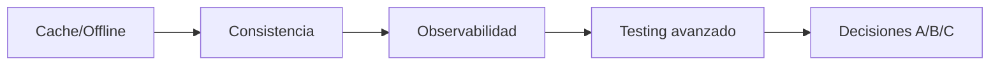

# Entregables — Etapa 3: Evolución

## Propósito de este cierre

Etapa 3 no se evalúa por “cantidad de código nuevo”. Se evalúa por capacidad de evolucionar un sistema existente sin romper su confiabilidad.

Este documento define qué evidencia debe existir para afirmar que la etapa realmente está completada a nivel profesional.

---

## Resultado esperado de etapa

Al cierre, el sistema debe demostrar:

1. Resiliencia operativa ante fallo de red.
2. Política de consistencia explícita y testeada.
3. Observabilidad suficiente para diagnóstico.
4. Pruebas avanzadas estables en rutas críticas.
5. Decisiones de arquitectura justificadas con trade-offs.

---

## Entregables obligatorios

## 1) Capacidad offline/caché funcional

Evidencia mínima:

- repositorio cacheado por composición,
- store persistente o estrategia equivalente,
- fallback condicionado por validez.

Aceptación:
- remoto caído + cache válido => experiencia útil.

## 2) Política de consistencia documentada

Evidencia mínima:

- regla de invalidación (TTL u otra),
- razón de negocio de la ventana de frescura,
- tests deterministas de validez/expiración.

Aceptación:
- no hay “número mágico” sin justificación.

## 3) Observabilidad estructurada mínima

Evidencia mínima:

- contrato de logger,
- eventos críticos instrumentados,
- contexto útil por evento.

Aceptación:
- se puede reconstruir un fallo de carga de catálogo.

## 4) Suite de pruebas avanzadas

Evidencia mínima:

- tests de cancelación,
- tests de tiempo (TTL) sin reloj real,
- pruebas de concurrencia relevantes sin flakiness.

Aceptación:
- pruebas estables en ejecuciones repetidas.

## 5) Marco de trade-offs aplicado

Evidencia mínima:

- decisiones A/B/C en puntos críticos,
- riesgos + mitigación,
- trigger de revisión.

Aceptación:
- cada decisión mayor puede auditarse con contexto.

## 6) Integración backend real (Firebase)

Evidencia mínima:

- documentación de setup local (Auth + Firestore),
- reglas de seguridad básicas y advertencias de entorno,
- mapeo de errores backend a semántica de dominio,
- plan de fallback cuando backend no esté disponible.

Aceptación:
- el alumno puede ejecutar el flujo local y explicar límites de la integración.

---

## Rubrica de evaluación

## Dimensión A — Diseño de resiliencia

- Básico: fallback parcial o ambiguo.
- Esperado: fallback claro para rutas críticas.
- Fuerte: fallback + política + señales de operación.

## Dimensión B — Calidad de consistencia

- Básico: TTL improvisado.
- Esperado: TTL justificado y probado.
- Fuerte: política revisable por métricas.

## Dimensión C — Observabilidad

- Básico: logs sueltos.
- Esperado: logs estructurados en operaciones críticas.
- Fuerte: correlación y diagnósticos reproducibles.

## Dimensión D — Testing avanzado

- Básico: cobertura happy/sad simple.
- Esperado: cancelación y tiempo testeados.
- Fuerte: suite robusta ante concurrencia y no-flaky.

## Dimensión E — Criterio arquitectónico

- Básico: decisiones por intuición.
- Esperado: trade-offs documentados.
- Fuerte: decisiones con trigger y revisión activa.

---

## Mapa de skills aplicado a la etapa

| Skill | Aplicación en Etapa 3 | Evidencia requerida |
| --- | --- | --- |
| `swift-concurrency` | cancelación, aislamiento y pruebas async | tests deterministas + fronteras justificadas |
| `swiftui-expert-skill` | estados UI coherentes ante fallback/error | ViewModel/state sin estados imposibles |
| `windsurf-rules-ios` (si aplica) | consistencia arquitectónica en evolución | decisiones limpias por capas y BDD->TDD sostenido |

---

## Quality gates de cierre

La etapa se considera cerrada cuando pasan todos los gates.

---

## Evidencia mínima por gate

## Gate Cache/Offline

- implementación operativa,
- pruebas de fallback.

## Gate Consistencia

- política escrita,
- pruebas TTL deterministas.

## Gate Observabilidad

- logs estructurados,
- cobertura de operaciones críticas.

## Gate Testing avanzado

- cancelación + concurrencia + no-flaky.

## Gate Decisiones

- ADR/registro con A/B/C, riesgos y trigger.

---

## Checklist final de entrega

- [ ] Cache/offline funcional en flujo de catálogo.
- [ ] Invalidación y frescura documentadas y probadas.
- [ ] Observabilidad estructurada implementada en rutas críticas.
- [ ] Pruebas avanzadas estables y útiles.
- [ ] Trade-offs y riesgos documentados con revisión prevista.
- [ ] Integración Firebase documentada y alineada con contratos de la arquitectura.

---

## Señales de que el alumno ya está en nivel Senior (inicio)

- Diseña para fallo, no solo para éxito.
- Hace explícita la política de consistencia.
- Usa observabilidad para decidir, no para justificar después.
- Escribe pruebas que protegen refactor real.
- Puede explicar por qué una mejora técnica sí/no compensa su coste.

---

## Cierre y continuidad

Etapa 3 deja preparada la base para la siguiente fase: gobernanza de arquitectura y escalado de plataforma/equipo.

**Anterior:** [Trade-offs y riesgos ←](05-trade-offs.md) · **Siguiente:** [Etapa 4: Arquitecto →](../04-arquitecto/00-introduccion.md)
