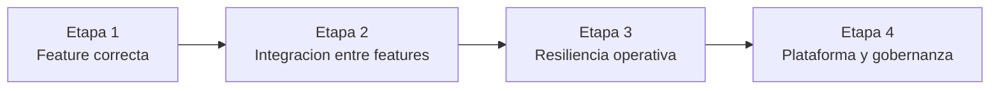
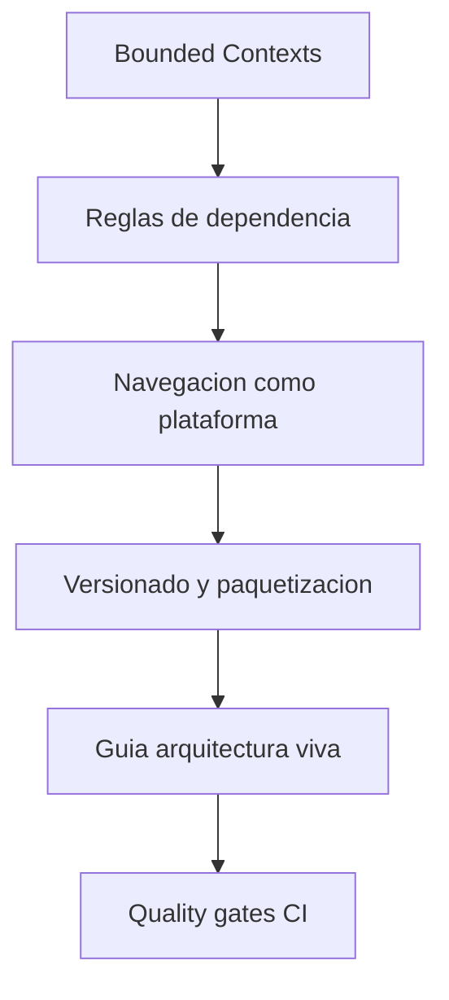
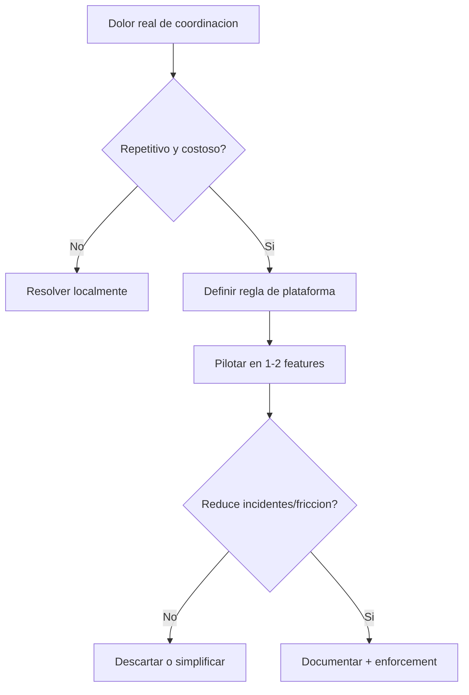

# Etapa 4: Arquitecto — Plataforma y gobernanza

## Objetivo de la etapa

Al terminar esta etapa, el alumno deja de pensar solo en “cómo implementar una feature” y pasa a pensar en “cómo escalar un sistema y un equipo sin perder control”.

Eso implica dominar cuatro capacidades:

1. delimitar bounded contexts reales;
2. gobernar dependencias con reglas verificables;
3. tratar navegación/deep links como plataforma;
4. definir calidad y versionado como políticas del repositorio.

En lenguaje simple: en etapas previas construiste buenas habitaciones; ahora diseñas el edificio para que crezca sin derrumbarse.

---

## Qué cambia respecto a Etapa 3

Etapa 3 reforzó resiliencia operativa de features (cache, consistencia, observabilidad, pruebas avanzadas). Etapa 4 sube de nivel de abstracción: construye el sistema de reglas que mantiene esa resiliencia cuando se multiplican features y equipos.

Pregunta de etapa 3:

- ¿resiste mi feature?

Pregunta de etapa 4:

- ¿resiste el ecosistema completo cuando crece?

---

## Definición simple

Gobernanza arquitectónica es convertir decisiones técnicas en reglas repetibles, trazables y verificables.

No es burocracia. Es reducir incertidumbre y coste de coordinación.

---

## Modelo mental: urbanismo de software

- cada bounded context es un barrio;
- las APIs/eventos son carreteras;
- el composition root es la estación central;
- quality gates son inspecciones de seguridad;
- ADRs son el plan urbanístico versionado.

Sin urbanismo:

- aparecen atajos peligrosos;
- los barrios se conectan de forma caótica;
- cada obra rompe otra.

---

## Resultados verificables de etapa

Al cierre de Etapa 4 deben existir evidencias concretas:

- mapa de bounded contexts con contratos y ownership;
- reglas de dependencia documentadas y con enforcement conceptual/automatizado;
- especificación de navegación por eventos + deep links en términos de plataforma;
- estrategia de versionado/paquetización con triggers claros;
- guía de arquitectura del repositorio mantenible;
- quality gates definidos para merge.

Si no hay evidencia, no hay gobernanza, solo intención.

---

## Mapa de módulos de la etapa

1. `01-bounded-contexts.md`
2. `02-reglas-dependencia-ci.md`
3. `03-navegacion-deeplinks.md`
4. `04-versionado-spm.md`
5. `05-guia-arquitectura.md`
6. `06-quality-gates.md`
7. `entregables-etapa-4.md`

Orden recomendado:

- primero límites,
- luego enforcement,
- luego plataforma transversal,
- luego gobernanza documental y de calidad.

---

## Roles y responsabilidades (modo arquitecto)

### Lo que sí hace un arquitecto en este curso

- define límites y contratos explícitos;
- evita acoplamientos invisibles;
- documenta decisiones macro con ADR;
- impulsa enforcement proporcional al riesgo.

### Lo que no hace

- centralizar todo el desarrollo;
- bloquear cambios locales con procesos innecesarios;
- decidir por gusto en lugar de criterio.

Arquitectura madura significa habilitar velocidad segura del equipo, no imponer control por control.

---

## Riesgos de etapa y mitigaciones

### Riesgo 1: sobreingeniería de plataforma

Síntoma:

- demasiadas reglas/herramientas para el tamaño real del proyecto.

Mitigación:

- aplicar enfoque progresivo con triggers medibles.

### Riesgo 2: arquitectura de diapositiva

Síntoma:

- diagramas bonitos sin reflejo en CI/código.

Mitigación:

- cada regla relevante debe tener check o checklist de PR.

### Riesgo 3: ownership ambiguo

Síntoma:

- cambios críticos sin responsables claros.

Mitigación:

- ownership por bounded context + reglas de aprobación.

### Riesgo 4: rigidez excesiva

Síntoma:

- cualquier cambio sencillo exige proceso pesado.

Mitigación:

- diferenciar cambios locales vs cambios de plataforma.

---

## A/B/C de estrategia de gobernanza

### Opción A: mínima gobernanza

Ventajas:

- velocidad inicial alta.

Costes:

- deuda de coordinación crece rápido.

### Opción B: gobernanza progresiva con enforcement por riesgo (decisión)

Ventajas:

- equilibrio entre control y velocidad.

Costes:

- disciplina continua.

### Opción C: gobernanza rígida desde inicio

Ventajas:

- control formal fuerte.

Costes:

- frena aprendizaje y entrega temprana.

Trigger para ajustar B:

- incidentes de arquitectura repetidos o fricción de PR sostenida.

---

## Concurrencia y gobernanza

Aunque esta etapa no es “solo concurrencia”, toda regla de plataforma debe contemplar Swift 6.2:

- contratos públicos con `Sendable` donde corresponda;
- aislamiento claro en coordinadores/estado global;
- prohibición de parches tipo `@MainActor` indiscriminado.

Gobernanza sin política de concurrencia deja un hueco crítico en arquitectura iOS moderna.

---

## Checklist de inicio de etapa

- [ ] Se entiende diferencia entre feature architecture y platform architecture.
- [ ] Existe intención clara de bounded contexts y ownership.
- [ ] Se acepta enfoque progresivo (sin big-bang de modularización).
- [ ] ADRs serán obligatorios en decisiones macro.
- [ ] Quality gates se diseñarán como soporte, no como burocracia.

---

## Cierre

Esta etapa es el puente entre “programar bien” y “construir un sistema que escala con gente real trabajando dentro”. Si la haces bien, los siguientes cambios del proyecto serán más seguros, más rápidos y menos dramáticos.

**Siguiente:** [Bounded contexts →](01-bounded-contexts.md)

---

## Señales de madurez: de senior a arquitecto

Esta etapa también cambia cómo evalúas tu propio trabajo.

### Señales de nivel senior

- implementas soluciones robustas dentro de una feature;
- detectas riesgos técnicos antes de que exploten;
- escribes tests útiles para cambios complejos.

### Señales de nivel arquitecto

- detectas riesgos sistémicos entre features/equipos;
- defines reglas que previenen problemas repetitivos;
- conviertes decisiones en contratos y quality gates;
- priorizas coste de coordinación, no solo coste de implementación.

Si puedes explicar una decisión de plataforma en términos de impacto para 3 equipos distintos, estás pensando como arquitecto.

---

## Evidencias concretas que debe producir el alumno

Al finalizar esta etapa, el alumno debe poder enseñar evidencias verificables, no solo discurso:

1. diagramas de context map y rutas de navegación de plataforma;
2. ADRs macro con A/B/C y triggers de revisión;
3. reglas de dependencia documentadas y validadas por CI/checklist;
4. estrategia de versionado/paquetización argumentada;
5. quality gates definidos con umbrales y excepciones.

Evidencia mínima esperada por módulo:

| Módulo | Evidencia clave |
| --- | --- |
| M09 (governance) | guía de arquitectura + reglas de dependencia |
| M10 (versionado) | estrategia SPM + política semver |
| Navegación plataforma | contratos de rutas/deep links + tests |

---

## Método de trabajo recomendado para esta etapa

El método que más funciona en plataforma es iterativo y documental.

1. definir problema de coordinación concreto;
2. proponer regla mínima para mitigarlo;
3. probar la regla con una feature real;
4. automatizar enforcement si aporta valor;
5. documentar en guía y ADR;
6. revisar a las 2-4 semanas con evidencia.

Este ciclo evita dos extremos:

- reglas improvisadas que nadie sigue;
- procesos rígidos que bloquean entregas.

---

## Diagrama de toma de decisión de plataforma

Este flujo convierte intuición en ingeniería de plataforma.

---

## Errores frecuentes al entrar en modo arquitecto

### Error 1: intentar rediseñar todo de golpe

Impacto:

- ruido, resistencia del equipo y alto riesgo de regresión.

Corrección:

- cambios incrementales de mínimo blast radius.

### Error 2: decidir sin métricas

Impacto:

- discusiones subjetivas interminables.

Corrección:

- definir métricas mínimas de éxito/fracaso antes de ejecutar.

### Error 3: gobernanza sin ownership

Impacto:

- reglas sin responsables, nadie responde cuando fallan.

Corrección:

- asignar ownership claro por contexto/regla.

---

## Checklist de preparación para iniciar Módulo 1 de la etapa

- [ ] Entiendo qué problemas son de feature y cuáles de plataforma.
- [ ] Tengo claro el mapa actual de contextos y sus límites.
- [ ] Dispongo de criterios para crear ADRs macro.
- [ ] Conozco el estado actual de quality gates y sus huecos.
- [ ] Acepto enfoque incremental en vez de rediseño total.

---

## Cierre extendido

Entrar en Etapa Arquitecto no significa dejar de programar; significa programar con una capa extra de responsabilidad sistémica. Tu código sigue importando, pero ahora también importan las reglas que hacen posible que otros equipos escriban buen código sin romperte y sin bloquearse entre sí.

---

## Cadencia operativa sugerida para gobernanza

Para evitar tanto caos como burocracia, la etapa recomienda una cadencia simple:

- semanal: revisión de violaciones de dependencia y excepciones activas;
- quincenal: revisión de ADRs abiertas y decisiones pendientes;
- mensual: revisión de métricas de quality gates y ajustes de umbral.

Con esta cadencia, la gobernanza se integra al trabajo real en lugar de convertirse en evento aislado.

---

## Criterios para decir “esta regla ya es plataforma”

Una regla pasa de local a plataforma cuando:

1. afecta a más de un bounded context;
2. su incumplimiento genera incidentes repetitivos;
3. puede verificarse objetivamente en CI/checklist;
4. tiene owner y proceso de excepción definido.

Si no cumple estos criterios, probablemente aún debe quedarse como convención local.

---

## Puente hacia Etapa 5 (maestría)

Al cerrar Arquitecto, el siguiente salto es optimización fina de concurrencia, rendimiento y operaciones avanzadas. El objetivo de esta etapa no es competir con Etapa 5, sino dejar una plataforma lo bastante sólida para que esas optimizaciones sean seguras y acumulativas.
