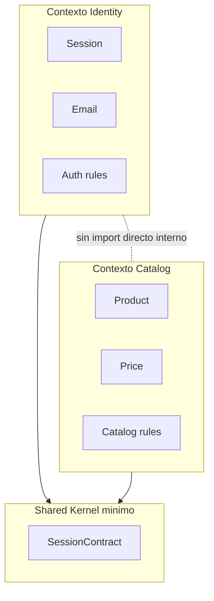
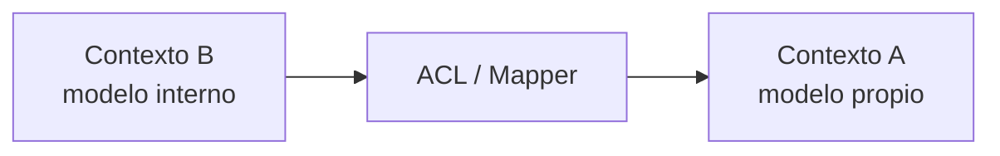
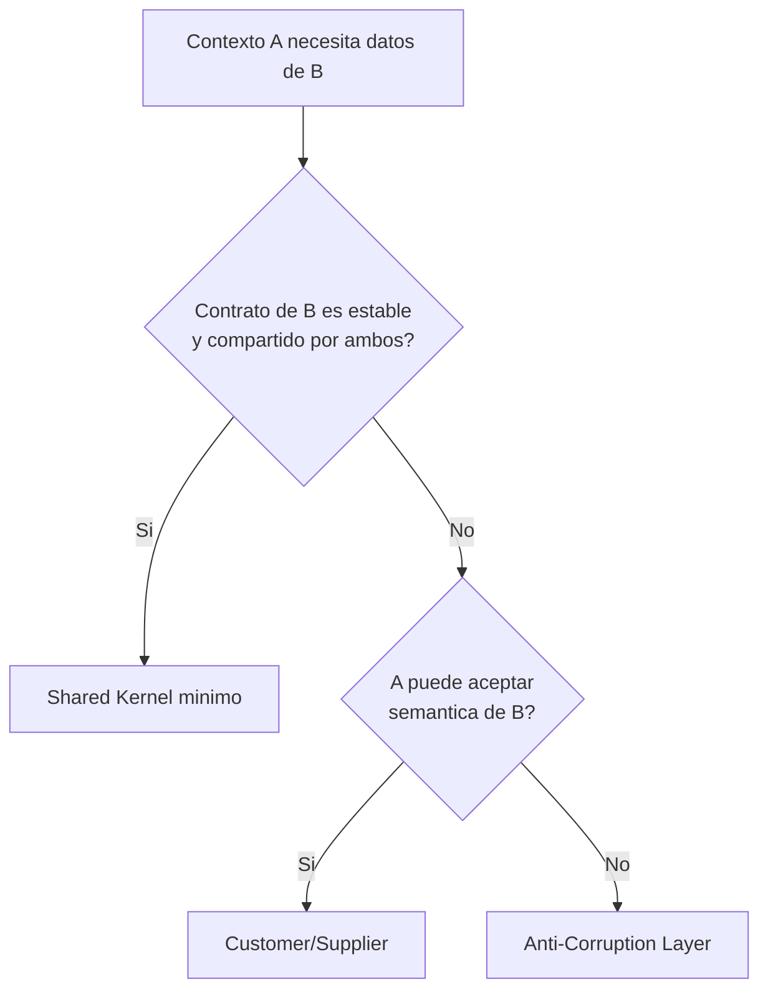

# Bounded Contexts

## Objetivo de aprendizaje

Al terminar esta lección vas a poder identificar, delimitar y gobernar bounded contexts en una app iOS modular, evitando dos errores comunes: contextos falsos (solo carpetas) y contextos acoplados por atajos.

En versión simple: bounded context es el “territorio” donde una palabra significa una cosa concreta y un equipo es responsable de ese significado.

---

## Definición simple

Un bounded context es un límite semántico y de responsabilidad. Dentro del límite, el lenguaje y reglas son consistentes. Fuera del límite, ese mismo término puede significar otra cosa.

No es solo estructura de carpetas. Es contrato de negocio + contrato técnico + ownership.

---

## Modelo mental: países con idioma propio

Piensa en cada contexto como un país.

- Dentro del país, el idioma oficial es único.
- Entre países, necesitas frontera y traducción.
- Si todos hablan “medio idioma de todos”, nadie se entiende.



---

## Context map del curso

Contextos actuales:

- `Identity`: autenticación, sesión, credenciales.
- `Catalog`: productos y lectura de catálogo.
- `Platform` (transversal): composición, navegación, quality gates.

Contextos potenciales futuros:

- `Orders`, `Profile`, `Payments`.

Relación recomendada actual:

- Identity y Catalog no se importan entre sí;
- comparten solo kernel mínimo de contratos;
- cualquier traducción entre modelos de contextos se hace vía ACL.

---

## Cuándo un término indica contexto distinto

Señal clásica:

- misma palabra, significado distinto.

Ejemplo `usuario`:

- en Identity: usuario autenticable;
- en Profile: usuario personalizable (avatar, preferencias);
- en Orders: usuario comprador con dirección fiscal/logística.

Si fuerzas un único `User` global, terminas con modelo inflado y reglas contradictorias.

---

## Heurísticas prácticas para detectar bounded contexts

1. reglas de negocio diferentes sobre el mismo concepto;
2. ciclos de cambio diferentes entre áreas;
3. equipos diferentes con ownership natural;
4. lenguaje de negocio distinto en conversaciones reales;
5. necesidad de versionado independiente a medio plazo.

Si tienes 4 de 5, probablemente necesitas separar contexto.

---

## ACL (Anti-Corruption Layer) explicado fácil

ACL es un traductor protector entre contextos.

Sin ACL:

- Contexto A depende de modelos internos de B.
- cambio en B rompe A.

Con ACL:

- A define su propio modelo;
- mapper traduce desde B;
- A queda protegido de cambios internos de B.



---

## Ejemplo mínimo de ACL

```swift
import Foundation

struct CatalogProduct: Sendable {
    let id: String
    let name: String
    let price: Decimal
}

struct OrderItem: Sendable {
    let productId: String
    let displayName: String
    let unitPrice: Decimal
}

struct CatalogToOrderItemMapper {
    func map(_ product: CatalogProduct) -> OrderItem {
        OrderItem(
            productId: product.id,
            displayName: product.name,
            unitPrice: product.price
        )
    }
}
```

Parece simple, pero evita acoplamiento estructural entre contextos.

---

## Ownership y gobernanza por contexto

Cada bounded context debe tener:

- owner explícito;
- contrato público definido;
- proceso de aprobación para cambios de contrato;
- ADRs de decisiones relevantes.

Supuesto operativo:

- en equipo pequeño, ownership puede ser por persona;
- al crecer, ownership por squad/contexto.

Tabla sugerida:

| Contexto | Owner | Reglas de cambio |
| --- | --- | --- |
| Identity | Equipo Auth | cambios de contrato requieren ADR y review cruzada |
| Catalog | Equipo Product | cambios locales libres, contratos con review |
| SharedKernel | Plataforma | aprobación multi-owner obligatoria |

---

## TDD y bounded contexts

Sí, bounded contexts también se prueban.

Qué probar:

- contracts tests entre contextos (cuando hay interacción);
- mappers ACL;
- ausencia de imports indebidos (mediante reglas CI/lint).

Ejemplo de test de ACL:

```swift
import XCTest

final class CatalogToOrderItemMapperTests: XCTestCase {
    func test_map_translatesCatalogProductIntoOrderItem() {
        let mapper = CatalogToOrderItemMapper()
        let product = CatalogProduct(id: "p-1", name: "Camiseta", price: 29.99)

        let item = mapper.map(product)

        XCTAssertEqual(item.productId, "p-1")
        XCTAssertEqual(item.displayName, "Camiseta")
        XCTAssertEqual(item.unitPrice, 29.99)
    }
}
```

---

## Concurrencia y fronteras de contexto

En Swift 6.2, los contratos entre contextos deben ser seguros en concurrencia:

- tipos cruzados marcados `Sendable` cuando aplique;
- evitar pasar referencias mutables compartidas entre contextos;
- aislar coordinadores/transversal state donde corresponda.

Anti-patrón:

- exponer objetos no sendable a múltiples features y confiar en “que no pase nada”.

---

## Anti-patrones frecuentes

### Anti-patrón 1: contexto por carpeta, no por semántica

Síntoma:

- carpeta separada, pero imports y modelos cruzados por todos lados.

Corrección:

- definir lenguaje y contratos, luego estructura.

### Anti-patrón 2: shared kernel gigante

Síntoma:

- todo termina en `SharedKernel`.

Corrección:

- shared kernel mínimo, solo contratos verdaderamente compartidos.

### Anti-patrón 3: no documentar relaciones entre contextos

Síntoma:

- cada equipo interpreta dependencias distinto.

Corrección:

- context map versionado + ADRs.

### Anti-patrón 4: separar contextos demasiado pronto

Síntoma:

- sobrecoste de coordinación con poco valor.

Corrección:

- separar por señales reales, no por moda.

---

## A/B/C de estrategia de delimitación

### Opción A: contextos semánticos con shared kernel mínimo (decisión)

Ventajas:

- alto equilibrio entre claridad y coste.

Costes:

- requiere disciplina de contrato.

### Opción B: modelo global único para todo

Ventajas:

- inicio rápido.

Costes:

- acoplamiento explosivo a medio plazo.

### Opción C: hiperfragmentación en demasiados contextos

Ventajas:

- aislamiento extremo teórico.

Costes:

- coordinación muy costosa.

Trigger para revisar A:

- aumento de cambios cruzados o ambigüedad semántica recurrente.

---

## ADR corto de la lección

```markdown
## ADR-012: Delimitacion de bounded contexts Identity y Catalog con Shared Kernel minimo
- Estado: Aprobado
- Contexto: crecimiento de features con riesgo de acoplamiento semantico
- Decisión: mantener contextos separados por lenguaje y ownership; usar ACL para traducciones y evitar imports directos entre contextos
- Consecuencias: mayor claridad y escalabilidad; necesidad de disciplina documental y tests de frontera
- Fecha: 2026-02-07
```

---

## Checklist de calidad

- [ ] Cada contexto tiene lenguaje ubicuo definido.
- [ ] No hay imports directos indebidos entre contextos.
- [ ] Shared Kernel se mantiene mínimo.
- [ ] Relaciones entre contextos están documentadas (context map).
- [ ] Existen tests para mappers/contratos de frontera.

---

## Cierre

Bounded contexts bien definidos reducen discusiones inútiles y regresiones cruzadas. Son la base para que varios equipos trabajen en paralelo sin pisarse. Esa capacidad, más que cualquier patrón de moda, es lo que convierte un código en plataforma escalable.

**Anterior:** [Introducción ←](00-introduccion.md) · **Siguiente:** [Reglas de dependencia y CI →](02-reglas-dependencia-ci.md)

---

## Procedimiento paso a paso para delimitar contextos

Cuando no está claro dónde cortar, usa esta secuencia:

1. listar términos clave del negocio y sus significados por área;
2. detectar términos con significados conflictivos;
3. agrupar reglas que cambian juntas;
4. identificar equipos/owners naturales;
5. dibujar frontera provisional;
6. validar con un caso de cambio real;
7. ajustar frontera y registrar ADR.

Este enfoque evita decisiones basadas solo en “intuición arquitectónica”.

---

## Checklist de frontera saludable

Una frontera de contexto está sana cuando:

- la mayoría de cambios internos no requieren coordinación externa;
- los contratos públicos son pequeños y estables;
- los nombres de dominio son coherentes en BDD/código/tests;
- existe owner claro;
- los tests detectan roturas de frontera temprano.

Si dos de estas condiciones fallan, probablemente el límite necesita revisión.

---

## Estrategias de relación entre contextos

No todas las relaciones son iguales. Elegir mal la relación genera acoplamiento accidental.

### Shared Kernel

Cuándo usar:

- tipos mínimos realmente comunes y estables.

Riesgo:

- crecer sin control y volverlo “contexto global”.

### Customer/Supplier

Cuándo usar:

- un contexto consumidor acepta modelo/protocolo del proveedor.

Riesgo:

- dependencia fuerte del ritmo del proveedor.

### ACL

Cuándo usar:

- necesitas protegerte de un modelo externo cambiante.

Riesgo:

- más código de traducción.

Regla práctica:

- ante duda, preferir ACL para proteger contexto consumidor.

---

## Diagrama de decisión para tipo de relación



---

## Migración de contexto sin romper producción

A veces descubres tarde que un contexto está mal delimitado. Migrar sin plan puede romper medio sistema.

Plan seguro:

1. crear nuevo contrato en paralelo al antiguo;
2. añadir ACL temporal para compatibilidad;
3. migrar consumidores gradualmente;
4. medir incidencias;
5. retirar contrato antiguo con deprecación y fecha.

Esto aplica el principio de bajo blast radius también a gobernanza.

---

## Pruebas de frontera recomendadas

1. contract tests de API pública del contexto;
2. tests de ACL por mapping semántico;
3. tests de reglas de dependencia (scripts/lint/CI);
4. smoke tests de integración para flujos que cruzan contextos.

Si solo tienes unit tests internos, puedes romper frontera sin enterarte.

---

## Checklist de revisión de PR cuando toca frontera

- [ ] el cambio modifica contrato público del contexto;
- [ ] existe ADR o actualización de ADR;
- [ ] hay plan de compatibilidad/migración si aplica;
- [ ] tests de frontera cubren caso nuevo;
- [ ] owners de contextos afectados revisaron.

Este checklist evita regresiones organizativas, no solo técnicas.

---

## Cierre extendido

Bounded context no es un dibujo de workshop. Es la unidad real de responsabilidad que define cómo escala tu arquitectura y cómo colabora tu equipo. Cuando los límites son claros, la velocidad aumenta porque hay menos sorpresas; cuando son difusos, cada release se convierte en negociación constante.
