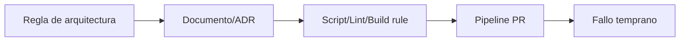
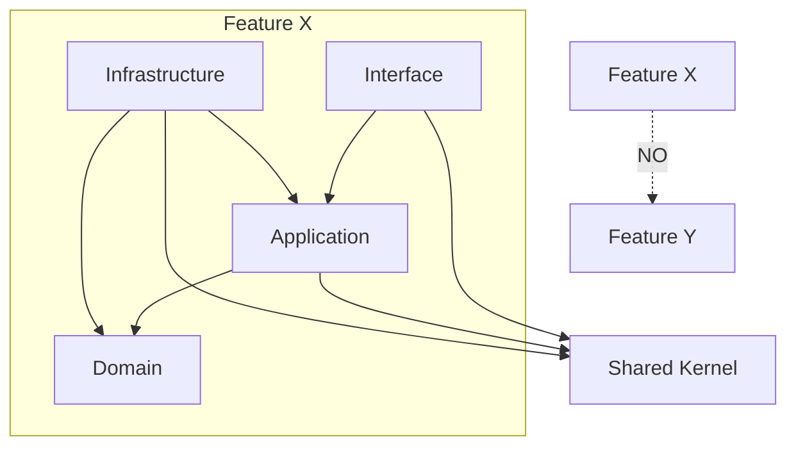
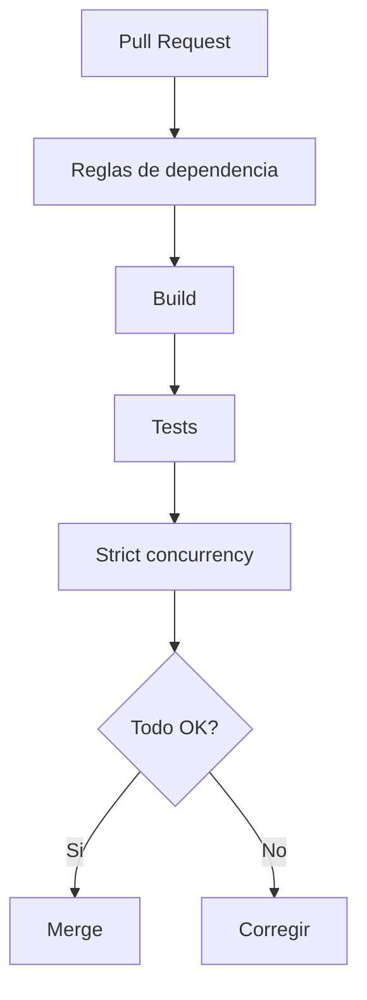

# Reglas de dependencia y CI

## Objetivo de aprendizaje

Al terminar esta lección vas a saber convertir reglas arquitectónicas en guardrails ejecutables. Es decir, pasar de “acuerdos de equipo” a “checks que bloquean errores antes del merge”.

En versión simple: una regla que no se verifica automáticamente es una recomendación. Una regla con CI es una garantía operativa.

---

## Definición simple

Regla de dependencia = limitación explícita sobre qué capa/contexto puede depender de cuál.

CI de arquitectura = conjunto de verificaciones automáticas que asegura que esas reglas no se rompen en cada PR.

Objetivo:

- detectar violaciones pronto;
- reducir regresiones de acoplamiento;
- mantener arquitectura sostenible bajo crecimiento de equipo.

---

## Modelo mental: barandilla de carretera

- documentación es el mapa;
- reglas son las señales;
- CI es la barandilla que evita caídas.



Sin barandilla, dependes de que nadie se equivoque. Eso no escala.

---

## Reglas de dependencia del curso

### Regla 1: Domain puro

- Domain no importa UI frameworks ni detalles de infraestructura.

### Regla 2: Features aisladas

- una feature no importa internals de otra;
- comunicación por contratos/eventos/shared kernel mínimo.

### Regla 3: Application no depende de infra concreta

- casos de uso dependen de puertos, no de `URLSession`, `UserDefaults`, etc.

### Regla 4: Infrastructure no depende de Interface

- evita ciclos y contaminación de presentación.

### Regla 5: App/Composition Root sí puede orquestar todas

- es el único punto donde convergen dependencias transversales.

---

## Diagrama de dependencias permitidas



---

## Pipeline de enforcement (estrategia progresiva)

### Nivel 1: scripts heurísticos

- rápido de implantar en monolito;
- útil para disciplina temprana.

### Nivel 2: checks estructurales + revisión obligatoria

- mejora precisión con reglas por paths/contextos.

### Nivel 3: enforcement por compilador (SPM targets)

- el compilador bloquea dependencias ilegales de forma nativa.

Regla de curso:

- empezar con nivel 1-2;
- escalar a nivel 3 cuando el tamaño del sistema lo justifique.

---

## Ejemplo de scripts base

### `check-domain-imports.sh`

```bash
#!/usr/bin/env bash
set -euo pipefail

violations=0

while IFS= read -r file; do
  if rg -n '^import (SwiftUI|UIKit|Combine)$' "$file" >/dev/null; then
    echo "[VIOLATION] Domain import prohibido en $file"
    violations=$((violations + 1))
  fi
done < <(find . -path "*/Domain/*.swift" -type f)

if [ "$violations" -gt 0 ]; then
  echo "Total violations: $violations"
  exit 1
fi

echo "Domain imports OK"
```

### `check-feature-cross-imports.sh`

```bash
#!/usr/bin/env bash
set -euo pipefail

violations=0

# Heurístico para estructura por carpetas feature-first
for file in $(find ./Features -name '*.swift' -type f); do
  feature=$(echo "$file" | sed -E 's#^./Features/([^/]+)/.*#\1#')

  for other in $(find ./Features -mindepth 1 -maxdepth 1 -type d -exec basename {} \;); do
    if [ "$feature" = "$other" ]; then
      continue
    fi

    if rg -n "import ${other}" "$file" >/dev/null; then
      echo "[VIOLATION] $file importa feature $other"
      violations=$((violations + 1))
    fi
  done
done

if [ "$violations" -gt 0 ]; then
  echo "Total violations: $violations"
  exit 1
fi

echo "Feature cross-imports OK"
```

---

## CI conceptual de PR



Orden recomendado:

1. checks rápidos de arquitectura;
2. build;
3. tests;
4. checks extra de concurrencia/calidad.

---

## Política de excepciones (muy importante)

Las reglas no son dogma ciego. A veces necesitas excepción.

Proceso mínimo:

1. justificar en PR por qué la regla no aplica;
2. abrir ADR o nota de excepción con fecha de expiración;
3. crear ticket de remediación;
4. etiquetar excepción para seguimiento.

Sin expiración, las excepciones se vuelven deuda permanente.

---

## Métricas de gobernanza útiles

No basta con “CI en verde”. Mide si la gobernanza funciona.

Métricas sugeridas:

- número de violaciones de dependencia por sprint;
- tiempo medio de resolución de violaciones;
- PRs bloqueadas por reglas de arquitectura;
- incidentes de acoplamiento en producción.

Si violaciones bajan y incidentes bajan, la gobernanza aporta valor.

---

## BDD + TDD aplicado a reglas de arquitectura

Sí, también aquí.

### BDD de regla

- Given una clase en Domain,
- When añade `import SwiftUI`,
- Then CI falla con mensaje claro.

### TDD de script/check

1. Red: crear fixture que viola regla;
2. Green: script detecta violación;
3. Refactor: mejorar mensaje/precisión y minimizar falsos positivos.

Esto evita scripts “decorativos” que nadie confía.

---

## Concurrencia y reglas de dependencia

En Swift 6.2 también conviene incluir checks de fronteras concurrentes:

- tipos públicos de contratos cross-feature deberían ser `Sendable`;
- evitar que Application exponga estado mutable compartido sin aislamiento;
- prohibir `@unchecked Sendable` sin documentación vinculada.

Regla práctica:

- cada bypass de seguridad concurrente requiere invariante + ticket de retirada.

---

## Anti-patrones y corrección

### Anti-patrón 1: reglas solo en wiki

Problema:

- nadie las aplica de forma consistente.

Corrección:

- automatizar en CI.

### Anti-patrón 2: scripts ruidosos con muchos falsos positivos

Problema:

- el equipo deja de confiar en checks.

Corrección:

- iterar precisión, reducir heurística frágil.

### Anti-patrón 3: bloquear todo por reglas menores

Problema:

- fricción excesiva.

Corrección:

- separar reglas críticas (bloqueantes) y reglas informativas.

### Anti-patrón 4: no medir impacto de gobernanza

Problema:

- no sabes si aporta o estorba.

Corrección:

- métricas de calidad y ciclo de PR.

---

## A/B/C de enforcement

### Opción A: convención manual

Ventajas:

- coste inicial mínimo.

Costes:

- alta probabilidad de deriva arquitectónica.

### Opción B: scripts + CI progresivo (decisión actual)

Ventajas:

- buen equilibrio para fase de crecimiento.

Costes:

- mantenimiento de scripts/checks.

### Opción C: enforcement total por modularización estricta desde día 1

Ventajas:

- precisión alta desde el inicio.

Costes:

- complejidad y fricción tempranas elevadas.

Trigger para B -> C:

- escala de proyecto/equipo donde scripts heurísticos ya no basten.

---

## ADR corto de la lección

```markdown
## ADR-013: Reglas de dependencia con enforcement CI progresivo
- Estado: Aprobado
- Contexto: riesgo de acoplamiento entre capas/features al crecer el repositorio
- Decisión: aplicar checks automáticos de dependencias en PR y evolucionar a enforcement por módulos cuando escale
- Consecuencias: mayor disciplina arquitectónica con coste moderado de mantenimiento de reglas
- Fecha: 2026-02-07
```

---

## Checklist de calidad

- [ ] Reglas de dependencia críticas están documentadas y automatizadas.
- [ ] PR falla temprano ante violaciones de arquitectura.
- [ ] Existe proceso formal de excepción con caducidad.
- [ ] Métricas de gobernanza se revisan periódicamente.
- [ ] Reglas concurrentes (`Sendable`/aislamiento) se incluyen en política.

---

## Cierre

La arquitectura no se mantiene por buena voluntad. Se mantiene porque el sistema de trabajo hace difícil romperla y fácil corregirla. Ese cambio de mentalidad es exactamente lo que distingue una organización que escala de una que se degrada.

**Anterior:** [Bounded Contexts ←](01-bounded-contexts.md) · **Siguiente:** [Navegación y deep links →](03-navegacion-deeplinks.md)

---

## Plan de adopción por fases (recomendado)

Para evitar fricción, adopta gobernanza en tres pasos:

1. fase 1: checks informativos (no bloqueantes) durante 1-2 sprints;
2. fase 2: checks críticos bloqueantes (`Domain purity`, `cross-feature imports`);
3. fase 3: endurecer con modularización y reglas de excepción trazables.

Este enfoque permite que el equipo aprenda el sistema sin parálisis.

---

## Señales de éxito en 30 días

- reducción visible de discusiones repetitivas sobre capas/dependencias en PR;
- menos correcciones tardías por acoplamiento accidental;
- mayor previsibilidad de merges (menos sorpresas en rama principal);
- onboarding más rápido por reglas claras y verificables.

Si no aparecen estas señales, revisa reglas demasiado rígidas o checks con falsos positivos altos.

---

## Playbook de mejora continua de reglas

Cada regla de dependencia debería pasar por este ciclo:

1. detectar dolor real (incidente o fricción repetida);
2. definir regla mínima que lo previene;
3. automatizar check con mensaje accionable;
4. medir falsos positivos durante 2 sprints;
5. endurecer o simplificar según evidencia.

Con este ciclo, el sistema de reglas evoluciona como producto interno, no como castigo.

---

## Señales de que una regla debe retirarse o cambiar

- tasa alta de excepciones justificadas;
- bloqueos frecuentes sin mejora visible de calidad;
- coste de mantenimiento mayor que riesgo prevenido;
- aparición de arquitectura nueva que vuelve obsoleta la regla.

Retirar una regla innecesaria también es gobernanza madura.

---

## Dashboard mínimo de gobernanza

Publica semanalmente un tablero simple con:

- violaciones detectadas por regla;
- excepciones activas y fecha de expiración;
- tiempo medio de recuperación de PR bloqueadas;
- tendencia de incidentes por acoplamiento.

Lo que se mide de forma visible se mejora de forma consistente.

---

## Regla de oro final

Si una regla no puede explicarse en una frase clara y verificarse automáticamente, aún no está lista para ser quality gate bloqueante.
