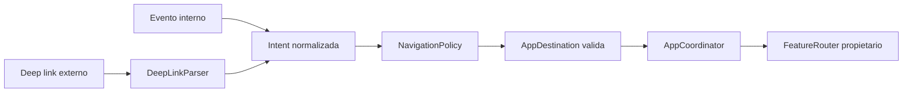
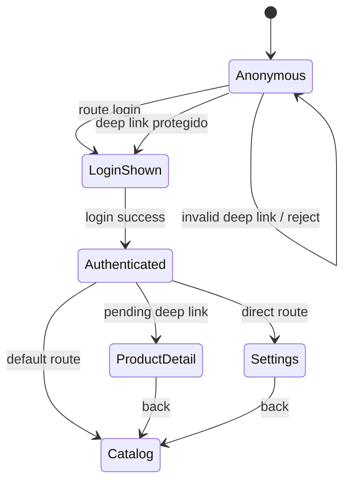

# Navegación y deep links como plataforma

## Objetivo de aprendizaje

Al terminar esta lección vas a ser capaz de diseñar navegación como infraestructura de plataforma, no como código improvisado dentro de vistas. Eso incluye:

- rutas tipadas por contrato;
- parsing de deep links desacoplado;
- control de precondiciones (autenticación/permisos);
- pruebas de navegación sin UI real;
- extensibilidad para múltiples features y bounded contexts.

En lenguaje simple: cuando la app crece, la navegación deja de ser “botón que abre pantalla” y pasa a ser “sistema de tráfico”. Si no hay reglas, hay choques.

---

## Problema real que resolvemos

Con dos features, un `switch` en coordinador parece suficiente. Con diez features y deep links desde push, widgets o URLs externas, aparecen síntomas:

- coordinador gigante;
- navegación duplicada en varias capas;
- reglas de auth desperdigadas;
- pruebas difíciles porque la lógica está mezclada con UI.

Meta de esta etapa arquitecto:

- convertir navegación en plataforma reusable con contratos claros y enforcement conceptual.

---

## Definición simple

Navegación de plataforma = sistema que transforma una intención de navegación (evento interno o deep link externo) en una ruta válida según estado de aplicación y reglas de negocio.

Piezas mínimas:

1. `AppDestination` tipado;
2. `DeepLinkParser`;
3. `NavigationPolicy` (auth/permisos/contexto);
4. `AppCoordinator` como orquestador;
5. registro de routers por feature.

---

## Modelo mental: aeropuerto con torre de control

- los vuelos son intenciones de navegación;
- la torre (coordinador + políticas) decide si despegan ahora, esperan, o se redirigen;
- las puertas (features) reciben solo vuelos que les pertenecen.



Esto desacopla origen de intención y destino final.

---

## Contrato de rutas tipadas

```swift
import Foundation

enum AppDestination: Hashable, Sendable {
    case login
    case catalog
    case productDetail(ProductID)
    case settings
}

struct ProductID: Hashable, Sendable {
    let rawValue: String

    init?(_ rawValue: String) {
        guard rawValue.isEmpty == false else { return nil }
        self.rawValue = rawValue
    }
}
```

Por qué tipado fuerte:

- evita rutas inválidas por strings mágicos;
- hace el compilador aliado de arquitectura;
- facilita testing determinista.

---

## Deep links: parsing desacoplado

### Ejemplo mínimo

```swift
import Foundation

struct DeepLinkParser: Sendable {
    func parse(_ url: URL) -> AppDestination? {
        guard let components = URLComponents(url: url, resolvingAgainstBaseURL: false),
              let host = components.host else {
            return nil
        }

        switch host {
        case "login":
            return .login
        case "catalog":
            return .catalog
        default:
            return nil
        }
    }
}
```

### Ejemplo realista

```swift
import Foundation

struct DeepLinkParser: Sendable {
    func parse(_ url: URL) -> AppDestination? {
        guard let components = URLComponents(url: url, resolvingAgainstBaseURL: false),
              let host = components.host else {
            return nil
        }

        switch host {
        case "login":
            return .login
        case "catalog":
            return .catalog
        case "product":
            guard let id = components.queryItems?.first(where: { $0.name == "id" })?.value,
                  let productID = ProductID(id) else {
                return nil
            }
            return .productDetail(productID)
        case "settings":
            return .settings
        default:
            return nil
        }
    }
}
```

Parser solo interpreta URL. No decide auth ni navegación final.

---

## Política de navegación (reglas de acceso)

```swift
import Foundation

enum NavigationDecision: Sendable {
    case allow(AppDestination)
    case deferUntilAuthenticated(AppDestination)
    case reject
}

struct NavigationContext: Sendable {
    let isAuthenticated: Bool
}

struct NavigationPolicy: Sendable {
    func evaluate(_ destination: AppDestination, context: NavigationContext) -> NavigationDecision {
        switch destination {
        case .login:
            return .allow(.login)
        case .catalog, .productDetail, .settings:
            if context.isAuthenticated {
                return .allow(destination)
            }
            return .deferUntilAuthenticated(destination)
        }
    }
}
```

Ventaja enterprise:

- reglas de acceso centralizadas y testeables;
- no repartes `if isAuthenticated` en cada vista.

---

## Coordinación y procesamiento de pendientes

```swift
import Foundation
import SwiftUI

@MainActor
final class AppCoordinator: ObservableObject {
    @Published var path = NavigationPath()

    private let policy: NavigationPolicy
    private var pendingDestination: AppDestination?

    private(set) var isAuthenticated: Bool = false

    init(policy: NavigationPolicy = NavigationPolicy()) {
        self.policy = policy
    }

    func handle(destination: AppDestination) {
        let decision = policy.evaluate(destination, context: NavigationContext(isAuthenticated: isAuthenticated))

        switch decision {
        case .allow(let route):
            navigate(to: route)
        case .deferUntilAuthenticated(let route):
            pendingDestination = route
            navigate(to: .login)
        case .reject:
            break
        }
    }

    func handleDeepLink(_ url: URL, parser: DeepLinkParser = DeepLinkParser()) {
        guard let destination = parser.parse(url) else { return }
        handle(destination: destination)
    }

    func handleLoginSuccess() {
        isAuthenticated = true
        if let pendingDestination {
            self.pendingDestination = nil
            navigate(to: pendingDestination)
        } else {
            navigate(to: .catalog)
        }
    }

    private func navigate(to destination: AppDestination) {
        switch destination {
        case .login:
            path = NavigationPath()
        default:
            path.append(destination)
        }
    }
}
```

---

## Secuencia completa: deep link con auth pendiente

```mermaid
sequenceDiagram
    participant OS as iOS (URL/Push/Widget)
    participant APP as App Entry
    participant PAR as DeepLinkParser
    participant COORD as AppCoordinator
    participant POL as NavigationPolicy
    participant NAV as NavigationStack

    OS->>APP: myapp://product?id=123
    APP->>PAR: parse(url)
    PAR-->>APP: AppDestination.productDetail(123)
    APP->>COORD: handle(destination)
    COORD->>POL: evaluate(destination, isAuthenticated)
    alt no autenticado
        POL-->>COORD: deferUntilAuthenticated
        COORD->>NAV: route = login
        Note over COORD: pending = productDetail(123)
    else autenticado
        POL-->>COORD: allow
        COORD->>NAV: route = productDetail(123)
    end
```

---

## State machine de navegación



Esta máquina de estados evita comportamientos “mágicos” difíciles de depurar.

---

## Routers por feature (evitar God Coordinator)

Cuando crezca el sistema, usa registro de routers.

```swift
import SwiftUI

protocol FeatureRouter: Sendable {
    func canHandle(_ destination: AppDestination) -> Bool
    @MainActor
    func makeView(for destination: AppDestination) -> AnyView
}

struct CatalogRouter: FeatureRouter {
    let makeCatalogView: @MainActor () -> AnyView
    let makeProductDetailView: @MainActor (ProductID) -> AnyView

    func canHandle(_ destination: AppDestination) -> Bool {
        switch destination {
        case .catalog, .productDetail:
            return true
        default:
            return false
        }
    }

    @MainActor
    func makeView(for destination: AppDestination) -> AnyView {
        switch destination {
        case .catalog:
            return makeCatalogView()
        case .productDetail(let id):
            return makeProductDetailView(id)
        default:
            return AnyView(EmptyView())
        }
    }
}
```

Supuesto: este patrón se activa cuando el coordinador supere complejidad razonable. En una app muy pequeña puede ser demasiado pronto.

---

## TDD de navegación (sin UI real)

### Plan

1. Red: parser devuelve destino correcto por URL válida.
2. Green: parse básico.
3. Red: deep link protegido en usuario anónimo se difiere.
4. Green: pending destination + route login.
5. Refactor: extraer policy y mantener coordinator limpio.

### Tests ejemplo

```swift
import XCTest

final class DeepLinkParserTests: XCTestCase {
    func test_parseProduct_withValidID_returnsDestination() {
        let sut = DeepLinkParser()
        let url = URL(string: "myapp://product?id=123")!

        let result = sut.parse(url)

        XCTAssertEqual(result, .productDetail(ProductID("123")!))
    }

    func test_parseUnknownHost_returnsNil() {
        let sut = DeepLinkParser()
        let url = URL(string: "myapp://unknown")!

        XCTAssertNil(sut.parse(url))
    }
}

@MainActor
final class AppCoordinatorNavigationTests: XCTestCase {
    func test_handleProtectedDestination_whenAnonymous_routesToLoginAndStoresPending() {
        let sut = AppCoordinator()

        sut.handle(destination: .productDetail(ProductID("123")!))

        XCTAssertTrue(sut.path.isEmpty)
    }

    func test_handleLoginSuccess_processesPendingDestination() {
        let sut = AppCoordinator()

        sut.handle(destination: .productDetail(ProductID("123")!))
        sut.handleLoginSuccess()

        XCTAssertEqual(sut.path.count, 1)
    }
}
```

Nota: `path` vacío/append puede variar según implementación de root screen; lo importante es mantener contrato verificable.

---

## Concurrencia (Swift 6.2)

### Aislamiento

- `AppCoordinator` en `@MainActor` porque controla estado de navegación UI.
- parser y policy pueden ser `Sendable` no aislados, porque son puros.

### `Sendable`

- `AppDestination` y tipos asociados deben ser `Sendable`.
- evita meter referencias mutables no sendable dentro de rutas.

### Cancelación

Si deep link dispara carga previa al navigate (por ejemplo validar recurso), esa tarea debe cancelarse si llega otro deep link conflictivo.

### Backpressure

Entrada masiva de deep links (push + notificaciones múltiples) requiere política:

- cola FIFO, o
- “último gana” para destinos equivalentes.

No definir política produce navegación errática.

---

## Anti-ejemplos y depuración

### Anti-ejemplo 1: navegación hardcodeada desde View

```swift
Button("Ir al producto") {
    path.append("product-123")
}
```

Problemas:

- string mágico;
- no respeta policy de auth;
- difícil de testear fuera de UI.

Corrección:

- emitir evento/intención y delegar en coordinador.

### Anti-ejemplo 2: parser que ya navega

Problema:

- mezcla parsing con side effects;
- imposible test unitario limpio.

Corrección:

- parser puro que devuelve `AppDestination?`.

### Guía de depuración

1. log de `deepLink.received` con URL y traceId;
2. log de `destination.parsed`;
3. log de `policy.decision`;
4. log de `navigation.applied`.

Con esa secuencia ubicas el fallo en minutos.

---

## A/B/C para arquitectura de navegación

### Opción A: coordinador único con `switch`

Ventajas:

- simple al inicio.

Costes:

- escala mal;
- aumenta acoplamiento.

### Opción B: coordinador + policy + parser + routers por feature (decisión objetivo)

Ventajas:

- separación de responsabilidades;
- alta testabilidad;
- escalabilidad por feature.

Costes:

- más piezas y disciplina.

### Opción C: navegación distribuida en cada feature sin plataforma común

Ventajas:

- rapidez local por equipo.

Costes:

- inconsistencia global;
- deep links difíciles;
- gobernanza pobre.

Trigger para pasar de A a B:

- crecimiento de features y deep links que dispara complejidad del coordinador.

---

## ADR corto de la lección

```markdown
## ADR-009: Navegación como plataforma con rutas tipadas y policy central
- Estado: Aprobado
- Contexto: crecimiento de features y deep links con riesgo de coordinador monolítico
- Decisión: separar parser, policy y coordinador; habilitar routers por feature cuando escale
- Consecuencias: mayor estructura inicial, mejor gobernanza y testabilidad a medio plazo
- Fecha: 2026-02-07
```

---

## Checklist de calidad

- [ ] Rutas tipadas sin strings mágicos en navegación.
- [ ] Parsing de deep links desacoplado y testeado.
- [ ] Reglas de auth/permisos centralizadas en policy.
- [ ] Coordinación testeable sin UI real.
- [ ] Estrategia de escalado a routers por feature definida.

---

## Cierre

Cuando la navegación es plataforma, añadir una nueva feature no implica tocar cinco pantallas y rezar. Implica registrar un contrato claro y dejar que el sistema haga su trabajo. Ese cambio de mentalidad es arquitectura enterprise real.

**Anterior:** [Reglas de dependencia ←](02-reglas-dependencia-ci.md) · **Siguiente:** [Versionado y SPM →](04-versionado-spm.md)
