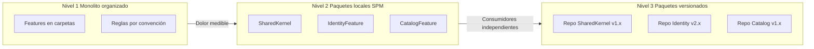
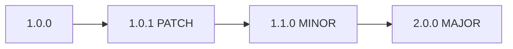

# Versionado y SPM

## Objetivo de aprendizaje

Al terminar esta lección vas a saber decidir cuándo modularizar con Swift Package Manager, cuándo no hacerlo todavía, y cómo versionar contratos sin romper equipos consumidores.

Dicho simple: modularizar no es “hacer muchos paquetes”, es crear límites que reduzcan coste de cambio.

---

## El error más común en modularización

Error típico:

- convertir cada carpeta en paquete demasiado pronto.

Síntomas:

- más tiempo peleando con `Package.swift` que con reglas de negocio;
- builds más lentas al resolver dependencias;
- PRs bloqueadas por cambios cruzados innecesarios.

Regla del curso:

- empezar simple (monolito organizado);
- extraer módulo cuando exista dolor medible;
- versionar cuando haya consumidores independientes reales.

---

## Definición simple

SPM en este contexto es una herramienta para materializar fronteras de arquitectura.

Un paquete bien definido te da:

- API pública explícita;
- dependencias controladas por compilador;
- tests por módulo;
- posibilidad de versionado independiente.

Si no hay frontera clara de negocio/técnica, el paquete solo añade fricción.

---

## Modelo mental: edificios y puertas

Imagina que cada módulo es un edificio.

- Las puertas públicas son la API del paquete.
- Lo interno del edificio no debería verse desde fuera.
- Si cada mesa es un edificio, nadie puede trabajar.
- Si toda la ciudad es un edificio, nadie escala.



---

## Criterios de paso entre niveles

### Nivel 1 -> Nivel 2

Pasa cuando:

- imports cruzados entre features aparecen con frecuencia;
- tiempos de compilación incremental crecen y afectan cadencia;
- necesitas enforcement por compilador, no solo por scripts.

No pasar solo porque “queda más pro”.

### Nivel 2 -> Nivel 3

Pasa cuando:

- hay múltiples apps/repos que consumen módulos comunes;
- equipos requieren releases en ritmos diferentes;
- la coordinación por monorepo ya es cuello de botella.

No pasar si el coste de coordinación externa supera el beneficio.

---

## Estructura recomendada por etapa

### Etapa actual (recomendada): Nivel 1 consolidado

```text
StackMyArchitecture/
  App/
  Features/
    Login/
    Catalog/
  SharedKernel/
  Tests/
```

### Siguiente paso (cuando duela): Nivel 2

```text
StackMyArchitecture/
  App/
  Packages/
    SharedKernel/
      Package.swift
    IdentityFeature/
      Package.swift
    CatalogFeature/
      Package.swift
```

---

## Ejemplo de `Package.swift` local

```swift
// swift-tools-version: 6.0
import PackageDescription

let package = Package(
    name: "CatalogFeature",
    platforms: [
        .iOS(.v17)
    ],
    products: [
        .library(name: "CatalogFeature", targets: ["CatalogFeature"])
    ],
    dependencies: [
        .package(path: "../SharedKernel")
    ],
    targets: [
        .target(
            name: "CatalogFeature",
            dependencies: [
                .product(name: "SharedKernel", package: "SharedKernel")
            ]
        ),
        .testTarget(
            name: "CatalogFeatureTests",
            dependencies: ["CatalogFeature"]
        )
    ]
)
```

Punto clave:

- dependencias mínimas y explícitas.

---

## Diseño de API pública por módulo

No publiques todo por comodidad.

Supuesto de `SharedKernel`:

```swift
public struct Session: Sendable, Equatable, Hashable {
    public let token: String
    public let email: String

    public init(token: String, email: String) {
        self.token = token
        self.email = email
    }
}
```

Si marcas todo `public`, conviertes detalles internos en contrato difícil de cambiar.

Regla:

- `public` solo lo que consume otro módulo;
- lo demás `internal`.

---

## Versionado semántico aplicado a arquitectura

### MAJOR

Rompes contrato público.

Ejemplo:

- cambias nombre/forma de tipo público obligatorio.

### MINOR

Añades capacidad compatible.

Ejemplo:

- agregas campo opcional o nuevo método no rompiente.

### PATCH

Arreglas bug sin tocar contrato.

Ejemplo:

- mejoras implementación interna.



Si no hay disciplina de semver, consumidores pierden confianza y empiezan a pinnear versiones antiguas.

---

## Compatibilidad y deprecaciones

Buenas prácticas cuando un módulo ya tiene consumidores:

1. marcar APIs antiguas como deprecadas antes de eliminarlas;
2. ofrecer ruta de migración clara;
3. documentar ventana temporal de soporte;
4. automatizar checks de compatibilidad en CI.

Ejemplo:

```swift
@available(*, deprecated, message: "Use accessToken instead")
public var token: String { accessToken }

public let accessToken: String
```

---

## TDD/Testing en ecosistema modular

Cuando modularizas, también modularizas responsabilidad de pruebas.

- cada paquete debe tener suite de unit + integración de su frontera;
- tests de app validan ensamblaje entre módulos;
- contract tests protegen APIs públicas entre paquetes.

Matriz sugerida:

| Nivel | Qué valida | Dónde corre |
| --- | --- | --- |
| Paquete | reglas internas del módulo | CI del paquete |
| Integración módulos | contratos entre paquetes | CI de app/monorepo |
| E2E | flujos críticos de negocio | pipeline selectivo |

---

## Concurrencia y módulos (Swift 6.2)

Modularizar sin disciplina de concurrencia puede empeorar errores de aislamiento.

Checklist de frontera entre paquetes:

- tipos públicos `Sendable` cuando crucen tareas;
- evitar exponer clases mutables no aisladas;
- no usar `@unchecked Sendable` sin invariante documentado;
- definir actor isolation explícita en APIs críticas.

Si un paquete expone API no segura, el problema se amplifica en todos los consumidores.

---

## Anti-ejemplos frecuentes

### Anti-ejemplo 1: paquete por capa sin negocio

Problema:

- `DomainPackage`, `ApplicationPackage`, `InfrastructurePackage` globales para toda la app generan acoplamiento horizontal.

Corrección:

- preferir feature-first: paquetes por bounded context cuando toque.

### Anti-ejemplo 2: separar repos prematuramente

Problema:

- sobrecoste de release/versionado en etapas tempranas.

Corrección:

- mantener monorepo hasta que haya necesidad de independencia real.

### Anti-ejemplo 3: API pública sobredimensionada

Problema:

- cada refactor interno se vuelve breaking change.

Corrección:

- minimizar superficie pública.

---

## A/B/C de estrategia de paquetización

### Opción A: monolito organizado con reglas de dependencia (decisión actual)

Ventajas:

- máxima velocidad de entrega inicial;
- baja complejidad de tooling.

Costes:

- enforcement por convención/script, no por compilador.

Riesgos:

- imports cruzados si disciplina baja.

### Opción B: paquetes locales SPM en monorepo

Ventajas:

- enforcement fuerte de fronteras;
- compilación incremental más predecible.

Costes:

- mayor complejidad de configuración y mantenimiento.

Riesgos:

- fricción si se extraen paquetes sin criterio.

### Opción C: paquetes versionados en repos separados

Ventajas:

- independencia total por equipo/app.

Costes:

- coordinación y gobernanza de versiones más pesada.

Riesgos:

- fragmentación y problemas de compatibilidad.

Trigger para A -> B:

- aumento sostenido de deuda de dependencia + build times que afectan productividad.

Trigger para B -> C:

- consumidores múltiples con necesidades de release desacopladas.

---

## ADR corto de la lección

```markdown
## ADR-010: Estrategia de modularización progresiva con SPM
- Estado: Aprobado
- Contexto: necesidad de escalar arquitectura sin sobrecoste temprano
- Decisión: mantener Nivel 1 inicialmente; migrar a paquetes locales (Nivel 2) ante dolor medible; evaluar Nivel 3 solo con consumidores independientes reales
- Consecuencias: menor complejidad inicial, migración guiada por señales objetivas
- Fecha: 2026-02-07
```

---

## Checklist de calidad

- [ ] La decisión de paquetización está basada en señales, no en moda.
- [ ] Superficie pública de módulos está minimizada y justificada.
- [ ] Existe política semver para APIs compartidas.
- [ ] Se definió estrategia de testing por nivel de módulo.
- [ ] Fronteras de concurrencia (`Sendable`/aislamiento) están cubiertas en APIs públicas.

---

## Cierre

SPM no es el objetivo, es el medio. El objetivo es reducir coste de coordinación y cambio mientras la organización crece. Cuando entiendes eso, dejas de modularizar por estética y empiezas a modularizar por economía de ingeniería.

**Anterior:** [Navegación y deep links ←](03-navegacion-deeplinks.md) · **Siguiente:** [Guía de arquitectura →](05-guia-arquitectura.md)

---

## Estrategia de migración segura a paquetes locales (playbook)

Cuando llegue el momento de pasar de Nivel 1 a Nivel 2:

1. extraer primero `SharedKernel` como paquete local;
2. mover una feature pequeña completa para validar pipeline;
3. mantener compatibilidad temporal con imports antiguos si aplica;
4. migrar tests por capas (unit primero, integración después);
5. cerrar con ADR de estado y métricas de impacto.

Evita migrar todo en una sola rama larga. Hazlo por lotes pequeños y verificables.

---

## Señales de que aún NO debes paquetizar más

- el equipo dedica más tiempo a resolver tooling que a entregar valor;
- no hay incidencias reales de acoplamiento que justifiquen extracción;
- el build actual sigue dentro de objetivos de productividad;
- no existen consumidores externos reales del módulo.

Si se cumplen 3 de 4, probablemente debes quedarte en nivel actual.

---

## Checklist de release para módulo versionado

- [ ] changelog con cambios y impacto de contrato;
- [ ] clasificación semver correcta (major/minor/patch);
- [ ] pruebas de compatibilidad con consumidor principal;
- [ ] plan de rollback si release introduce regresión.

Este checklist evita publicar versiones que rompen equipos aguas abajo sin aviso.

---

## Plan de rollback de release de módulo

Toda publicación debería incluir rollback explícito:

1. versión previa estable identificada;
2. criterio de activación de rollback;
3. pasos de reversión y responsables;
4. comunicación a consumidores.

Sin rollback documentado, un fallo de versión se convierte en crisis de coordinación.

---

## Principio de versionado responsable

Versionar no es publicar rápido; es publicar cambios que otro equipo puede adoptar con confianza y previsibilidad.
