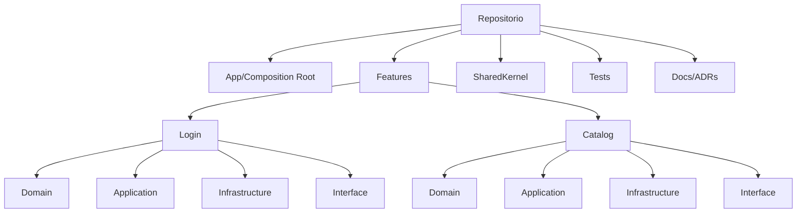
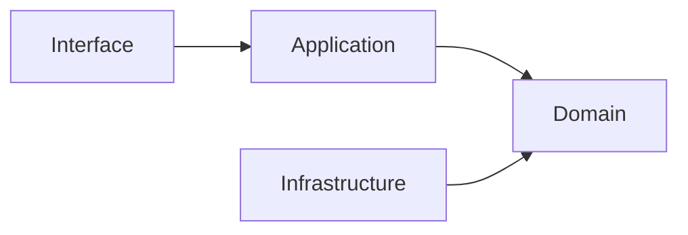
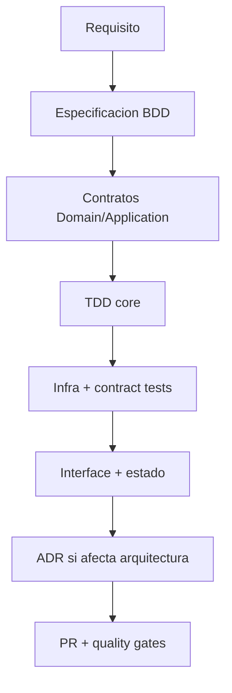

# Guía de arquitectura del repositorio

## Objetivo de aprendizaje

Al terminar esta lección vas a poder mantener y evolucionar una guía de arquitectura como activo de plataforma: un documento vivo que reduce fricción de onboarding, evita discusiones repetidas y convierte reglas implícitas en contratos explícitos de equipo.

En versión simple: una buena guía de arquitectura es el manual del sistema. Sin manual, cada mecánico arregla el motor a su manera.

---

## Qué problema resuelve esta guía

En equipos enterprise no falla solo el código. Falla la coordinación.

Síntomas de falta de guía:

- cada feature se estructura distinto;
- naming inconsistente;
- PRs con discusiones básicas repetidas;
- onboarding lento y caro;
- deuda de arquitectura invisible.

Meta de esta guía:

- que cualquier persona del equipo sepa dónde va cada cosa, cómo se decide y cómo se valida calidad.

---

## Definición simple

Guía de arquitectura = conjunto versionado de convenciones, reglas de dependencia, flujos de cambio y criterios de calidad que gobiernan cómo evoluciona el repositorio.

No es documento decorativo. Es parte del sistema de ejecución del equipo.

---

## Principios de la guía

1. claridad operativa: cualquier regla debe ser accionable;
2. mínimo dogma: si no hay razón de negocio/técnica, no se impone;
3. trazabilidad: toda regla relevante debe enlazar con ADR o criterio;
4. enforcement progresivo: primero convención, luego automatización;
5. actualización continua: guía y código evolucionan juntos.

---

## Mapa del repositorio y ownership



Ownership sugerido por contexto:

- `Login` y `Catalog` con owners por feature;
- `SharedKernel`, navegación y quality gates con ownership de plataforma.

---

## Convenciones de nombrado (por qué existen)

Las convenciones no son estética. Son compresión cognitiva.

Si ves `LoadProductsUseCase`, ya sabes su rol. Si ves `DoItService2`, pierdes tiempo interpretando.

| Elemento | Convención | Ejemplo |
| --- | --- | --- |
| Entidad Domain | sustantivo singular | `Product.swift` |
| Value Object | semántica explícita | `Price.swift`, `ProductID.swift` |
| Error Domain | `[Feature]Error` | `CatalogError.swift` |
| Puerto | sustantivo + rol | `ProductRepository.swift` |
| Caso de uso | verbo + objetivo + `UseCase` | `LoadProductsUseCase.swift` |
| DTO | nombre + `DTO` | `ProductDTO.swift` |
| Adapter infra | prefijo técnico + puerto | `RemoteProductRepository.swift` |
| ViewModel | nombre vista + `ViewModel` | `CatalogViewModel.swift` |
| Tests | SUT + `Tests` | `LoadProductsUseCaseTests.swift` |

---

## Reglas de dependencia por feature

Regla canónica Clean por feature:

- `Interface` depende de `Application`;
- `Application` depende de `Domain`;
- `Infrastructure` depende de `Domain`/puertos;
- `Domain` no depende de nadie interno.



Regla cross-feature:

- una feature no importa internamente otra feature;
- comunicación por contratos/eventos/shared kernel mínimo.

---

## Flujo oficial para crear o cambiar una feature



Esta secuencia evita construir UI sobre contratos inestables.

---

## Cuándo crear ADR (regla clara)

Debes crear ADR cuando el cambio:

1. afecta más de una feature/bounded context;
2. modifica contrato público del shared kernel;
3. introduce o elimina dependencia importante;
4. cambia estrategia de navegación/concurrencia/testing.

No hace falta ADR para micro-cambios locales reversibles.

---

## Plantilla mínima de ADR aplicada

```markdown
## ADR-[NNN]: [Titulo]
- Estado: Propuesto | Aprobado | Reemplazado
- Contexto:
- Decisión:
- Alternativas A/B/C:
- Consecuencias:
- Trigger de revision:
- Fecha:
```

La parte más olvidada suele ser `Trigger de revision`. Sin trigger, las decisiones se fosilizan.

---

## Guía de PR y revisiones

Toda PR de arquitectura o feature debería responder explícitamente:

1. ¿qué comportamiento BDD cubre?
2. ¿qué tests (unit/integration) protegen el cambio?
3. ¿qué reglas de dependencia toca?
4. ¿qué trade-off se aceptó?
5. ¿requiere ADR o actualiza una existente?

Checklist de revisión técnica:

- límites de capa respetados;
- no hay fuga de detalles de infraestructura al core;
- concurrencia segura (`Sendable`, aislamiento, cancelación);
- navegación/eventos desacoplados;
- nombres y estructura alineados con guía.

---

## Onboarding operativo de 3 días

### Día 1: mapa del sistema

- leer README + guía + ADRs vigentes;
- navegar un flujo completo de Login;
- ejecutar tests base.

### Día 2: trazabilidad de feature

- seguir Catalog de BDD a tests y código;
- identificar dónde viven decisiones de dependencia;
- reproducir un flujo de integración.

### Día 3: primer cambio controlado

- cambio pequeño end-to-end;
- actualizar tests y documentación si aplica;
- abrir PR con checklist completo.

Meta de onboarding:

- reducir tiempo a primer commit fiable, no solo primer commit rápido.

---

## Gobernanza: cómo mantener la guía viva

Regla operativa:

- cada cambio de arquitectura aprobado debe actualizar guía en la misma PR.

Ritmo recomendado:

- revisión mensual de guía de arquitectura;
- revisión inmediata tras incidentes relevantes.

Métrica útil:

- preguntas repetidas en PR/onboarding. Si aumentan, la guía se quedó atrás.

---

## Concurrencia y guía del repositorio

La guía debe incluir decisiones de concurrencia a nivel de plataforma, por ejemplo:

- dónde usar `@MainActor` y dónde no;
- requisitos `Sendable` en contratos públicos;
- política de cancelación en casos de uso;
- límites de `@unchecked Sendable` con invariante documentado.

Si esto no está en guía, cada feature inventa su propia regla y el sistema se fragmenta.

---

## A/B/C para enfoque documental

### Opción A: guía mínima estática

Ventajas:

- coste bajo inicial.

Costes:

- se vuelve obsoleta rápido.

### Opción B: guía viva versionada con enforcement progresivo (decisión)

Ventajas:

- alinea equipo y reduce deuda de coordinación.

Costes:

- requiere disciplina continua.

### Opción C: sin guía formal

Ventajas:

- cero esfuerzo documental inicial.

Costes:

- caos de convenciones y alto coste de onboarding.

Trigger para reforzar B con automatización:

- cuando revisiones manuales no escalan y reaparecen incumplimientos.

---

## ADR corto de la lección

```markdown
## ADR-011: Guia de arquitectura como documento vivo con actualizacion obligatoria por PR arquitectonica
- Estado: Aprobado
- Contexto: divergencia de convenciones y alto coste de onboarding
- Decisión: mantener una guía versionada en repositorio con checklist de actualización y ownership
- Consecuencias: mayor esfuerzo continuo de documentación, menor fricción y ambigüedad de equipo
- Fecha: 2026-02-07
```

---

## Checklist de calidad

- [ ] Guía define estructura y reglas de dependencia por feature.
- [ ] Convenciones de naming son explícitas y justificadas.
- [ ] Criterios ADR están claros y aplicados.
- [ ] Existe flujo de cambio BDD -> TDD -> PR -> governance.
- [ ] Guía contempla políticas de concurrencia y testing.

---

## Cierre

La arquitectura no se gobierna solo con código. Se gobierna con código + decisiones + lenguaje compartido. Esta guía es el pegamento que convierte un conjunto de features en una plataforma mantenible por equipos reales.

**Anterior:** [Versionado y SPM ←](04-versionado-spm.md) · **Siguiente:** [Quality Gates →](06-quality-gates.md)

---

## Cadencia recomendada de mantenimiento de guía

Para que la guía siga viva y no sea museo:

- revisión ligera semanal en PRs de arquitectura;
- revisión formal mensual de secciones críticas;
- revisión extraordinaria tras incidentes severos.

Roles sugeridos:

- owner de plataforma: coordina y arbitra conflictos;
- owners de contextos: actualizan convenciones de su área;
- reviewers: validan consistencia transversal.

---

## Métricas para saber si la guía sirve

1. tiempo a primer PR productiva de un nuevo miembro;
2. número de comentarios de review repetitivos sobre estructura/capas;
3. número de excepciones arquitectónicas por sprint;
4. incidencias por acoplamiento entre features.

Si estas métricas mejoran, la guía está aportando. Si empeoran, hay que simplificar o aclarar reglas.

---

## Mini checklist para actualizar guía en cada ADR

- [ ] la decisión cambia una convención existente;
- [ ] la sección afectada se actualizó en la misma PR;
- [ ] se añadió ejemplo correcto/incorrecto si aplica;
- [ ] se revisó impacto en onboarding y quality gates.

Este microproceso evita deriva documental silenciosa.

---

## Proceso de resolución de conflictos de arquitectura

Cuando dos convenciones chocan, usa este orden:

1. revisar ADRs vigentes;
2. validar impacto de negocio y riesgo técnico;
3. elegir alternativa con menor coste de coordinación;
4. actualizar guía + checklist en la misma PR;
5. comunicar cambio en canal de arquitectura.

Este proceso evita decisiones ad-hoc por autoridad o urgencia puntual.

---

## Señales de salud documental

La guía está sana cuando:

- los nuevos miembros encuentran respuestas sin preguntar lo básico;
- las PRs discuten decisiones, no estructura elemental;
- la guía y el código no se contradicen;
- los ADRs recientes reflejan cambios reales del repositorio.

Si alguna señal falla, la guía necesita mantenimiento inmediato.
