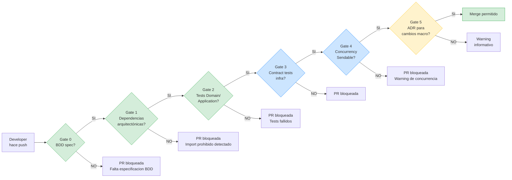
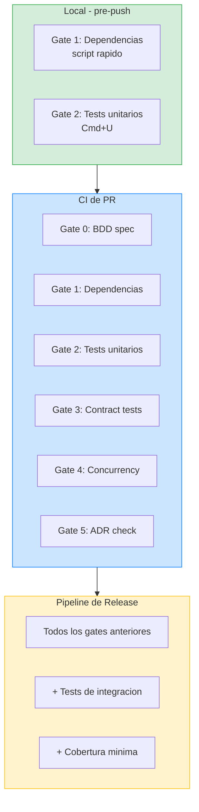

# Quality Gates

## De "creo que está bien" a "sé que está bien"

Un quality gate es una puerta con regla automática: si no cumples la condición, no pasas.

Metáfora simple:

- Sin gates: cualquiera entra al edificio con lo que sea en la mochila.
- Con gates: hay control de acceso. No se trata de desconfiar de personas, se trata de proteger el sistema.

En arquitectura enterprise, confiar solo en "review manual" no escala. Cuando hay varios equipos, el gate automático evita regresiones y discusiones repetidas.

---

## Objetivo de esta lección

Definir un sistema de quality gates práctico para este curso, que pueda evolucionar desde equipo pequeño hasta equipo grande:

- qué gates son **bloqueantes**,
- qué gates son **informativos**,
- en qué orden corren,
- y cómo gestionar excepciones sin romper la gobernanza.

---

## Principio base: pocas reglas, mucho enforcement

Regla que no se puede verificar automáticamente = recomendación.

Por eso priorizamos gates que se puedan ejecutar en:

1. local (antes de subir PR),
2. CI de PR (antes de merge),
3. pipeline de release (antes de producción).

---

## Diagrama: el pipeline de quality gates



Los gates verdes son **bloqueantes**: si fallan, la PR no puede hacer merge. Los azules son bloqueantes pero con excepciones documentadas. Los amarillos son **informativos**: alertan pero no bloquean.

### Diagrama: dónde se ejecuta cada gate



---

## Catálogo de gates del curso

### Gate 0: Especificación BDD presente y trazable

**Qué valida**

- existe documento BDD de la feature o cambio,
- hay escenarios happy/sad/edge,
- los tests refieren esos escenarios.

**Tipo**

- Bloqueante en PR de features/casos de uso nuevos.

**Evidencia mínima**

- archivo `00-especificacion-bdd.md`,
- IDs de escenario usados en tests o descripción del PR.

### Gate 1: Reglas de dependencia arquitectónica

**Qué valida**

- Domain no importa UI/frameworks prohibidos,
- feature A no importa internals de feature B,
- solo App/Composition Root conoce todo el wiring.

**Tipo**

- Bloqueante siempre.

**Evidencia mínima**

- scripts o checks de lint de dependencias,
- salida limpia en CI.

### Gate 2: Tests unitarios de Domain/Application

**Qué valida**

- invariantes y reglas de negocio,
- orquestación de casos de uso.

**Tipo**

- Bloqueante siempre.

**Evidencia mínima**

- suite unitaria en verde en PR.

### Gate 3: Tests de integración de Infrastructure

**Qué valida**

- contrato entre repositorios/clients/serialización,
- mapping correcto de errores y datos.

**Tipo**

- Bloqueante cuando se toca infraestructura.

**Evidencia mínima**

- contract tests para 200, errores de red, payload inválido.

### Gate 4: UI tests mínimos de flujos críticos

**Qué valida**

- que los caminos de negocio más importantes siguen vivos (smoke funcional).

**Tipo**

- Bloqueante en release,
- opcional/recomendado en PR (según coste del pipeline).

**Evidencia mínima**

- resultados de UI smoke tests.

### Gate 5: Strict concurrency y seguridad de aislamiento

**Qué valida**

- ausencia de problemas de aislamiento críticos,
- uso correcto de `Sendable`,
- cancelación y fronteras de concurrencia razonables.

**Tipo**

- Bloqueante siempre.

**Evidencia mínima**

- build sin violaciones de seguridad de concurrencia,
- pruebas async relevantes en verde.

### Gate 6: Observabilidad mínima en flujos críticos

**Qué valida**

- trazabilidad por `traceId` o contexto equivalente,
- errores de casos críticos con contexto útil.

**Tipo**

- Bloqueante en features nuevas críticas,
- recomendado en cambios menores.

**Evidencia mínima**

- tests o logs de ejemplo con contexto.

---

## Orden recomendado de ejecución

Ejecutar gates en este orden reduce tiempo de feedback:

1. Gate 1 (arquitectura/imports): muy rápido.
2. Gate 2 (unit): rápido.
3. Gate 3 (integración): medio.
4. Gate 5 (concurrency): medio.
5. Gate 4 (UI smoke): más caro.
6. Gate 6 (observabilidad): validación final.

Si Gate 1 falla, no tiene sentido gastar 10 minutos en UI tests.

---

## Matriz de severidad de gates

| Gate | PR normal | PR infra | Release |
| --- | --- | --- | --- |
| Gate 0 BDD | Bloqueante si hay feature nueva | Bloqueante si cambia caso de uso | Bloqueante |
| Gate 1 Dependencias | Bloqueante | Bloqueante | Bloqueante |
| Gate 2 Unit | Bloqueante | Bloqueante | Bloqueante |
| Gate 3 Integración | Recomendado | Bloqueante | Bloqueante |
| Gate 4 UI smoke | Recomendado | Recomendado | Bloqueante |
| Gate 5 Concurrency | Bloqueante | Bloqueante | Bloqueante |
| Gate 6 Observabilidad | Recomendado | Bloqueante en flujos críticos | Bloqueante en flujos críticos |

---

## Implementación conceptual en CI

```yaml
name: Quality Gates
on:
  pull_request:
  push:
    branches: [main]

jobs:
  gates:
    runs-on: macos-latest
    steps:
      - name: Checkout
        uses: actions/checkout@v4

      - name: Gate 1 - dependency rules
        run: bash scripts/check-architecture-rules.sh

      - name: Gate 2 - unit tests
        run: xcodebuild test -scheme StackMyArchitecture -only-testing:UnitTests

      - name: Gate 3 - integration tests
        run: xcodebuild test -scheme StackMyArchitecture -only-testing:IntegrationTests

      - name: Gate 5 - strict concurrency
        run: xcodebuild build -scheme StackMyArchitecture SWIFT_STRICT_CONCURRENCY=complete

      - name: Gate 4 - ui smoke (release/main only)
        if: github.ref == 'refs/heads/main'
        run: xcodebuild test -scheme StackMyArchitecture -only-testing:UISmokeTests
```

`N/D`: flags exactos de toolchain según versión de Xcode/Swift del proyecto; confirmar en el entorno real antes de fijarlos.

---

## Concurrency gate: qué sí y qué no

### Sí

- aislar estado mutable compartido con `actor` o aislamiento explícito,
- usar `Sendable` en fronteras concurrentes,
- propagar cancelación (`Task.checkCancellation()` cuando aplique),
- preferir structured concurrency.

### No

- marcar todo con `@MainActor` para silenciar errores,
- usar `@unchecked Sendable` sin invariante documentada,
- meter `Task.detached` sin razón fuerte y sin ownership.

Si se necesita excepción, debe haber ADR corto con:

- riesgo aceptado,
- invariante de seguridad,
- fecha objetivo de retirada.

---

## Cobertura: criterio, no dogma

No usamos "80% porque sí".

Usamos cobertura por criticidad:

- Domain/Application críticos: cobertura alta esperada.
- Infrastructure: cobertura por contratos y errores relevantes.
- UI: cobertura mínima de flujos críticos.

Pregunta guía: "si este test no existe, qué bug caro puede escapar".

---

## Proceso de excepción (sin anarquía)

Cuando un gate bloquea algo legítimo:

1. Crear ADR de excepción.
2. Definir alcance temporal (fecha de expiración).
3. Añadir ticket de remediación.
4. Referenciar ADR en PR y en comentario del check.

Sin fecha de expiración, la excepción se convierte en deuda permanente.

---

## Debug rápido cuando falla un gate

### Falla Gate 1 (dependencias)

- revisa import prohibido,
- mueve tipo a contrato/shared kernel si corresponde,
- o introduce ACL para traducir en frontera.

### Falla Gate 2 (unit)

- identifica si rompiste invariante o contrato público,
- corrige comportamiento antes de "arreglar" test.

### Falla Gate 3 (integración)

- sospecha de mapping DTO/error/status code,
- revisa contrato de repositorio y fixtures.

### Falla Gate 5 (concurrency)

- identifica frontera de aislamiento,
- corrige ownership/conformancia `Sendable`,
- evita parche rápido con `@MainActor` global.

---

## Trade-offs A/B/C de rigor de gates

### A: Gates mínimos

- Pro: velocidad inicial.
- Contra: deuda arquitectónica silenciosa.
- Riesgo: regresiones tardías y costosas.

### B: Gates equilibrados (recomendado en este curso)

- Pro: buen balance entre seguridad y velocidad.
- Contra: mantenimiento moderado de CI/checks.
- Riesgo: requiere disciplina de equipo.

### C: Gates máximos desde día 1

- Pro: control alto.
- Contra: fricción alta en equipos pequeños.
- Riesgo: burocracia y bypass manual.

Decisión del curso: **B**.

Trigger para pasar de B a C:

- equipo > 10 personas,
- múltiples apps/targets,
- historial de regresiones por integración.

---

## Checklist de cierre de quality gates

- [ ] Gate 0: escenarios BDD trazables.
- [ ] Gate 1: reglas de dependencia limpias.
- [ ] Gate 2: unit tests verdes.
- [ ] Gate 3: integration tests relevantes verdes.
- [ ] Gate 4: UI smoke en release.
- [ ] Gate 5: strict concurrency sin excepciones ocultas.
- [ ] Gate 6: observabilidad mínima validada.
- [ ] Excepciones (si existen) con ADR + fecha de retirada.

---

## Evidencia esperada en repositorio

- `scripts/check-architecture-rules.sh`
- `scripts/check-domain-imports.sh`
- `scripts/check-feature-imports.sh`
- `.github/workflows/quality-gates.yml` (o equivalente)
- `docs/quality-gates.md` (este documento)
- `anexos/adrs/ADR-EXCEPTION-*.md` (si aplica)

---

**Anterior:** [Guía de arquitectura del repo ←](05-guia-arquitectura.md) · **Siguiente:** [Entregables de Etapa 4 →](entregables-etapa-4.md)
