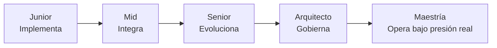
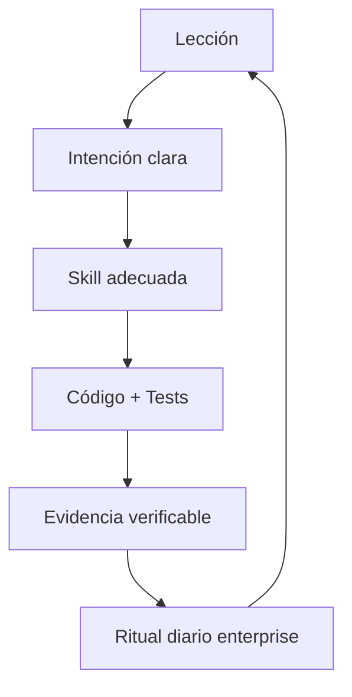
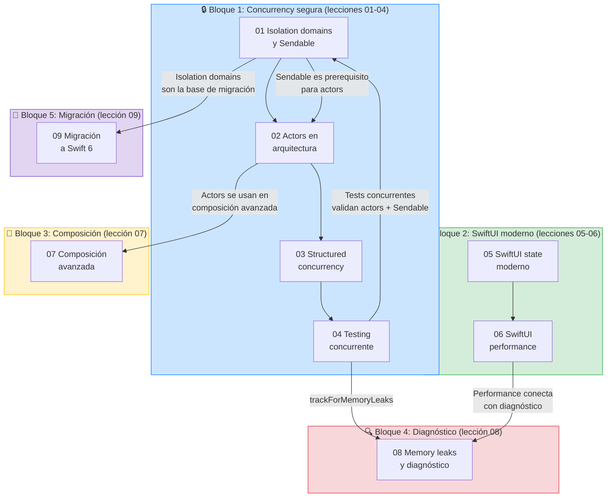
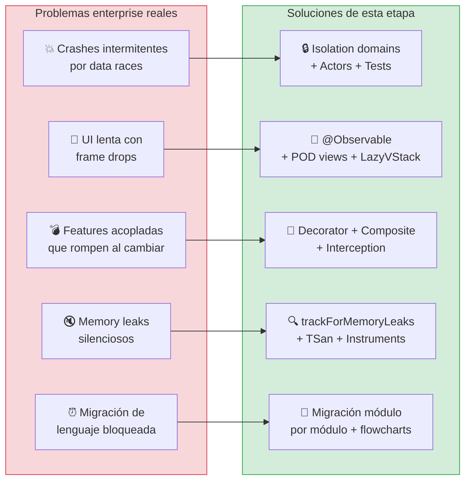

# Etapa 5 — Maestría: Concurrency, SwiftUI moderno y patrones de composición

## Por qué existe esta etapa y por qué no es opcional

Hasta aquí el curso ya te llevó a construir arquitectura modular, contratos entre features, navegación desacoplada, observabilidad y quality gates. Eso te pone por encima del promedio. Pero en un entorno enterprise real todavía falta una capa crítica: **dominar los mecanismos que sostienen el sistema cuando todo se complica al mismo tiempo**.

Esa capa es exactamente esta etapa:

- Concurrency segura de verdad, no solo `async/await` "porque compila".
- SwiftUI moderno con control de estado y performance medible.
- Composición avanzada para extender comportamiento sin romper contratos.
- Diagnóstico y prevención para fallos intermitentes (fugas, data races, render loops).

En otras palabras, esta etapa transforma conocimientos aislados en **criterio operativo**. El objetivo no es saber "qué son actors"; es saber **cuándo conviene usarlos, cuándo no, qué coste tienen y cómo demostrar con tests que tu decisión es correcta**.

---

## Contrato pedagógico transversal (aplica a todas las lecciones)

Desde aquí en adelante, cada lección se estudia con el mismo marco. Este marco es obligatorio para que el salto de junior a arquitecto no sea teórico, sino reproducible en trabajo diario.

### Regla 1: Cada concepto se aprende en 6 capas

1. **Definición simple**: explicación para alguien que parte de cero.
2. **Modelo mental**: cómo funciona por dentro sin perder rigor.
3. **Regla de uso**: cuándo sí, cuándo no, y por qué.
4. **Implementación mínima**: ejemplo corto para fijar mecánica.
5. **Implementación realista**: versión enterprise con trade-offs.
6. **Debug y anti-patrones**: cómo falla y cómo se corrige.

Si una lección no se puede explicar en estas 6 capas, todavía no está madura.

### Regla 2: Todo aprendizaje debe dejar evidencia

No vale "entenderlo en abstracto". En cada lección deben existir artefactos verificables:

- Código de producción.
- Tests que prueban comportamiento relevante.
- Decisión documentada (ADR o decisión equivalente).
- Señal de operación (log, métrica o regla de diagnóstico).

### Regla 3: Todo debe poder enseñarse a otro

El alumno no cierra una lección cuando la ejecuta una vez. La cierra cuando puede explicarla con claridad a un compañero junior, justificar trade-offs y anticipar errores comunes.

---

## Del junior al arquitecto: cómo se produce realmente el salto

El salto no ocurre por acumular temas. Ocurre cuando cambias la forma de pensar:

- Junior piensa en "que funcione".
- Mid piensa en "que funcione y se pueda mantener".
- Senior piensa en "que funcione, se mantenga y escale bajo cambio".
- Arquitecto piensa en "que el sistema y el equipo puedan evolucionar sin degradarse".

Esta etapa trabaja exactamente ese último tramo: decisiones bajo presión, con concurrencia real, UI reactiva compleja y necesidades de extensibilidad.



---

## Relación explícita con el plan del curso y el PDF base

La etapa de maestría no rompe el plan original, lo profundiza. Se mantiene la misma columna vertebral:

- **Small batches**: una capacidad de alto impacto por lección, con evidencia concreta.
- **BDD + TDD**: primero comportamiento y contrato, luego implementación guiada por tests.
- **Bajo acoplamiento / alta cohesión**: incluso al introducir actores, decorators o composites.
- **Composition Root limpio**: la complejidad de wiring sigue fuera del core.

Del PDF de mejores prácticas se conserva la premisa central: aclarar intención antes de codificar. En esta etapa esa intención se vuelve más exigente: no basta definir qué hace una función; hay que definir **en qué dominio de aislamiento vive, qué garantías de seguridad tiene y cómo se valida en runtime**.

---

## Cómo se integra esta etapa con tus skills (uso diario enterprise)

Esta sección es clave porque convierte el curso en rutina profesional.

### Skill: `swift-concurrency`

Se usa en lecciones 01, 02, 03, 04 y 09.

Objetivo operativo:
- Delimitar fronteras de aislamiento.
- Evitar parches tipo `@MainActor` indiscriminado.
- Elegir entre actor, struct `Sendable` o aislamiento de task con criterio.

Evidencia esperada:
- Decisión de aislamiento documentada.
- Tests de cancelación/race.
- Cero warnings críticos de strict concurrency.

### Skill: `swiftui-expert-skill`

Se usa en lecciones 05 y 06.

Objetivo operativo:
- Estado moderno correcto (`@Observable`, `@Bindable`, `@State`).
- Evitar renders innecesarios y dependencias de más.
- Usar APIs modernas y medibles.

Evidencia esperada:
- Árbol de decisión de wrappers aplicado.
- Diagnóstico con `_printChanges()` cuando toque.
- Refactor de vistas calientes con datos de impacto.

### Skill: `windsurf-rules-ios` (si aplica al proyecto real)

Se usa como guía de consistencia de equipo en todas las lecciones donde haya decisiones de estilo, arquitectura y concurrencia.

Objetivo operativo:
- Evitar soluciones "geniales" pero incompatibles con estándares del repo.
- Mantener decisiones alineadas con gobernanza técnica.

Evidencia esperada:
- Código y tests que pasan quality gates del proyecto.
- Decisiones que respetan reglas del repositorio.



Este ciclo se repite hasta que el comportamiento técnico correcto deja de ser esfuerzo consciente y se vuelve segunda naturaleza.

---

## Estructura de la etapa (qué aprenderás y para qué sirve en trabajo real)

### Mapa visual: cómo se conectan las lecciones



### Qué problema enterprise resuelve cada bloque



```text
05-maestria/
├── 00-introduccion.md
├── 01-isolation-domains.md        ← Data races → errores de compilación
├── 02-actors-en-arquitectura.md   ← @unchecked Sendable → seguridad verificada
├── 03-structured-concurrency.md   ← Task {} → .task, async let, TaskGroup
├── 04-testing-concurrente.md      ← Flaky tests → tests deterministas
├── 05-swiftui-state-moderno.md    ← @StateObject → @Observable + decision tree
├── 06-swiftui-performance.md      ← Invalidation storms → POD + diagnóstico
├── 07-composicion-avanzada.md     ← God objects → Decorator/Composite/Interception
├── 08-memory-leaks-y-diagnostico.md ← Bugs silenciosos → detección automática
├── 09-migracion-swift6.md         ← Warnings ignorados → plan de migración
└── entregables-etapa-5.md         ← Criterios verificables de completitud
```

Lectura funcional del mapa:

- `01-04`: blindan seguridad y confiabilidad concurrente.
- `05-06`: blindan calidad y performance de UI reactiva.
- `07`: blinda extensibilidad sin reescritura.
- `08`: blinda capacidad de diagnóstico y prevención.
- `09`: blinda transición tecnológica sin romper operación.

---

## Método de estudio para que se convierta en hábito de trabajo

No estudies esta etapa como teoría continua. Estúdiala como simulación de trabajo real.

### Ciclo recomendado por lección

1. Leer la lección completa sin escribir código.
2. Reescribir el modelo mental con tus palabras en 10 líneas.
3. Implementar el ejemplo mínimo desde cero.
4. Implementar la versión realista en tu base existente.
5. Ejecutar tests y añadir un test de edge adicional que no venga en la lección.
6. Documentar una decisión de diseño con trade-off explícito.

### Ritual semanal de consolidación

- Un día de la semana: solo revisión de anti-patrones encontrados.
- Un día: solo refactor protegido por tests.
- Un día: solo observabilidad y diagnóstico.

El objetivo es que las skills no queden asociadas a "leer un capítulo", sino a "resolver presión real sin romper el sistema".

---

## Qué no debes hacer en esta etapa

Hay cuatro trampas típicas que frenan el salto a arquitecto:

1. Convertir la concurrency en anotaciones cosméticas.
2. Tratar SwiftUI como maquillaje visual y no como sistema reactivo con coste.
3. Usar patrones de composición por moda sin necesidad real.
4. Dejar diagnóstico para el final, cuando los bugs ya están en producción.

Si caes en una de estas, vuelve a la regla de 6 capas y exige evidencia técnica antes de dar por cerrada una lección.

---

## Definición de éxito de la etapa

Esta etapa está realmente completada cuando el alumno puede:

- Diseñar fronteras de aislamiento sin improvisar.
- Explicar por qué un tipo debe o no debe ser `Sendable`.
- Implementar UI SwiftUI con estado moderno y perf controlada.
- Componer comportamiento por Decorator/Composite/Interception con criterio.
- Detectar y prevenir fugas/data races de forma sistemática.
- Planificar migración a Swift 6 en lotes pequeños y verificables.

Eso es exactamente lo que diferencia a alguien que "sabe conceptos" de alguien que puede sostener una base iOS enterprise día tras día.

---

## Siguiente paso

Ahora sí: pasa a `01-isolation-domains.md` y estúdialo con el contrato anterior en mano. No lo leas como capítulo aislado; léelo como la primera pieza del sistema operativo mental que necesitas para trabajar a nivel arquitecto.

**Siguiente:** [Isolation domains y Sendable →](01-isolation-domains.md)
