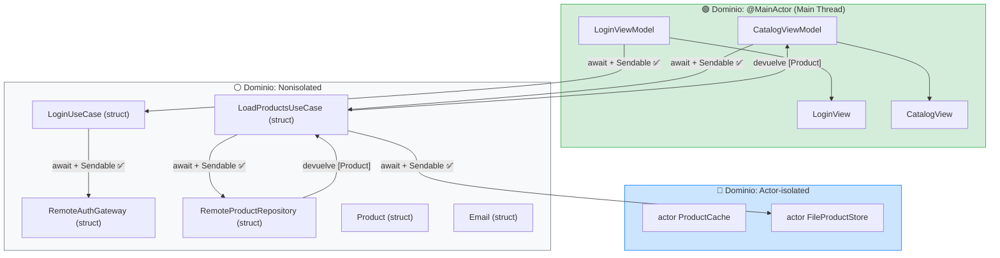
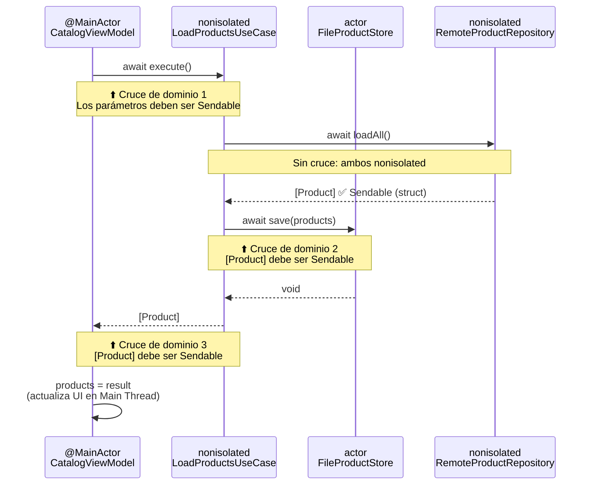
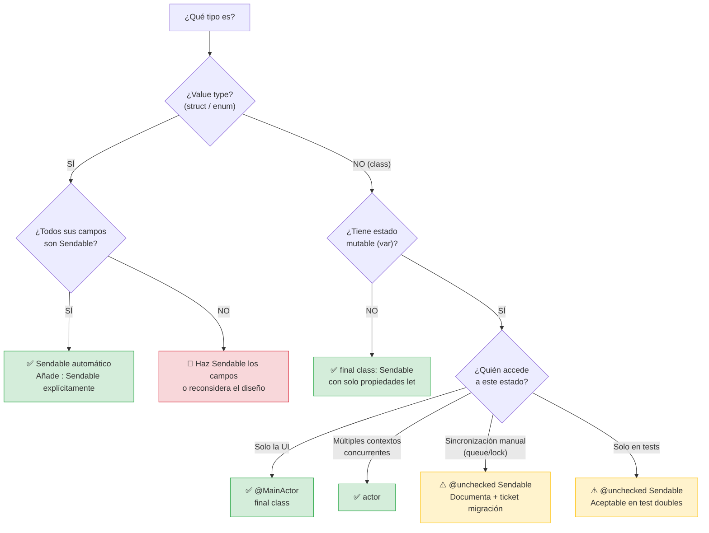

# Isolation domains y Sendable

## El modelo mental que lo cambia todo

Swift Concurrency no es solo `async/await`. Es un **sistema de tipos para concurrencia**: el compilador verifica en tiempo de compilación que tu código no tiene data races. Para entender cómo lo hace, necesitas entender dos conceptos fundamentales: **dominios de aislamiento** (isolation domains) y **Sendable**.

Si en las etapas anteriores usaste `Sendable` y `@MainActor` porque "el compilador lo pedía", esta lección te explica **por qué lo pedía** y **qué está verificando**.

---

## Qué es un data race (y qué no es)

Un **data race** ocurre cuando dos hilos acceden a la misma ubicación de memoria al mismo tiempo, y al menos uno de ellos escribe. El resultado es indeterminado: el programa puede crashear, devolver datos corruptos, o funcionar perfectamente... hasta que no funciona.

```swift
// ❌ Data race: dos hilos acceden a `count` simultáneamente
var count = 0

Task { count += 1 }  // Hilo A escribe
Task { print(count) } // Hilo B lee
```

Una **race condition** es diferente: es un bug lógico donde el resultado depende del orden de ejecución, pero no hay acceso simultáneo a la misma memoria. Las race conditions son bugs de lógica; los data races son bugs de memoria que pueden causar crashes y corrupción silenciosa.

```swift
// Race condition (NO data race): el orden de ejecución cambia el resultado,
// pero cada acceso a la variable está serializado por el actor
actor Counter {
    var count = 0
    func increment() { count += 1 }
    func decrement() { count -= 1 }
}

let counter = Counter()
// ¿El resultado final es 0, 1, o -1? Depende del orden.
// Pero NO hay data race: el actor serializa los accesos.
Task { await counter.increment() }
Task { await counter.decrement() }
```

Swift Concurrency **elimina los data races** en tiempo de compilación. Las race conditions siguen siendo responsabilidad tuya como programador.

---

## Los tres dominios de aislamiento

El compilador divide tu código en **dominios de aislamiento**. Cada dominio es una "zona segura" donde el código se ejecuta de forma serializada (nunca dos cosas a la vez dentro del mismo dominio). Los data races solo ocurren cuando datos **cruzan** entre dominios.

### Diagrama: los tres dominios en nuestro proyecto



Este diagrama muestra cómo se distribuye nuestro proyecto entre los tres dominios. Observa que:

- **Los ViewModels** (verde) viven en `@MainActor` porque SwiftUI lee sus propiedades desde el Main Thread.
- **Los stores y caches** (azul) son actors: tienen estado mutable que necesita protección.
- **Los modelos, use cases y gateways** (gris) son nonisolated: son structs puros sin estado compartido.

Cada flecha que cruza entre colores es un **punto de transferencia** donde el compilador exige `Sendable`. Si un tipo no es `Sendable`, la flecha no compila.

### Diagrama: qué pasa cuando un dato cruza dominios



Cada vez que un dato cruza una línea punteada entre dominios diferentes, el compilador verifica que ese dato es `Sendable`. Si no lo es, obtienes un error de compilación. Esto es lo que hace que Swift Concurrency sea un **sistema de tipos para concurrencia**, no solo una librería de async/await.

### ¿Por qué esto importa en el trabajo enterprise diario?

En un proyecto real con 20+ desarrolladores, los data races son la categoría de bugs más cara:

- **Son intermitentes**: aparecen en producción pero no en tu máquina.
- **Son silenciosos**: corrompen datos sin crashear. El usuario ve precios incorrectos, pedidos duplicados, o estados inconsistentes.
- **Son difíciles de reproducir**: dependen del timing exacto de los hilos, que cambia con la carga del servidor, la velocidad del dispositivo, y la suerte.
- **Son caros de diagnosticar**: un senior puede pasar días buscando un data race que solo ocurre bajo carga.

Swift Concurrency convierte esta categoría de bugs en **errores de compilación**. Si compila, no hay data races. Esa es la promesa. Y para que se cumpla, necesitas entender los dominios de aislamiento.

### 1. Nonisolated (sin aislamiento)

El código que no pertenece a ningún actor. Es el dominio por defecto de funciones libres, structs, y métodos que no están marcados con ningún actor.

```swift
// Nonisolated: no pertenece a ningún actor
func formatPrice(_ amount: Decimal) -> String {
    return "\(amount) EUR"
}
```

Este código es seguro si solo trabaja con datos locales (parámetros y variables locales). Es inseguro si accede a estado mutable compartido.

### 2. Actor-isolated (aislado por actor)

El código que pertenece a un actor específico. Todas las propiedades y métodos de un actor están aislados a ese actor. Solo se puede acceder a ellos desde dentro del actor o con `await` desde fuera.

```swift
actor ProductCache {
    private var products: [String: Product] = [:]
    
    // Este método está aislado al actor ProductCache.
    // Solo un caller puede ejecutarlo a la vez.
    func store(_ product: Product, forKey key: String) {
        products[key] = product
    }
    
    func product(forKey key: String) -> Product? {
        products[key]
    }
}
```

### 3. Global-actor-isolated (aislado por actor global)

El código marcado con un actor global como `@MainActor`. Todo el código marcado con `@MainActor` comparte el mismo dominio de aislamiento: el hilo principal.

```swift
@MainActor
final class CatalogViewModel {
    var products: [Product] = []
    var isLoading = false
    
    // Todos los accesos a `products` e `isLoading` ocurren en el Main Thread.
    // SwiftUI puede leer estas propiedades de forma segura.
}
```

---

## Sendable: el pasaporte entre dominios

Cuando un valor **cruza** de un dominio de aislamiento a otro, el compilador exige que sea `Sendable`. Ser `Sendable` significa: "es seguro enviar este valor a otro dominio porque no puede causar un data race".

### Tipos que son Sendable automáticamente

Los **value types** (structs y enums) son `Sendable` si todos sus campos lo son:

```swift
// ✅ Sendable automáticamente: struct con campos Sendable
struct Product: Sendable {
    let id: String           // String es Sendable
    let name: String         // String es Sendable
    let price: Price         // Price es Sendable (si lo es)
    let imageURL: URL        // URL es Sendable
}

// ✅ Sendable automáticamente: enum con associated values Sendable
enum AuthError: Error, Sendable {
    case connectivity
    case invalidCredentials
}
```

Los tipos primitivos (`Int`, `String`, `Bool`, `Double`, `URL`, `Date`, `UUID`) son todos `Sendable`. Los arrays, diccionarios, sets, y opcionales de tipos `Sendable` también lo son.

### Tipos que NO son Sendable por defecto

Las **clases** no son `Sendable` por defecto porque tienen identidad de referencia: dos variables pueden apuntar al mismo objeto, y si una modifica el objeto mientras otra lo lee, hay un data race.

```swift
// ❌ NO es Sendable: clase con estado mutable
class UserSession {
    var token: String?  // Dos hilos podrían leer/escribir simultáneamente
}
```

### Cómo hacer una clase Sendable

Opción 1 — **Hacerla `final` con propiedades `let` inmutables**:

```swift
// ✅ Sendable: clase final con solo propiedades let
final class APIConfiguration: Sendable {
    let baseURL: URL
    let apiKey: String
    
    init(baseURL: URL, apiKey: String) {
        self.baseURL = baseURL
        self.apiKey = apiKey
    }
}
```

Opción 2 — **Convertirla en un actor** (si necesita estado mutable):

```swift
// ✅ Sendable: los actors son Sendable por definición
actor UserSession {
    var token: String?
    
    func update(token: String) {
        self.token = token
    }
}
```

Opción 3 — **Marcarla `@MainActor`** (si solo se accede desde el hilo principal):

```swift
// ✅ Sendable: @MainActor garantiza acceso serializado en el Main Thread
@MainActor
final class LoginViewModel {
    var email = ""
    var password = ""
    var isLoading = false
}
```

### @unchecked Sendable: la válvula de escape

A veces necesitas conformar `Sendable` pero no puedes (o no quieres) que el compilador lo verifique. Para eso existe `@unchecked Sendable`:

```swift
// ⚠️ @unchecked Sendable: TÚ garantizas la thread safety
final class FileProductStore: ProductStore, @unchecked Sendable {
    private let fileURL: URL
    private let queue = DispatchQueue(label: "FileProductStore")
    
    // La thread safety la garantizas tú con el DispatchQueue.
    // El compilador NO lo verifica.
}
```

**Regla del curso:** `@unchecked Sendable` es deuda técnica. Cada uso debería tener un comentario explicando por qué es necesario y un ticket para eliminarlo. En nuestro proyecto, lo usamos en `FileProductStore` porque sincronizamos manualmente con un `DispatchQueue`. La alternativa correcta es convertirlo en un `actor` (lo haremos en la lección siguiente).

---

## Revisión del código de etapas anteriores

Ahora que entiendes isolation domains y Sendable, revisemos decisiones que tomamos en etapas anteriores:

### ¿Por qué `RemoteAuthGateway` es un struct?

```swift
// Etapa 1: Infrastructure
struct RemoteAuthGateway: AuthGateway, Sendable {
    private let httpClient: any HTTPClient
    private let baseURL: URL
    // ...
}
```

Es un `struct` con propiedades `let`. Eso lo hace **value type inmutable**, que es `Sendable` automáticamente. No necesitamos `@unchecked`, no necesitamos un actor, no necesitamos sincronización manual. Es la opción más simple y más segura.

¿Podría ser una clase? Sí, si fuera `final` con propiedades `let`. Pero un struct es más idiomático en Swift cuando no necesitas identidad de referencia ni herencia.

### ¿Por qué `HTTPClientStub` es `@unchecked Sendable`?

```swift
// Etapa 1: Tests
final class HTTPClientStub: HTTPClient, @unchecked Sendable {
    private let result: Result<(Data, HTTPURLResponse), Error>
    private(set) var receivedRequests: [URLRequest] = []
    // ...
}
```

Es una clase con `receivedRequests` mutable. El compilador no puede garantizar que sea thread-safe. Usamos `@unchecked Sendable` porque:

1. Solo se usa en tests, donde la ejecución es secuencial (un test a la vez).
2. El `receivedRequests` solo se escribe dentro de `execute()` y se lee después de que la operación termina.
3. No hay acceso concurrente real en la práctica de los tests.

Esto es un uso aceptable de `@unchecked Sendable`: código de test donde controlamos completamente el flujo de ejecución.

### ¿Por qué `CatalogViewModel` está marcado con `@MainActor`?

```swift
// Etapa 2: Interface
@MainActor
final class CatalogViewModel {
    var products: [Product] = []
    var isLoading = false
    // ...
}
```

Porque SwiftUI lee `products` e `isLoading` desde el Main Thread para renderizar la UI. Si el ViewModel estuviera en otro dominio de aislamiento, SwiftUI podría leer mientras el ViewModel escribe → data race. `@MainActor` garantiza que todos los accesos ocurren en el Main Thread.

### ¿Por qué `FileProductStore` usa `@unchecked Sendable`?

```swift
// Etapa 3: Cache
final class FileProductStore: ProductStore, @unchecked Sendable {
    private let fileURL: URL
    // ...
}
```

Porque accede al sistema de archivos, que es inherentemente compartido. Dos llamadas concurrentes a `save()` podrían escribir el mismo archivo simultáneamente. En la lección siguiente, lo convertiremos en un `actor` para que el compilador verifique la serialización.

---

## El árbol de decisión de Sendable

Cuando necesites que un tipo sea `Sendable`, sigue este flowchart. Imprímelo, tenlo visible. Después de usarlo 20 veces, será automático:



### Mapping completo del proyecto con este flowchart

| Tipo | ¿Value? | ¿Mutable? | ¿Quién accede? | Decisión | Justificación |
|------|---------|-----------|-----------------|----------|---------------|
| `Product` | struct | No | Todos | `Sendable` auto | Value type con campos Sendable |
| `Email` | struct | No | Todos | `Sendable` auto | Value type |
| `Password` | struct | No | Todos | `Sendable` auto | Value type |
| `Price` | struct | No | Todos | `Sendable` auto | Value type |
| `AuthError` | enum | No | Todos | `Sendable` auto | Enum sin associated values mutables |
| `Credentials` | struct | No | Todos | `Sendable` auto | Value type |
| `Session` | struct | No | Todos | `Sendable` auto | Value type |
| `AuthRequest` | struct | No | Infra | `Sendable` auto | DTO |
| `AuthResponse` | struct | No | Infra | `Sendable` auto | DTO |
| `RemoteAuthGateway` | struct | No | Application | `Sendable` auto | Inmutable, `let` properties |
| `StubAuthGateway` | struct | No | Tests/Previews | `Sendable` auto | Inmutable |
| `RemoteProductRepository` | struct | No | Application | `Sendable` auto | Inmutable |
| `LoginUseCase` | struct | No | ViewModel | `Sendable` auto | Inmutable |
| `LoadProductsUseCase` | struct | No | ViewModel | `Sendable` auto | Inmutable |
| `APIConfiguration` | class | No (`let`) | Todos | `final class: Sendable` | Inmutable después de init |
| `LoginViewModel` | class | Sí | Solo UI | `@MainActor` | SwiftUI lee desde Main Thread |
| `CatalogViewModel` | class | Sí | Solo UI | `@MainActor` | SwiftUI lee desde Main Thread |
| `FileProductStore` | class → actor | Sí | Concurrente | `actor` | Acceso concurrente al filesystem |
| `InMemoryProductCache` | actor | Sí | Concurrente | `actor` | Caché compartida entre llamadas |
| `HTTPClientStub` | class | Sí | Solo tests | `@unchecked Sendable` | Acceso secuencial en tests |
| `ProductRepositoryStub` | class | Sí | Solo tests | `@unchecked Sendable` | Acceso secuencial en tests |
| `ProductStoreSpy` | class | Sí | Solo tests | `@unchecked Sendable` | Acceso secuencial en tests |

Esta tabla es tu **referencia viva**. Cada vez que crees un tipo nuevo en el proyecto, pregúntate: "¿en qué fila de esta tabla encaja?" Si no encaja en ninguna, estás creando algo nuevo que necesita su propia justificación.

### Escenario enterprise: el tipo que "parece Sendable" pero no lo es

En proyectos grandes, un error común es crear un tipo que parece seguro pero tiene una trampa escondida:

```swift
// ❌ Parece Sendable, pero no lo es
struct OrderProcessor: Sendable {
    let httpClient: any HTTPClient     // ✅ HTTPClient es Sendable
    let analytics: AnalyticsTracker    // ❌ AnalyticsTracker es una clase con estado mutable
}
```

El compilador te dirá: "Stored property 'analytics' of 'Sendable'-conforming struct 'OrderProcessor' has non-sendable type 'AnalyticsTracker'". La solución no es `@unchecked Sendable` en `OrderProcessor`. La solución es hacer que `AnalyticsTracker` sea Sendable (probablemente convirtiéndolo en actor o en protocolo con conformance Sendable).

**Principio enterprise:** la Sendability se propaga hacia arriba. Si un tipo contiene algo no-Sendable, ese tipo tampoco es Sendable. Esto te fuerza a diseñar desde los cimientos: primero los tipos hoja (modelos, DTOs), luego los tipos intermedios (gateways, repositories), y finalmente los tipos raíz (use cases, ViewModels).

---

## Funciones y closures Sendable

No solo los tipos pueden ser `Sendable`. Las funciones y closures también. El atributo `@Sendable` indica que un closure es seguro para enviar a otro dominio de aislamiento:

```swift
// El closure que recibe `currentDate` cruza dominios,
// por eso es @Sendable
init(
    remote: any ProductRepository,
    store: any ProductStore,
    maxAge: TimeInterval = 300,
    currentDate: @Sendable @escaping () -> Date = { Date() }
) {
    // ...
}
```

Un closure `@Sendable` no puede capturar variables mutables del contexto que lo rodea:

```swift
var count = 0

// ❌ Error: closure @Sendable captura variable mutable
let increment: @Sendable () -> Void = { count += 1 }

// ✅ Correcto: captura valor inmutable
let currentCount = count
let report: @Sendable () -> Void = { print(currentCount) }
```

---

## La keyword `sending` (Swift 6.2)

Swift 6.2 introduce `sending`, que indica que un valor **transfiere ownership** al cruzar un dominio de aislamiento. Después de enviar un valor con `sending`, no puedes seguir usándolo en el dominio original:

```swift
actor ImageCache {
    private var cache: [URL: Data] = [:]
    
    // `data` se transfiere al actor. El caller no puede usarlo después.
    func store(_ data: sending Data, forURL url: URL) {
        cache[url] = data
    }
}

// Uso:
let imageData = try await downloadImage(from: url)
await cache.store(imageData, forURL: url)
// `imageData` ya no se puede usar aquí: se transfirió al actor
```

`sending` es más preciso que `Sendable`: no requiere que el tipo sea inherentemente thread-safe, solo que la transferencia sea segura porque el caller deja de usarlo. Es útil para tipos grandes que no quieres copiar (como `Data` o arrays grandes).

---

## Configuración del proyecto: strict concurrency

En la Etapa 1, configuramos `SWIFT_STRICT_CONCURRENCY = complete`. Esto activa todas las verificaciones de concurrency del compilador. Sin esta flag, muchos errores de data race pasan desapercibidos.

Verifica que tu proyecto tiene esta configuración en Build Settings:

```
SWIFT_STRICT_CONCURRENCY = complete
```

Con `complete`, el compilador:

- Verifica que todo lo que cruza entre dominios de aislamiento es `Sendable`.
- Detecta global state mutable que no está protegido.
- Advierte sobre closures que capturan estado mutable de forma insegura.
- Verifica que los accesos a propiedades de actores usan `await`.

---

## Errores comunes y cómo resolverlos

### "Capture of non-sendable type in @Sendable closure"

```swift
// ❌ Error: HTTPClientStub no es Sendable
let client = HTTPClientStub(data: data, statusCode: 200)
Task {
    await client.execute(request) // Error: client no es Sendable
}
```

**Solución:** Haz que el tipo sea `Sendable`, o reestructura el código para no cruzar dominios.

### "Actor-isolated property cannot be referenced from non-isolated context"

```swift
// ❌ Error: accediendo a propiedad del actor sin await
let cache = ProductCache()
let product = cache.product(forKey: "1") // Error: falta await
```

**Solución:** Usa `await`:

```swift
let product = await cache.product(forKey: "1")
```

### "Main actor-isolated property cannot be mutated from non-isolated context"

```swift
// ❌ Error: modificando propiedad @MainActor desde contexto no aislado
@MainActor final class ViewModel {
    var isLoading = false
}

func loadData(viewModel: ViewModel) async {
    viewModel.isLoading = true // Error: no estamos en @MainActor
}
```

**Solución:** Marca la función con `@MainActor` o accede con `await`:

```swift
@MainActor
func loadData(viewModel: ViewModel) async {
    viewModel.isLoading = true // ✅ Estamos en @MainActor
}
```

---

## Resumen

| Concepto | Qué es | Cuándo usarlo |
|----------|--------|---------------|
| **Isolation domain** | Zona donde el código se ejecuta serializado | Siempre existe; entiéndelo para razonar sobre concurrency |
| **Sendable** | Protocolo que marca tipos seguros para cruzar dominios | En todo tipo que cruza entre actores o @MainActor |
| **@unchecked Sendable** | Conformance sin verificación del compilador | Solo cuando sincronizas manualmente; documenta y planifica migración |
| **@Sendable** | Atributo para closures seguros entre dominios | En closures que se pasan a Tasks, actors, o APIs async |
| **sending** | Transferencia de ownership entre dominios (Swift 6.2) | En parámetros de funciones de actor donde el caller no necesita el valor después |
| **@MainActor** | Actor global del hilo principal | En ViewModels y cualquier código que toque la UI |
| **SWIFT_STRICT_CONCURRENCY** | Flag del compilador | Siempre en `complete` |

---

**Anterior:** [Introducción ←](00-introduccion.md) · **Siguiente:** [Actors en arquitectura →](02-actors-en-arquitectura.md)
