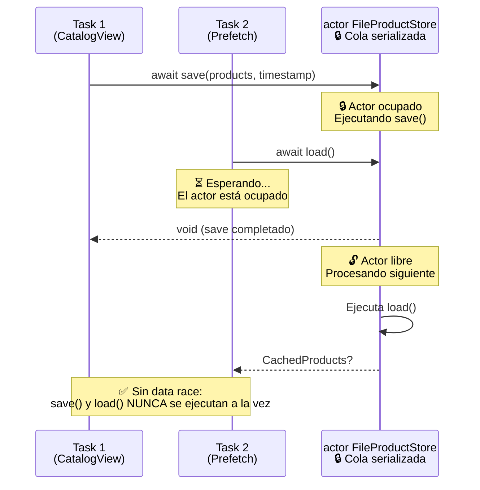
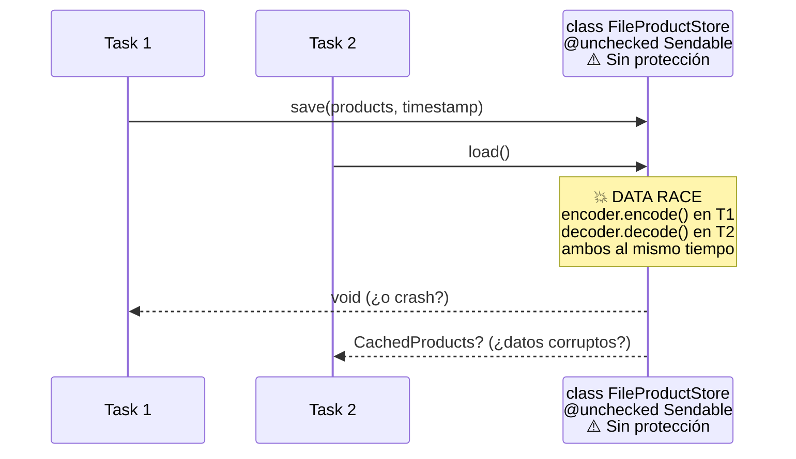
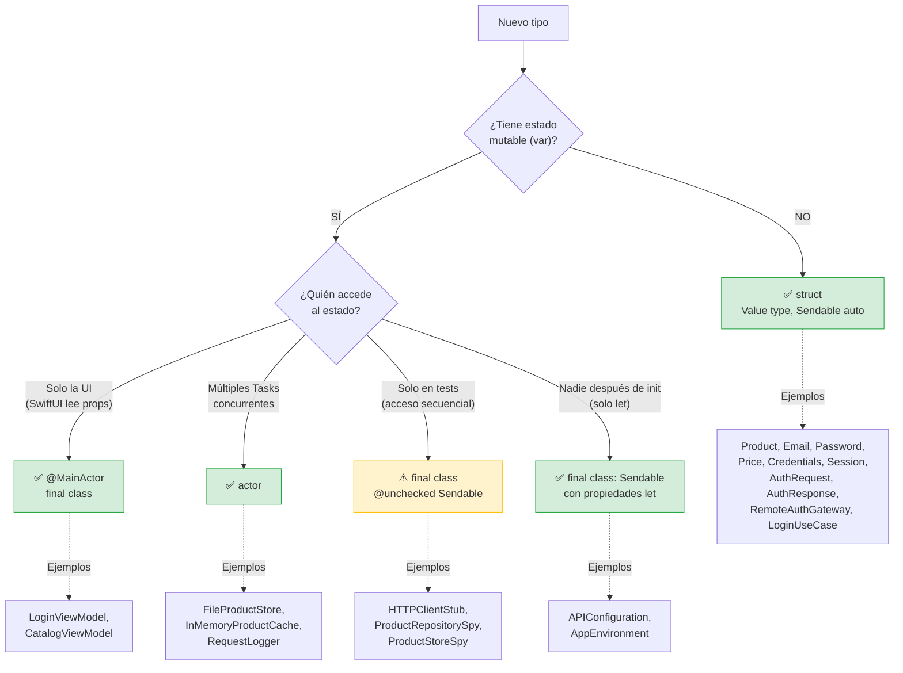
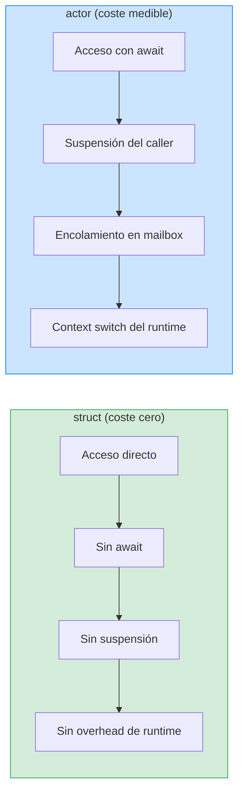
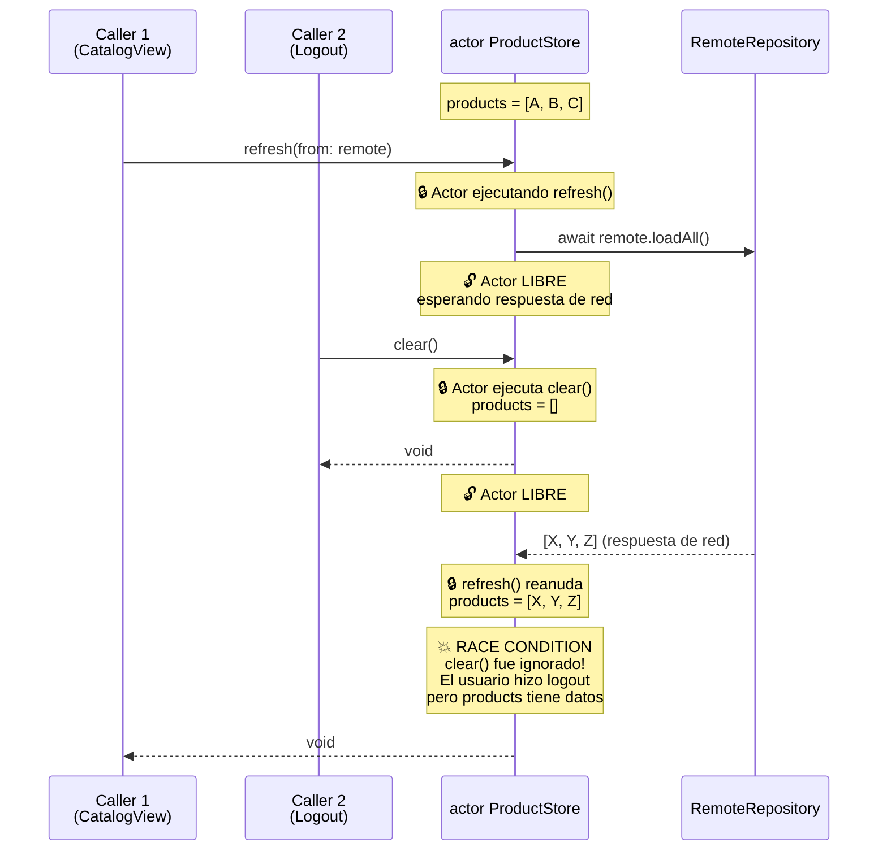

# Actors en arquitectura

## De `@unchecked Sendable` a seguridad verificada por el compilador

En la lección anterior aprendimos que `@unchecked Sendable` es deuda técnica: tú le dices al compilador "confía en mí, este tipo es thread-safe", pero si te equivocas, el compilador no te salvará. En esta lección vamos a hacer algo mejor: convertir componentes de nuestro proyecto en **actors**, para que el compilador verifique la seguridad por nosotros.

Un actor es como una clase con un candado invisible: todas sus propiedades y métodos están serializados automáticamente. Solo una operación puede ejecutarse a la vez dentro del actor. No necesitas `DispatchQueue`, no necesitas `NSLock`, no necesitas `@unchecked Sendable`. El compilador lo garantiza.

---

## Diagrama: actor como candado automático



Compara esto con lo que ocurre sin actor (con `@unchecked Sendable`):



Este segundo diagrama muestra el problema real: sin serialización, dos hilos acceden al mismo `JSONEncoder`/`JSONDecoder` simultáneamente. `JSONEncoder` mantiene estado interno durante la codificación. Si dos hilos lo usan a la vez, el resultado es indeterminado: puede funcionar, puede crashear, puede devolver JSON corrupto. **Lo peor es que funciona el 99% de las veces**, lo que te da falsa confianza.

---

## El problema: `FileProductStore` no es seguro

En la Etapa 3, implementamos `FileProductStore` así:

```swift
// Etapa 3: versión con @unchecked Sendable
final class FileProductStore: ProductStore, @unchecked Sendable {
    private let fileURL: URL
    private let encoder = JSONEncoder()
    private let decoder = JSONDecoder()
    
    func save(_ products: [Product], timestamp: Date) async throws {
        let cache = CacheDTO(products: products.map(ProductCacheDTO.init), timestamp: timestamp)
        let data = try encoder.encode(cache)
        try data.write(to: fileURL, options: .atomic)
    }
    
    func load() async throws -> CachedProducts? {
        guard FileManager.default.fileExists(atPath: fileURL.path) else { return nil }
        let data = try Data(contentsOf: fileURL)
        let cache = try decoder.decode(CacheDTO.self, from: data)
        return CachedProducts(products: cache.products.map(\.toDomain), timestamp: cache.timestamp)
    }
}
```

¿Qué pasa si dos llamadas concurrentes ejecutan `save()` al mismo tiempo? Ambas intentan escribir el mismo archivo. Con `options: .atomic`, el sistema operativo protege la escritura final, pero el `encoder.encode()` ocurre antes de la escritura, y `JSONEncoder` no es thread-safe cuando se comparte entre hilos.

¿Y si una llamada ejecuta `load()` mientras otra ejecuta `save()`? El `load()` podría leer un archivo parcialmente escrito, o el `decoder` podría estar en uso por ambas operaciones.

Estos son data races reales que `@unchecked Sendable` oculta. El compilador no los detecta porque le dijimos "confía en mí".

---

## La solución: convertir en actor

```swift
// Etapa 5: versión con actor — seguridad verificada por el compilador
actor FileProductStore: ProductStore {
    private let fileURL: URL
    private let encoder = JSONEncoder()
    private let decoder = JSONDecoder()
    
    init(directory: URL) {
        self.fileURL = directory.appendingPathComponent("products-cache.json")
    }
    
    func save(_ products: [Product], timestamp: Date) throws {
        let cache = CacheDTO(
            products: products.map(ProductCacheDTO.init),
            timestamp: timestamp
        )
        let data = try encoder.encode(cache)
        try data.write(to: fileURL, options: .atomic)
    }
    
    func load() throws -> CachedProducts? {
        guard FileManager.default.fileExists(atPath: fileURL.path) else {
            return nil
        }
        let data = try Data(contentsOf: fileURL)
        let cache = try decoder.decode(CacheDTO.self, from: data)
        return CachedProducts(
            products: cache.products.map(\.toDomain),
            timestamp: cache.timestamp
        )
    }
}
```

### Qué cambió

1. **`final class` → `actor`**: Ahora el compilador garantiza que `save()` y `load()` nunca se ejecutan al mismo tiempo. Si llegan dos llamadas concurrentes, la segunda espera a que la primera termine.

2. **Desaparece `@unchecked Sendable`**: Los actors son `Sendable` automáticamente. No necesitamos decirle al compilador "confía en mí" porque él puede verificarlo.

3. **Desaparece `async` de los métodos**: Los métodos del actor no necesitan ser `async` internamente. Son funciones normales que el actor serializa. El `async` aparece automáticamente en el punto de llamada desde fuera del actor:

```swift
// Desde fuera del actor, necesitas `await` para cruzar la frontera de aislamiento
let store = FileProductStore(directory: cacheDir)
try await store.save(products, timestamp: Date())       // await es obligatorio
let cached = try await store.load()                      // await es obligatorio
```

```swift
// Dentro del actor, NO necesitas `await`
actor FileProductStore {
    func saveAndLoad(_ products: [Product]) throws -> CachedProducts? {
        try save(products, timestamp: Date())  // Sin await: estamos dentro del actor
        return try load()                       // Sin await: estamos dentro del actor
    }
}
```

### Impacto en el protocolo ProductStore

El protocolo `ProductStore` necesita ajustarse. En la Etapa 3 lo definimos así:

```swift
protocol ProductStore: Sendable {
    func save(_ products: [Product], timestamp: Date) async throws
    func load() async throws -> CachedProducts?
}
```

El protocolo ya tiene `async throws`, lo que es compatible con actors. Cuando un actor conforma un protocolo con métodos `async`, el compilador añade la serialización automáticamente. No necesitamos cambiar el protocolo.

---

## Cuándo usar actor vs struct vs class

Este es el árbol de decisión para elegir el tipo correcto en nuestro proyecto. Deberías poder recorrerlo mentalmente en menos de 5 segundos para cualquier tipo nuevo que crees:



### Escenario enterprise: cómo se aplica en un equipo de 15 personas

En un equipo grande, los juniors crean clases por defecto (vienen de otros lenguajes). Un senior les dice "usa struct" y el junior no entiende por qué. Con este flowchart, la conversación de code review se convierte en:

> "Tu `OrderMapper` no tiene estado mutable. El flowchart dice: sin estado mutable → struct. Cámbialo."

No es opinión. No es estilo. Es una regla derivada de las garantías de seguridad del compilador. **El flowchart elimina la discusión subjetiva y la convierte en una verificación objetiva.**

### ¿Por qué no usar actor para todo?

Podrías pensar: "si actor es más seguro, ¿por qué no hacer todo actor?" Porque tiene un coste real:



Cada `await` a un actor implica:
1. **Suspensión**: el caller se suspende (deja de ejecutarse temporalmente).
2. **Encolamiento**: la operación se encola en el mailbox del actor.
3. **Context switch**: el runtime de Swift decide cuándo ejecutar la operación encolada.
4. **Reanudación**: cuando la operación termina, el caller se reanuda.

Para un `Product` que se crea, pasa, y destruye millones de veces, este overhead es inaceptable. Para un `FileProductStore` que se llama unas pocas veces por sesión, es insignificante. **Usa el tipo más simple que sea correcto.**

---

## Actor como caché en memoria

En la Etapa 3 usamos el patrón Decorator para la caché. Pero si quisiéramos una caché en memoria (sin disco), un actor es la solución natural:

```swift
actor InMemoryProductCache {
    private var products: [Product] = []
    private var timestamp: Date?
    private let maxAge: TimeInterval
    
    init(maxAge: TimeInterval = 300) {
        self.maxAge = maxAge
    }
    
    func store(_ products: [Product], at date: Date) {
        self.products = products
        self.timestamp = date
    }
    
    func retrieve(currentDate: Date) -> [Product]? {
        guard let timestamp, currentDate.timeIntervalSince(timestamp) < maxAge else {
            return nil
        }
        return products
    }
    
    func invalidate() {
        products = []
        timestamp = nil
    }
}
```

No hay locks, no hay queues, no hay `@unchecked Sendable`. El actor garantiza que `store()`, `retrieve()`, e `invalidate()` nunca se ejecutan simultáneamente.

### Test del actor cache

```swift
import XCTest
@testable import StackMyArchitecture

final class InMemoryProductCacheTests: XCTestCase {
    
    // MARK: - Helpers
    
    private func makeSUT(maxAge: TimeInterval = 300) -> InMemoryProductCache {
        InMemoryProductCache(maxAge: maxAge)
    }
    
    private func makeProducts() -> [Product] {
        [Product(
            id: "1",
            name: "Test",
            price: Price(amount: 10, currency: "EUR"),
            imageURL: URL(string: "https://example.com/1.png")!
        )]
    }
    
    // MARK: - Store and Retrieve
    
    func test_retrieve_on_empty_cache_returns_nil() async {
        let sut = makeSUT()
        
        let result = await sut.retrieve(currentDate: Date())
        
        XCTAssertNil(result)
    }
    
    func test_retrieve_after_store_returns_stored_products() async {
        let sut = makeSUT()
        let products = makeProducts()
        let now = Date()
        
        await sut.store(products, at: now)
        let result = await sut.retrieve(currentDate: now)
        
        XCTAssertEqual(result, products)
    }
    
    func test_retrieve_after_maxAge_returns_nil() async {
        let sut = makeSUT(maxAge: 300)
        let products = makeProducts()
        let storeDate = Date()
        let retrieveDate = storeDate.addingTimeInterval(301) // 1 segundo después de expirar
        
        await sut.store(products, at: storeDate)
        let result = await sut.retrieve(currentDate: retrieveDate)
        
        XCTAssertNil(result)
    }
    
    func test_retrieve_exactly_at_maxAge_returns_products() async {
        let sut = makeSUT(maxAge: 300)
        let products = makeProducts()
        let storeDate = Date()
        let retrieveDate = storeDate.addingTimeInterval(299)
        
        await sut.store(products, at: storeDate)
        let result = await sut.retrieve(currentDate: retrieveDate)
        
        XCTAssertEqual(result, products)
    }
    
    func test_invalidate_clears_cache() async {
        let sut = makeSUT()
        let products = makeProducts()
        
        await sut.store(products, at: Date())
        await sut.invalidate()
        let result = await sut.retrieve(currentDate: Date())
        
        XCTAssertNil(result)
    }
    
    // MARK: - Concurrency Safety
    
    func test_concurrent_store_and_retrieve_does_not_crash() async {
        let sut = makeSUT()
        let products = makeProducts()
        
        await withTaskGroup(of: Void.self) { group in
            for i in 0..<100 {
                group.addTask {
                    if i % 2 == 0 {
                        await sut.store(products, at: Date())
                    } else {
                        _ = await sut.retrieve(currentDate: Date())
                    }
                }
            }
        }
        // Si llegamos aquí sin crash, el actor protegió correctamente el estado.
        // Con una clase sin protección, este test crashearía intermitentemente.
    }
}
```

Fíjate en el último test: `test_concurrent_store_and_retrieve_does_not_crash`. Este test lanza 100 operaciones concurrentes (50 escrituras y 50 lecturas) contra el mismo actor. Si hubiéramos usado una clase sin protección, este test crashearía aleatoriamente por data races. Con el actor, **nunca crashea** porque el actor serializa todas las operaciones.

Este tipo de test no verifica lógica de negocio; verifica que la infraestructura es thread-safe. Es una práctica que deberías añadir a cualquier componente compartido.

---

## Nonisolated: escapar del actor cuando no lo necesitas

A veces un método de un actor no accede a estado mutable. En ese caso, puedes marcarlo como `nonisolated` para evitar el coste de la serialización:

```swift
actor FileProductStore {
    private let fileURL: URL
    
    // Este método no accede a estado mutable del actor,
    // solo lee una propiedad `let`. No necesita serialización.
    nonisolated var cacheFileURL: URL {
        fileURL
    }
    
    // Este método SÍ accede a estado mutable (el filesystem),
    // así que necesita la protección del actor.
    func save(_ products: [Product], timestamp: Date) throws {
        // ...
    }
}

// Uso:
let store = FileProductStore(directory: cacheDir)
let url = store.cacheFileURL        // Sin await: nonisolated
try await store.save(products, timestamp: Date()) // Con await: actor-isolated
```

`nonisolated` es útil para propiedades computadas que solo dependen de constantes, o para métodos utilitarios puros. No lo uses en métodos que acceden a propiedades `var` del actor — el compilador te lo impedirá.

---

## Actor reentrancy: el detalle que muchos ignoran

Los actors serializan las operaciones, pero tienen un comportamiento que puede sorprenderte: **reentrancy**. Cuando un método del actor hace `await` (espera por algo externo), el actor libera su "candado" y permite que otra operación se ejecute.

### Diagrama: cómo la reentrancy causa una race condition lógica



Observa la secuencia:
1. `refresh()` empieza y hace `await` al repositorio remoto.
2. **Durante el `await`**, el actor está libre. Otro caller invoca `clear()`.
3. `clear()` vacía los products. El usuario hizo logout.
4. La red responde. `refresh()` reanuda y **sobreescribe** products con datos nuevos.
5. **Resultado:** el usuario hizo logout pero la pantalla muestra productos. Bug silencioso.

Esto **no es un data race** (el actor serializa los accesos). Es una **race condition lógica**: el resultado depende del orden de ejecución. El compilador no puede detectar esto porque no hay acceso simultáneo a la memoria.

```swift
actor ProductStore {
    private var products: [Product] = []
    
    func refresh(from remote: any ProductRepository) async throws {
        // Punto 1: products = [A, B, C]
        let newProducts = try await remote.loadAll()
        // Punto 2: ¿products sigue siendo [A, B, C]?
        // ¡NO necesariamente! clear() pudo ejecutarse durante el await.
        products = newProducts // Sobreescribe el efecto de clear()
    }
    
    func clear() {
        products = []
    }
}
```

La solución depende del caso:

```swift
actor ProductStore {
    private var products: [Product] = []
    private var refreshToken: UUID?
    
    func refresh(from remote: any ProductRepository) async throws {
        let token = UUID()
        refreshToken = token
        
        let newProducts = try await remote.loadAll()
        
        // Solo asignamos si nadie más inició un refresh mientras esperábamos
        guard refreshToken == token else { return }
        products = newProducts
    }
}
```

**Regla:** después de cada `await` dentro de un actor, verifica que el estado sigue siendo válido para tu operación. No asumas que nada cambió.

---

## Resumen: cuándo usar cada mecanismo

| Mecanismo | Protege contra | Coste | Cuándo usarlo |
|-----------|---------------|-------|---------------|
| **struct** (value type) | Data races por diseño (copia) | Cero overhead | Modelos, Value Objects, DTOs |
| **actor** | Data races (serialización automática) | Overhead de `await` en cada acceso externo | Caché, stores, servicios compartidos |
| **@MainActor** | Data races con la UI | Ejecución en Main Thread | ViewModels, código de UI |
| **@unchecked Sendable** | Nada (confianza manual) | Riesgo de bugs silenciosos | Solo test doubles, con documentación |
| **Locks/Queues** | Data races (sincronización manual) | Complejidad, riesgo de deadlocks | Evitar. Preferir actors. |

---

**Anterior:** [Isolation domains ←](01-isolation-domains.md) · **Siguiente:** [Structured concurrency →](03-structured-concurrency.md)
