# Structured concurrency

## El control que necesitas sobre las tareas concurrentes

En las etapas anteriores usamos `async/await` como si fuera una llamada asíncrona simple: "espera a que esto termine y dame el resultado". Pero Swift Concurrency ofrece herramientas mucho más potentes para orquestar múltiples operaciones concurrentes, cancelar trabajo innecesario, y estructurar la ejecución de forma predecible.

Esta lección cubre **TaskGroup**, **async let**, **cancelación cooperativa**, y cómo aplicarlos a problemas reales de nuestro proyecto.

---

## El mapa de la concurrencia estructurada

Antes de entrar en detalles, este diagrama muestra cómo se relacionan todas las herramientas de concurrencia que vamos a cubrir:

```mermaid
graph TD
    ROOT["Concurrencia en Swift"] --> STRUCT["Structured<br/>(ligada al scope)"]
    ROOT --> UNSTRUCT["Unstructured<br/>(independiente del scope)"]
    
    STRUCT --> AL["async let<br/>2-3 operaciones paralelas<br/>conocidas en compile-time"]
    STRUCT --> TG["TaskGroup<br/>N operaciones paralelas<br/>N dinámico en runtime"]
    STRUCT --> TASK_MOD[".task { }<br/>SwiftUI lifecycle<br/>auto-cancelación"]
    
    UNSTRUCT --> TASK["Task { }<br/>Lanzar desde síncrono<br/>cancelación manual"]
    UNSTRUCT --> DETACHED["Task.detached { }<br/>Sin herencia de contexto<br/>evitar en la mayoría de casos"]
    
    STRUCT -->|"✅ Preferir siempre"| SAFE["Cancelación automática<br/>Sin memory leaks<br/>Jerarquía predecible"]
    UNSTRUCT -->|"⚠️ Usar con cuidado"| RISK["Tareas huérfanas<br/>Memory leaks posibles<br/>Cancelación manual"]

    style STRUCT fill:#d4edda,stroke:#28a745
    style UNSTRUCT fill:#fff3cd,stroke:#ffc107
    style SAFE fill:#d4edda,stroke:#28a745
    style RISK fill:#f8d7da,stroke:#dc3545
```



**Regla enterprise:** siempre empieza con structured concurrency (`.task`, `async let`, `TaskGroup`). Solo usa `Task {}` cuando necesites lanzar trabajo desde un contexto síncrono (como un `Button` action) y no puedes usar `.task`. Nunca uses `Task.detached` salvo que tengas una razón documentada.

---

## Task: la unidad de trabajo concurrente

Cada `Task { }` crea una nueva unidad de trabajo independiente. Pero "independiente" tiene un precio: si la vista que lanzó el Task desaparece, el Task sigue ejecutándose. No hay padre que lo cancele automáticamente.

```swift
// ⚠️ Task no estructurado: vive independientemente del scope
func loadData() {
    Task {
        let products = try await repository.loadAll()
        self.products = products
    }
    // Si `self` se desaloca, el Task sigue ejecutándose.
    // `self` podría ser retenido por el closure → memory leak.
}
```

### Diagrama: Task no estructurado vs .task de SwiftUI

```mermaid
sequenceDiagram
    participant V as CatalogView
    participant T as Task { }
    participant N as Navigator

    V->>T: Task { await loadProducts() }
    Note over T: Ejecutando loadProducts()...
    
    N->>V: Usuario navega atrás
    Note over V: ❌ Vista desaparece
    Note over T: ⚠️ Task SIGUE ejecutando<br/>Nadie lo canceló<br/>self retenido → memory leak
    T->>T: loadProducts() termina
    Note over T: Resultado descartado<br/>o asignado a vista muerta
```

```mermaid
sequenceDiagram
    participant V as CatalogView
    participant T as .task { }
    participant N as Navigator

    V->>T: .task { await loadProducts() }
    Note over T: Ejecutando loadProducts()...
    
    N->>V: Usuario navega atrás
    Note over V: Vista desaparece
    V->>T: ✅ SwiftUI cancela automáticamente
    Note over T: Task.isCancelled = true<br/>Operación se detiene limpiamente
    Note over T: Sin memory leak<br/>Sin trabajo innecesario
```





La diferencia es fundamental para el trabajo diario: con `.task`, no necesitas pensar en cancelación. SwiftUI lo hace por ti. Con `Task {}`, eres responsable de cancelar manualmente, y **la mayoría de los desarrolladores olvidan hacerlo**.

**Structured concurrency** resuelve esto: las tareas hijas están ligadas al scope del padre. Si el padre se cancela o termina, las hijas también.

---

## async let: paralelismo simple

`async let` lanza una operación en segundo plano y te permite esperar el resultado más tarde. Es ideal cuando necesitas ejecutar dos o tres operaciones independientes en paralelo:

```swift
// Caso real: cargar productos y configuración al mismo tiempo
func loadCatalogScreen() async throws -> (products: [Product], config: CatalogConfig) {
    async let products = repository.loadAll()
    async let config = configService.loadCatalogConfig()
    
    // Ambas operaciones se ejecutan en paralelo.
    // Aquí esperamos a que ambas terminen.
    return try await (products, config)
}
```

Sin `async let`, las operaciones serían secuenciales. El diagrama de Gantt lo hace evidente:


```swift
// ❌ Secuencial: config espera a que products termine
let products = try await repository.loadAll()       // 500ms
let config = try await configService.loadCatalogConfig() // 200ms
// Total: 700ms

// ✅ Paralelo con async let
async let products = repository.loadAll()            // 500ms ─┐
async let config = configService.loadCatalogConfig() // 200ms ─┤ en paralelo
let result = try await (products, config)            //         └─ Total: 500ms
```

**Impacto enterprise:** en una pantalla que carga 5 recursos independientes (productos, config, usuario, banners, categorías), la diferencia entre secuencial y paralelo puede ser de 2 segundos vs 0.5 segundos. Esos 1.5 segundos son la diferencia entre un usuario que espera y uno que cierra la app.

### Diagrama: qué pasa cuando una operación falla con async let

```mermaid
sequenceDiagram
    participant F as Función async
    participant P as async let products
    participant C as async let config

    F->>P: Lanza loadAll()
    F->>C: Lanza loadConfig()
    
    Note over P: Ejecutando...
    Note over C: Ejecutando...
    
    P--xF: 💥 throws CatalogError.connectivity
    
    F->>C: ❌ Cancelar (la hermana falló)
    Note over C: Task.isCancelled = true<br/>Se detiene limpiamente
    
    F->>F: throws CatalogError.connectivity
    Note over F: Ambas tareas terminaron<br/>Error propagado al caller
```



Cuando una de las operaciones `async let` falla, Swift **cancela automáticamente las demás**. No hay trabajo innecesario, no hay resultados parciales que gestionar. Es todo-o-nada por defecto.

### Reglas de async let

1. **Si no haces `await` del resultado, la tarea se cancela automáticamente** cuando el scope termina. Esto es structured concurrency en acción: no hay tareas huérfanas.

2. **Si una falla, la otra se cancela**. Si `repository.loadAll()` lanza un error, `configService.loadCatalogConfig()` recibe una señal de cancelación.

3. **`async let` solo funciona dentro de funciones `async`**. No puedes usarlo en código síncrono.

---

## TaskGroup: paralelismo dinámico

`async let` es perfecto cuando sabes cuántas operaciones vas a lanzar en tiempo de compilación. Pero, ¿qué pasa si necesitas lanzar N operaciones donde N se conoce en tiempo de ejecución? Para eso existe `TaskGroup`:

```swift
// Caso real: cargar imágenes de N productos en paralelo
func loadImages(for products: [Product]) async -> [String: Data] {
    await withTaskGroup(of: (String, Data?).self) { group in
        for product in products {
            group.addTask {
                let data = try? await self.imageLoader.load(from: product.imageURL)
                return (product.id, data)
            }
        }
        
        var images: [String: Data] = [:]
        for await (id, data) in group {
            if let data {
                images[id] = data
            }
        }
        return images
    }
}
```

### Cómo funciona

1. **`withTaskGroup`** crea un grupo de tareas. El tipo `(String, Data?)` es el tipo de resultado de cada tarea hija.
2. **`group.addTask`** lanza una tarea hija por cada producto. Todas se ejecutan en paralelo (el runtime decide cuántas ejecutar simultáneamente basándose en los cores disponibles).
3. **`for await (id, data) in group`** recoge los resultados a medida que las tareas terminan. Los resultados llegan en el orden en que terminan, no en el orden en que se lanzaron.
4. **Si el grupo se cancela**, todas las tareas hijas reciben la señal de cancelación.

### Diagrama: cómo TaskGroup orquesta N tareas en paralelo

```mermaid
sequenceDiagram
    participant G as TaskGroup
    participant T1 as Task 1<br/>Product A
    participant T2 as Task 2<br/>Product B
    participant T3 as Task 3<br/>Product C
    participant R as Resultados

    G->>T1: addTask (Product A)
    G->>T2: addTask (Product B)
    G->>T3: addTask (Product C)
    
    Note over T1,T3: Las 3 se ejecutan en PARALELO

    T2-->>G: (B, imageData) ← termina primero
    G->>R: images["B"] = imageData
    
    T1-->>G: (A, imageData) ← termina segundo
    G->>R: images["A"] = imageData
    
    T3-->>G: (C, nil) ← falla, devuelve nil
    G->>R: skip (nil)
    
    Note over R: Resultado: { "A": data, "B": data }
    Note over G: Los resultados llegan en ORDEN DE FINALIZACIÓN<br/>no en orden de lanzamiento
```



**Detalle enterprise crucial:** los resultados no llegan en el orden en que lanzaste las tareas, sino en el orden en que terminan. Si necesitas mantener el orden original, usa el índice del array como clave o reconstruye el orden después.

### Limitar la concurrencia

A veces no quieres lanzar 1000 peticiones simultáneas. Puedes limitar la concurrencia manualmente:

```swift
func loadImages(for products: [Product], maxConcurrent: Int = 5) async -> [String: Data] {
    await withTaskGroup(of: (String, Data?).self) { group in
        var images: [String: Data] = [:]
        var iterator = products.makeIterator()
        
        // Lanzar las primeras `maxConcurrent` tareas
        for _ in 0..<min(maxConcurrent, products.count) {
            if let product = iterator.next() {
                group.addTask {
                    let data = try? await self.imageLoader.load(from: product.imageURL)
                    return (product.id, data)
                }
            }
        }
        
        // Por cada tarea que termina, lanzar la siguiente
        for await (id, data) in group {
            if let data { images[id] = data }
            if let product = iterator.next() {
                group.addTask {
                    let data = try? await self.imageLoader.load(from: product.imageURL)
                    return (product.id, data)
                }
            }
        }
        
        return images
    }
}
```

Este patrón mantiene siempre N tareas activas sin saturar la red o la CPU.

### ThrowingTaskGroup para propagación de errores

Si quieres que el grupo falle cuando cualquier tarea falla, usa `withThrowingTaskGroup`:

```swift
func loadAllImages(for products: [Product]) async throws -> [String: Data] {
    try await withThrowingTaskGroup(of: (String, Data).self) { group in
        for product in products {
            group.addTask {
                let data = try await self.imageLoader.load(from: product.imageURL)
                return (product.id, data)
            }
        }
        
        var images: [String: Data] = [:]
        for try await (id, data) in group {
            images[id] = data
        }
        return images
    }
}
// Si cualquier imagen falla, todo el grupo falla y las demás tareas se cancelan.
```

---

## Cancelación cooperativa

La cancelación en Swift Concurrency es **cooperativa**: cuando cancelas una tarea, no la matas inmediatamente. Le envías una señal. La tarea decide qué hacer con esa señal.

### Cómo verificar la cancelación

```swift
func loadProducts() async throws -> [Product] {
    // Opción 1: lanzar error si la tarea está cancelada
    try Task.checkCancellation()
    
    let data = try await httpClient.execute(request)
    
    // Opción 2: verificar sin lanzar
    guard !Task.isCancelled else {
        return [] // Devolver resultado parcial o vacío
    }
    
    return try parseProducts(from: data)
}
```

### Dónde verificar la cancelación

Verifica la cancelación **antes de operaciones costosas**:

```swift
func processLargeDataset(_ items: [Item]) async throws -> [ProcessedItem] {
    var results: [ProcessedItem] = []
    
    for item in items {
        // Verificar antes de cada operación costosa
        try Task.checkCancellation()
        
        let processed = try await process(item) // Operación costosa
        results.append(processed)
    }
    
    return results
}
```

### El modifier `.task` de SwiftUI cancela automáticamente

En la Etapa 2, usamos `.task` en las vistas SwiftUI. Este modifier es structured concurrency en acción:

```swift
struct CatalogView: View {
    @State private var viewModel: CatalogViewModel
    
    var body: some View {
        List(viewModel.products) { product in
            ProductRow(product: product)
        }
        .task {
            // Esta tarea se cancela automáticamente cuando la vista desaparece.
            // No necesitas cancelarla manualmente.
            await viewModel.loadProducts()
        }
    }
}
```

Si el usuario navega fuera de `CatalogView`, SwiftUI cancela la tarea. Si `loadProducts()` verifica `Task.checkCancellation()` internamente, la operación se detiene limpiamente.

**Comparación con `Task {}` en `onAppear`:**

```swift
// ⚠️ Esto NO se cancela automáticamente al desaparecer la vista
.onAppear {
    Task {
        await viewModel.loadProducts()
    }
}

// ✅ Esto SÍ se cancela automáticamente
.task {
    await viewModel.loadProducts()
}
```

Usa siempre `.task` en lugar de `Task {}` dentro de `onAppear`. Si necesitas reaccionar a cambios en un valor, usa `.task(id:)`:

```swift
.task(id: selectedCategory) {
    // Se ejecuta cuando selectedCategory cambia.
    // La tarea anterior se cancela automáticamente antes de lanzar la nueva.
    await viewModel.loadProducts(category: selectedCategory)
}
```

---

## Aplicación práctica: refactorizando el Composition Root

En la Etapa 3, el Composition Root crea el `CachedProductRepository` de forma secuencial. Pero si necesitáramos inicializar múltiples stores o precalentar cachés, podríamos paralelizarlo:

```swift
// Antes: secuencial
func makeAppDependencies() async throws -> AppDependencies {
    let httpClient = URLSessionHTTPClient()
    let authGateway = RemoteAuthGateway(httpClient: httpClient, baseURL: baseURL)
    let productRepo = RemoteProductRepository(httpClient: httpClient, baseURL: baseURL)
    let store = FileProductStore(directory: cacheDirectory)
    let cachedRepo = CachedProductRepository(remote: productRepo, store: store)
    
    return AppDependencies(auth: authGateway, catalog: cachedRepo)
}

// Después: paralelización donde tiene sentido
func makeAppDependencies() async throws -> AppDependencies {
    let httpClient = URLSessionHTTPClient()
    
    // Auth y Catalog no dependen entre sí → paralelo
    async let authGateway = makeAuthGateway(httpClient: httpClient)
    async let catalogRepo = makeCatalogRepository(httpClient: httpClient)
    
    return try await AppDependencies(auth: authGateway, catalog: catalogRepo)
}

private func makeAuthGateway(httpClient: any HTTPClient) -> some AuthGateway {
    RemoteAuthGateway(httpClient: httpClient, baseURL: baseURL)
}

private func makeCatalogRepository(httpClient: any HTTPClient) -> some ProductRepository {
    let remote = RemoteProductRepository(httpClient: httpClient, baseURL: baseURL)
    let store = FileProductStore(directory: cacheDirectory)
    return CachedProductRepository(remote: remote, store: store)
}
```

---

## Errores comunes con structured concurrency

### Error 1: no verificar cancelación en loops

```swift
// ❌ Este loop sigue aunque la tarea esté cancelada
for url in urls {
    let data = try await download(url)
    results.append(data)
}

// ✅ Verificar cancelación en cada iteración
for url in urls {
    try Task.checkCancellation()
    let data = try await download(url)
    results.append(data)
}
```

### Error 2: usar Task {} cuando deberías usar .task

```swift
// ❌ Memory leak potencial: Task retiene self
struct MyView: View {
    @State private var viewModel = ViewModel()
    
    var body: some View {
        Text("Hello")
            .onAppear {
                Task { await viewModel.load() } // No se cancela
            }
    }
}

// ✅ Structured: se cancela al desaparecer
struct MyView: View {
    @State private var viewModel = ViewModel()
    
    var body: some View {
        Text("Hello")
            .task { await viewModel.load() }
    }
}
```

### Error 3: capturar variables mutables en addTask

```swift
// ❌ Error de compilación: variable mutable capturada en @Sendable closure
var results: [Product] = []
await withTaskGroup(of: Product.self) { group in
    group.addTask {
        results.append(product) // Error: results es mutable
    }
}

// ✅ Correcto: devolver el resultado y recogerlo fuera
await withTaskGroup(of: Product.self) { group in
    group.addTask { return product }
    
    for await product in group {
        results.append(product) // Aquí sí: acceso secuencial
    }
}
```

---

## Resumen

| Herramienta | Cuándo usarla | Cancelación |
|-------------|--------------|-------------|
| **async/await** | Operación secuencial simple | Manual con `Task.checkCancellation()` |
| **async let** | 2-3 operaciones paralelas conocidas en compile time | Automática si el scope termina |
| **TaskGroup** | N operaciones paralelas con N dinámico | Automática al cancelar el grupo |
| **Task {}** | Lanzar trabajo desde contexto síncrono | Manual o con `.cancel()` |
| **.task** (SwiftUI) | Trabajo asíncrono ligado al ciclo de vida de la vista | Automática al desaparecer la vista |
| **.task(id:)** (SwiftUI) | Trabajo que reacciona a cambios en un valor | Automática: cancela anterior, lanza nueva |

---

**Anterior:** [Actors en arquitectura ←](02-actors-en-arquitectura.md) · **Siguiente:** [Testing concurrente →](04-testing-concurrente.md)
