# Testing concurrente

## Cómo testear código async sin flaky tests

Los tests de código concurrente tienen fama de ser frágiles: pasan la mayoría de las veces, pero fallan aleatoriamente. Un test que falla 1 de cada 20 ejecuciones es peor que no tener test, porque erosiona la confianza del equipo en la suite. Si un test falla sin razón aparente, la reacción natural es ignorarlo, re-ejecutar, o marcarlo como "known issue". Eso es el principio del fin.

En esta lección aprenderás a escribir tests deterministas para código async: tests que pasan siempre o fallan siempre, sin depender de timings, sleeps, o condiciones de carrera.

---

## Los 5 principios del testing concurrente

Antes de entrar en cada principio, este mapa muestra la estrategia completa:


**En el trabajo enterprise:** un CI con tests flaky es un CI en el que nadie confía. Cuando un desarrollador dice "ese test falla a veces, dale a re-run", ya has perdido. Cada re-run es tiempo desperdiciado y confianza erosionada. Estos 5 principios eliminan esa categoría de problemas.

---

## El problema de los tests basados en tiempo

```swift
// ❌ Test frágil: depende de timing
func test_loadProducts_updates_state() async {
    let viewModel = CatalogViewModel(loadProducts: mockUseCase)
    
    await viewModel.loadProducts()
    
    // ¿Ya se actualizó `products`? Depende de cuándo
    // @MainActor procesa la actualización.
    Thread.sleep(forTimeInterval: 0.1) // "espero que baste"
    
    XCTAssertEqual(viewModel.products.count, 3)
}
```

### Diagrama: por qué Thread.sleep causa flaky tests


Este test tiene dos problemas: el `Thread.sleep` es arbitrario (¿por qué 0.1 y no 0.5?) y bloquea el hilo (desperdicia tiempo de CI). Si el CI está bajo carga, 0.1 segundos puede no ser suficiente y el test falla. Si aumentas a 1 segundo, tu suite de 200 tests tarda 200 segundos extra.

---

## Principio 1: usa `await` en lugar de sleep

El mecanismo más simple para tests deterministas es `await`: espera a que la operación termine, no a que pase un tiempo arbitrario.

```swift
// ✅ Test determinista: espera al resultado, no al tiempo
func test_loadProducts_on_success_returns_products() async throws {
    let expectedProducts = makeProducts()
    let repository = ProductRepositoryStub(result: .success(expectedProducts))
    let useCase = LoadProductsUseCase(repository: repository)
    
    let result = try await useCase.execute()
    
    XCTAssertEqual(result, expectedProducts)
}
```

No hay sleep, no hay timeout, no hay dependencia del timing. La prueba espera exactamente lo necesario y ni un nanosegundo más.

---

## Principio 2: inyecta el tiempo, no lo midas

Cuando el código bajo test depende del tiempo (TTL del caché, delays, debounce), **inyecta el reloj** en lugar de esperar a que pase el tiempo real:

```swift
// ❌ Frágil: espera a que el caché expire en tiempo real
func test_cache_expires_after_maxAge() async throws {
    let sut = makeSUT(maxAge: 0.5) // 500ms
    await sut.store(products, at: Date())
    
    Thread.sleep(forTimeInterval: 0.6) // Esperar a que expire
    
    let result = await sut.retrieve(currentDate: Date())
    XCTAssertNil(result)
}

// ✅ Determinista: inyecta la fecha
func test_cache_expires_after_maxAge() async {
    let storeDate = Date()
    let expiredDate = storeDate.addingTimeInterval(301)
    let sut = makeSUT(maxAge: 300)
    
    await sut.store(products, at: storeDate)
    let result = await sut.retrieve(currentDate: expiredDate)
    
    XCTAssertNil(result)
}
```

Ya lo hacemos en la Etapa 3 con el `currentDate` closure del `CachedProductRepository`. El principio es el mismo para cualquier dependencia temporal: no uses el reloj real, inyecta una función que devuelva la fecha que necesites para el test.

---

## Principio 3: controla el executor en tests de @MainActor

Cuando testeas ViewModels marcados con `@MainActor`, el código se ejecuta en el Main Thread. En tests, necesitas asegurarte de que el Main Thread procesa las actualizaciones. La forma más fiable es usar `@MainActor` en el propio test:

```swift
// ✅ Test en @MainActor: garantiza que las actualizaciones se procesan
@MainActor
func test_loadProducts_sets_isLoading_to_true_before_request() async {
    let repository = ProductRepositoryStub(result: .success([]))
    let viewModel = CatalogViewModel(loadProducts: LoadProductsUseCase(repository: repository))
    
    XCTAssertFalse(viewModel.isLoading)
    
    await viewModel.loadProducts()
    
    // Después de await, sabemos que loadProducts() terminó completamente
    XCTAssertFalse(viewModel.isLoading) // isLoading vuelve a false al terminar
}
```

### Verificar estados intermedios

A veces necesitas verificar qué pasa **durante** la ejecución, no solo al final. Para esto, controla cuándo el stub devuelve su resultado.

#### Diagrama: el patrón SuspendingStub paso a paso

```mermaid
sequenceDiagram
    participant Test as @MainActor Test
    participant VM as CatalogViewModel
    participant Stub as SuspendingProductRepository
    
    Test->>VM: Task { viewModel.loadProducts() }
    VM->>VM: isLoading = true
    VM->>Stub: await loadAll()
    Note over Stub: 🔒 SUSPENDIDO<br/>withCheckedContinuation<br/>NO devuelve resultado aún
    
    Test->>Test: await Task.yield()
    Note over Test: ✅ Ahora podemos verificar<br/>el estado INTERMEDIO
    
    Test->>VM: XCTAssertTrue(isLoading)
    Note over Test: ✅ isLoading ES true<br/>porque loadAll() está suspendido
    
    Test->>Stub: complete(with: .success(products))
    Note over Stub: 🔓 Reanuda continuation<br/>Devuelve [Product]
    
    Stub-->>VM: [Product]
    VM->>VM: products = result<br/>isLoading = false
    
    Test->>Test: await task.value
    Test->>VM: XCTAssertFalse(isLoading)
    Test->>VM: XCTAssertEqual(products.count, 3)
    Note over Test: ✅ Test DETERMINISTA<br/>Sin sleeps, sin timings
```



Este patrón es **la técnica más importante de esta lección**. Te permite verificar estados intermedios (como `isLoading = true` durante la carga) de forma determinista. Sin `SuspendingStub`, tendrías que usar `Thread.sleep` y rezar para que el timing sea correcto.

**En enterprise:** este patrón lo usarás constantemente. Cada vez que un PM pregunte "¿por qué no se muestra el spinner?", el test con `SuspendingStub` es la prueba de que sí se muestra. Y si no se muestra, el test falla y sabes exactamente dónde está el bug.

```swift
final class SuspendingProductRepository: ProductRepository, @unchecked Sendable {
    private var continuation: CheckedContinuation<[Product], Error>?
    
    func loadAll() async throws -> [Product] {
        try await withCheckedThrowingContinuation { continuation in
            self.continuation = continuation
        }
    }
    
    func complete(with result: Result<[Product], Error>) {
        switch result {
        case .success(let products):
            continuation?.resume(returning: products)
        case .failure(let error):
            continuation?.resume(throwing: error)
        }
    }
}

@MainActor
func test_loadProducts_sets_isLoading_to_true_while_loading() async {
    let repository = SuspendingProductRepository()
    let viewModel = CatalogViewModel(
        loadProducts: LoadProductsUseCase(repository: repository)
    )
    
    // Lanzar la operación sin esperar a que termine
    let task = Task { await viewModel.loadProducts() }
    
    // Dar tiempo al runtime para que inicie la ejecución
    await Task.yield()
    
    // Verificar estado intermedio
    XCTAssertTrue(viewModel.isLoading, "isLoading debería ser true mientras carga")
    
    // Completar la operación
    repository.complete(with: .success(makeProducts()))
    await task.value
    
    // Verificar estado final
    XCTAssertFalse(viewModel.isLoading, "isLoading debería ser false al terminar")
}
```

`Task.yield()` le dice al runtime "ejecuta cualquier trabajo pendiente antes de continuar". No es un sleep: no espera un tiempo fijo, sino que cede el control para que se procesen las tareas encoladas. Es mucho más fiable que un sleep.

---

## Principio 4: tests de cancelación

La cancelación cooperativa se testea verificando que el código **respeta** la señal de cancelación:

```swift
func test_loadProducts_on_cancellation_throws_cancellationError() async {
    let repository = SuspendingProductRepository()
    let useCase = LoadProductsUseCase(repository: repository)
    
    let task = Task {
        try await useCase.execute()
    }
    
    // Cancelar antes de que el repository responda
    task.cancel()
    
    // Completar el repository (pero la tarea ya está cancelada)
    repository.complete(with: .success(makeProducts()))
    
    do {
        _ = try await task.value
        XCTFail("Expected CancellationError")
    } catch is CancellationError {
        // ✅ Correcto: el use case respetó la cancelación
    } catch {
        XCTFail("Expected CancellationError, got \(error)")
    }
}
```

Para que este test pase, el caso de uso debe verificar la cancelación:

```swift
struct LoadProductsUseCase {
    let repository: any ProductRepository
    
    func execute() async throws -> [Product] {
        try Task.checkCancellation() // Verificar antes de la operación
        return try await repository.loadAll()
    }
}
```

---

## Principio 5: tests de concurrencia real

A veces necesitas verificar que tu código es thread-safe bajo acceso concurrente real. Estos tests no verifican lógica de negocio, sino robustez:

```swift
func test_concurrent_access_to_actor_does_not_crash() async {
    let cache = InMemoryProductCache(maxAge: 300)
    let products = makeProducts()
    
    await withTaskGroup(of: Void.self) { group in
        // 50 escrituras concurrentes
        for _ in 0..<50 {
            group.addTask {
                await cache.store(products, at: Date())
            }
        }
        
        // 50 lecturas concurrentes
        for _ in 0..<50 {
            group.addTask {
                _ = await cache.retrieve(currentDate: Date())
            }
        }
    }
    
    // Si llegamos aquí, no hubo crash por data race
}
```

### Cuándo usar este tipo de test

Solo para componentes que manejan estado mutable compartido: caches, stores, pools de conexiones, loggers. No para modelos, Value Objects, o DTOs (que son value types y no tienen problemas de concurrencia).

---

## Helper reutilizable: trackForMemoryLeaks

Este es un patrón del PDF de "Mejores prácticas" que no hemos usado en el curso hasta ahora, y deberíamos haberlo aplicado desde la Etapa 1. Añade verificación automática de memory leaks a cada test:

```swift
// StackMyArchitectureTests/Helpers/XCTestCase+MemoryLeakTracking.swift

import XCTest

extension XCTestCase {
    func trackForMemoryLeaks(
        _ instance: AnyObject,
        file: StaticString = #filePath,
        line: UInt = #line
    ) {
        addTeardownBlock { [weak instance] in
            XCTAssertNil(
                instance,
                "Instance should have been deallocated. Potential memory leak.",
                file: file,
                line: line
            )
        }
    }
}
```

### Cómo funciona

1. `addTeardownBlock` registra un bloque que XCTest ejecuta **después** de que el test termina.
2. `[weak instance]` captura el objeto débilmente. Si el objeto se desalocó correctamente, `instance` será `nil`. Si hay un retain cycle, `instance` seguirá vivo.
3. `XCTAssertNil` falla si el objeto no se desalocó → detecta memory leaks automáticamente.

### Cómo usarlo en makeSUT

```swift
private func makeSUT(
    data: Data = Data(),
    statusCode: Int = 200,
    file: StaticString = #filePath,
    line: UInt = #line
) throws -> (sut: RemoteAuthGateway, client: HTTPClientStub) {
    let client = HTTPClientStub(data: data, statusCode: statusCode)
    let sut = RemoteAuthGateway(httpClient: client, baseURL: baseURL)
    
    // ✅ Verificar que ni el SUT ni el client tienen memory leaks
    trackForMemoryLeaks(client, file: file, line: line)
    // RemoteAuthGateway es un struct, no se puede trackear (no es AnyObject).
    // Solo se trackean clases.
    
    return (sut, client)
}
```

Para clases como ViewModels:

```swift
@MainActor
private func makeSUT(
    file: StaticString = #filePath,
    line: UInt = #line
) -> CatalogViewModel {
    let repository = ProductRepositoryStub(result: .success([]))
    let useCase = LoadProductsUseCase(repository: repository)
    let sut = CatalogViewModel(loadProducts: useCase)
    
    trackForMemoryLeaks(sut, file: file, line: line)
    trackForMemoryLeaks(repository, file: file, line: line)
    
    return sut
}
```

**Regla:** todo `makeSUT` de todo test en el proyecto debería llamar a `trackForMemoryLeaks` para cada objeto de referencia que cree. Es barato y detecta problemas silenciosos.

---

## Anti-patrón: flaky tests por orden de ejecución

XCTest ejecuta los tests de cada clase en orden alfabético por defecto, pero puedes configurar ejecución aleatoria en el scheme (y deberías). Un test es flaky por orden si:

- Test A modifica estado global que Test B lee.
- Test B pasa cuando se ejecuta después de A, pero falla cuando se ejecuta solo.

**Solución:** cada test debe ser independiente. No uses singletons, no uses estado global, no compartas instancias entre tests. El patrón `makeSUT()` garantiza esto: cada test crea sus propias instancias.

Configura la ejecución aleatoria en el scheme de Xcode: Edit Scheme → Test → Options → Randomize execution order ✅.

---

## Checklist de tests concurrentes

Antes de dar por terminado un test de código async, verifica:

- [ ] **¿Usa `await` en lugar de sleep?** Si hay un `Thread.sleep` o `Task.sleep` en el test, es una señal de alerta.
- [ ] **¿Inyecta las dependencias temporales?** Si el test depende de `Date()`, el resultado es indeterminista.
- [ ] **¿Verifica cancelación?** Si el código tiene `async`, debería manejar cancelación y tener un test para ello.
- [ ] **¿Trackea memory leaks?** Todo `makeSUT` con objetos de referencia debería llamar a `trackForMemoryLeaks`.
- [ ] **¿Es independiente?** ¿El test pasa ejecutándolo solo? ¿Y en orden aleatorio?
- [ ] **¿Evita `XCTAssert` después de `XCTFail`?** Si el test puede fallar, usa `do/catch` o return temprano.

---

## Resumen

| Principio | Qué resuelve | Cómo aplicarlo |
|-----------|-------------|----------------|
| **Usar `await`** | Elimina sleeps arbitrarios | Espera al resultado, no al tiempo |
| **Inyectar el tiempo** | Tests deterministas de TTL y delays | Closure `currentDate` o `Clock` inyectable |
| **@MainActor en tests** | Garantiza procesamiento de actualizaciones de UI | Marcar test con `@MainActor` |
| **SuspendingStub** | Verificar estados intermedios (isLoading) | `withCheckedContinuation` + `Task.yield()` |
| **Task.cancel()** | Verificar que el código respeta cancelación | Cancelar antes de completar el stub |
| **TaskGroup en tests** | Verificar thread safety bajo carga | 100+ operaciones concurrentes contra un actor |
| **trackForMemoryLeaks** | Detectar retain cycles automáticamente | `addTeardownBlock` + `[weak instance]` en todo `makeSUT` |

---

**Anterior:** [Structured concurrency ←](03-structured-concurrency.md) · **Siguiente:** [SwiftUI state moderno →](05-swiftui-state-moderno.md)
