# SwiftUI state moderno

## El árbol de decisión que todo desarrollador iOS necesita

En las etapas anteriores usamos `@MainActor`, `@State`, y `@Observable` sin explicar en profundidad por qué elegimos cada uno. En esta lección, construimos el modelo mental completo para gestionar estado en SwiftUI con las APIs modernas (iOS 17+), y revisamos el código del curso para verificar que nuestras decisiones fueron correctas.

---

## El problema que SwiftUI resuelve (y el que crea)

SwiftUI es declarativo: describes **qué** debería mostrarse dado un estado, y el framework se encarga de actualizar la UI cuando el estado cambia. Pero para que esto funcione, SwiftUI necesita saber **qué estado observar** y **cuándo ha cambiado**. Ahí es donde entran los property wrappers.

El problema es que hay demasiados: `@State`, `@Binding`, `@Bindable`, `@StateObject`, `@ObservedObject`, `@EnvironmentObject`, `@Environment`, `@Observable`. Un junior ve esta lista y no sabe cuál usar. Un mid usa siempre `@StateObject` porque "así funciona". Un senior sabe exactamente cuándo usar cada uno.

---

## La regla fundamental: `@Observable` sobre `ObservableObject`

Para iOS 17+, la regla es clara: **siempre prefiere `@Observable` sobre `ObservableObject`**. Las razones son técnicas y concretas:

### Con `ObservableObject` (legacy):

```swift
// ❌ Legacy: ObservableObject
class CatalogViewModel: ObservableObject {
    @Published var products: [Product] = []
    @Published var isLoading = false
    @Published var errorMessage: String?
}
```

Problemas:
- **Cualquier** cambio en **cualquier** `@Published` property invalida **todas** las vistas que observan este objeto. Si `isLoading` cambia, una vista que solo lee `products` se re-renderiza innecesariamente.
- Los objetos `ObservableObject` anidados no funcionan: si un `@Published` property es otro `ObservableObject`, los cambios en el objeto interno no se detectan.

### Con `@Observable` (moderno):

```swift
// ✅ Moderno: @Observable
@Observable
@MainActor
final class CatalogViewModel {
    var products: [Product] = []
    var isLoading = false
    var errorMessage: String?
}
```

Ventajas:
- SwiftUI solo re-renderiza las vistas que **leen** la propiedad que cambió. Si `isLoading` cambia, una vista que solo lee `products` no se re-renderiza.
- Los objetos `@Observable` anidados funcionan correctamente: los cambios se propagan automáticamente.
- No necesitas `@Published`. Las propiedades `var` son observables automáticamente.

### ¿Por qué `@MainActor` en clases `@Observable`?

Porque `@Observable` genera código que accede a las propiedades del objeto. Si SwiftUI lee desde el Main Thread y algo escribe desde otro hilo, hay un data race. `@MainActor` garantiza que todos los accesos ocurren en el Main Thread.

**Nota:** Si tu proyecto usa Swift 6.2+ con Default Actor Isolation configurado a `MainActor`, el atributo explícito es redundante. Pero mientras no sea el caso, añádelo siempre.

---

### Diagrama: cómo @Observable reduce re-renderizados vs ObservableObject

```mermaid
graph TB
    subgraph Legacy["❌ ObservableObject"]
        direction TB
        OO["ObservableObject<br/>@Published products<br/>@Published isLoading<br/>@Published error"]
        OO -->|"isLoading cambia"| V1L["ProductList<br/>🔄 RE-RENDER<br/>aunque solo lee products"]
        OO -->|"isLoading cambia"| V2L["ErrorBanner<br/>🔄 RE-RENDER<br/>aunque solo lee error"]
        OO -->|"isLoading cambia"| V3L["LoadingSpinner<br/>🔄 RE-RENDER ✅"]
    end

    subgraph Modern["✅ @Observable"]
        direction TB
        OBS["@Observable<br/>var products<br/>var isLoading<br/>var error"]
        OBS -->|"isLoading cambia"| V1M["ProductList<br/>⏸️ NO re-render<br/>no lee isLoading"]
        OBS -->|"isLoading cambia"| V2M["ErrorBanner<br/>⏸️ NO re-render<br/>no lee isLoading"]
        OBS -->|"isLoading cambia"| V3M["LoadingSpinner<br/>🔄 RE-RENDER ✅<br/>lee isLoading"]
    end

    style Legacy fill:#f8d7da,stroke:#dc3545
    style Modern fill:#d4edda,stroke:#28a745
```



En un ViewModel con 10 propiedades y 15 vistas observando, `ObservableObject` causa **150 re-evaluaciones de body** por cada cambio en cualquier propiedad. `@Observable` causa **solo las necesarias**: las vistas que realmente leen la propiedad que cambió. En una app enterprise con pantallas complejas, esta diferencia se traduce en frame drops visibles.

---

## El árbol de decisión completo

Cuando necesites pasar estado a una vista, sigue este flowchart. Es la herramienta más importante de esta lección. Imprímelo:

```mermaid
flowchart TD
    START["¿Cómo paso este dato<br/>a la vista?"] --> OWN{"¿La vista CREA<br/>y POSEE el dato?"}
    
    OWN -->|SÍ| TYPE1{"¿Qué tipo es?"}
    TYPE1 -->|"Value type<br/>(Bool, String, struct)"| STATE["@State private var"]
    TYPE1 -->|"Clase @Observable"| STATE2["@State private var<br/>(NO @StateObject)"]
    
    OWN -->|"NO<br/>(viene de fuera)"| MOD{"¿La vista necesita<br/>MODIFICAR el dato?"}
    
    MOD -->|NO| LET["let<br/>(la opción más simple)"]
    
    MOD -->|SÍ| TYPE2{"¿Qué tipo es?"}
    TYPE2 -->|"Value type"| BINDING["@Binding var"]
    TYPE2 -->|"@Observable +<br/>necesita $bindings"| BINDABLE["@Bindable var"]
    
    LET -.->|"Ejemplo"| LETE["let product: Product<br/>let title: String"]
    STATE -.->|"Ejemplo"| STATEE["@State private var isExpanded = false"]
    STATE2 -.->|"Ejemplo"| STATE2E["@State private var viewModel = CatalogViewModel()"]
    BINDING -.->|"Ejemplo"| BINDE["@Binding var isOn: Bool"]
    BINDABLE -.->|"Ejemplo"| BINDABLEE["@Bindable var profile: UserProfile"]

    style STATE fill:#d4edda,stroke:#28a745
    style STATE2 fill:#d4edda,stroke:#28a745
    style LET fill:#d4edda,stroke:#28a745
    style BINDING fill:#cce5ff,stroke:#007bff
    style BINDABLE fill:#cce5ff,stroke:#007bff
```



**Regla de oro del flowchart:** empieza siempre por la rama derecha (`let`). Solo sube de complejidad si la vista necesita más. El 60% de las propiedades de una vista deberían ser `let`. Si tienes más `@State` que `let`, probablemente estás poniendo demasiada responsabilidad en la vista.

### Tabla de equivalencia Legacy → Moderno

| Legacy (pre-iOS 17) | Moderno (iOS 17+) | Cuándo usarlo |
|---------------------|-------------------|---------------|
| `@StateObject` | `@State` con `@Observable` | La vista crea y posee una clase observable |
| `@ObservedObject` | `@Bindable` o referencia directa | La vista recibe una clase observable de fuera |
| `@EnvironmentObject` | `@Environment(Type.self)` | Estado global inyectable |
| `@Published var` | `var` (implícito con `@Observable`) | Propiedad observable |
| `ObservableObject` | `@Observable` (macro) | Clase con estado observable |

**En nuestro curso, NUNCA usamos la columna "Legacy"**. Todo el código usa las APIs modernas. Si estás manteniendo un proyecto existente con `ObservableObject`, la migración es directa: quita `ObservableObject`, `@Published`, `@StateObject`, y `@ObservedObject`; añade `@Observable`, y cambia `@StateObject` por `@State`.

---

## Cada wrapper en detalle

### `@State` — la vista posee el dato

```swift
struct LoginView: View {
    // ✅ @State: la vista crea y posee estos valores
    @State private var email = ""
    @State private var password = ""
    @State private var isLoading = false
    
    var body: some View {
        Form {
            TextField("Email", text: $email)
            SecureField("Password", text: $password)
        }
    }
}
```

**Reglas:**
- Siempre `private`. Si no es `private`, es una señal de que debería ser `let`, `@Binding`, o `@Bindable`.
- Con `@Observable`, usa `@State` para clases también (no `@StateObject`):

```swift
struct CatalogView: View {
    // ✅ Con @Observable, usamos @State (no @StateObject)
    @State private var viewModel = CatalogViewModel()
    
    var body: some View {
        List(viewModel.products) { product in
            ProductRow(product: product)
        }
    }
}
```

### `let` — read-only desde el padre

```swift
struct ProductRow: View {
    // ✅ let: solo muestra, no modifica
    let product: Product
    
    var body: some View {
        HStack {
            Text(product.name)
            Spacer()
            Text(product.price.formatted)
        }
    }
}
```

Es la opción más simple y la que deberías usar por defecto. Solo cambia a `@Binding` o `@Bindable` si la vista **necesita modificar** el dato.

### `@Binding` — la vista modifica un value type del padre

```swift
struct ToggleRow: View {
    let title: String
    // ✅ @Binding: la vista modifica el Bool del padre
    @Binding var isOn: Bool
    
    var body: some View {
        Toggle(title, isOn: $isOn)
    }
}

// Uso desde el padre:
struct SettingsView: View {
    @State private var notificationsEnabled = true
    
    var body: some View {
        ToggleRow(title: "Notifications", isOn: $notificationsEnabled)
    }
}
```

**Error común:** usar `@Binding` cuando la vista solo lee:

```swift
// ❌ Innecesario: esta vista no modifica title
struct DisplayView: View {
    @Binding var title: String
    var body: some View { Text(title) }
}

// ✅ Correcto: usar let para read-only
struct DisplayView: View {
    let title: String
    var body: some View { Text(title) }
}
```

### `@Bindable` — la vista necesita $bindings de un @Observable inyectado

```swift
@Observable
@MainActor
final class UserProfile {
    var name = ""
    var email = ""
    var bio = ""
}

struct EditProfileView: View {
    // ✅ @Bindable: recibimos un @Observable del padre
    // y necesitamos crear $bindings para TextFields
    @Bindable var profile: UserProfile
    
    var body: some View {
        Form {
            TextField("Name", text: $profile.name)
            TextField("Email", text: $profile.email)
            TextField("Bio", text: $profile.bio)
        }
    }
}

// Uso desde el padre:
struct ProfileView: View {
    @State private var profile = UserProfile()
    
    var body: some View {
        EditProfileView(profile: profile)
    }
}
```

`@Bindable` es el equivalente moderno de `@ObservedObject` para `@Observable`. Lo usas cuando:
1. El objeto viene de fuera (no lo crea la vista).
2. Necesitas crear `$bindings` (por ejemplo, para `TextField`).

Si solo necesitas leer propiedades sin crear bindings, usa una simple referencia sin wrapper.

### `@Environment` con `@Observable` — estado global inyectable

```swift
@Observable
@MainActor
final class AppState {
    var isLoggedIn = false
    var currentUser: User?
}

// Inyectar en la raíz:
@main
struct MyApp: App {
    @State private var appState = AppState()
    
    var body: some Scene {
        WindowGroup {
            ContentView()
                .environment(appState)
        }
    }
}

// Acceder desde cualquier vista descendiente:
struct ProfileButton: View {
    @Environment(AppState.self) private var appState
    
    var body: some View {
        if let user = appState.currentUser {
            Text(user.name)
        }
    }
}
```

**No uses `@EnvironmentObject`** (legacy). Usa `.environment()` con `@Observable` directamente.

---

## El error más grave: pasar valores como @State

```swift
// ❌ BUG SILENCIOSO: la vista ignora actualizaciones del padre
struct ChildView: View {
    @State var item: Item  // Acepta el valor inicial y lo IGNORA después
    
    var body: some View {
        Text(item.name) // Muestra el valor inicial PARA SIEMPRE
    }
}

struct ParentView: View {
    @State private var item = Item(name: "Original")
    
    var body: some View {
        ChildView(item: item)
        Button("Change") {
            item.name = "Updated" // ChildView NO se entera
        }
    }
}
```

`@State` retiene su valor entre re-renderizados. Cuando el padre pasa un nuevo valor, `@State` lo ignora porque ya tiene su propio valor almacenado. Ese es su propósito: mantener estado local.

**Solución:** si el valor viene del padre, usa `let`:

```swift
// ✅ Correcto: el hijo ve los cambios del padre
struct ChildView: View {
    let item: Item
    
    var body: some View {
        Text(item.name) // Se actualiza cuando el padre cambia
    }
}
```

**Prevención:** marca siempre `@State` como `private`. Si un `@State` no es `private`, significa que aparece en el initializer generado, lo que invita a pasar valores desde fuera.

---

## Revisión del código del curso

### Etapa 1: LoginViewModel

```swift
// ✅ Correcto: @Observable + @MainActor
@Observable
@MainActor
final class LoginViewModel {
    var email = ""
    var password = ""
    var isLoading = false
    var errorMessage: String?
    // ...
}
```

Y en la vista:

```swift
struct LoginView: View {
    // ✅ Correcto: @State porque la vista posee el ViewModel
    @State private var viewModel: LoginViewModel
    
    var body: some View {
        Form {
            // ✅ Correcto: $viewModel.email crea un binding
            // Funciona porque @Observable + @State = bindings automáticos
            TextField("Email", text: $viewModel.email)
        }
    }
}
```

### Etapa 2: CatalogView con navegación

```swift
struct CatalogView: View {
    @State private var viewModel: CatalogViewModel
    
    var body: some View {
        List(viewModel.products) { product in
            // ✅ Correcto: Product es un struct, pasamos como let
            ProductRow(product: product)
                .onTapGesture {
                    viewModel.selectProduct(product)
                }
        }
    }
}

struct ProductRow: View {
    // ✅ Correcto: read-only, usa let
    let product: Product
    // ...
}
```

---

## APIs modernas vs deprecated

En el código del curso, verifica que usamos las APIs modernas:

| Deprecated | Moderno | Notas |
|-----------|---------|-------|
| `.foregroundColor(.red)` | `.foregroundStyle(.red)` | `foregroundStyle` acepta cualquier `ShapeStyle` |
| `.cornerRadius(8)` | `.clipShape(.rect(cornerRadius: 8))` | Más expresivo y combinable |
| `.background(Color.blue)` | `.background(.blue)` | SwiftUI infiere el tipo |
| `NavigationView { }` | `NavigationStack { }` | `NavigationView` está deprecated en iOS 16+ |
| `@StateObject` | `@State` con `@Observable` | Solo para iOS 17+ |
| `@ObservedObject` | `@Bindable` o referencia directa | Solo para iOS 17+ con `@Observable` |
| `@EnvironmentObject` | `@Environment(Type.self)` | Solo para iOS 17+ con `@Observable` |
| `.onChange(of:) { newValue in }` | `.onChange(of:) { oldValue, newValue in }` | iOS 17+ usa la versión con dos parámetros |
| `.task { }` sin id | `.task(id: value) { }` | Cuando la tarea debe reiniciarse al cambiar un valor |

---

## Resumen: tabla de referencia rápida

| Wrapper | Ownership | Mutabilidad | Ejemplo |
|---------|-----------|-------------|---------|
| `@State private var` | Vista crea | Vista modifica | `@State private var isExpanded = false` |
| `let` | Padre pasa | Read-only | `let product: Product` |
| `@Binding var` | Padre pasa | Hijo modifica (value type) | `@Binding var isOn: Bool` |
| `@Bindable var` | Padre pasa | Hijo crea $bindings (@Observable) | `@Bindable var profile: UserProfile` |
| `@Environment` | Ancestro inyecta | Depende | `@Environment(AppState.self) private var appState` |

**Regla de oro:** empieza siempre con `let`. Solo cambia a `@Binding` si la vista necesita **modificar**. Solo cambia a `@State` si la vista **crea** el dato. Solo usa `@Bindable` si necesitas `$bindings` para un `@Observable` inyectado.

---

**Anterior:** [Testing concurrente ←](04-testing-concurrente.md) · **Siguiente:** [SwiftUI performance →](06-swiftui-performance.md)
