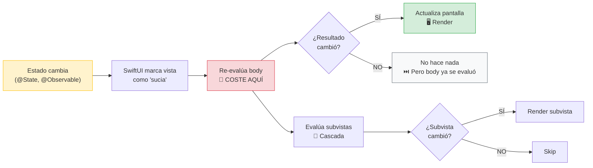
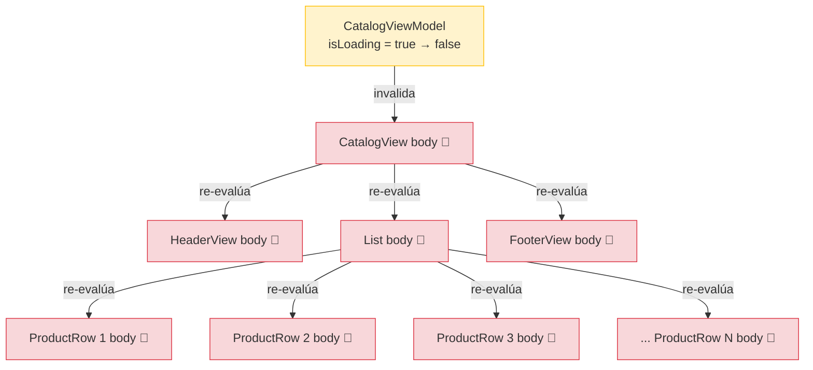
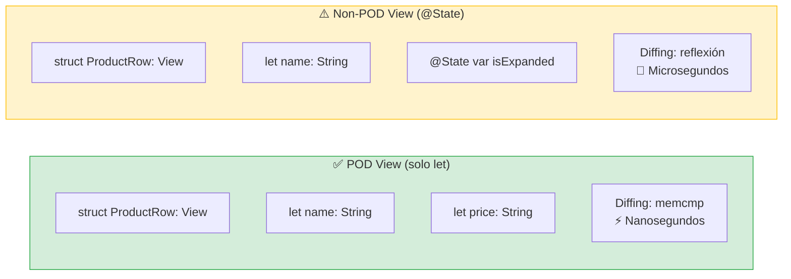

# SwiftUI performance

## Por qué tu vista se re-renderiza 47 veces cuando solo cambió un Bool

SwiftUI promete que "solo actualiza lo que cambió". Pero en la práctica, muchas apps sufren de **invalidation storms**: cascadas de re-renderizados innecesarios que causan frame drops, scroll lento, y consumo excesivo de batería. Esta lección enseña a diagnosticar y prevenir estos problemas con las herramientas y patrones que tu skill de SwiftUI ofrece.

---

## Cómo decide SwiftUI cuándo re-renderizar

Cuando un `@State`, `@Binding`, o propiedad de un `@Observable` cambia, SwiftUI marca la vista como "sucia" y re-evalúa su `body`. Pero antes de re-renderizar en pantalla, SwiftUI compara el resultado nuevo con el anterior (diffing). Si son iguales, no actualiza la pantalla.

El problema es que **evaluar `body` tiene un coste**, incluso si el resultado no cambia. Y si tu vista tiene subvistas, cada subvista también se evalúa. Si una de esas subvistas tiene un `@Observable` con dependencias amplias, la cascada se expande.

### Diagrama: el ciclo de invalidación de SwiftUI



El coste real está en el paso "Re-evalúa body": aunque SwiftUI no actualice la pantalla, ya gastó CPU evaluando el body y todas sus subvistas. En una lista con 50 `ProductRow`, eso son 51 evaluaciones de body por un solo cambio de `isLoading`.

### Diagrama: invalidation storm (el problema real)



Un solo cambio de `isLoading` causó N+4 evaluaciones de body. Si ninguna de esas vistas usa `isLoading`, todas fueron innecesarias. Este es el **invalidation storm** que causa frame drops en apps enterprise con pantallas complejas.

### Diagrama: POD view vs Non-POD view (diffing)



SwiftUI usa dos mecanismos de diffing: `memcmp` (comparación de memoria byte a byte, extremadamente rápido) para vistas POD, y reflexión (introspección de propiedades, más lento) para vistas con property wrappers. En una lista con 1000 items, la diferencia es medible.

**Impacto enterprise:** en un e-commerce con catálogos de 500+ productos y scroll infinito, la diferencia entre POD y Non-POD views es la diferencia entre 60fps fluido y 45fps con micro-stutters. Los usuarios no saben decir "la app tiene frame drops", pero **sienten** que es lenta.

---

## Herramienta de diagnóstico: `Self._printChanges()`

La herramienta más valiosa para depurar re-renderizados innecesarios es `Self._printChanges()`. Es una función de debug que imprime en la consola qué propiedad causó que `body` se evaluara:

```swift
struct CatalogView: View {
    @State private var viewModel = CatalogViewModel()
    
    var body: some View {
        let _ = Self._printChanges() // ← Añadir temporalmente para debug
        
        List(viewModel.products) { product in
            ProductRow(product: product)
        }
    }
}
```

Output en consola:
```
CatalogView: _viewModel changed.
CatalogView: _viewModel changed.
CatalogView: @self changed.
```

Si ves que `_viewModel changed` aparece cuando solo cambió `isLoading` y tu vista no usa `isLoading`, tienes un problema de dependencias demasiado amplias.

**Regla:** añade `Self._printChanges()` cuando sospeches de re-renderizados innecesarios. Quítalo antes de hacer commit. Nunca lo dejes en producción.

---

## Patrón 1: pasa solo lo que la vista necesita

El anti-patrón más común es pasar un objeto `@Observable` completo a una subvista cuando solo necesita una propiedad:

```swift
// ❌ Anti-patrón: ProductRow recibe TODO el ViewModel
struct CatalogView: View {
    @State private var viewModel = CatalogViewModel()
    
    var body: some View {
        List(viewModel.products) { product in
            // ProductRow recibe el ViewModel completo.
            // Cualquier cambio en CUALQUIER propiedad del ViewModel
            // (isLoading, errorMessage, etc.) invalida ProductRow.
            ProductRow(viewModel: viewModel, product: product)
        }
    }
}

struct ProductRow: View {
    let viewModel: CatalogViewModel // ← Dependencia demasiado amplia
    let product: Product
    
    var body: some View {
        Text(product.name)
            .foregroundStyle(viewModel.theme.primaryColor)
    }
}
```

```swift
// ✅ Correcto: ProductRow recibe solo lo que necesita
struct CatalogView: View {
    @State private var viewModel = CatalogViewModel()
    
    var body: some View {
        List(viewModel.products) { product in
            ProductRow(
                product: product,
                primaryColor: viewModel.theme.primaryColor
            )
        }
    }
}

struct ProductRow: View {
    let product: Product
    let primaryColor: Color // ← Solo lo que necesita
    
    var body: some View {
        Text(product.name)
            .foregroundStyle(primaryColor)
    }
}
```

Con `@Observable`, SwiftUI trackea qué propiedades lee cada vista. Pero pasar el objeto completo crea una dependencia implícita que puede sorprenderte cuando añadas nuevas propiedades al ViewModel.

---

## Patrón 2: POD views para diffing rápido

**POD (Plain Old Data) views** son vistas que solo contienen `let` properties de value types, sin property wrappers. SwiftUI usa `memcmp` (comparación de memoria) para estas vistas, que es la forma más rápida de diffing:

```swift
// ✅ POD view: solo `let` de value types → diffing con memcmp (más rápido)
struct ProductRow: View {
    let name: String
    let price: String
    let imageURL: URL
    
    var body: some View {
        HStack {
            AsyncImage(url: imageURL)
            VStack(alignment: .leading) {
                Text(name)
                Text(price)
            }
        }
    }
}
```

```swift
// Non-POD view: tiene @State → diffing más lento (reflexión)
struct ProductRow: View {
    let name: String
    let price: String
    @State private var isExpanded = false // ← Hace que NO sea POD
    
    var body: some View {
        // ...
    }
}
```

### Patrón avanzado: wrapper POD + inner con estado

Si necesitas `@State` pero quieres diffing rápido del padre, envuelve la vista:

```swift
// POD wrapper: diffing rápido
struct ProductRow: View {
    let product: Product // Value type → POD
    
    var body: some View {
        ProductRowContent(product: product) // Delega al inner
    }
}

// Inner con estado: solo se re-evalúa si product cambió
private struct ProductRowContent: View {
    let product: Product
    @State private var isExpanded = false
    
    var body: some View {
        VStack {
            Text(product.name)
            if isExpanded {
                Text(product.description)
            }
        }
        .onTapGesture { isExpanded.toggle() }
    }
}
```

El padre (`ProductRow`) usa `memcmp` para decidir si re-evaluar. Solo si `product` cambió, se re-evalúa `ProductRowContent`.

---

## Patrón 3: evita crear objetos en body

`body` se evalúa cada vez que el estado cambia. Crear objetos dentro de `body` significa crearlos en cada re-renderizado:

```swift
// ❌ Anti-patrón: crea un DateFormatter en cada evaluación de body
struct OrderRow: View {
    let order: Order
    
    var body: some View {
        let formatter = DateFormatter()      // ← Se crea CADA VEZ
        formatter.dateStyle = .long
        
        return Text(formatter.string(from: order.date))
    }
}

// ✅ Correcto: formatter estático, se crea una sola vez
struct OrderRow: View {
    let order: Order
    
    private static let dateFormatter: DateFormatter = {
        let f = DateFormatter()
        f.dateStyle = .long
        return f
    }()
    
    var body: some View {
        Text(Self.dateFormatter.string(from: order.date))
    }
}
```

Lo mismo aplica para ordenamientos, filtros, y transformaciones de datos:

```swift
// ❌ Anti-patrón: ordena el array en cada evaluación de body
var body: some View {
    List(products.sorted { $0.name < $1.name }) { product in
        ProductRow(product: product)
    }
}

// ✅ Correcto: ordena en el ViewModel, body solo renderiza
@Observable
@MainActor
final class CatalogViewModel {
    private(set) var products: [Product] = []
    
    var sortedProducts: [Product] {
        products.sorted { $0.name < $1.name }
    }
}

// En la vista:
var body: some View {
    List(viewModel.sortedProducts) { product in
        ProductRow(product: product)
    }
}
```

---

## Patrón 4: evita actualizaciones de estado redundantes

SwiftUI **no compara valores antes de triggear actualizaciones**. Si asignas el mismo valor, se re-renderiza igualmente:

```swift
// ❌ Triggea re-renderizado incluso si el valor no cambió
.onReceive(publisher) { value in
    self.currentValue = value // Siempre triggea body, incluso si value == currentValue
}

// ✅ Solo actualiza si el valor es diferente
.onReceive(publisher) { value in
    if self.currentValue != value {
        self.currentValue = value
    }
}
```

Esto es especialmente importante en **hot paths**: código que se ejecuta frecuentemente, como scroll handlers o gesture recognizers:

```swift
// ❌ Hot path: actualiza estado en CADA posición de scroll
.onPreferenceChange(ScrollOffsetKey.self) { offset in
    shouldShowTitle = offset.y <= -32 // Se asigna en cada frame de scroll
}

// ✅ Solo actualiza cuando cruza el umbral
.onPreferenceChange(ScrollOffsetKey.self) { offset in
    let shouldShow = offset.y <= -32
    if shouldShow != shouldShowTitle {
        shouldShowTitle = shouldShow // Solo 2 actualizaciones: al cruzar y al volver
    }
}
```

---

## Patrón 5: LazyVStack para listas grandes

`VStack` crea **todas** las subvistas inmediatamente, incluso las que no son visibles. Para listas grandes, esto significa crear cientos de vistas al instante:

```swift
// ❌ Crea 1000 ProductRows inmediatamente
ScrollView {
    VStack {
        ForEach(viewModel.products) { product in
            ProductRow(product: product)
        }
    }
}

// ✅ Crea ProductRows bajo demanda (solo las visibles)
ScrollView {
    LazyVStack {
        ForEach(viewModel.products) { product in
            ProductRow(product: product)
        }
    }
}
```

`LazyVStack` solo crea las vistas que son visibles en pantalla (más un pequeño buffer). A medida que el usuario scrollea, crea las nuevas y descarta las que salen de pantalla.

**Cuándo usar cada uno:**

| Contenedor | Cuándo usarlo |
|-----------|---------------|
| `VStack` / `HStack` | Pocos items (< 20), todos visibles o casi |
| `LazyVStack` / `LazyHStack` | Muchos items, scroll, items fuera de pantalla |
| `List` | Listas con separadores, swipe actions, edición |

---

## Patrón 6: Equatable views para casos especiales

Para vistas con `body` muy costoso, puedes conformar `Equatable` para controlar cuándo se re-evalúa:

```swift
struct ExpensiveChartView: View, Equatable {
    let data: [DataPoint]
    let title: String
    
    static func == (lhs: Self, rhs: Self) -> Bool {
        // Solo re-renderizar si los datos cambian, ignorar el título
        lhs.data == rhs.data
    }
    
    var body: some View {
        // Renderizado costoso del gráfico
        Chart(data) { point in
            LineMark(x: .value("X", point.x), y: .value("Y", point.y))
        }
    }
}

// Uso:
ExpensiveChartView(data: chartData, title: "Sales")
    .equatable() // ← Activa la comparación custom
```

**Precaución:** si añades nuevas propiedades a la vista y olvidas actualizar `==`, la vista no se re-renderizará cuando debería. Usa este patrón solo cuando tengas un problema de performance medido, no como optimización prematura.

---

## Diagnóstico con Instruments

Cuando `Self._printChanges()` no es suficiente, usa **Instruments** con el template de SwiftUI:

1. Abre tu proyecto en Xcode.
2. Product → Profile (⌘I).
3. Selecciona el template "SwiftUI".
4. Ejecuta la app y reproduce el escenario lento.
5. Instruments muestra: cuántas veces se evaluó cada `body`, cuánto tiempo tardó cada evaluación, y qué causó la invalidación.

Instruments es la herramienta definitiva para performance. `Self._printChanges()` te dice **qué** se re-renderiza; Instruments te dice **cuánto cuesta** cada re-renderizado.

---

## Checklist de performance

Antes de considerar una vista "terminada":

- [ ] **¿`body` es puro?** No tiene side effects, no crea objetos pesados, no ordena arrays.
- [ ] **¿Pasa solo lo necesario a subvistas?** No pasa el ViewModel completo si solo necesita una propiedad.
- [ ] **¿Usa `LazyVStack` para listas largas?** `VStack` con ForEach de más de 20 items es sospechoso.
- [ ] **¿Los hot paths (scroll, gestures) verifican antes de actualizar estado?** No asigna el mismo valor repetidamente.
- [ ] **¿Los formatters son estáticos?** `DateFormatter`, `NumberFormatter`, etc. no se crean en `body`.
- [ ] **¿@State es `private`?** Si no es `private`, probablemente debería ser `let` o `@Binding`.
- [ ] **¿Las vistas de lista son POD?** Solo `let` de value types para diffing rápido.

---

**Anterior:** [SwiftUI state moderno ←](05-swiftui-state-moderno.md) · **Siguiente:** [Composición avanzada →](07-composicion-avanzada.md)
