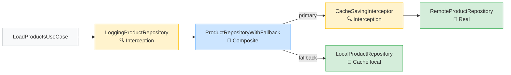
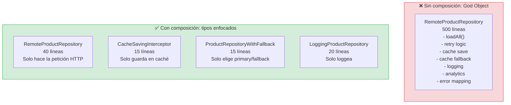

# Composición avanzada

## Decorator, Composite e Interception: los tres patrones que cambian cómo piensas sobre el código

En la Etapa 3 usamos el patrón **Decorator** para añadir caché sin modificar el repositorio remoto. Ese fue solo el primer paso. En esta lección cubrimos los tres patrones de composición que te permiten añadir comportamiento a tu sistema **sin modificar código existente**: Decorator, Composite e Interception. Juntos, son la base del Open/Closed Principle en la práctica.

---

## Visión general: los tres patrones de composición

Antes de entrar en cada patrón, este diagrama muestra cómo se relacionan y cuándo usar cada uno:

```mermaid
graph TD
    subgraph Decorator["🎨 Decorator"]
        direction LR
        D1["Envuelve UN objeto"] --> D2["Modifica el flujo<br/>(puede cambiar el resultado)"]
        D2 --> D3["Ejemplo: CachedProductRepository<br/>Si falla la red, devuelve caché"]
    end

    subgraph Composite["🧩 Composite"]
        direction LR
        C1["Combina MÚLTIPLES objetos"] --> C2["Aplica una estrategia<br/>(primario → fallback)"]
        C2 --> C3["Ejemplo: ProductRepositoryWithFallback<br/>Remoto → Local → Backup"]
    end

    subgraph Interception["🔍 Interception"]
        direction LR
        I1["Envuelve UN objeto"] --> I2["Añade side effects<br/>(NO cambia el resultado)"]
        I2 --> I3["Ejemplo: CacheSavingInterceptor<br/>Guarda en caché sin modificar respuesta"]
    end

    style Decorator fill:#d4edda,stroke:#28a745
    style Composite fill:#cce5ff,stroke:#007bff
    style Interception fill:#fff3cd,stroke:#ffc107
```



Y así es como se combinan en el Composition Root de nuestro proyecto:



El `LoadProductsUseCase` no sabe nada de esta cadena. Solo sabe que habla con algo que conforma `ProductRepository`. Toda la composición es **invisible** para la lógica de negocio.

---

## El problema que resuelven

Imagina que necesitas añadir estas funcionalidades al flujo de carga de productos:

1. **Caché**: si la red falla, servir datos guardados (ya lo hacemos con Decorator).
2. **Fallback**: intentar primero el remoto; si falla, intentar el caché; si falla, intentar un servidor backup.
3. **Logging**: registrar cada petición y su resultado para diagnóstico.
4. **Analytics**: medir el tiempo de cada petición.
5. **Retry**: reintentar automáticamente si la petición falla por timeout.

Si añades toda esta lógica dentro del `RemoteProductRepository`, terminas con un tipo de 500 líneas que hace demasiadas cosas. Si la añades en el caso de uso, el caso de uso deja de ser "lógica de negocio" y se convierte en "lógica de infraestructura disfrazada".

La solución es **componer** tipos pequeños y enfocados que envuelven al repositorio original.

### Diagrama: sin composición vs con composición



Cada tipo tiene **una sola responsabilidad**. Si el logging cambia, solo tocas `LoggingProductRepository`. Si la estrategia de fallback cambia, solo tocas `ProductRepositoryWithFallback`. El resto del sistema no se entera.

**En el trabajo enterprise diario:** cuando un PM dice "añade analytics a la carga de productos", tu respuesta no es "voy a modificar el repositorio" (que puede romper tests existentes). Tu respuesta es "voy a crear un nuevo decorator de 20 líneas y añadirlo al Composition Root". Cero riesgo de regresión.

---

## Patrón 1: Decorator (ya lo conoces)

El Decorator envuelve un objeto y añade comportamiento antes o después de delegarle la operación. Es lo que hicimos con `CachedProductRepository`:

```swift
// El decorador implementa el mismo protocolo que el decorado
final class CachedProductRepository: ProductRepository, @unchecked Sendable {
    private let remote: any ProductRepository  // El decorado
    private let store: any ProductStore
    
    func loadAll() async throws -> [Product] {
        do {
            let products = try await remote.loadAll() // Delega al decorado
            try? await store.save(products, timestamp: Date())
            return products
        } catch {
            // Comportamiento añadido: buscar en caché
            if let cached = try? await store.load(), isValid(cached.timestamp) {
                return cached.products
            }
            throw error
        }
    }
}
```

El poder del Decorator es que el `LoadProductsUseCase` no sabe si está hablando con un repositorio real, un repositorio cacheado, o un repositorio con logging. Solo sabe que habla con algo que conforma `ProductRepository`.

### Decorator de logging

```swift
final class LoggingProductRepository: ProductRepository, Sendable {
    private let decoratee: any ProductRepository
    private let logger: any Logger
    
    init(decoratee: any ProductRepository, logger: any Logger) {
        self.decoratee = decoratee
        self.logger = logger
    }
    
    func loadAll() async throws -> [Product] {
        logger.log("ProductRepository.loadAll() started")
        let startTime = CFAbsoluteTimeGetCurrent()
        
        do {
            let products = try await decoratee.loadAll()
            let duration = CFAbsoluteTimeGetCurrent() - startTime
            logger.log("ProductRepository.loadAll() succeeded in \(duration)s — \(products.count) products")
            return products
        } catch {
            let duration = CFAbsoluteTimeGetCurrent() - startTime
            logger.log("ProductRepository.loadAll() failed in \(duration)s — \(error)")
            throw error
        }
    }
}
```

Y puedes apilar decoradores:

```swift
// Composición en el Composition Root:
let remote = RemoteProductRepository(httpClient: httpClient, baseURL: baseURL)
let cached = CachedProductRepository(remote: remote, store: store)
let logged = LoggingProductRepository(decoratee: cached, logger: consoleLogger)

// El use case recibe el decorador más externo
let useCase = LoadProductsUseCase(repository: logged)
```

El flujo es: `logged` → `cached` → `remote`. Cada capa añade comportamiento sin que las otras lo sepan.

---

## Patrón 2: Composite (fallback con múltiples fuentes)

El Composite implementa el mismo protocolo, pero en lugar de envolver un solo objeto, combina **múltiples** objetos con una estrategia:

```swift
final class ProductRepositoryWithFallback: ProductRepository, Sendable {
    private let primary: any ProductRepository
    private let fallback: any ProductRepository
    
    init(primary: any ProductRepository, fallback: any ProductRepository) {
        self.primary = primary
        self.fallback = fallback
    }
    
    func loadAll() async throws -> [Product] {
        do {
            return try await primary.loadAll()
        } catch {
            return try await fallback.loadAll()
        }
    }
}
```

### Uso real: remoto → caché → servidor backup

```swift
let remote = RemoteProductRepository(httpClient: httpClient, baseURL: productionURL)
let backup = RemoteProductRepository(httpClient: httpClient, baseURL: backupURL)
let local = LocalProductRepository(store: fileStore)

// Intenta remoto primero, luego local, luego backup
let repository = ProductRepositoryWithFallback(
    primary: remote,
    fallback: ProductRepositoryWithFallback(
        primary: local,
        fallback: backup
    )
)
```

El Composite es recursivo: puedes anidar composites dentro de composites. Cada nivel no sabe si su primario/fallback es un repositorio real, un decorador, u otro composite.

### Test del Composite

```swift
import XCTest
@testable import StackMyArchitecture

final class ProductRepositoryWithFallbackTests: XCTestCase {
    
    func test_loadAll_on_primary_success_returns_primary_products() async throws {
        let primaryProducts = [makeProduct(id: "1")]
        let fallbackProducts = [makeProduct(id: "2")]
        let sut = makeSUT(
            primary: .success(primaryProducts),
            fallback: .success(fallbackProducts)
        )
        
        let result = try await sut.loadAll()
        
        XCTAssertEqual(result, primaryProducts)
    }
    
    func test_loadAll_on_primary_failure_returns_fallback_products() async throws {
        let fallbackProducts = [makeProduct(id: "2")]
        let sut = makeSUT(
            primary: .failure(.connectivity),
            fallback: .success(fallbackProducts)
        )
        
        let result = try await sut.loadAll()
        
        XCTAssertEqual(result, fallbackProducts)
    }
    
    func test_loadAll_on_both_failure_throws_fallback_error() async {
        let sut = makeSUT(
            primary: .failure(.connectivity),
            fallback: .failure(.invalidData)
        )
        
        do {
            _ = try await sut.loadAll()
            XCTFail("Expected error")
        } catch let error as CatalogError {
            XCTAssertEqual(error, .invalidData) // El error del fallback
        } catch {
            XCTFail("Unexpected error: \(error)")
        }
    }
    
    // MARK: - Helpers
    
    private func makeSUT(
        primary: Result<[Product], CatalogError>,
        fallback: Result<[Product], CatalogError>
    ) -> ProductRepositoryWithFallback {
        ProductRepositoryWithFallback(
            primary: ProductRepositoryStub(result: primary),
            fallback: ProductRepositoryStub(result: fallback)
        )
    }
    
    private func makeProduct(id: String) -> Product {
        Product(
            id: id, name: "Test",
            price: Price(amount: 10, currency: "EUR"),
            imageURL: URL(string: "https://example.com/\(id).png")!
        )
    }
}
```

---

## Patrón 3: Interception (efectos secundarios sin modificar la cadena)

Interception es un patrón que inyecta **side effects** (efectos secundarios) en la composición de la aplicación. A diferencia del Decorator, que modifica el flujo (caché, fallback), Interception ejecuta código adicional **sin cambiar el resultado**:

```swift
final class CacheSavingInterceptor: ProductRepository, Sendable {
    private let decoratee: any ProductRepository
    private let cache: any ProductStore
    
    init(decoratee: any ProductRepository, cache: any ProductStore) {
        self.decoratee = decoratee
        self.cache = cache
    }
    
    func loadAll() async throws -> [Product] {
        let products = try await decoratee.loadAll()
        // Side effect: guardar en caché (no modifica el resultado)
        try? await cache.save(products, timestamp: Date())
        return products
    }
}
```

La diferencia sutil con el Decorator de caché:

- **Decorator** (CachedProductRepository): modifica el flujo. Si el remoto falla, busca en caché. El resultado puede venir del caché.
- **Interception** (CacheSavingInterceptor): no modifica el flujo. Siempre devuelve lo que el remoto devuelve. Solo guarda en caché como efecto secundario.

Puedes usar Interception para:
- Guardar datos en caché después de una carga exitosa.
- Enviar analytics después de una operación.
- Invalidar caché después de una escritura.
- Loggear sin modificar el resultado.

### Composición con Interception

```swift
// Composition Root con Interception
let remote = RemoteProductRepository(httpClient: httpClient, baseURL: baseURL)

// Interceptor que guarda en caché después de cada carga exitosa
let withCaching = CacheSavingInterceptor(decoratee: remote, cache: fileStore)

// Fallback al caché local si la red falla
let withFallback = ProductRepositoryWithFallback(
    primary: withCaching,
    fallback: LocalProductRepository(store: fileStore)
)

// Logging de toda la operación
let withLogging = LoggingProductRepository(decoratee: withFallback, logger: logger)

let useCase = LoadProductsUseCase(repository: withLogging)
```

El flujo resultante:
1. `LoggingProductRepository` registra el inicio.
2. `ProductRepositoryWithFallback` intenta el primario.
3. `CacheSavingInterceptor` llama a `RemoteProductRepository`.
4. Si tiene éxito, guarda en caché y devuelve los productos.
5. Si falla, `ProductRepositoryWithFallback` intenta `LocalProductRepository`.
6. `LoggingProductRepository` registra el resultado final.

Todo esto sin que `LoadProductsUseCase` sepa nada de caché, logging, o fallback.

---

## Composition Root testeable

El Composition Root es el lugar donde se ensambla toda la cadena de composición. En nuestro proyecto, vive en el módulo Main (el punto de entrada de la app). Siguiendo el patrón del PDF de "Mejores prácticas", debemos poder **testear** que la composición es correcta:

```swift
@MainActor
final class CompositionRootTests: XCTestCase {
    
    func test_catalogView_is_composed_with_correct_dependencies() {
        let root = AppCompositionRoot(
            baseURL: URL(string: "https://api.example.com")!,
            cacheDirectory: FileManager.default.temporaryDirectory
        )
        
        let catalogView = root.makeCatalogView(onProductSelected: { _ in })
        
        // Verificar que la composición es correcta
        XCTAssertNotNil(catalogView)
    }
}
```

Para un test más profundo, podemos verificar que la cadena de composición tiene el comportamiento esperado:

```swift
func test_catalogView_uses_cached_data_on_network_failure() async throws {
    let root = AppCompositionRoot(
        baseURL: URL(string: "https://unreachable.example.com")!,
        cacheDirectory: testCacheDirectory
    )
    
    // Pre-poblar el caché con datos de prueba
    let store = FileProductStore(directory: testCacheDirectory)
    try await store.save(makeProducts(), timestamp: Date())
    
    let catalogView = root.makeCatalogView(onProductSelected: { _ in })
    
    // El ViewModel debería cargar datos del caché
    // porque el servidor no es alcanzable
    await catalogView.viewModel.loadProducts()
    
    XCTAssertFalse(catalogView.viewModel.products.isEmpty,
        "Should load from cache when network fails")
}
```

---

## Cuándo usar cada patrón

| Patrón | Qué hace | Ejemplo |
|--------|---------|---------|
| **Decorator** | Modifica el flujo (puede cambiar el resultado) | Caché con fallback, retry con delay |
| **Composite** | Combina múltiples fuentes con estrategia | Primario → fallback → backup |
| **Interception** | Añade side effects sin cambiar el resultado | Guardar en caché, analytics, logging |

Los tres comparten una propiedad esencial: **implementan el mismo protocolo que el objeto que envuelven**. Eso los hace **transparentes** para el código que los usa. El caso de uso no sabe si está hablando con un repositorio real, un decorador, un composite, o una cadena de interceptores. Solo sabe que habla con algo que conforma `ProductRepository`.

---

## Resumen

La composición avanzada te permite:

- Añadir caché, logging, analytics, retry, y fallback **sin modificar** el código de producción existente.
- Cambiar la estrategia de composición **solo en el Composition Root**, sin tocar los casos de uso ni los ViewModels.
- Testear cada capa de forma independiente con tests unitarios simples.
- Cumplir el Open/Closed Principle: el código está **abierto** a extensión (nuevos decoradores) pero **cerrado** a modificación (no tocas el código existente).

---

**Anterior:** [SwiftUI performance ←](06-swiftui-performance.md) · **Siguiente:** [Memory leaks y diagnóstico →](08-memory-leaks-y-diagnostico.md)
