# Memory leaks y diagnóstico

## Las herramientas que separan al profesional del aficionado

Un memory leak silencioso es peor que un crash. El crash te dice "algo está mal". El memory leak no dice nada: la app funciona, los tests pasan, el usuario no se queja... hasta que la app consume 2GB de RAM y el sistema operativo la mata sin aviso. El usuario ve "la app se cierra sola" y no puede reproducirlo.

En esta lección integramos tres herramientas de diagnóstico que todo proyecto profesional necesita: **trackForMemoryLeaks** en tests, **Thread Sanitizer** en CI, y **Instruments** para profiling.

---

## Diagrama: anatomía de un memory leak (retain cycle)

```mermaid
graph LR
    subgraph RetainCycle["💥 Retain Cycle"]
        direction LR
        A["ViewModel<br/>retainCount: 1"] -->|"strong ref<br/>onComplete closure"| B["Closure<br/>{ self.update() }"]
        B -->|"strong ref<br/>captures self"| A
    end

    subgraph Normal["✅ Sin Retain Cycle"]
        direction LR
        C["ViewModel<br/>retainCount: 0 → dealloc"] -.->|"weak ref<br/>[weak self]"| D["Closure<br/>{ self?.update() }"]
        D -->|"weak ref"| C
    end

    style RetainCycle fill:#f8d7da,stroke:#dc3545
    style Normal fill:#d4edda,stroke:#28a745
```



En el ciclo de retención (arriba), el ViewModel retiene el closure y el closure retiene el ViewModel. Ninguno de los dos puede desalocarse porque cada uno mantiene al otro vivo. El resultado: la memoria crece con cada navegación, y después de 50 veces de entrar y salir de la pantalla, la app consume 500MB de RAM.

Con `[weak self]` (abajo), el closure no retiene al ViewModel. Cuando la vista desaparece y el ViewModel ya no tiene otros retenedores, se desaloca normalmente. El closure queda con una referencia `nil` y no hace nada.

### Diagrama: cómo trackForMemoryLeaks detecta el problema

```mermaid
sequenceDiagram
    participant Test as test_loadProducts()
    participant SUT as makeSUT()
    participant Track as trackForMemoryLeaks
    participant Teardown as addTeardownBlock

    Test->>SUT: Crea ViewModel + Repository
    SUT->>Track: trackForMemoryLeaks(viewModel)
    Track->>Teardown: addTeardownBlock { [weak viewModel] in<br/>XCTAssertNil(viewModel) }
    SUT-->>Test: Devuelve (viewModel, repository)
    
    Note over Test: Test ejecuta sus asserts...
    Note over Test: Test TERMINA<br/>Variables locales salen del scope
    
    alt Sin retain cycle
        Note over SUT: viewModel.retainCount → 0<br/>✅ Se desaloca
        Teardown->>Teardown: viewModel == nil<br/>✅ XCTAssertNil PASA
    end
    
    alt Con retain cycle
        Note over SUT: viewModel.retainCount → 1<br/>❌ Closure lo retiene
        Teardown->>Teardown: viewModel != nil<br/>💥 XCTAssertNil FALLA<br/>"Potential memory leak"
    end
```



Este diagrama muestra exactamente por qué `trackForMemoryLeaks` funciona: el teardown se ejecuta **después** de que las variables locales del test se han destruido. Si el objeto sigue vivo, es porque algo lo retiene indebidamente.

---

## trackForMemoryLeaks: detección automática en cada test

Ya presentamos este helper en la lección de testing concurrente. Aquí lo detallamos con todos los casos de uso.

### La implementación

```swift
// StackMyArchitectureTests/Helpers/XCTestCase+MemoryLeakTracking.swift

import XCTest

extension XCTestCase {
    func trackForMemoryLeaks(
        _ instance: AnyObject,
        file: StaticString = #filePath,
        line: UInt = #line
    ) {
        addTeardownBlock { [weak instance] in
            XCTAssertNil(
                instance,
                "Instance should have been deallocated. Potential memory leak.",
                file: file,
                line: line
            )
        }
    }
}
```

### Cómo funciona paso a paso

1. **El test crea objetos** en `makeSUT()` y los devuelve.
2. **`trackForMemoryLeaks`** registra un bloque que se ejecuta DESPUÉS de que el test termine.
3. **El test termina**, las variables locales salen del scope. Si no hay retain cycles, los objetos se desalocan.
4. **El teardown block se ejecuta.** Verifica que las referencias `weak` son `nil`. Si alguna no lo es, hay un retain cycle → el test falla con un mensaje claro.

### El truco clave: `[weak instance]`

Sin `[weak instance]`, el bloque captura el objeto fuertemente. Eso lo mantiene vivo para siempre, y el assert nunca falla. La captura débil permite que el objeto se desaloque si no hay otros retenedores:

```swift
// ❌ INCORRECTO: captura fuerte, el objeto nunca se desaloca
addTeardownBlock {
    XCTAssertNil(instance) // Siempre falla: el bloque retiene instance
}

// ✅ CORRECTO: captura débil, el objeto se desaloca si no hay retain cycle
addTeardownBlock { [weak instance] in
    XCTAssertNil(instance) // Solo falla si hay un retain cycle real
}
```

### Aplicación a todos los makeSUT del proyecto

Todo `makeSUT` que cree objetos de referencia (clases, actors) debe llamar a `trackForMemoryLeaks`. Los structs no necesitan tracking porque son value types sin identidad de referencia.

**Etapa 1 — RemoteAuthGatewayTests:**

```swift
private func makeSUT(
    data: Data = Data(),
    statusCode: Int = 200,
    file: StaticString = #filePath,
    line: UInt = #line
) throws -> (sut: RemoteAuthGateway, client: HTTPClientStub) {
    let client = HTTPClientStub(data: data, statusCode: statusCode)
    let sut = RemoteAuthGateway(httpClient: client, baseURL: baseURL)
    
    trackForMemoryLeaks(client, file: file, line: line)
    // sut es un struct → no necesita tracking
    
    return (sut, client)
}
```

**Etapa 2 — CatalogViewModelTests:**

```swift
@MainActor
private func makeSUT(
    result: Result<[Product], CatalogError> = .success([]),
    file: StaticString = #filePath,
    line: UInt = #line
) -> (sut: CatalogViewModel, repository: ProductRepositoryStub) {
    let repository = ProductRepositoryStub(result: result)
    let useCase = LoadProductsUseCase(repository: repository)
    let sut = CatalogViewModel(loadProducts: useCase)
    
    trackForMemoryLeaks(sut, file: file, line: line)
    trackForMemoryLeaks(repository, file: file, line: line)
    
    return (sut, repository)
}
```

**Etapa 3 — CachedProductRepositoryTests:**

```swift
private func makeSUT(
    remoteResult: Result<[Product], CatalogError> = .success([]),
    cachedProducts: CachedProducts? = nil,
    maxAge: TimeInterval = 300,
    currentDate: @escaping @Sendable () -> Date = { Date() },
    file: StaticString = #filePath,
    line: UInt = #line
) -> (sut: CachedProductRepository, remote: ProductRepositoryStub, store: ProductStoreSpy) {
    let remote = ProductRepositoryStub(result: remoteResult)
    let store = ProductStoreSpy(cachedProducts: cachedProducts)
    let sut = CachedProductRepository(
        remote: remote, store: store,
        maxAge: maxAge, currentDate: currentDate
    )
    
    trackForMemoryLeaks(remote, file: file, line: line)
    trackForMemoryLeaks(store, file: file, line: line)
    // sut es una class → trackear
    trackForMemoryLeaks(sut, file: file, line: line)
    
    return (sut, remote, store)
}
```

### Cuándo un memory leak es real

Si `trackForMemoryLeaks` falla, busca **retain cycles** en el código del SUT:

```swift
// ❌ Retain cycle: el closure captura self fuertemente
class MyLoader {
    var onComplete: (() -> Void)?
    
    func load() {
        someAsyncOperation { result in
            self.onComplete?() // self retiene onComplete, onComplete retiene self
        }
    }
}

// ✅ Sin retain cycle: captura débil
class MyLoader {
    var onComplete: (() -> Void)?
    
    func load() {
        someAsyncOperation { [weak self] result in
            self?.onComplete?()
        }
    }
}
```

Con `async/await`, los retain cycles son menos comunes porque no hay closures de completion handler. Pero siguen siendo posibles con `Task {}` y closures almacenados.

---

## Thread Sanitizer: detectar data races automáticamente

Thread Sanitizer (TSan) es una herramienta de LLVM que detecta data races en tiempo de ejecución. No detecta todos los data races posibles, pero detecta los que ocurren durante la ejecución de tus tests.

### Diagrama: cómo Thread Sanitizer detecta un data race

```mermaid
sequenceDiagram
    participant T1 as Thread A<br/>(Background)
    participant MEM as Memoria<br/>var token: String?
    participant T2 as Thread B<br/>(Main)
    participant TSan as Thread Sanitizer

    T1->>MEM: WRITE token = "abc123"
    Note over MEM: 📝 TSan registra:<br/>Thread A escribió en 0x7ff...
    
    T2->>MEM: READ token
    Note over MEM: 📝 TSan registra:<br/>Thread B leyó de 0x7ff...
    
    TSan->>TSan: ¿Mismo address?<br/>¿Accesos simultáneos?<br/>¿Al menos uno es WRITE?
    
    Note over TSan: 💥 DATA RACE DETECTADO<br/>Thread A: WRITE at 0x7ff...<br/>  → UserSession.swift:12<br/>Thread B: READ at 0x7ff...<br/>  → LoginViewModel.swift:45
    
    TSan-->>T1: Stack trace del WRITE
    TSan-->>T2: Stack trace del READ
```



TSan instrumenta **cada acceso a memoria** durante la ejecución. Por eso ralentiza 2-10x: está registrando y comparando millones de accesos. Pero cuando detecta un data race, te da las dos ubicaciones exactas del problema. Eso vale más que días de debugging manual.

### Diagrama: pipeline CI completo con diagnósticos

```mermaid
flowchart LR
    PR["Pull Request<br/>abierto"] --> UNIT["1. Unit Tests<br/>⚡ Rápidos<br/>~30 seg"]
    UNIT --> RANDOM["2. Tests en<br/>orden aleatorio<br/>~30 seg"]
    RANDOM --> TSAN["3. Thread Sanitizer<br/>🐌 Lento (2-10x)<br/>~2 min"]
    TSAN --> STRICT["4. Strict Concurrency<br/>SWIFT_STRICT_CONCURRENCY=complete<br/>~1 min"]
    STRICT --> MERGE{"¿Todo<br/>verde?"}
    MERGE -->|SÍ| OK["✅ Merge<br/>a main"]
    MERGE -->|NO| BLOCK["❌ Bloqueado<br/>Arreglar primero"]

    style PR fill:#f8f9fa,stroke:#6c757d
    style UNIT fill:#d4edda,stroke:#28a745
    style RANDOM fill:#d4edda,stroke:#28a745
    style TSAN fill:#fff3cd,stroke:#ffc107
    style STRICT fill:#cce5ff,stroke:#007bff
    style OK fill:#d4edda,stroke:#28a745
    style BLOCK fill:#f8d7da,stroke:#dc3545
```



**En enterprise:** este pipeline se ejecuta automáticamente en cada PR. Ningún código llega a `main` sin pasar las 4 puertas. El paso 3 (TSan) es el más lento pero el más valioso: detecta bugs que ningún test unitario puede encontrar. El paso 4 (strict concurrency) garantiza que el código está preparado para Swift 6.

### Cómo activar Thread Sanitizer

1. En Xcode: Edit Scheme → Test → Diagnostics → Thread Sanitizer ✅
2. O en xcodebuild:

```bash
xcodebuild test \
    -scheme StackMyArchitecture \
    -destination 'platform=iOS Simulator,name=iPhone 16' \
    -enableThreadSanitizer YES
```

### Cuándo activarlo

**No lo dejes activado todo el tiempo.** Thread Sanitizer ralentiza la ejecución significativamente (2-10x más lento). La estrategia recomendada:

- **En desarrollo local:** desactivado por defecto. Actívalo manualmente cuando sospeches de un data race.
- **En CI:** activado en un scheme separado llamado "CI" que se ejecuta antes de mergear a main.

### Configurar un scheme CI con Thread Sanitizer

```bash
# En tu pipeline de CI (GitHub Actions, por ejemplo):
- name: Run tests with Thread Sanitizer
  run: |
    xcodebuild test \
      -scheme CI \
      -destination 'platform=iOS Simulator,name=iPhone 16' \
      -enableThreadSanitizer YES \
      -resultBundlePath TestResults.xcresult
```

### Qué hacer cuando Thread Sanitizer detecta un data race

TSan te muestra dos stack traces:
1. El hilo que estaba **leyendo** la ubicación de memoria.
2. El hilo que estaba **escribiendo** la misma ubicación.

La solución típica es una de estas:
- Convertir la clase en un **actor** (preferido).
- Marcar la clase con **@MainActor** si solo necesita acceso desde la UI.
- Usar un **DispatchQueue** para serializar accesos (menos preferido).

### Ejemplo real: data race en URLProtocolStub

En tu PDF de "Mejores prácticas" (pág. 335), encontraste un data race en `URLProtocolStub`: un hilo de background leía `stub` mientras el hilo principal de un test escribía en la misma variable. La solución fue asegurarse de que todas las operaciones URL terminaran antes de que el test retornara.

Patrón para evitar esto en tests de red:

```swift
func test_get_performs_request_to_url() async throws {
    let url = URL(string: "https://example.com")!
    let (sut, _) = makeSUT()
    
    // Usar await para garantizar que la operación termina
    // antes de que el test retorne
    _ = try await sut.get(from: url)
    
    // Si la operación termina, no hay hilos huérfanos
}
```

---

## Instruments: profiling de memoria y CPU

Instruments es la herramienta definitiva para problemas de performance y memoria que no se detectan con tests unitarios.

### Memory Graph Debugger (en Xcode)

Para investigar memory leaks en tiempo real:

1. Ejecuta la app en el simulador.
2. En Xcode, Debug Navigator → Memory.
3. Pulsa el botón "Debug Memory Graph" (⌘⇧M).
4. Xcode muestra todos los objetos vivos y sus relaciones de retención.
5. Los objetos con un ⚠️ son posibles leaks.

### Allocations Instrument

Para medir cuánta memoria usa tu app:

1. Product → Profile (⌘I).
2. Selecciona "Allocations".
3. Ejecuta la app y reproduce el escenario.
4. Instruments muestra cada allocación, su tamaño, y si fue liberada.

### Leaks Instrument

Para detectar memory leaks que el Memory Graph no muestra:

1. Product → Profile (⌘I).
2. Selecciona "Leaks".
3. Ejecuta la app durante unos minutos.
4. Instruments marca los objetos que deberían haberse liberado pero siguen vivos.

---

## Integración en el pipeline de CI

Un pipeline completo de diagnóstico incluye:

```yaml
# .github/workflows/ci.yml (conceptual)
name: CI

on:
  pull_request:
    branches: [main]

jobs:
  test:
    runs-on: macos-14
    steps:
      - uses: actions/checkout@v4
      
      # 1. Tests unitarios con ejecución aleatoria
      - name: Unit Tests
        run: |
          xcodebuild test \
            -scheme StackMyArchitecture \
            -destination 'platform=iOS Simulator,name=iPhone 16' \
            -parallel-testing-enabled YES
      
      # 2. Tests con Thread Sanitizer
      - name: Thread Sanitizer
        run: |
          xcodebuild test \
            -scheme CI \
            -destination 'platform=iOS Simulator,name=iPhone 16' \
            -enableThreadSanitizer YES
      
      # 3. Verificación de reglas de dependencia
      - name: Dependency Rules
        run: bash scripts/check-dependency-rules.sh
      
      # 4. Strict concurrency check
      - name: Build with strict concurrency
        run: |
          xcodebuild build \
            -scheme StackMyArchitecture \
            -destination 'platform=iOS Simulator,name=iPhone 16' \
            SWIFT_STRICT_CONCURRENCY=complete
```

---

## Checklist de diagnóstico

Antes de mergear cualquier PR:

- [ ] **¿Todos los `makeSUT` usan `trackForMemoryLeaks`?** Para todo objeto de referencia creado.
- [ ] **¿Los tests pasan con Thread Sanitizer?** Ejecutar con el scheme CI al menos antes de mergear.
- [ ] **¿Los tests pasan en orden aleatorio?** Configurar randomize execution order en el scheme.
- [ ] **¿No hay closures de completion handler que capturen self fuertemente?** Preferir `async/await` sobre closures.
- [ ] **¿Los objetos @unchecked Sendable tienen justificación documentada?** Cada uso debe tener un comentario explicativo.

---

## Resumen

| Herramienta | Qué detecta | Cuándo usarla |
|-------------|-------------|---------------|
| **trackForMemoryLeaks** | Retain cycles en objetos de test | En todo `makeSUT` de todo test |
| **Thread Sanitizer** | Data races en tiempo de ejecución | CI pipeline antes de merge |
| **Memory Graph Debugger** | Objetos retenidos inesperadamente | Debug manual en Xcode |
| **Allocations Instrument** | Consumo de memoria excesivo | Profiling pre-release |
| **Leaks Instrument** | Memory leaks no detectados por tests | Profiling pre-release |
| **`Self._printChanges()`** | Re-renderizados innecesarios de SwiftUI | Debug durante desarrollo |

---

**Anterior:** [Composición avanzada ←](07-composicion-avanzada.md) · **Siguiente:** [Migración a Swift 6 →](09-migracion-swift6.md)
