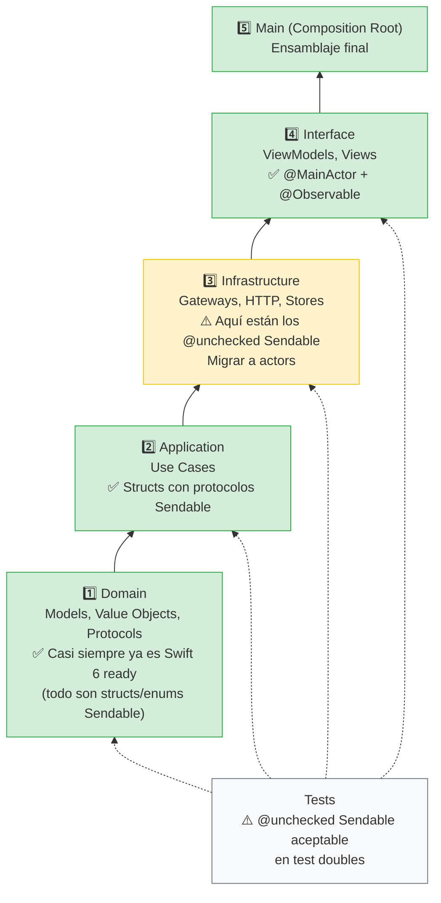
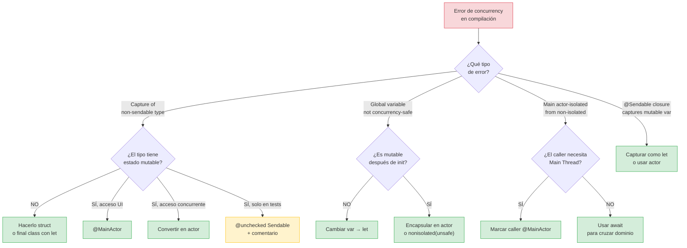

# Migración a Swift 6

## De warnings a errores: preparar tu proyecto para el futuro

Swift 6 convierte los warnings de concurrency en **errores de compilación**. Si tu proyecto compila con `SWIFT_STRICT_CONCURRENCY = complete` sin warnings, ya estás listo. Si no, esta lección te guía paso a paso para migrar.

Esta lección no es sobre escribir código nuevo. Es sobre **arreglar código existente** que el compilador ahora considera inseguro, entender por qué lo considera inseguro, y decidir la estrategia correcta de migración.

---

## El cambio fundamental de Swift 6

En Swift 5.x, las verificaciones de concurrency son **warnings**. Puedes ignorarlos y el código compila. En Swift 6, esos mismos warnings son **errores**. No compila.

¿Por qué Apple hizo esto? Porque los data races son la categoría más peligrosa de bugs: causan crashes aleatorios, corrupción de datos silenciosa, y comportamiento indeterminado que es casi imposible de reproducir y depurar. Swift 6 los elimina en tiempo de compilación, igual que Swift eliminó los null pointer dereferences con opcionales.

---

## Estrategia de migración: módulo por módulo

No intentes migrar todo el proyecto de golpe. Migra un módulo (target) a la vez, siguiendo el orden de dependencias:

### Diagrama: orden de migración por capas de dependencia



**¿Por qué este orden?** Porque cada módulo depende del que tiene debajo. Si migras Domain primero, los errores de Sendable en Domain se propagan como soluciones hacia arriba. Si empiezas por UI, tendrás errores confusos porque los tipos de Domain aún no son Sendable.

### Diagrama: flowchart para resolver cada error de compilación



Este flowchart es tu **herramienta de triage** durante la migración. Cada error de compilación se resuelve siguiendo una de estas ramas. Después de resolver 50 errores, el flowchart se convierte en instinto: ves el error y sabes la solución en 3 segundos.

### Paso 1: Activar strict concurrency en el módulo

En Build Settings del target específico:

```
SWIFT_STRICT_CONCURRENCY = complete
```

O en `Package.swift` para un paquete SPM:

```swift
.target(
    name: "LoginFeature",
    swiftSettings: [
        .enableExperimentalFeature("StrictConcurrency")
    ]
)
```

### Paso 2: Compilar y analizar los warnings/errores

Los errores más comunes que encontrarás:

#### Error 1: "Capture of non-sendable type"

```swift
// ❌ Error: MyClass no es Sendable
class MyClass {
    var value = 0
}

let obj = MyClass()
Task {
    print(obj.value) // Error: obj cruza dominios y no es Sendable
}
```

**Soluciones (en orden de preferencia):**

1. Convertir en struct si no necesita identidad de referencia.
2. Convertir en actor si tiene estado mutable compartido.
3. Marcar `@MainActor` si solo se accede desde la UI.
4. Hacer `final class` con solo propiedades `let` + `: Sendable`.
5. Como último recurso: `@unchecked Sendable` con documentación.

#### Error 2: "Global variable is not concurrency-safe"

```swift
// ❌ Error: variable global mutable
var sharedConfig = AppConfig()
```

**Soluciones:**

```swift
// Opción 1: hacerla constante
let sharedConfig = AppConfig()

// Opción 2: encapsularla en un actor
actor ConfigStore {
    static let shared = ConfigStore()
    private var config = AppConfig()
    
    func get() -> AppConfig { config }
    func update(_ config: AppConfig) { self.config = config }
}

// Opción 3: nonisolated(unsafe) — válvula de escape temporal
nonisolated(unsafe) var sharedConfig = AppConfig()
// ⚠️ Documenta por qué es seguro y crea ticket para migrar
```

#### Error 3: "Main actor-isolated property cannot be referenced from non-isolated context"

```swift
@MainActor
class ViewModel {
    var title = "Hello"
}

// ❌ Error: accediendo a propiedad @MainActor desde contexto nonisolated
func process(vm: ViewModel) {
    print(vm.title) // Error
}
```

**Soluciones:**

```swift
// Opción 1: marcar la función @MainActor
@MainActor
func process(vm: ViewModel) {
    print(vm.title) // ✅
}

// Opción 2: usar await
func process(vm: ViewModel) async {
    let title = await vm.title // ✅
    print(title)
}
```

### Paso 3: Verificar que los tests pasan

Después de arreglar todos los errores del módulo, ejecuta los tests del módulo. Los cambios de isolation pueden alterar el comportamiento en tests:

```bash
xcodebuild test \
    -scheme LoginFeature \
    -destination 'platform=iOS Simulator,name=iPhone 16'
```

### Paso 4: Repetir para el siguiente módulo

Migra en orden de dependencias: primero los módulos sin dependencias (Domain), luego los que dependen de ellos (Application), luego Infrastructure, y finalmente Interface.

---

## Region-based isolation (Swift 6.1+)

Swift 6.1 introduce **region-based isolation**, una mejora que reduce la cantidad de tipos que necesitan ser `Sendable`. El compilador analiza las "regiones" de datos y verifica que no se compartan entre dominios de aislamiento:

```swift
// Sin region-based isolation (Swift 6.0):
// ❌ Error: `result` no es Sendable
func processData() async {
    let result = NonSendableClass()
    Task {
        use(result) // Error: result cruza dominios
    }
}

// Con region-based isolation (Swift 6.1+):
// ✅ El compilador ve que `result` no se usa después del Task
func processData() async {
    let result = NonSendableClass()
    Task {
        use(result) // OK: el compilador ve que result se "transfiere" al Task
    }
    // result ya no se usa aquí → no hay data race posible
}
```

Region-based isolation reduce los falsos positivos: casos donde el compilador reporta un error pero no hay data race real. Esto hace la migración a Swift 6 significativamente más fácil.

---

## La keyword `sending` en la práctica

`sending` complementa region-based isolation. Marca parámetros que se transfieren al llamado:

```swift
// Antes de `sending` — necesitabas que Data fuera Sendable
actor Cache {
    func store(_ data: Data) { /* ... */ }
}

// Con `sending` — Data se transfiere, no necesita ser Sendable
actor Cache {
    func store(_ data: sending Data) { /* ... */ }
}
```

La diferencia:
- `Sendable`: el tipo es inherentemente seguro para compartir (puede copiarse o es inmutable).
- `sending`: el valor se transfiere. El caller no puede usarlo después. No importa si el tipo es Sendable o no.

---

## Default Actor Isolation (Swift 6.2)

Swift 6.2 permite configurar el aislamiento por defecto del módulo:

```swift
// Package.swift
.target(
    name: "MyApp",
    swiftSettings: [
        .defaultIsolation(MainActor.self)
    ]
)
```

Con `defaultIsolation(MainActor.self)`, todo el código del módulo está aislado al `@MainActor` por defecto. No necesitas añadir `@MainActor` a cada ViewModel o View. El código que necesita ser nonisolated lo marcas explícitamente:

```swift
// Con defaultIsolation(MainActor.self):
// Todo es @MainActor por defecto

class ViewModel { // Implícitamente @MainActor
    var products: [Product] = [] // Acceso seguro desde Main Thread
}

nonisolated func parseJSON(_ data: Data) -> [Product] {
    // Explícitamente nonisolated: puede ejecutarse en cualquier hilo
}
```

### ¿Es buena idea?

Para **módulos de UI** (Features, ViewModels, Views): **sí**. La mayoría del código de UI debe ejecutarse en el Main Thread. `defaultIsolation(MainActor.self)` reduce el boilerplate y previene errores.

Para **módulos de Domain o Infrastructure**: **no**. El Domain debe ser independiente del hilo de ejecución. Infrastructure puede necesitar ejecutarse en background. Dejarlos con aislamiento por defecto `nonisolated` es lo correcto.

---

## Nuestro proyecto: estado actual de migración

| Módulo | SWIFT_STRICT_CONCURRENCY | Estado |
|--------|--------------------------|--------|
| Domain (Models, Value Objects) | `complete` | ✅ Listo — todo son structs/enums Sendable |
| Application (Use Cases) | `complete` | ✅ Listo — protocolos Sendable, use cases structs |
| Infrastructure (Gateways, HTTP) | `complete` | ⚠️ `FileProductStore` usa `@unchecked Sendable` → migrar a actor |
| Interface (ViewModels, Views) | `complete` | ✅ Listo — ViewModels @MainActor, Views usan @State |
| Tests | `complete` | ⚠️ Test doubles usan `@unchecked Sendable` → aceptable |

### Plan de acción

1. ✅ **Domain y Application:** ya son Swift 6-ready.
2. ⚠️ **Infrastructure:** convertir `FileProductStore` de `@unchecked Sendable` a actor (lección 02 de esta etapa).
3. ✅ **Interface:** ya usa `@MainActor` correctamente.
4. ⚠️ **Tests:** los `@unchecked Sendable` en test doubles son aceptables porque los tests son secuenciales.

---

## Errores comunes en la migración

### "Estoy añadiendo @MainActor a todo para que compile"

Si tu solución a cada error es `@MainActor`, estás usando el Main Thread como lock global. Esto funciona, pero causa dos problemas:
1. Todo el código se ejecuta en el Main Thread → bloquea la UI durante operaciones pesadas.
2. Oculta el diseño real: no sabes qué código realmente necesita el Main Thread.

**Regla:** solo usa `@MainActor` para código que toca la UI (ViewModels, Views). Para el resto, usa actors, structs Sendable, o `nonisolated`.

### "Estoy usando @unchecked Sendable en todas partes"

Si tu solución a cada error es `@unchecked Sendable`, estás desactivando las verificaciones del compilador. Es lo mismo que ignorar los warnings: tu código compila, pero los data races siguen ahí.

**Regla:** cada `@unchecked Sendable` debe tener un comentario que explique por qué es seguro y una justificación de por qué no se usa actor, struct, o @MainActor.

### "Mis tests no compilan porque los stubs no son Sendable"

Los test doubles (stubs, spies) suelen tener estado mutable (`receivedMessages`, `completions`). Hacerlos `Sendable` requiere convertirlos en actors, lo que cambia su API (todo necesita `await`).

**Regla pragmática:** `@unchecked Sendable` en test doubles es aceptable. Los tests se ejecutan secuencialmente (un test a la vez), no hay acceso concurrente real. Documéntalo con un comentario:

```swift
// @unchecked Sendable: test double con acceso secuencial en tests.
// No hay concurrencia real — los tests se ejecutan uno a la vez.
final class HTTPClientStub: HTTPClient, @unchecked Sendable {
    // ...
}
```

---

## Resumen de la migración

| Paso | Acción | Herramienta |
|------|--------|-------------|
| 1 | Activar `SWIFT_STRICT_CONCURRENCY = complete` | Build Settings |
| 2 | Arreglar errores de Sendable | Structs, actors, @MainActor |
| 3 | Arreglar variables globales | Constantes, actors, `nonisolated(unsafe)` |
| 4 | Verificar tests | `xcodebuild test` |
| 5 | Activar Thread Sanitizer en CI | Scheme CI separado |
| 6 | Migrar `@unchecked Sendable` a actors | Gradualmente, un tipo a la vez |
| 7 | Considerar `defaultIsolation` para módulos UI | Swift 6.2+ |

---

**Anterior:** [Memory leaks y diagnóstico ←](08-memory-leaks-y-diagnostico.md) · **Siguiente:** [Entregables Etapa 5 →](entregables-etapa-5.md)
