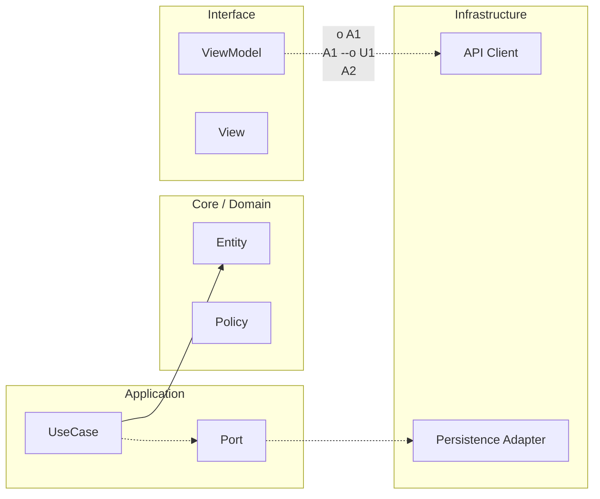

# Propósito y Alcance

## Ruta scaffold relacionada

- `apps/ios/ArchitectureKit/Sources/` para implementación de código real de esta lección.
- `apps/ios/ArchitectureKit/Tests/` para validación y regresión de contratos.
- `apps/ios/ArchitectureHostApp/` cuando la lección impacta navegación/UI integrada.

Esta rúbrica define el **mínimo profesional exigible** para un ingeniero iOS y el **listón superior** esperado de un Mobile Architect.

No está diseñada para premiar la familiaridad con APIs o frameworks de forma aislada, sino para evaluar la **calidad de las decisiones bajo restricciones reales**: corrección, seguridad, operabilidad y mantenibilidad a largo plazo.

La rúbrica asume un contexto empresarial donde:
- Los sistemas evolucionan con el tiempo.
- Los equipos cambian.
- Los fallos son inevitables.
- Las malas decisiones se acumulan silenciosamente.

Su objetivo es distinguir entre código que simplemente funciona y sistemas que pueden ser **evolucionados, operados y gobernados de forma segura**.

---

# Qué evalúa esta rúbrica

Esta rúbrica evalúa **resultados y evidencia**, no intenciones.

Se centra en:
- Límites arquitectónicos y contratos.
- Corrección y seguridad (incluyendo concurrencia).
- Quality gates y disciplina de testing.
- Operabilidad (observabilidad, release, rollback).
- Postura de seguridad y privacidad.
- Trazabilidad de decisiones a través de artefactos explícitos.

Una entrega se evalúa como un **sistema**, no como una colección de archivos.

---

# Qué no evalúa esta rúbrica

Esta rúbrica **no** evalúa:
- Conocimiento de APIs específicas o características sintácticas.
- Volumen de código, ingeniosidad o preferencias estilísticas.
- Uso de patrones sin justificación contextual.
- Opiniones personales o suposiciones no documentadas.

Las elecciones tecnológicas son aceptables **solo cuando están justificadas por restricciones, trade-offs y evidencia explícitos**.

---

# Principios de evaluación

## Principio 1 — Contexto sobre patrones
No existen arquitecturas universalmente correctas.
Las decisiones se evalúan en función de lo bien que responden a **restricciones explícitas** (tiempo, riesgo, escala, composición del equipo), no por pureza teórica.

La aplicación de patrones sin justificación contextual se considera una debilidad.

---

## Principio 2 — Trade-offs explícitos
Toda decisión arquitectónica introduce trade-offs.

Las soluciones sólidas:
- Reconocen alternativas.
- Explican por qué se descartaron opciones.
- Hacen explícitos los trade-offs aceptados.

Los trade-offs no reconocidos indican razonamiento superficial.

---

## Principio 3 — Invariantes primero
Las invariantes definen lo que **nunca** debe ocurrir en el sistema
(por ejemplo, corrupción de datos, pérdida de acciones confirmadas del usuario, violaciones de seguridad o privacidad).

Cualquier solución que viole una invariante, independientemente de otros beneficios, queda automáticamente descalificada.

---

## Principio 4 — Diseñar para el cambio, no para la predicción
Las arquitecturas se evalúan por su capacidad de **absorber cambios**, no de predecir el futuro.

Los diseños sólidos:
- Hacen fáciles los cambios frecuentes.
- Protegen las áreas estables del acoplamiento accidental.
- Favorecen la evolución incremental sobre las reescrituras masivas.

La sobre-ingeniería para futuros hipotéticos se penaliza.

---

## Principio 5 — Evidencia sobre opinión
Las afirmaciones deben estar respaldadas por **evidencia observable**.

Evidencia aceptable incluye:
- Tests y cobertura.
- Métricas antes y después de cambios.
- ADRs y RFCs.
- Artefactos operacionales (logs, alertas, runbooks).

Las afirmaciones sin evidencia se tratan como opiniones y no contribuyen a la puntuación.

---

## Principio 6 — La operabilidad es parte de la corrección
Un sistema que no puede ser observado, revertido u operado de forma segura se considera incompleto.

La corrección incluye:
- Saber cuándo el sistema está fallando.
- Limitar el radio de impacto.
- Recuperarse de forma segura de incidentes.

La operabilidad es una responsabilidad arquitectónica fundamental, no un complemento opcional.

---

## Principio 7 — La gobernanza habilita la escala
Los sistemas fallan a escala no por errores individuales, sino por **evolución no gobernada**.

La gobernanza arquitectónica se evalúa a través de:
- Reglas de dependencias.
- Quality gates.
- Trazabilidad de decisiones.
- Estándares compartidos aplicados mediante tooling y proceso.

La ausencia de mecanismos de gobernanza es un riesgo estructural.

---

# Interpretación de umbrales

El umbral **Minimum Hireable** representa una línea base profesional adecuada para trabajar de forma segura en un codebase empresarial.

El umbral **Architect Ready** representa la capacidad de:
- Tomar y defender decisiones arquitectónicas.
- Reducir el riesgo sistémico.
- Habilitar a los equipos para moverse más rápido sin degradar la calidad.

La diferencia entre ambos no es conocimiento, sino **criterio**.

---

# Rúbrica final de empleabilidad iOS (Production-Readiness)

## Propósito

Esta rúbrica define una señal defendible de salida para el curso iOS. Sirve para autoevaluación, preparación de entrevista y defensa de portfolio con evidencia. No evalúa opiniones: evalúa decisiones, implementación, operación y trazabilidad.

Está alineada con el Core Mobile en [`00-core-mobile/04-calidad-pr-ready.md`](../../00-core-mobile/04-calidad-pr-ready.md), [`00-core-mobile/05-observabilidad-operacion.md`](../../00-core-mobile/05-observabilidad-operacion.md), [`00-core-mobile/06-release-rollback-flags.md`](../../00-core-mobile/06-release-rollback-flags.md), [`00-core-mobile/07-apis-contratos-versionado.md`](../../00-core-mobile/07-apis-contratos-versionado.md), [`00-core-mobile/08-seguridad-privacidad-threat-modeling.md`](../../00-core-mobile/08-seguridad-privacidad-threat-modeling.md), [`00-core-mobile/09-dependency-governance-supply-chain.md`](../../00-core-mobile/09-dependency-governance-supply-chain.md) y [`00-core-mobile/10-plantillas.md`](../../00-core-mobile/10-plantillas.md).

## Reglas de scoring

Puntuación total: **100 puntos**.

Cada categoría se puntúa en una escala 0–100 interna y se multiplica por su peso.

Fórmula:

`Total = Σ (score_categoria × peso_categoria)`

Donde el peso está expresado en porcentaje.

## Hard blockers (fallo automático)

Si aparece cualquiera de estos bloqueadores, el resultado final es **No apto**, aunque el total supere umbrales:

- No tests o cobertura no significativa en áreas críticas requeridas.
- Patrones de concurrencia inseguros (estado mutable compartido sin aislamiento explícito).
- Ausencia de manejo de errores en flujos de red/autenticación.
- Ausencia de estrategia de rollback/flags para features de riesgo.
- Filtración de PII en logs o analytics.
- Ausencia de artefactos de evidencia para decisiones clave (ADRs, checklist PR, métricas antes/después).

### Criterio operativo de “cobertura significativa”

Para evitar ambigüedad, esta rúbrica considera cobertura significativa cuando se cumple uno de estos esquemas:

- **Domain/Core**: objetivo recomendado `85–90%+`.
- **Data/Repositories**: objetivo recomendado `80–85%+`.
- **UI**: objetivo recomendado `60–70%+` **o** evidencia equivalente por tests de contrato/integración/aceptación cuando la cobertura por línea no represente bien el riesgo.

La regla no premia un número aislado: exige evidencia de protección real en caminos críticos.

### Red flags explícitas de concurrencia insegura

Se considera hard blocker de concurrencia si aparece cualquiera de estos patrones:

- Uso de `@MainActor` como parche global para esconder carreras sin delimitar aislamiento.
- Mutación de estado compartido desde `Task.detached` o concurrencia no estructurada sin frontera explícita.
- Ignorar cancelación o absorber `CancellationError` sin tratamiento.
- Fronteras `Sendable`/actor no definidas para datos compartidos entre dominios de ejecución.

### Qué cuenta como estrategia real de rollback/flags

Ejemplos válidos de estrategia:

- Kill-switch operativo para desactivar ruta de riesgo.
- Flag server-side con control de exposición.
- Criterios explícitos de phased rollout/canary con umbrales de parada.
- Fallback funcional definido para degradación controlada.

Ejemplo inválido (hard blocker):

- “Si falla, sacamos hotfix” como único plan.

### Checklist mínimo para evitar fuga de PII

Esta rúbrica considera PII en móvil, como mínimo: email, teléfono, matrícula, ubicación precisa, identificadores persistentes y tokens de sesión.

Reglas mínimas:

- Nunca loguear tokens.
- Enmascarar identificadores sensibles.
- Aplicar redacción por defecto en logging/analytics.
- Usar sampling en eventos ruidosos para reducir exposición accidental.

### Mínimo obligatorio de trazabilidad de evidencia

Sin este set mínimo, aplica hard blocker de trazabilidad:

- `>= 3` ADRs.
- `>= 1` RFC.
- `>= 1` PR review checklist aplicado.
- `>= 1` tabla de métricas before/after.
- Minimal Observability Spec.
- Release Readiness Checklist.
- Threat Model Lite.
- API Contract Checklist.

## Umbrales de decisión

- **Minimum Hireable**: `>= 70/100` y sin hard blockers.
- **Architect Ready**: `>= 85/100` y sin hard blockers, con mínimo `>= 75` en Observabilidad/Operación, Seguridad/Privacidad y Arquitectura/Límites.

## Categorías y pesos

| Categoría | Peso | Qué se evalúa | Evidencia esperada |
|---|---:|---|---|
| Architecture & Boundaries (Clean / Feature-First / Contracts) | 15% | Límites claros, contratos entre módulos, dependencias dirigidas | Diagrama de dependencias + contratos + ADRs |
| Concurrency Safety (Swift 6 / Sendable / actors / cancellation) | 15% | Aislamiento correcto, cancelación, ausencia de data races | Tests concurrentes + decisiones de aislamiento |
| Testing & Quality Gates (BDD/TDD + cobertura) | 15% | Estrategia de pruebas y gates reproducibles | CI verde + cobertura y matriz de tests |
| API Integration Discipline (contratos, taxonomía de errores, retries/backoff) | 10% | Integración robusta y consistente | API checklist + manejo de errores por categoría |
| Observability & Operability (logs/metrics, SLO/error budget, alert hygiene) | 15% | Señales accionables y operación realista | Spec de observabilidad + runbook + SLO |
| Release Strategy (flags, phased rollout, rollback) | 10% | Despliegue controlado y mitigación | Release checklist + plan rollback |
| Security & Privacy (tokens, PII, threat model lite) | 10% | Protección de datos y superficie de ataque | Threat model lite + evidencia de redacción PII |
| Performance & UX (budget, SwiftUI perf, accessibility baseline) | 5% | Rendimiento y UX medibles | Métricas before/after + baseline accesibilidad |
| Documentation & Decision Traceability (ADRs/RFCs, DoD, PR review) | 5% | Trazabilidad de decisiones y disciplina de entrega | ADRs + RFC + DoD + PR checklist |

## Bandas de calidad por categoría

| Banda | Rango | Interpretación |
|---|---:|---|
| Deficiente | 0–49 | Riesgo alto, no defendible en entrevista técnica |
| Operativo básico | 50–69 | Funciona, pero con huecos de producción |
| Hireable sólido | 70–84 | Defendible para rol iOS con guía de equipo |
| Architect-level | 85–100 | Defendible para diseño, operación y evolución |

## Criterios medibles recomendados por categoría

### Testing & Quality Gates

- **Domain/Core**: cobertura objetivo **85–90%+**.
- **Data/Repositories**: cobertura objetivo **80–85%+**.
- **UI**: cobertura objetivo **60–70%+** o evidencia equivalente con tests de contrato/integración/aceptación cuando aplique.
- Tasa de flaky tests en suite crítica: **< 2%**.

### Observability & Operability

- SLO definido para al menos 2 flujos críticos.
- Error budget explícito y acción definida cuando se agota.
- Alertas accionables: 100% con owner y runbook asociado.

### Performance & UX

- Cold start p50 y p95 medidos en dispositivo real o baseline reproducible.
- Frame drops en flujo crítico medidos y comparados before/after.
- Baseline de accesibilidad (labels, navegación y contraste) validada.

### Security & Privacy

- Tokens en storage seguro de plataforma.
- Política de redacción de PII aplicada en logs.
- Threat model lite actualizado y con mitigaciones priorizadas.

## Resultado final

| Estado | Condición |
|---|---|
| No apto | Cualquier hard blocker activo |
| No apto | Total < 70 |
| Minimum Hireable | Total >= 70 y sin hard blockers |
| Architect Ready | Total >= 85, sin hard blockers y mínimos por categoría crítica |

---

**Anterior:** [Entregables Etapa 5 — Maestría ←](../entregables-etapa-5.md) · **Siguiente:** [Evidencias obligatorias iOS (cierre defendible) →](02-evidencias-obligatorias-ios.md)

<!-- auto-gapfix:layered-mermaid -->
## Diagrama de arquitectura por capas



La lectura del diagrama sigue esta semantica:
1. `-->` dependencia directa en runtime.
2. `-.->` contrato o abstraccion.
3. `-.o` wiring o composicion.
4. `--o` salida o propagacion de resultado.

<!-- auto-gapfix:layered-snippet -->
## Snippet de referencia por capas

```swift
protocol FeaturePort {
    func fetch() async throws -> [String]
}

final class FeatureUseCase {
    private let port: FeaturePort

    init(port: FeaturePort) {
        self.port = port
    }

    func execute() async throws -> [String] {
        try await port.fetch()
    }
}

@MainActor
final class FeatureViewModel: ObservableObject {
    @Published private(set) var items: [String] = []

    private let useCase: FeatureUseCase

    init(useCase: FeatureUseCase) {
        self.useCase = useCase
    }

    func load() async {
        items = (try? await useCase.execute()) ?? []
    }
}
```
