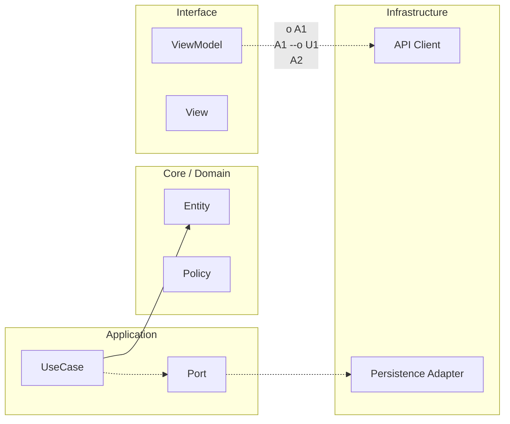

# Evidencias obligatorias iOS (cierre defendible)

## Ruta scaffold relacionada

- `apps/ios/ArchitectureKit/Sources/` para implementación de código real de esta lección.
- `apps/ios/ArchitectureKit/Tests/` para validación y regresión de contratos.
- `apps/ios/ArchitectureHostApp/` cuando la lección impacta navegación/UI integrada.

## Propósito

Este checklist define qué artefactos debes mostrar para demostrar production-readiness y empleabilidad arquitectónica en iOS. Está alineado con las plantillas de [`00-core-mobile/10-plantillas.md`](../../00-core-mobile/10-plantillas.md).

Sin este paquete de evidencia, la rúbrica final no se considera completa aunque la app funcione.

## Checklist de artefactos obligatorios

### Decisiones y trazabilidad

- [ ] **ADRs (mínimo 3)** usando plantilla ADR de [`00-core-mobile/10-plantillas.md`](../../00-core-mobile/10-plantillas.md).
- [ ] **1 RFC** usando plantilla RFC de [`00-core-mobile/10-plantillas.md`](../../00-core-mobile/10-plantillas.md).
- [ ] **Definition of Done** aplicada al cierre usando plantilla DoD de [`00-core-mobile/10-plantillas.md`](../../00-core-mobile/10-plantillas.md).

Regla de consistencia con rúbrica: este bloque es hard requirement para la trazabilidad mínima (3 ADRs + 1 RFC).

### Calidad y revisión técnica

- [ ] **PR Review checklist** aplicado a una PR real o simulada usando la plantilla de [`00-core-mobile/10-plantillas.md`](../../00-core-mobile/10-plantillas.md).
- [ ] Evidencia de quality gates (build, tests, lint/concurrency warnings) en verde.

Regla de consistencia con rúbrica: debe existir **al menos 1** PR Review checklist aplicado.

### Métricas y rendimiento

- [ ] **Tabla de métricas before/after** rellenada con al menos 3 métricas usando plantilla de [`00-core-mobile/10-plantillas.md`](../../00-core-mobile/10-plantillas.md).
- [ ] Evidencia de medición de performance (cold start, render/perf SwiftUI o métrica equivalente).

Regla de consistencia con rúbrica: debe existir **al menos 1** tabla before/after válida.

### Observabilidad y operación

- [ ] **Minimal Observability Spec** completado (basado en [`00-core-mobile/05-observabilidad-operacion.md`](../../00-core-mobile/05-observabilidad-operacion.md)).
- [ ] **Incident Runbook Skeleton** completado (basado en [`00-core-mobile/05-observabilidad-operacion.md`](../../00-core-mobile/05-observabilidad-operacion.md)).
- [ ] SLO y error budget definidos para al menos 1 flujo crítico.

Regla de consistencia con rúbrica: **Minimal Observability Spec** es artefacto obligatorio de hard requirement.

### Release y control de riesgo

- [ ] **Release readiness checklist** completado (basado en [`00-core-mobile/06-release-rollback-flags.md`](../../00-core-mobile/06-release-rollback-flags.md)).
- [ ] Plan de rollback explícito para una feature de riesgo.
- [ ] Estrategia de flags/kill-switch para mitigación de incidente.

Regla de consistencia con rúbrica: **Release readiness checklist** es artefacto obligatorio de hard requirement.

### API discipline

- [ ] **API Contract Checklist** completado (basado en [`00-core-mobile/07-apis-contratos-versionado.md`](../../00-core-mobile/07-apis-contratos-versionado.md)).
- [ ] Error taxonomy aplicada en al menos 1 integración crítica.
- [ ] Política de retries/backoff implementada o documentada para red transitoria.

Regla de consistencia con rúbrica: **API Contract Checklist** es artefacto obligatorio de hard requirement.

### Seguridad y privacidad

- [ ] **Mobile Threat Model Lite** completado (basado en [`00-core-mobile/08-seguridad-privacidad-threat-modeling.md`](../../00-core-mobile/08-seguridad-privacidad-threat-modeling.md)).
- [ ] Evidencia de no exposición de PII en logs/analytics.
- [ ] Evidencia de principios de storage seguro para tokens/sesión.

Regla de consistencia con rúbrica: **Threat Model Lite** es artefacto obligatorio de hard requirement.

## Ejemplos de evidencia aceptable

### ADRs (mínimo 3)

Aceptable: ADR de frontera de módulos, ADR de estrategia de concurrencia y ADR de política de errores API, cada uno con contexto, decisión, trade-offs y métrica de validación.

No aceptable: notas sin trade-offs o sin consecuencias medibles.

### RFC (mínimo 1)

Aceptable: RFC de migración incremental de feature crítica con rollout y reversión.

No aceptable: RFC sin plan de despliegue ni riesgos.

### PR Review checklist aplicado

Aceptable: checklist completado con observaciones reales de arquitectura, tests, edge cases, observabilidad y seguridad.

No aceptable: checklist marcado “todo OK” sin comentarios ni evidencia.

### Before/after metrics table

Aceptable: latencia de carga, crash-free sessions y tiempo de arranque con baseline y delta.

No aceptable: métricas sin fuente o sin contexto de medición.

### Observabilidad mínima

Aceptable: eventos estructurados, owner de alertas y runbook con condición de rollback.

No aceptable: logs textuales sin campos ni ownership.

### Threat model lite

Aceptable: activos, superficie de ataque, mitigaciones y riesgo residual explícito.

No aceptable: lista genérica de amenazas sin priorización.

## Criterio de completitud

Se considera paquete completo cuando el 100% de ítems obligatorios están presentes y son verificables por un tercero sin contexto oral adicional.

---

<!-- plantilla-pedagogica:auto -->

## Refuerzo pedagogico
Contexto: normalizacion automatica para `05-maestria/10-rubrica-final/02-evidencias-obligatorias-ios.md`.

### Objetivo
- Define el resultado concreto esperado al finalizar esta leccion.

### Prerrequisitos
- Revisa la leccion anterior inmediata y confirma los conceptos base antes de continuar.

### Practica guiada
- Aplica un cambio pequeno y verificable en el scaffold relacionado con esta leccion.

**Anterior:** [Propósito y Alcance ←](01-rubrica-empleabilidad-ios.md) · **Siguiente:** [Checklist de entrega para entrevista (1 página) →](03-checklist-entrega-para-entrevista.md)

<!-- auto-gapfix:layered-mermaid -->
## Diagrama de arquitectura por capas



La lectura del diagrama sigue esta semantica:
1. `-->` dependencia directa en runtime.
2. `-.->` contrato o abstraccion.
3. `-.o` wiring o composicion.
4. `--o` salida o propagacion de resultado.

<!-- auto-gapfix:layered-snippet -->
## Snippet de referencia por capas

```swift
protocol FeaturePort {
    func fetch() async throws -> [String]
}

final class FeatureUseCase {
    private let port: FeaturePort

    init(port: FeaturePort) {
        self.port = port
    }

    func execute() async throws -> [String] {
        try await port.fetch()
    }
}

@MainActor
final class FeatureViewModel: ObservableObject {
    @Published private(set) var items: [String] = []

    private let useCase: FeatureUseCase

    init(useCase: FeatureUseCase) {
        self.useCase = useCase
    }

    func load() async {
        items = (try? await useCase.execute()) ?? []
    }
}
```
