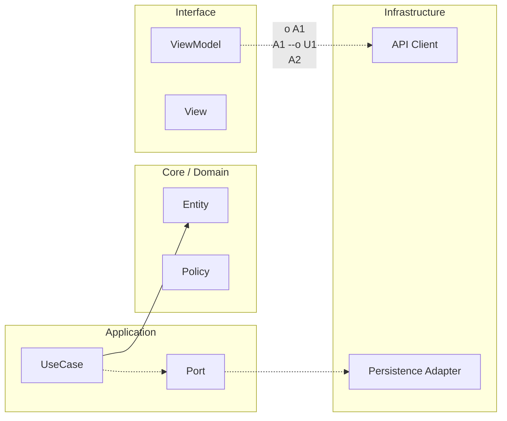

# Checklist de entrega para entrevista (1 página)

## Ruta scaffold relacionada

- `apps/ios/ArchitectureKit/Sources/` para implementación de código real de esta lección.
- `apps/ios/ArchitectureKit/Tests/` para validación y regresión de contratos.
- `apps/ios/ArchitectureHostApp/` cuando la lección impacta navegación/UI integrada.

## Objetivo

Este paquete sirve para defender tu perfil en entrevista técnica en 5 minutos con señal de arquitectura móvil real: profundidad iOS + criterios de Mobile Architect.

## Qué mostrar en 5 minutos

- [ ] 1 diagrama simple de límites de arquitectura (features, contratos, dependencias).
- [ ] 1 decisión crítica con ADR (problema, alternativa, trade-off, resultado).
- [ ] 1 evidencia de concurrencia segura (Sendable/actor/cancelación + test asociado).
- [ ] 1 evidencia de disciplina API (taxonomía de errores + retry/backoff aplicado).
- [ ] 1 evidencia operativa (SLO + runbook o alerta accionable).
- [ ] 1 evidencia de release controlado (flags + rollback plan).
- [ ] 1 evidencia de seguridad/privacidad (threat model lite + no PII en logs).
- [ ] 1 tabla before/after con métricas de impacto.

## Talk track recomendado (guion breve)

Abre explicando el contexto de producto y el riesgo principal que resolviste.

Explica cómo definiste límites e invariantes para que el cambio no rompiera módulos vecinos.

Resume la decisión técnica más relevante con su trade-off y evidencia.

Muestra cómo validaste la decisión con tests y métricas.

Cierra con operación: qué monitorizas, cuándo haces rollback y qué harías ante incidente.

Frase de cierre recomendada:

"No solo implementé la solución. Dejé evidencia de que se puede operar, evolucionar y defender técnicamente en producción".

## Qué no debes afirmar

- [ ] "Está listo para producción" sin SLO, runbook o rollback.
- [ ] "Es seguro" sin threat model y control de PII.
- [ ] "Escala" sin límites/contratos y reglas de dependencia.
- [ ] "No hay bugs" en vez de explicar cómo detectas y mitigas.
- [ ] "Tenemos cobertura alta" sin discriminar cobertura crítica real.

## Criterio de paquete defendible

Se considera paquete defendible si un entrevistador puede seguir problema → decisión → evidencia → operación sin depender de promesas verbales.

---

**Anterior:** [Evidencias obligatorias iOS (cierre defendible) ←](02-evidencias-obligatorias-ios.md) · **Siguiente:** [Calentamiento: Etapa 5 - Maestría →](../../anexos/calentamiento-etapa-5-maestria.md)

<!-- auto-gapfix:layered-mermaid -->
## Diagrama de arquitectura por capas



La lectura del diagrama sigue esta semantica:
1. `-->` dependencia directa en runtime.
2. `-.->` contrato o abstraccion.
3. `-.o` wiring o composicion.
4. `--o` salida o propagacion de resultado.

<!-- auto-gapfix:layered-snippet -->
## Snippet de referencia por capas

```swift
protocol FeaturePort {
    func fetch() async throws -> [String]
}

final class FeatureUseCase {
    private let port: FeaturePort

    init(port: FeaturePort) {
        self.port = port
    }

    func execute() async throws -> [String] {
        try await port.fetch()
    }
}

@MainActor
final class FeatureViewModel: ObservableObject {
    @Published private(set) var items: [String] = []

    private let useCase: FeatureUseCase

    init(useCase: FeatureUseCase) {
        self.useCase = useCase
    }

    func load() async {
        items = (try? await useCase.execute()) ?? []
    }
}
```
