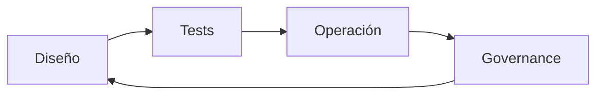

# Entregables Etapa 5 — Maestría

## Propósito de este documento

Este documento no es una lista de tareas para marcar casillas. Es el contrato de cierre de la etapa más exigente del curso. Si la etapa 5 se aprueba con criterios blandos, el alumno sale con vocabulario bonito pero sin reflejos técnicos de nivel enterprise. Si se aprueba con criterios verificables, sale con habilidades que resisten presión real: concurrencia, regresiones, cambios de arquitectura y diagnóstico de producción.

Por eso, cada entregable aquí está diseñado con tres capas inseparables:

- **Comprensión profunda**: el alumno explica y justifica decisiones.
- **Implementación operativa**: el alumno construye código correcto.
- **Evidencia verificable**: el alumno demuestra con tests/artefactos.

---

## Definición de “Maestría” en este curso

Maestría no significa saber más conceptos. Significa que el alumno:

1. Toma decisiones técnicas coherentes bajo incertidumbre.
2. Explica trade-offs sin esconderse en dogmas.
3. Detecta y corrige fallos antes de que lleguen a producción.
4. Escala su conocimiento al equipo mediante estándares repetibles.

Si falta cualquiera de esos cuatro puntos, todavía no hay maestría, aunque el código compile.

---

## Entregables obligatorios por lección (con criterio de evaluación fuerte)

| Lección | Entregable técnico mínimo | Evidencia obligatoria | Señal de nivel arquitecto |
| --- | --- | --- | --- |
| 01 - Isolation domains | Mapa explícito de dominios de aislamiento del sistema | Documento + ejemplos de tipos reales clasificados | Puede justificar por qué cada frontera existe y qué rompe si se viola |
| 02 - Actors en arquitectura | Migración de estado compartido crítico a actor o aislamiento equivalente | Código + tests concurrentes sin flaky behavior | Puede argumentar cuándo actor sí y cuándo no |
| 03 - Structured concurrency | Reemplazo de concurrencia ad-hoc por tareas estructuradas | Tests de cancelación y completitud | Puede demostrar ownership de tareas end-to-end |
| 04 - Testing concurrente | Suite de pruebas deterministas para caminos async críticos | Pruebas repetibles en runs consecutivos | Puede explicar por qué sus tests no dependen de timing accidental |
| 05 - SwiftUI state moderno | Aplicación consistente del árbol de decisión de wrappers | Código de vistas + revisión de wrappers | Puede detectar y corregir mal uso de estado inyectado/poseído |
| 06 - SwiftUI performance | Diagnóstico y reducción de renders innecesarios | Evidencia con herramientas (`_printChanges`, profiling) | Puede convertir observación de performance en acciones concretas |
| 07 - Composición avanzada | Composición con al menos un Decorator, un Composite y un Interceptor | Código + tests de extensión sin modificar core | Puede extender comportamiento sin tocar contratos existentes |
| 08 - Memory leaks y diagnóstico | Cobertura de prevención y detección de fugas en componentes clave | `trackForMemoryLeaks` + pruebas/diagnóstico documentado | Puede diseñar estrategia preventiva y no solo reactiva |
| 09 - Migración Swift 6 | Plan de migración en lotes con riesgos y mitigaciones | Documento de plan + estado por módulo | Puede priorizar orden de migración por impacto y riesgo |

---

## Rubrica de calidad transversal (aplica a todas las lecciones)

Cada lección se evalúa con esta rúbrica. Sin excepción.

### 1) Rigor conceptual

El alumno demuestra comprensión causal, no memorización. Si se le cambia el ejemplo, mantiene el criterio.

Escala esperada:
- Insuficiente: repite definición, no decide.
- Operativo: aplica patrón en caso guiado.
- Arquitecto: justifica elección y anticipa fallos.

### 2) Rigor de implementación

El código no solo compila; refleja intención clara, límites correctos y uso adecuado de concurrencia/estado.

Escala esperada:
- Insuficiente: funciona en happy path.
- Operativo: cubre happy/sad principales.
- Arquitecto: cubre edge cases con diseño mantenible.

### 3) Rigor de pruebas

Las pruebas deben proteger comportamiento, no detalles accidentales. En concurrencia, deben ser deterministas.

Escala esperada:
- Insuficiente: tests frágiles por timing.
- Operativo: pruebas estables de casos clave.
- Arquitecto: suite orientada a regresión real y diagnóstica.

### 4) Rigor de operación enterprise

El alumno deja señales de diagnóstico y decisiones trazables. Sin esto, no hay sostenibilidad.

Escala esperada:
- Insuficiente: no hay evidencia operativa.
- Operativo: logs/diagnóstico básico.
- Arquitecto: observabilidad + decisiones versionadas + gobernanza.

---

## Mapa explícito de skills aplicadas (para convertir estudio en hábito)

Este mapa traduce teoría en práctica diaria. Es obligatorio usarlo como checklist de ejecución.

| Skill | Dónde se aplica | Qué debes demostrar |
| --- | --- | --- |
| `swift-concurrency` | Lecciones 01, 02, 03, 04, 09 | Fronteras de aislamiento justificadas, cancelación correcta, seguridad de sendability |
| `swiftui-expert-skill` | Lecciones 05 y 06 | Selección correcta de wrappers, composición de vistas, mejora de performance con evidencia |
| `windsurf-rules-ios` (si aplica) | Todas las lecciones con código de iOS | Alineación con estándares del repositorio y decisiones consistentes de equipo |

El criterio de evaluación no es "menciona la skill". Es "la skill cambia decisiones y resultados".

---

## Quality gates de etapa (obligatorios para cierre)

Para declarar la etapa cerrada, deben pasar estos gates de forma conjunta:

1. **Gate de seguridad de concurrencia**
   - Sin warnings críticos en rutas concurrentes relevantes.
   - Fronteras de aislamiento explícitas en componentes clave.

2. **Gate de diseño y composición**
   - Extensiones por composición sin modificar core.
   - Contratos públicos estables y entendibles.

3. **Gate de pruebas**
   - Cobertura de casos críticos async/UI/performance.
   - Ejecuciones repetidas estables en tests de concurrencia.

4. **Gate de operación**
   - Diagnóstico mínimo definido para incidentes previsibles.
   - Evidencia de prevención (no solo reacción) en fugas y regresiones.

Si uno falla, la etapa no está cerrada aunque los otros pasen.

---

## Evidencia esperada de cierre (formato práctico)

Para cada lección debe existir un paquete de evidencia con cuatro piezas:

1. **Decisión técnica**
   - Qué se eligió.
   - Qué alternativas se descartaron.
   - Qué riesgo se aceptó.

2. **Implementación**
   - Código final del componente o refactor.
   - Límite arquitectónico explícito (quién depende de quién).

3. **Validación**
   - Tests relevantes que prueban la intención.
   - Resultado esperado de ejecución (sin flakiness).

4. **Operación/seguimiento**
   - Qué se monitoriza.
   - Qué señal indica regresión.
   - Qué acción tomar si aparece.

Este formato evita la típica trampa de cerrar una lección solo con lectura o solo con código sin evidencia de comportamiento.

---

## Escenario de evaluación final (simulación enterprise)

La etapa se da por consolidada cuando el alumno puede resolver este escenario integrado:

- Llega una incidencia de producción intermitente: catálogo tarda, UI se recalcula demasiado y hay sospecha de fuga.
- El alumno debe:
  - delimitar dominios de aislamiento,
  - ajustar concurrencia estructurada,
  - reducir renders innecesarios,
  - verificar fugas,
  - documentar trade-offs,
  - y dejar controles para evitar reaparición.

Si puede resolverlo con método y evidencia, el conocimiento ya se volvió operativo.

---

## Métricas de madurez recomendadas (no cosméticas)

Estas métricas no son para decorar reportes. Son para detectar degradación temprana.

| Métrica | Qué detecta | Señal de alerta |
| --- | --- | --- |
| Tiempo medio de diagnóstico de bug concurrente | Operabilidad real | Crece sprint tras sprint |
| Número de warnings/concesiones de concurrencia | Deuda de seguridad | Subida sostenida |
| Re-renders evitables en vistas críticas | Coste de UI reactiva | Aumento tras cambios de feature |
| Fugas detectadas en tests de ciclo de vida | Salud de memoria | Cualquier fuga no explicada |
| Cambios que rompen contratos sin plan | Riesgo de plataforma | Breaking sin ADR/migración |

---

## Checklist de cierre definitivo de Etapa 5

- [ ] Cada lección tiene evidencia en las 4 piezas (decisión, implementación, validación, operación).
- [ ] El mapa de skills se aplicó explícitamente en lecciones relevantes.
- [ ] Los quality gates pasan de forma conjunta, no parcial.
- [ ] Existe simulación integrada resuelta con trazabilidad técnica.
- [ ] El alumno puede enseñar cada decisión clave a alguien de nivel inferior.

---

## Qué viene después (para no perder la maestría alcanzada)

El mayor riesgo después de cerrar esta etapa es volver a hábitos antiguos por presión de entrega. Para evitarlo, hay que institucionalizar tres rituales:

1. Revisión semanal de decisiones de concurrencia y estado.
2. Revisión quincenal de performance y fugas en rutas críticas.
3. Revisión mensual de calidad de contratos y deuda de migración.

La maestría no se conserva por memoria, se conserva por práctica disciplinada.

---

## Cierre

Si llegaste aquí con evidencia sólida, ya no estás estudiando "patrones". Estás entrenando una forma de construir y operar software iOS enterprise de manera predecible, mantenible y segura. Ese es el objetivo real del curso.

**Anterior:** [Migración a Swift 6 ←](09-migracion-swift6.md)
