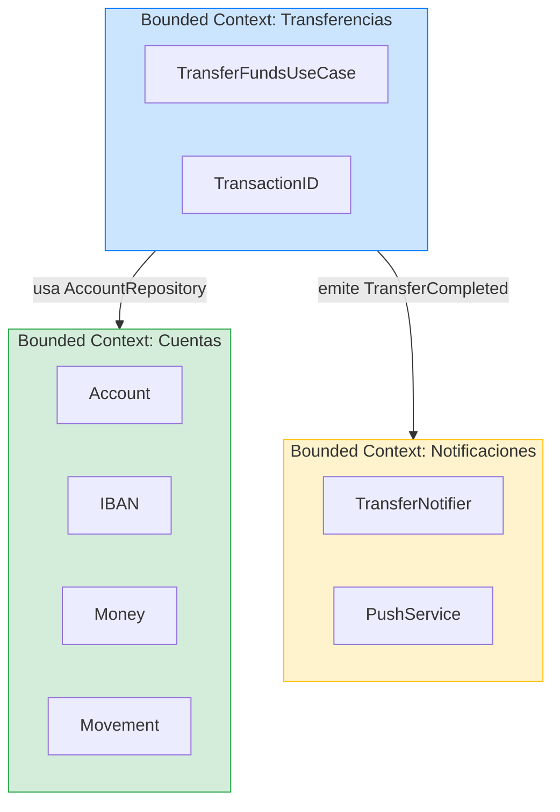

# Apendice: Dominio Banca / Ledger

## Proposito

Este apendice muestra como los principios del curso (Clean Architecture, BDD/TDD, Value Objects, bounded contexts) se aplican a un dominio financiero real. No es una leccion completa — es un ejercicio de transferencia para que veas que la arquitectura no es especifica de un catalogo de productos.

---

## Por que Banca es un buen ejercicio

Un dominio bancario tiene:

- **Invariantes estrictas** — un saldo no puede ser negativo (en cuenta corriente estandar).
- **Value Objects ricos** — `Money`, `IBAN`, `TransactionID`.
- **Consistencia critica** — un movimiento debe ser atomico.
- **Auditoria obligatoria** — cada operacion debe ser trazable.
- **Bounded contexts claros** — Cuentas, Transferencias, Notificaciones.

Si puedes modelar esto con Clean Architecture, puedes modelar cualquier cosa.

---

## Modelo de Domain: Ledger minimo

### Value Objects

```swift
struct Money: Sendable, Equatable {
    let amount: Decimal
    let currency: Currency

    init(amount: Decimal, currency: Currency) throws {
        guard amount >= 0 else {
            throw LedgerError.negativeAmount
        }
        self.amount = amount
        self.currency = currency
    }

    func adding(_ other: Money) throws -> Money {
        guard currency == other.currency else {
            throw LedgerError.currencyMismatch
        }
        return try Money(amount: amount + other.amount, currency: currency)
    }

    func subtracting(_ other: Money) throws -> Money {
        guard currency == other.currency else {
            throw LedgerError.currencyMismatch
        }
        let result = amount - other.amount
        guard result >= 0 else {
            throw LedgerError.insufficientFunds
        }
        return try Money(amount: result, currency: currency)
    }
}

enum Currency: String, Sendable, Equatable, CaseIterable {
    case eur = "EUR"
    case usd = "USD"
    case gbp = "GBP"
}

struct IBAN: Sendable, Equatable {
    let value: String

    init(_ value: String) throws {
        let cleaned = value.replacingOccurrences(of: " ", with: "").uppercased()
        guard cleaned.count >= 15, cleaned.count <= 34 else {
            throw LedgerError.invalidIBAN
        }
        guard cleaned.prefix(2).allSatisfy(\.isLetter) else {
            throw LedgerError.invalidIBAN
        }
        self.value = cleaned
    }
}

struct TransactionID: Sendable, Equatable, Hashable {
    let value: String

    init() {
        self.value = UUID().uuidString
    }

    init(_ value: String) {
        self.value = value
    }
}
```

**Observa:** Los Value Objects validan en `init`, exactamente como `Email` y `Password` en el curso. `Money` no permite cantidades negativas. `IBAN` valida formato. La logica de negocio vive en el tipo, no dispersa en ViewModels.

### Entidades

```swift
struct Account: Sendable, Equatable {
    let id: String
    let iban: IBAN
    let holder: String
    private(set) var balance: Money
    private(set) var movements: [Movement]

    mutating func apply(_ movement: Movement) throws {
        switch movement.type {
        case .credit:
            balance = try balance.adding(movement.amount)
        case .debit:
            balance = try balance.subtracting(movement.amount)
        }
        movements.append(movement)
    }
}

struct Movement: Sendable, Equatable {
    let id: TransactionID
    let type: MovementType
    let amount: Money
    let description: String
    let timestamp: Date
}

enum MovementType: String, Sendable, Equatable {
    case credit
    case debit
}
```

### Errores de Domain

```swift
enum LedgerError: Error, Sendable, Equatable {
    case negativeAmount
    case currencyMismatch
    case insufficientFunds
    case invalidIBAN
    case accountNotFound
    case transferToSameAccount
    case connectivity
}
```

---

## Especificacion BDD

```markdown
## SC-TRANSFER-001: Transferencia exitosa entre cuentas
- Given la cuenta origen ES12345 tiene saldo 1000.00 EUR
- And la cuenta destino DE67890 tiene saldo 500.00 EUR
- When el usuario transfiere 200.00 EUR de ES12345 a DE67890
- Then la cuenta origen tiene saldo 800.00 EUR
- And la cuenta destino tiene saldo 700.00 EUR
- And se registra un movimiento de debito en origen
- And se registra un movimiento de credito en destino

## SC-TRANSFER-002: Transferencia con fondos insuficientes
- Given la cuenta origen tiene saldo 50.00 EUR
- When el usuario intenta transferir 100.00 EUR
- Then ve un error "Fondos insuficientes"
- And el saldo no cambia

## SC-TRANSFER-003: Transferencia entre monedas diferentes
- Given la cuenta origen tiene saldo en EUR
- And la cuenta destino tiene saldo en USD
- When el usuario intenta transferir
- Then ve un error "Las monedas no coinciden"
```

---

## UseCase: TransferFunds

```swift
struct TransferFundsUseCase: Sendable {
    private let accountRepository: any AccountRepository
    private let logger: any AppLogger

    init(
        accountRepository: any AccountRepository,
        logger: any AppLogger
    ) {
        self.accountRepository = accountRepository
        self.logger = logger
    }

    func execute(
        from sourceIBAN: IBAN,
        to destinationIBAN: IBAN,
        amount: Money,
        description: String,
        timestamp: Date = Date()
    ) async throws {
        guard sourceIBAN != destinationIBAN else {
            throw LedgerError.transferToSameAccount
        }

        var source = try await accountRepository.find(by: sourceIBAN)
        var destination = try await accountRepository.find(by: destinationIBAN)

        let transactionId = TransactionID()

        let debit = Movement(
            id: transactionId,
            type: .debit,
            amount: amount,
            description: "Transferencia a \(destinationIBAN.value): \(description)",
            timestamp: timestamp
        )

        let credit = Movement(
            id: transactionId,
            type: .credit,
            amount: amount,
            description: "Transferencia de \(sourceIBAN.value): \(description)",
            timestamp: timestamp
        )

        try source.apply(debit)
        try destination.apply(credit)

        try await accountRepository.save(source)
        try await accountRepository.save(destination)

        logger.log(.info, "transfer.completed",
                   context: ["transactionId": transactionId.value,
                             "amount": "\(amount.amount) \(amount.currency.rawValue)"])
    }
}

protocol AccountRepository: Sendable {
    func find(by iban: IBAN) async throws -> Account
    func save(_ account: Account) async throws
}
```

---

## Tests TDD

```swift
import XCTest

final class TransferFundsUseCaseTests: XCTestCase {

    // MARK: - Helpers

    private func makeSUT(
        sourceBalance: Decimal = 1000,
        destinationBalance: Decimal = 500
    ) -> (sut: TransferFundsUseCase, repo: AccountRepositoryStub) {
        let repo = AccountRepositoryStub(
            sourceBalance: sourceBalance,
            destinationBalance: destinationBalance
        )
        let logger = LoggerSpy()
        let sut = TransferFundsUseCase(
            accountRepository: repo,
            logger: logger
        )
        return (sut, repo)
    }

    private let sourceIBAN = try! IBAN("ES1234567890123456")
    private let destIBAN = try! IBAN("DE9876543210987654")

    // MARK: - Happy Path

    func test_transfer_deducesFromSource_andCreditsDestination() async throws {
        let (sut, repo) = makeSUT(sourceBalance: 1000, destinationBalance: 500)
        let amount = try Money(amount: 200, currency: .eur)

        try await sut.execute(
            from: sourceIBAN,
            to: destIBAN,
            amount: amount,
            description: "Alquiler"
        )

        let source = try await repo.find(by: sourceIBAN)
        let dest = try await repo.find(by: destIBAN)

        XCTAssertEqual(source.balance.amount, 800)
        XCTAssertEqual(dest.balance.amount, 700)
    }

    // MARK: - Sad Paths

    func test_transfer_withInsufficientFunds_throwsError() async throws {
        let (sut, _) = makeSUT(sourceBalance: 50)
        let amount = try Money(amount: 100, currency: .eur)

        do {
            try await sut.execute(
                from: sourceIBAN,
                to: destIBAN,
                amount: amount,
                description: "Intento"
            )
            XCTFail("Deberia haber lanzado error")
        } catch {
            XCTAssertEqual(error as? LedgerError, .insufficientFunds)
        }
    }

    func test_transfer_toSameAccount_throwsError() async throws {
        let (sut, _) = makeSUT()
        let amount = try Money(amount: 100, currency: .eur)

        do {
            try await sut.execute(
                from: sourceIBAN,
                to: sourceIBAN,
                amount: amount,
                description: "A mi mismo"
            )
            XCTFail("Deberia haber lanzado error")
        } catch {
            XCTAssertEqual(error as? LedgerError, .transferToSameAccount)
        }
    }

    // MARK: - Edge Cases

    func test_transfer_registersMovementsWithSameTransactionId() async throws {
        let (sut, repo) = makeSUT()
        let amount = try Money(amount: 100, currency: .eur)

        try await sut.execute(
            from: sourceIBAN,
            to: destIBAN,
            amount: amount,
            description: "Test"
        )

        let source = try await repo.find(by: sourceIBAN)
        let dest = try await repo.find(by: destIBAN)

        let debitId = source.movements.last?.id
        let creditId = dest.movements.last?.id

        XCTAssertNotNil(debitId)
        XCTAssertEqual(debitId, creditId,
            "Debito y credito deben compartir el mismo TransactionID para trazabilidad")
    }
}
```

---

## Diagrama de bounded contexts bancarios



---

## Mapping al curso

| Concepto Banca | Equivalente en el curso | Leccion |
|---|---|---|
| `Money` | `Price` | E1: Value Objects |
| `IBAN` | `Email` | E1: Value Objects |
| `Account` | `Product` | E1: Domain |
| `TransferFundsUseCase` | `LoginUseCase` | E1: Application |
| `AccountRepository` | `ProductRepository` | E1: Puertos |
| `LedgerError` | `CatalogError` | E1: Domain |
| Bounded contexts | Identity vs Catalog | E4: Bounded Contexts |
| Trazabilidad (TransactionID) | TraceID en observabilidad | E3: Observabilidad |

---

## Conclusion

El dominio cambia (productos → cuentas bancarias), pero la arquitectura no. Value Objects validan en `init`, UseCases orquestan logica de negocio, repositories abstraen persistencia, y los bounded contexts acotan responsabilidades. Si entiendes el curso, puedes modelar un ledger bancario sin cambiar de framework ni de principios.
