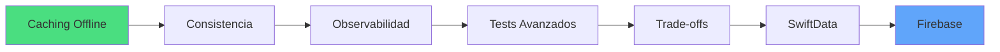

# Calentamiento: Etapa 3 - Evolución

<!-- sma:meta:v1 -->
meta_leccion:
  tiempo_lectura: "10 min"
  tiempo_practica: "15 min"
  dificultad: 2
  prerequisitos:
    - "02-integracion/entregables-etapa-2.md"
  si_te_atascas: "#mini-ejercicio"
<!-- /sma:meta:v1 -->

> 🌡️ **Antes de empezar la Etapa 3**, dedica 25 minutos a este calentamiento. Te preparará mentalmente para los conceptos de resiliencia, cache y observabilidad.

---

## ¿Por qué un calentamiento?

La Etapa 3 es diferente de las anteriores. Hasta ahora has construido features que funcionan en condiciones ideales. Ahora aprenderás a construir features que **sobreviven en condiciones reales**:

- Red lenta o intermitente
- Datos que cambian mientras el usuario los ve
- Bugs que solo aparecen en producción

Es un cambio de mentalidad: de "hacer que funcione" a "hacer que funcione siempre".

---

## Analogía: El restaurante que nunca cierra

Imagina que eres dueño de un restaurante. Tu objetivo no es solo servir comida deliciosa cuando todo va bien, sino **servir comida consistente** aunque:

- El proveedor de pescado falle (¿tienes un plan B?)
- El horno principal se rompa (¿puedes cocinar con el secundario?)
- Un cliente tenga una alergia que no declaró (¿tienes registros de ingredientes?)

En software, esto se llama **resiliencia operativa**.

---

## Conceptos clave de la Etapa 3 (preview)

### 1. Cache / Offline-first

**Analogía:** La nevera de tu casa.

- Vas al super (red) cada semana, no cada vez que tienes hambre
- Guardas comida (cache) con fecha de caducidad (TTL)
- Si el super está cerrado, comes lo de la nevera (fallback)

**En código:** Guardar datos localmente para no depender 100% de la red.

### 2. Consistencia e Invalidación

**Analogía:** Un periódico.

- El de hoy tiene noticias frescas (consistente)
- El de ayer tiene noticias viejas (inconsistente con la realidad actual)
- Sabes que está viejo porque tiene fecha (metadata)

**En código:** Saber cuándo los datos locales ya no reflejan la verdad.

### 3. Observabilidad

**Analogía:** Los instrumentos de un coche.

- Velocímetro: ¿voy demasiado rápido?
- Gasolina: ¿necesito repostar?
- Luz de check engine: ¿algo va mal?

Sin estos instrumentos, conducirías a ciegas. En software, sin logs/métricas, operas a ciegas.

---

## Mini-ejercicio: Diseña tu nevera {#mini-ejercicio}

**Contexto:** Eres arquitecto de una app de recetas. Los usuarios necesitan ver recetas aunque no tengan internet.

**Tarea:** Diseña una estrategia de cache simple respondiendo estas preguntas:

1. ¿Qué datos guardarías en la "nevera" (cache)?
2. ¿Cuánto tiempo los mantendrías antes de considerarlos "caducados"?
3. ¿Qué harías si el usuario quiere ver una receta y no tiene internet ni cache?

💡 Pista 1: Qué cachear

No todo necesita cache. Las recetas sí (se ven frecuentemente), pero los comentarios en tiempo real quizás no.

💡 Pista 2: TTL (tiempo de vida)

Considera la frecuencia de cambio. ¿Las recetas cambian a menudo? Probablemente no tanto como los comentarios.

✅ Una posible solución

1. **Cachear:** Recetas (título, ingredientes, pasos) e imágenes (con compresión)
2. **TTL:** 7 días para recetas, 1 día para imágenes
3. **Sin internet ni cache:** Mostrar mensaje amigable "Modo offline no disponible para esta receta. Conéctate para descargarla."

**Por qué funciona:** Balance entre frescura de datos y experiencia offline. No mentimos al usuario con datos muy viejos.

---

## Mapa de la Etapa 3

**Lo que construirás:**

1. Un `CachedProductRepository` que intenta red primero, fallback a cache
2. Una política de invalidación explícita y testeada
3. Métricas básicas para saber si tu cache está funcionando
4. Tests de integración que simulan red lenta/offline

---

## Verificación de preparación

Antes de empezar la Etapa 3, asegúrate de:

- [ ] Haber completado todos los entregables de la Etapa 2
- [ ] Entender el Composition Root y cómo se cablean dependencias
- [ ] Tener claro qué es un protocolo (contrato) en Swift
- [ ] Estar cómodo con `async/await` básico

Si falta algo, **vuelve a la Etapa 2**. La Etapa 3 asume que dominas esos conceptos.

---

## Frase para recordar

> "Cualquier developer puede hacer que funcione en condiciones perfectas. Los buenos developers hacen que funcione a pesar de las imperfecciones."

---

## Continuación

¿Listo? Adelante:

-

---

**Anterior:** [Entregables — Etapa 3: Evolución ←](../03-evolucion/entregables-etapa-3.md) · **Siguiente:** [Etapa 4: Arquitecto — Plataforma y gobernanza →](../04-arquitecto/00-introduccion.md)
