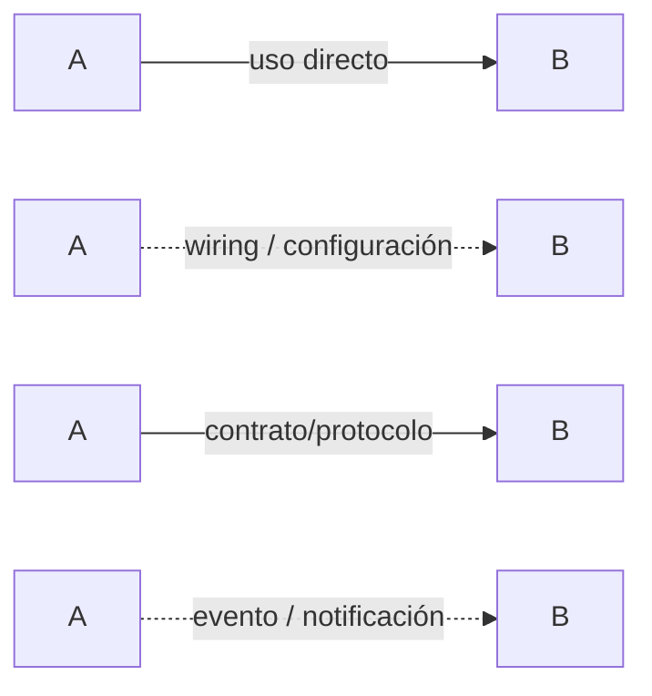
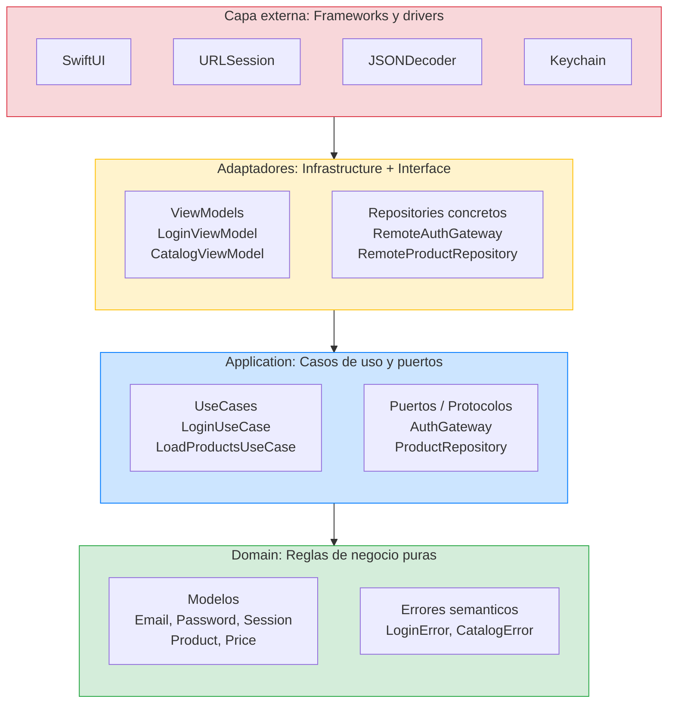
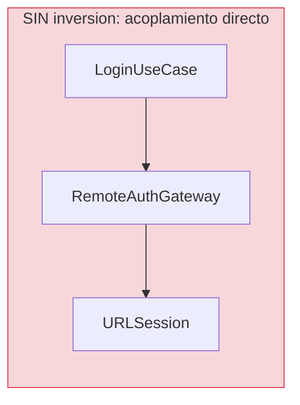
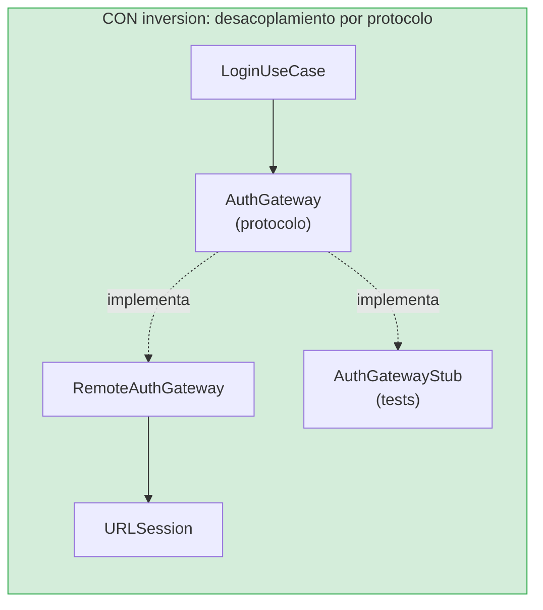
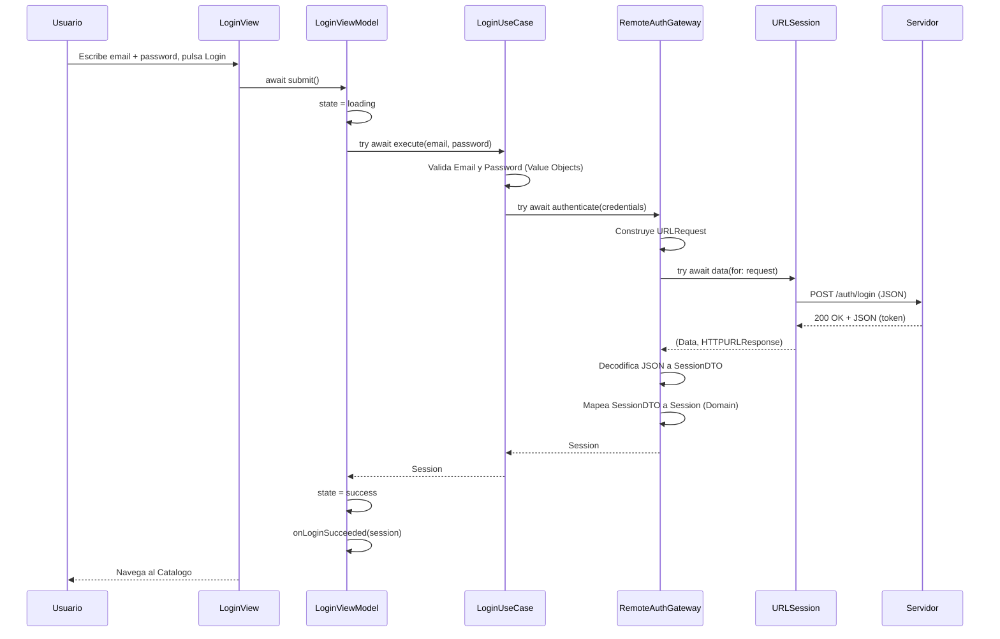
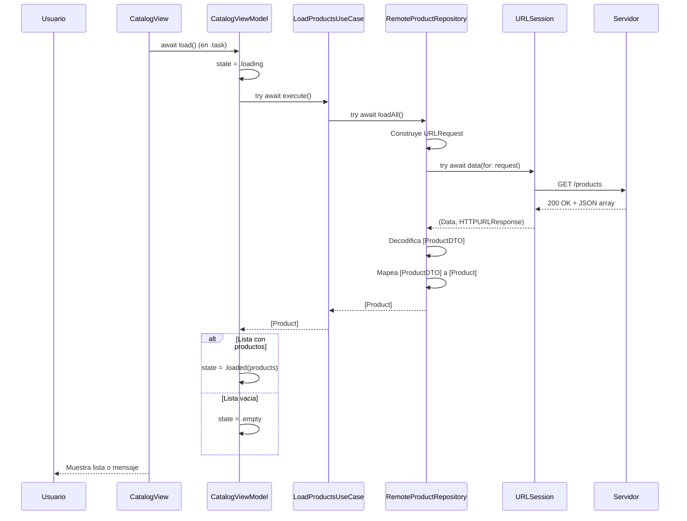
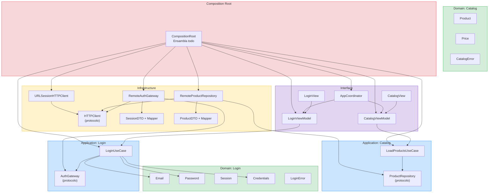
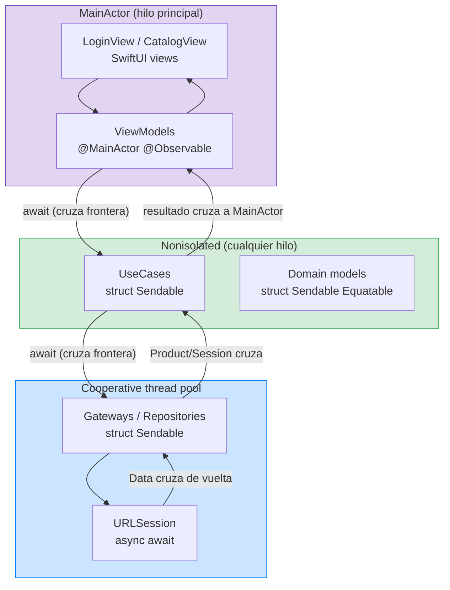
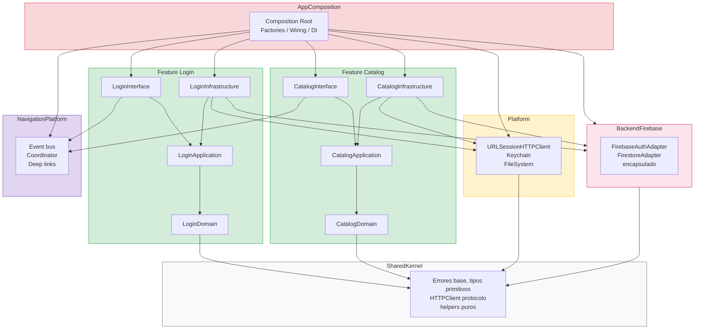
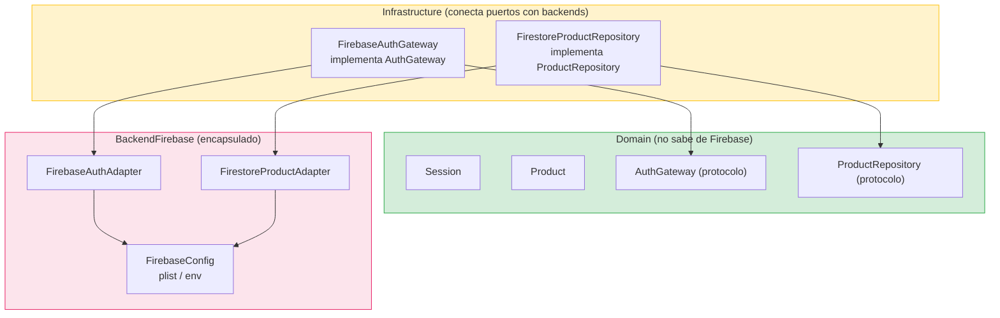

# Atlas visual de arquitectura

> Este documento es tu **mapa de referencia permanente**. Cuando estés perdido en una lección, vuelve aquí para ver el panorama completo.

---

## 0. Convención de flechas del curso (léela una vez)

Antes de interpretar cualquier diagrama, usa esta clave semántica:

- `-->` = dependencia o llamada directa en runtime.
- `-.->` = relación de ensamblado/wiring o notificación desacoplada (según etiqueta).
- Etiqueta `"contrato/protocolo"` = dependencia hacia abstracción.
- Etiqueta `"evento/notificación"` = salida de información, no uso fuerte.

Nota de herramienta: en Mermaid `flowchart` no todos los estilos de punta (abierta/cerrada) son igual de expresivos que en herramientas de dibujo manual. Por eso la convención oficial del curso usa **línea + etiqueta textual** como fuente de verdad.

---

## 1. Clean Architecture: las capas y la regla de dependencia

Clean Architecture organiza el código en **anillos concéntricos**. La regla fundamental es una sola: **las dependencias siempre apuntan hacia el centro**. Nunca al revés.

**Como leer este diagrama:**

- **Centro (verde) = Domain:** No importa nada externo. No sabe que existe URLSession, SwiftUI ni Firebase. Solo contiene reglas de negocio puras. Si borras toda la app excepto Domain, el Domain sigue compilando.
- **Segundo anillo (azul) = Application:** Conoce Domain. Define los puertos (protocolos) que necesita y los casos de uso que orquestan el flujo. No sabe cómo se implementan los puertos.
- **Tercer anillo (amarillo) = Adaptadores:** Infrastructure implementa los puertos de Application (conecta con el mundo real). Interface consume Application para mostrar datos al usuario.
- **Exterior (rojo) = Frameworks:** Son las herramientas concretas de Apple (SwiftUI, URLSession, etc.). Viven en el borde, nunca en el centro.

**La regla de oro:** Las flechas SOLO van hacia dentro. Domain nunca importa Application. Application nunca importa Infrastructure. Si ves una flecha apuntando hacia fuera, hay un error de arquitectura.

---

## 2. Dependency Inversion: por que existen los protocolos en las fronteras

Sin inversión de dependencias, Application dependería directamente de Infrastructure:

Problema: si cambias la implementación de `RemoteAuthGateway` (por ejemplo, migras de URLSession a Firebase), tienes que **tocar LoginUseCase**. Y si tocas LoginUseCase, tienes que re-testear todo el flujo.

Con inversión de dependencias, Application define un protocolo y no sabe quién lo implementa:

**La flecha de dependencia se invierte:** ahora `RemoteAuthGateway` depende de `AuthGateway` (el protocolo que vive en Application), no al revés. LoginUseCase solo conoce el protocolo.

Beneficios concretos:

- **Testabilidad:** En tests, inyectas un stub en vez de la implementación real. El UseCase no sabe la diferencia.
- **Intercambiabilidad:** Puedes cambiar de URLSession a Firebase sin tocar Application ni Domain.
- **Compilación independiente:** Application compila sin que exista Infrastructure.

---

## 3. Flujo end-to-end de una peticion (Login)

Este diagrama muestra el viaje completo de los datos cuando el usuario pulsa "Login", desde la UI hasta el servidor y de vuelta:

**Que datos viajan en cada tramo:**

| Tramo | Datos que viajan | Tipo |
|---|---|---|
| Usuario a View | Strings crudos (email, password) | `String` |
| View a ViewModel | Nada (la View llama `submit()`, el VM ya tiene los strings) | — |
| ViewModel a UseCase | Strings crudos | `String` |
| UseCase (interno) | Value Objects validados | `Email`, `Password` → `Credentials` |
| UseCase a Gateway | Credenciales tipadas | `Credentials` |
| Gateway (interno) | Request HTTP | `URLRequest` con JSON body |
| URLSession a Servidor | Bytes en red | HTTP POST |
| Servidor a URLSession | Bytes en red | HTTP 200 + JSON |
| Gateway (interno) | DTO intermedio | `SessionDTO` → `Session` |
| Gateway a UseCase | Modelo de dominio | `Session` |
| UseCase a ViewModel | Modelo de dominio | `Session` |
| ViewModel a View | Estado de UI | `.loading` / `.idle` |

---

## 4. Flujo end-to-end de una peticion (Catalog)

---

## 5. Grafo de dependencias entre componentes

Este diagrama muestra TODOS los componentes del proyecto y quién depende de quién:

**Como leer este grafo:**

- **Verde (Domain):** No tiene flechas salientes hacia otras capas. Solo depende de sí mismo.
- **Azul (Application):** Depende de Domain. Define protocolos (puertos) que otros implementan.
- **Amarillo (Infrastructure):** Depende de Application (implementa sus protocolos) y de Domain (usa sus tipos).
- **Morado (Interface):** Depende de Application (consume UseCases).
- **Rojo (Composition Root):** Depende de TODO. Es el unico lugar que conoce todas las piezas. Por eso vive fuera del core.

**Regla: ninguna flecha verde apunta hacia amarillo, morado o rojo. Si lo hiciera, Domain estaría contaminado.**

---

## 6. Fronteras de concurrencia (Swift 6.2)

Este diagrama muestra las zonas de aislamiento y donde se necesita `Sendable`:

**Que significa cada zona:**

- **MainActor (morado):** Todo lo que toca la UI. SwiftUI y ViewModels viven aqui. El compilador garantiza que las mutaciones de estado ocurren en el hilo principal.
- **Nonisolated (verde):** UseCases y Domain models son structs `Sendable`. Pueden ejecutarse en cualquier hilo sin riesgo porque son inmutables o value types.
- **Cooperative thread pool (azul):** Las operaciones async (red, disco) se ejecutan aqui. URLSession devuelve datos que cruzan de vuelta hacia MainActor.

**Donde se necesita Sendable:** Cada vez que un dato **cruza** de una zona a otra (las flechas del diagrama), ese dato debe ser `Sendable`. Por eso todos nuestros modelos (Email, Product, Session, etc.) son structs conformando `Sendable`.

**Cancelacion:** Cuando el usuario sale de una pantalla, la `Task` que lanzó el `.task` de SwiftUI se cancela automaticamente. Esa cancelacion se propaga por toda la cadena: ViewModel → UseCase → Gateway → URLSession. Si URLSession recibe la cancelacion, deja de esperar la respuesta del servidor.

---

## 7. Estructura SPM objetivo (Etapa 4)

Este diagrama muestra la estructura de targets SPM hacia la que evoluciona el proyecto:

**Reglas de dependencia (enforceables por CI):**

| Target | Puede importar | NO puede importar |
|---|---|---|
| `*Domain` | Solo `SharedKernel` | Todo lo demas |
| `*Application` | `*Domain` + `SharedKernel` | Interface, Infrastructure, Platform, Backend |
| `*Interface` | `*Application` + `NavigationPlatform` | Infrastructure, Platform, Backend |
| `*Infrastructure` | `*Application` + `Platform` + `Backend*` | Interface, otros Features directamente |
| `Platform` | `SharedKernel` | Features, Backend |
| `Backend*` | `SharedKernel` | Features, Platform |
| `AppComposition` | Todo | — (es el unico que puede) |

**Entre features:** nunca importar clases internas de otra feature. Solo comunicacion via `NavigationPlatform` (eventos) o `FeatureXContracts` (modelos publicos).

---

## 8. Backend Firebase encapsulado en Infrastructure

**Principio clave:** Domain y Application no saben que Firebase existe. Solo conocen `AuthGateway` y `ProductRepository` (protocolos). Infrastructure es quien conecta esos protocolos con los adaptadores concretos de Firebase.

Si mañana migras de Firebase a Supabase, solo cambias `BackendFirebase` por `BackendSupabase` y las implementaciones en Infrastructure. **Domain, Application e Interface no se tocan.**

---

## Como usar este atlas

- **Antes de empezar una leccion:** mira el diagrama 1 (capas) para ubicar donde estas trabajando.
- **Si no entiendes por que existe un protocolo:** mira el diagrama 2 (Dependency Inversion).
- **Si no entiendes el flujo de datos:** mira los diagramas 3 o 4 (secuencias end-to-end).
- **Si no sabes quien depende de quien:** mira el diagrama 5 (grafo de dependencias).
- **Si no entiendes `Sendable` o `@MainActor`:** mira el diagrama 6 (concurrencia).
- **Si quieres ver la estructura de modulos futura:** mira el diagrama 7 (SPM).
- **Si quieres saber como encaja Firebase:** mira el diagrama 8 (backend).

**Anterior:** [Glosario](../glosario.md) · **Inicio:** [README](../../README.md)
