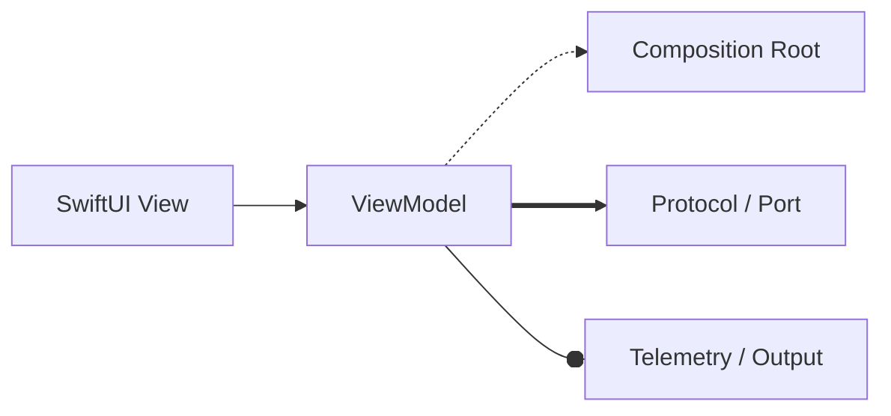

# Guía rápida: leyenda de flechas Mermaid

Referencia mínima para mantener semántica consistente en los diagramas del curso.

## Convención

- `-->` Dependencia directa (runtime).
- `-.->` Wiring / configuración.
- `==>` Contrato / abstracción.
- `--o` Salida / propagación.
