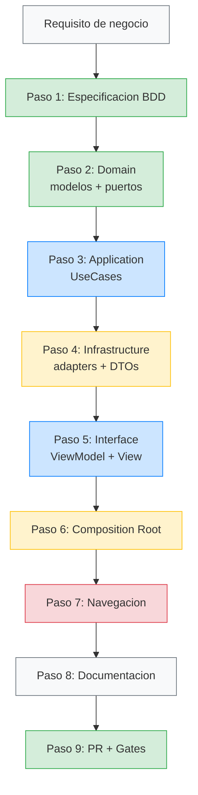

# Como anadir una feature nueva

## Proposito

Esta guia es un playbook paso a paso para cuando necesites crear una feature nueva en el proyecto. Sigue el orden exacto y no te saltaras nada. Cada paso tiene su checklist.

---

## Prerequisitos

Antes de empezar, asegurate de:

- [ ] tener claro el requisito de negocio (en lenguaje de usuario, no tecnico);
- [ ] saber en que bounded context vive la feature (Identity, Catalog, o uno nuevo);
- [ ] tener acceso al repositorio y los tests pasando en verde.

---

## Paso 1: Especificacion BDD

**Donde:** `XX-etapa/YY-feature-nombre/00-especificacion-bdd.md`

**Que hacer:**

1. Escribir los escenarios en formato Given/When/Then.
2. Cubrir minimo: happy path, sad path, y edge cases.
3. Cada escenario tiene un ID unico (ej: `SC-CART-001`).

**Checklist:**

- [ ] Al menos 1 happy path.
- [ ] Al menos 1 sad path (error de red, datos invalidos).
- [ ] Al menos 1 edge case (lista vacia, timeout, cancelacion).
- [ ] Los escenarios estan escritos en lenguaje de negocio, no tecnico.

**Ejemplo minimo:**

```markdown
## SC-CART-001: Agregar producto al carrito
- Given el usuario esta en la pantalla de detalle del producto "Camiseta React"
- When pulsa "Agregar al carrito"
- Then el carrito muestra 1 item con "Camiseta React" y precio 29.99 EUR

## SC-CART-002: Agregar producto cuando no hay conexion
- Given el usuario esta sin conexion
- When intenta agregar un producto al carrito
- Then ve un mensaje de error "Sin conexion. Intenta mas tarde."
```

---

## Paso 2: Domain (modelos y reglas de negocio)

**Donde:** `Features/NuevaFeature/Domain/`

**Que crear:**

1. **Entidades y Value Objects** — Los modelos puros de negocio.
2. **Errores de dominio** — Un enum con los errores posibles.
3. **Puertos (protocolos)** — Los contratos que Application usara.

**Orden TDD:**

```
1. Red:   test_cartItem_calculatesTotal_correctly()
2. Green: crear CartItem con metodo total
3. Red:   test_cart_addItem_incrementsCount()
4. Green: crear Cart con metodo addItem
```

**Checklist:**

- [ ] Ningun `import` de frameworks externos (ni SwiftUI, ni Foundation si posible).
- [ ] Todos los tipos son `Sendable`.
- [ ] Value Objects validan en `init` (ej: `Quantity` no acepta negativos).
- [ ] Errores son un enum con casos semanticos (no strings).
- [ ] Protocolos definen el contrato minimo necesario.

**Ejemplo:**

```swift
// Features/Cart/Domain/CartItem.swift
struct CartItem: Sendable, Equatable {
    let productId: String
    let name: String
    let unitPrice: Price
    let quantity: Int

    var total: Decimal {
        unitPrice.amount * Decimal(quantity)
    }
}

// Features/Cart/Domain/CartError.swift
enum CartError: Error, Sendable, Equatable {
    case productNotFound
    case quantityInvalid
    case connectivity
}

// Features/Cart/Domain/CartRepository.swift (puerto)
protocol CartRepository: Sendable {
    func loadCart() async throws -> [CartItem]
    func addItem(_ item: CartItem) async throws
}
```

---

## Paso 3: Application (casos de uso)

**Donde:** `Features/NuevaFeature/Application/`

**Que crear:**

1. **UseCase** — Orquesta la logica de negocio usando los puertos de Domain.

**Orden TDD:**

```
1. Red:   test_addToCart_withValidProduct_addsItem()
2. Green: crear AddToCartUseCase con metodo execute
3. Red:   test_addToCart_onConnectivityError_throwsCartError()
4. Green: manejar error de connectivity
```

**Checklist:**

- [ ] UseCase depende SOLO de protocolos de Domain (puertos), nunca de clases concretas.
- [ ] UseCase es un struct inmutable (`Sendable` automatico).
- [ ] UseCase no importa SwiftUI, UIKit, SwiftData, Firebase, etc.
- [ ] Cada UseCase tiene UNA responsabilidad.

**Ejemplo:**

```swift
// Features/Cart/Application/AddToCartUseCase.swift
struct AddToCartUseCase: Sendable {
    private let repository: any CartRepository

    init(repository: any CartRepository) {
        self.repository = repository
    }

    func execute(item: CartItem) async throws {
        guard item.quantity > 0 else {
            throw CartError.quantityInvalid
        }
        try await repository.addItem(item)
    }
}
```

---

## Paso 4: Infrastructure (implementacion concreta)

**Donde:** `Features/NuevaFeature/Infrastructure/`

**Que crear:**

1. **Adapter** — Implementacion concreta del protocolo de Domain.
2. **DTOs** — Modelos de transferencia para la API/base de datos.
3. **Mapper** — Traduce entre DTOs y modelos de Domain.

**Checklist:**

- [ ] El adapter implementa el protocolo de Domain.
- [ ] Los DTOs son `Codable` + `Sendable`.
- [ ] El mapper valida datos (guard let, else throw error semantico).
- [ ] Los errores tecnicos (HTTP, Firebase, etc.) se traducen a errores de Domain.
- [ ] Existe al menos un contract test (200 OK, error red, datos invalidos).

**Ejemplo:**

```swift
// Features/Cart/Infrastructure/FirestoreCartRepository.swift
struct FirestoreCartRepository: CartRepository, Sendable {
    private let db: Firestore

    func addItem(_ item: CartItem) async throws {
        do {
            try await db.collection("carts")
                .document("current")
                .collection("items")
                .document(item.productId)
                .setData(CartItemMapper.toFirestore(item))
        } catch {
            throw CartError.connectivity
        }
    }

    func loadCart() async throws -> [CartItem] {
        // ...similar
    }
}
```

---

## Paso 5: Interface (ViewModel + SwiftUI)

**Donde:** `Features/NuevaFeature/Interface/`

**Que crear:**

1. **ViewModel** — `@Observable`, `@MainActor`, consume UseCase.
2. **View** — SwiftUI pura, consume ViewModel.

**Checklist:**

- [ ] ViewModel usa `@Observable` (no `ObservableObject`).
- [ ] ViewModel esta marcado `@MainActor`.
- [ ] ViewModel tiene un enum `State` para loading/loaded/error.
- [ ] View no contiene logica de negocio.
- [ ] Navegacion se emite como evento (closure), no como NavigationLink directo.
- [ ] Tests del ViewModel cubren: estado inicial, happy path, error, retry.

**Ejemplo:**

```swift
// Features/Cart/Interface/CartViewModel.swift
@MainActor
@Observable
final class CartViewModel {
    private(set) var state: State = .idle
    private let loadCart: LoadCartUseCase
    let onCheckout: () -> Void

    enum State: Equatable {
        case idle
        case loading
        case loaded([CartItem])
        case error(String)
    }

    init(loadCart: LoadCartUseCase, onCheckout: @escaping () -> Void) {
        self.loadCart = loadCart
        self.onCheckout = onCheckout
    }

    func load() async {
        state = .loading
        do {
            let items = try await loadCart.execute()
            state = items.isEmpty ? .loaded([]) : .loaded(items)
        } catch {
            state = .error("No se pudo cargar el carrito")
        }
    }
}
```

---

## Paso 6: Wiring en Composition Root

**Donde:** `App/CompositionRoot.swift`

**Que hacer:**

1. Crear factory method para la nueva feature.
2. Conectar con el AppCoordinator (nueva ruta).

**Checklist:**

- [ ] Factory method crea toda la cadena: Repository → UseCase → ViewModel → View.
- [ ] Si hay cache, el decorador se inserta aqui (no en UseCase).
- [ ] Si hay logging, el decorador se inserta aqui.
- [ ] El UseCase, ViewModel y View no saben de los decoradores.

---

## Paso 7: Navegacion

**Donde:** `App/AppCoordinator.swift` o router de feature.

**Que hacer:**

1. Anadir nuevo caso a `AppDestination`.
2. Actualizar `DeepLinkParser` si hay deep link.
3. Actualizar `NavigationPolicy` si requiere autenticacion.

**Checklist:**

- [ ] `AppDestination` tiene el nuevo caso tipado.
- [ ] Tests del parser cubren la nueva URL.
- [ ] Tests del coordinator cubren la nueva ruta (con y sin auth).

---

## Paso 8: Documentacion

**Que hacer:**

1. Crear ADR si la feature cambia arquitectura o introduce dependencia nueva.
2. Actualizar el README con la nueva leccion.
3. Actualizar `build-html.py` con el nuevo archivo en `FILE_ORDER`.

**Checklist:**

- [ ] ADR creado si aplica.
- [ ] README actualizado.
- [ ] `build-html.py` actualizado para incluir nuevo .md.
- [ ] HTML regenerado con `bash scripts/serve.sh`.

---

## Paso 9: PR y Quality Gates

**Que hacer:**

1. Abrir PR con descripcion que responda:
   - Que comportamiento BDD cubre.
   - Que tests protegen el cambio.
   - Que reglas de dependencia toca.
   - Si requiere ADR.
2. Verificar que los gates pasan.

**Checklist de PR:**

- [ ] Gate 1: reglas de dependencia limpias.
- [ ] Gate 2: build con strict concurrency OK.
- [ ] Gate 3: unit tests verdes.
- [ ] Gate 4: integration tests verdes (si toca infra).
- [ ] Descripcion de PR completa.

---

## Diagrama resumen del flujo



---

## Tiempo estimado por paso

| Paso | Tiempo estimado | Notas |
|---|---|---|
| BDD | 30-60 min | Requiere conversacion con negocio |
| Domain | 1-2 horas | TDD puro, sin dependencias |
| Application | 30-60 min | UseCase simple si Domain esta bien |
| Infrastructure | 1-2 horas | Incluye contract tests |
| Interface | 1-2 horas | ViewModel + View + tests |
| Wiring | 15-30 min | Solo Composition Root |
| Navegacion | 15-30 min | Segun complejidad de rutas |
| Documentacion | 15-30 min | ADR + README |
| PR | 15-30 min | Descripcion + review |

**Total estimado: 5-9 horas** para una feature simple (1 pantalla, 1 UseCase, 1 repository).

---

**Referencia:** Esta guia aplica el flujo descrito en [Guia de arquitectura](../04-arquitecto/05-guia-arquitectura.md) y usa los quality gates de [Quality Gates](../04-arquitecto/06-quality-gates.md).
