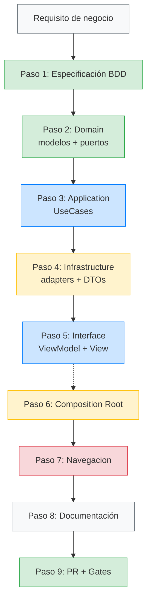

# Cómo añadir una feature nueva

## Propósito

Esta guía es un playbook paso a paso para cuando necesites crear una feature nueva en el proyecto. Sigue el orden exacto y no te saltarás nada. Cada paso tiene su checklist.

---

## Prerequisitos

Antes de empezar, asegúrate de:

- [ ] tener claro el requisito de negocio (en lenguaje de usuario, no técnico);
- [ ] saber en qué bounded context vive la feature (Identity, Catalog, o uno nuevo);
- [ ] tener acceso al repositorio y los tests pasando en verde.

---

## Paso 1: Especificación BDD

**Dónde:** `XX-etapa/YY-feature-nombre/00-especificacion-bdd.md`

**Qué hacer:**

1. Escribir los escenarios en formato Given/When/Then.
2. Cubrir mínimo: happy path, sad path, y edge cases.
3. Cada escenario tiene un ID único (ej: `SC-CART-001`).

**Checklist:**

- [ ] Al menos 1 happy path.
- [ ] Al menos 1 sad path (error de red, datos inválidos).
- [ ] Al menos 1 edge case (lista vacía, timeout, cancelación).
- [ ] Los escenarios están escritos en lenguaje de negocio, no técnico.

**Ejemplo mínimo:**

```markdown
## SC-CART-001: Agregar producto al carrito
- Given el usuario esta en la pantalla de detalle del producto "Camiseta React"
- When pulsa "Agregar al carrito"
- Then el carrito muestra 1 item con "Camiseta React" y precio 29.99 EUR

## SC-CART-002: Agregar producto cuando no hay conexion
- Given el usuario está sin conexión
- When intenta agregar un producto al carrito
- Then ve un mensaje de error "Sin conexión. Intenta más tarde."
```swift

---

## Paso 2: Domain (modelos y reglas de negocio)

**Dónde:** `Features/NuevaFeature/Domain/`

**Qué crear:**

1. **Entidades y Value Objects** — Los modelos puros de negocio.
2. **Errores de dominio** — Un enum con los errores posibles.
3. **Puertos (protocolos)** — Los contratos que Application usará.

**Orden TDD:**

```text
1. Red:   test_cartItem_calculatesTotal_correctly()
2. Green: crear CartItem con método total
3. Red:   test_cart_addItem_incrementsCount()
4. Green: crear Cart con método addItem
```swift

**Checklist:**

- [ ] Ningún `import` de frameworks externos (ni SwiftUI, ni Foundation si posible).
- [ ] Todos los tipos son `Sendable`.
- [ ] Value Objects validan en `init` (ej: `Quantity` no acepta negativos).
- [ ] Errores son un enum con casos semánticos (no strings).
- [ ] Protocolos definen el contrato mínimo necesario.

**Ejemplo:**

```swift
// Features/Cart/Domain/CartItem.swift
struct CartItem: Sendable, Equatable {
    let productId: String
    let name: String
    let unitPrice: Price
    let quantity: Int

    var total: Decimal {
        unitPrice.amount * Decimal(quantity)
    }
}

// Features/Cart/Domain/CartError.swift
enum CartError: Error, Sendable, Equatable {
    case productNotFound
    case quantityInvalid
    case connectivity
}

// Features/Cart/Domain/CartRepository.swift (puerto)
protocol CartRepository: Sendable {
    func loadCart() async throws -> [CartItem]
    func addItem(_ item: CartItem) async throws
}
```text

---

## Paso 3: Application (casos de uso)

**Dónde:** `Features/NuevaFeature/Application/`

**Qué crear:**

1. **UseCase** — Orquesta la lógica de negocio usando los puertos de Domain.

**Orden TDD:**

```text
1. Red:   test_addToCart_withValidProduct_addsItem()
2. Green: crear AddToCartUseCase con método execute
3. Red:   test_addToCart_onConnectivityError_throwsCartError()
4. Green: manejar error de connectivity
```swift

**Checklist:**

- [ ] UseCase depende SOLO de protocolos de Domain (puertos), nunca de clases concretas.
- [ ] UseCase es un struct inmutable (`Sendable` automático).
- [ ] UseCase no importa SwiftUI, UIKit, SwiftData, Firebase, etc.
- [ ] Cada UseCase tiene UNA responsabilidad.

**Ejemplo:**

```swift
// Features/Cart/Application/AddToCartUseCase.swift
struct AddToCartUseCase: Sendable {
    private let repository: any CartRepository

    init(repository: any CartRepository) {
        self.repository = repository
    }

    func execute(item: CartItem) async throws {
        guard item.quantity > 0 else {
            throw CartError.quantityInvalid
        }
        try await repository.addItem(item)
    }
}
```text

---

## Paso 4: Infrastructure (implementación concreta)

**Dónde:** `Features/NuevaFeature/Infrastructure/`

**Qué crear:**

1. **Adapter** — Implementación concreta del protocolo de Domain.
2. **DTOs** — Modelos de transferencia para la API/base de datos.
3. **Mapper** — Traduce entre DTOs y modelos de Domain.

**Checklist:**

- [ ] El adapter implementa el protocolo de Domain.
- [ ] Los DTOs son `Codable` + `Sendable`.
- [ ] El mapper valida datos (guard let, else throw error semántico).
- [ ] Los errores técnicos (HTTP, Firebase, etc.) se traducen a errores de Domain.
- [ ] Existe al menos un contract test (200 OK, error red, datos inválidos).

**Ejemplo:**

```swift
// Features/Cart/Infrastructure/FirestoreCartRepository.swift
struct FirestoreCartRepository: CartRepository, Sendable {
    private let db: Firestore

    func addItem(_ item: CartItem) async throws {
        do {
            try await db.collection("carts")
                .document("current")
                .collection("items")
                .document(item.productId)
                .setData(CartItemMapper.toFirestore(item))
        } catch {
            throw CartError.connectivity
        }
    }

    func loadCart() async throws -> [CartItem] {
        // ...similar
    }
}
```text

---

## Paso 5: Interface (ViewModel + SwiftUI)

**Dónde:** `Features/NuevaFeature/Interface/`

**Qué crear:**

1. **ViewModel** — `@Observable`, `@MainActor`, consume UseCase.
2. **View** — SwiftUI pura, consume ViewModel.

**Checklist:**

- [ ] ViewModel usa `@Observable` (no `ObservableObject`).
- [ ] ViewModel está marcado `@MainActor`.
- [ ] ViewModel tiene un enum `State` para loading/loaded/error.
- [ ] View no contiene lógica de negocio.
- [ ] Navegación se emite como evento (closure), no como NavigationLink directo.
- [ ] Tests del ViewModel cubren: estado inicial, happy path, error, retry.

**Ejemplo:**

```swift
// Features/Cart/Interface/CartViewModel.swift
@MainActor
@Observable
final class CartViewModel {
    private(set) var state: State = .idle
    private let loadCart: LoadCartUseCase
    let onCheckout: () -> Void

    enum State: Equatable {
        case idle
        case loading
        case loaded([CartItem])
        case error(String)
    }

    init(loadCart: LoadCartUseCase, onCheckout: @escaping () -> Void) {
        self.loadCart = loadCart
        self.onCheckout = onCheckout
    }

    func load() async {
        state = .loading
        do {
            let items = try await loadCart.execute()
            state = items.isEmpty ? .loaded([]) : .loaded(items)
        } catch {
            state = .error("No se pudo cargar el carrito")
        }
    }
}
```text

---

## Paso 6: Wiring en Composition Root

**Dónde:** `App/CompositionRoot.swift`

**Qué hacer:**

1. Crear factory method para la nueva feature.
2. Conectar con el AppCoordinator (nueva ruta).

**Checklist:**

- [ ] Factory method crea toda la cadena: Repository → UseCase → ViewModel → View.
- [ ] Si hay cache, el decorador se inserta aquí (no en UseCase).
- [ ] Si hay logging, el decorador se inserta aquí.
- [ ] El UseCase, ViewModel y View no saben de los decoradores.

---

## Paso 7: Navegación

**Dónde:** `App/AppCoordinator.swift` o router de feature.

**Qué hacer:**

1. Añadir nuevo caso a `AppDestination`.
2. Actualizar `DeepLinkParser` si hay deep link.
3. Actualizar `NavigationPolicy` si requiere autenticación.

**Checklist:**

- [ ] `AppDestination` tiene el nuevo caso tipado.
- [ ] Tests del parser cubren la nueva URL.
- [ ] Tests del coordinator cubren la nueva ruta (con y sin auth).

---

## Paso 8: Documentación

**Qué hacer:**

1. Crear ADR si la feature cambia arquitectura o introduce dependencia nueva.
2. Actualizar el README con la nueva lección.
3. Actualizar `build-html.py` con el nuevo archivo en `FILE_ORDER`.

**Checklist:**

- [ ] ADR creado si aplica.
- [ ] README actualizado.
- [ ] `build-html.py` actualizado para incluir nuevo .md.
- [ ] HTML regenerado con `bash scripts/serve.sh`.

---

## Paso 9: PR y Quality Gates

**Qué hacer:**

1. Abrir PR con descripción que responda:
   - Qué comportamiento BDD cubre.
   - Qué tests protegen el cambio.
   - Qué reglas de dependencia toca.
   - Si requiere ADR.
2. Verificar que los gates pasan.

**Checklist de PR:**

- [ ] Gate 1: reglas de dependencia limpias.
- [ ] Gate 2: build con strict concurrency OK.
- [ ] Gate 3: unit tests verdes.
- [ ] Gate 4: integration tests verdes (si toca infra).
- [ ] Descripción de PR completa.

---

## Diagrama resumen del flujo


```mermaid
flowchart TD
    REQ["Requisito de negocio"] --> BDD["Paso 1: Especificación BDD"]
    BDD --> DOM["Paso 2: Domain<br/>modelos + puertos"]
    DOM --> APP["Paso 3: Application<br/>UseCases"]
    APP --> INF["Paso 4: Infrastructure<br/>adapters + DTOs"]
    INF --> UI["Paso 5: Interface<br/>ViewModel + View"]
    UI -.-> WIRE["Paso 6: Composition Root"]
    WIRE --> NAV["Paso 7: Navegacion"]
    NAV --> DOC["Paso 8: Documentación"]
    DOC --> PR["Paso 9: PR + Gates"]

    style REQ fill:#f8f9fa,stroke:#6c757d
    style BDD fill:#d4edda,stroke:#28a745
    style DOM fill:#d4edda,stroke:#28a745
    style APP fill:#cce5ff,stroke:#007bff
    style INF fill:#fff3cd,stroke:#ffc107
    style UI fill:#cce5ff,stroke:#007bff
    style WIRE fill:#fff3cd,stroke:#ffc107
    style NAV fill:#f8d7da,stroke:#dc3545
    style DOC fill:#f8f9fa,stroke:#6c757d
    style PR fill:#d4edda,stroke:#28a745
```

---

## Tiempo estimado por paso

| Paso | Tiempo estimado | Notas |
|---|---|---|
| BDD | 30-60 min | Requiere conversación con negocio |
| Domain | 1-2 horas | TDD puro, sin dependencias |
| Application | 30-60 min | UseCase simple si Domain está bien |
| Infrastructure | 1-2 horas | Incluye contract tests |
| Interface | 1-2 horas | ViewModel + View + tests |
| Wiring | 15-30 min | Solo Composition Root |
| Navegación | 15-30 min | Según complejidad de rutas |
| Documentación | 15-30 min | ADR + README |
| PR | 15-30 min | Descripción + review |

**Total estimado: 5-9 horas** para una feature simple (1 pantalla, 1 UseCase, 1 repository).

---

**Referencia:** Esta guía aplica el flujo descrito en [Guia de arquitectura](../04-arquitecto/05-guia-arquitectura.md) y usa los quality gates de [Quality Gates](../04-arquitecto/06-quality-gates.md).

---

**Anterior:** [Atlas visual de arquitectura ←](diagramas/atlas-arquitectura.md) · **Siguiente:** [Git Workflow para el Curso →](git-workflow-curso.md)
