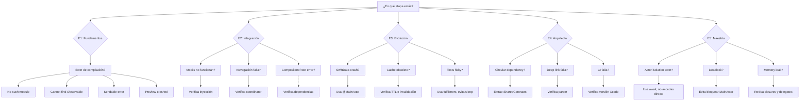

# Guía de Recuperación - Curso iOS

> ¿Te atascaste? No pasa nada. Aquí encontrarás diagnóstico y soluciones por etapa.

---

## Cómo usar esta guía

1. **Identifica tu etapa** (E1, E2, E3, E4, E5)
2. **Busca el síntoma** que describes tu problema
3. **Sigue los pasos** de recuperación
4. Si nada funciona, vuelve al checkpoint anterior y verifica que cumples todos los entregables

---

## Etapa 1: Fundamentos {#etapa-1}

### Síntoma: "No such module" al compilar

**Diagnóstico:** Xcode no encuentra un módulo que importaste.

**Pasos de recuperación:**

1. Verifica que el archivo existe en el proyecto (navegador izquierdo)
2. Si es un módulo de tu proyecto: Product → Clean Build Folder (Cmd+Shift+K)
3. Si es un package SPM: File → Packages → Reset Package Caches
4. Compila de nuevo (Cmd+B)

**Si persiste:**
- Revisa que el target del archivo esté incluido en tu app (Build Phases → Compile Sources)

---

### Síntoma: "Cannot find type 'Observable' in scope"

**Diagnóstico:** Estás usando `@Observable` pero tu clase no es compatible.

**Pasos de recuperación:**

1. Asegúrate de que tu clase sea un `class` (no struct):
```swift
@Observable
class MiViewModel {  // ✅ class, no struct
    var contador = 0
}
```

2. Si necesitas que sea struct, usa `@State` en lugar de `@Observable`:
```swift
struct MiViewModel {  // struct
    var contador = 0
}

// En la View:
@State private var viewModel = MiViewModel()  // ✅ @State para structs
```

---

### Síntoma: "Sendable conformance" error

**Diagnóstico:** Swift 6 requiere que los tipos compartidos entre actores sean Sendable.

**Pasos de recuperación:**

1. Si es un struct con propiedades simples, añade conformancia:
```swift
struct MiModel: Sendable {  // ✅ Añade : Sendable
    let id: String
    let nombre: String
}
```

2. Si tiene tipos no-Sendable (como `Date`), usa `@preconcurrency` o convierte:
```swift
struct MiModel: Sendable {
    let timestamp: TimeInterval  // ✅ TimeInterval es Sendable (Double)
    // ❌ NO: let date: Date
}
```

---

### Síntoma: Preview de SwiftUI no funciona / "Preview crashed"

**Diagnóstico:** El canvas de Xcode no puede renderizar la vista.

**Pasos de recuperación:**

1. Verifica que el preview no dependa de servicios reales:
```swift
#Preview {
    LoginView(viewModel: LoginViewModel(  // ✅ Inyecta dependencias
        useCase: MockLoginUseCase()  // Usa mock, no el real
    ))
}
```

2. Si usa `@Observable`, asegúrate de que el viewModel sea `var`:
```swift
struct LoginView: View {
    @State private var viewModel: LoginViewModel  // ✅ var, no let
}
```

3. Reinicia el canvas: Cmd+Option+Enter (cierra), Cmd+Option+Enter (abre)

---

## Etapa 2: Integración {#etapa-2}

### Síntoma: URLSession mock no funciona en tests

**Diagnóstico:** El test está llamando al servidor real en lugar del mock.

**Pasos de recuperación:**

1. Verifica que inyectas el `HTTPClient` en el Composition Root de tests:
```swift
// En tu test
let stubClient = HTTPClientStub(result: .success(mockData))
let repository = RemoteAuthRepository(httpClient: stubClient)  // ✅ Inyecta stub
```

2. NUNCA uses `URLSession.shared` directamente:
```swift
// ❌ MAL
let session = URLSession.shared

// ✅ BIEN
init(httpClient: HTTPClient) {
    self.httpClient = httpClient
}
```

---

### Síntoma: Navegación no funciona (no pasa de Login a Catalog)

**Diagnóstico:** El evento de navegación no está siendo manejado o el coordinator no está conectado.

**Pasos de recuperación:**

1. Verifica que emites el evento correcto:
```swift
// En LoginViewModel
coordinator.handle(.loginSucceeded)  // ✅ Evento semántico, no navegación directa
```

2. Verifica que el coordinator está en el entorno:
```swift
// En tu App
@State private var coordinator = AppCoordinator()

var body: some Scene {
    WindowGroup {
        ContentView()
            .environment(coordinator)  // ✅ Inyecta coordinator
    }
}
```

3. Verifica que la View accede al coordinator:
```swift
@Environment(AppCoordinator.self) private var coordinator  // ✅ Usa @Environment
```

---

### Síntoma: "Missing argument for parameter in call" en Composition Root

**Diagnóstico:** El Composition Root no tiene todas las dependencias necesarias.

**Pasos de recuperación:**

1. Revisa la firma del init del Composition Root:
```swift
struct AppCompositionRoot {
    private let httpClient: HTTPClient
    private let sessionStore: SessionStore  // ¿Falta esto?
    
    init(httpClient: HTTPClient, sessionStore: SessionStore) {  // ✅ Todos los parámetros
        self.httpClient = httpClient
        self.sessionStore = sessionStore
    }
}
```

2. Verifica que al crear el Composition Root pasas todo:
```swift
let root = AppCompositionRoot(
    httpClient: URLSessionHTTPClient(),  // ✅ httpClient
    sessionStore: UserDefaultsSessionStore()  // ✅ sessionStore
)
```

---

## Etapa 3: Evolución {#etapa-3}

### Síntoma: SwiftData crash "Context is nil" o threading error

**Diagnóstico:** Estás usando SwiftData en el hilo incorrecto o el contexto no está inicializado.

**Pasos de recuperación:**

1. Asegúrate de que las operaciones de SwiftData usen `@MainActor`:
```swift
@MainActor
class ProductStore {
    private let context: ModelContext
    
    func save(_ product: Product) throws {
        context.insert(product)  // ✅ MainActor garantiza hilo correcto
        try context.save()
    }
}
```

2. Si llamas desde un actor no-main, usa `MainActor.run`:
```swift
await MainActor.run {
    try? store.save(product)
}
```

---

### Síntoma: Cache devuelve datos obsoletos / no invalida

**Diagnóstico:** La política de invalidación no está funcionando o el TTL es incorrecto.

**Pasos de recuperación:**

1. Verifica que el TTL se calcula correctamente:
```swift
func isValid(createdAt: Date, ttl: TimeInterval) -> Bool {
    Date().timeIntervalSince(createdAt) < ttl  // ✅ Comparación correcta
}
```

2. Asegúrate de invalidar cuando hay escrituras:
```swift
func updateProduct(_ product: Product) async throws {
    try await remote.update(product)
    await cache.invalidate(product.id)  // ✅ Invalida después de escritura
}
```

---

### Síntoma: Tests async flaky (fallan intermitentemente)

**Diagnóstico:** Hay race conditions o los tests no esperan correctamente.

**Pasos de recuperación:**

1. Usa `await fulfillment` para expectativas async:
```swift
let expectation = expectation(description: "Carga completada")
Task {
    await viewModel.load()
    expectation.fulfill()
}
await fulfillment(of: [expectation], timeout: 5.0)  // ✅ Espera explícita
```

2. Evita `sleep` en tests; usa `Task.yield()` si necesitas:
```swift
// ❌ MAL
Thread.sleep(forTimeInterval: 0.1)

// ✅ BIEN (si es necesario)
await Task.yield()
```

---

## Etapa 4: Arquitecto {#etapa-4}

### Síntoma: SPM "circular dependency" error

**Diagnóstico:** Dos módulos dependen mutuamente entre sí.

**Pasos de recuperación:**

1. Identifica el ciclo:
```
FeatureA -> FeatureB -> FeatureA  // ❌ Ciclo
```

2. Extrae lo común a un tercer módulo:
```
FeatureA -> SharedContracts ⬅️ FeatureB  // ✅ Sin ciclo
```

3. O usa inversión de dependencias (protocolos en módulo compartido):
```swift
// En SharedContracts
public protocol FeatureBProtocol { }

// FeatureA depende del protocolo, no de FeatureB
```

---

### Síntoma: Deep link no funciona / no parsea correctamente

**Diagnóstico:** El parser de deep links no maneja el formato o el coordinator no recibe el evento.

**Pasos de recuperación:**

1. Verifica el formato del deep link:
```swift
// ✅ Formato correcto
myapp://product/123

// ❌ Formato incorrecto
myapp://product?id=123  // Query params requieren parsing diferente
```

2. Asegúrate de que el AppDelegate/SceneDelegate pasa el URL al coordinator:
```swift
func scene(_ scene: UIScene, openURLContexts URLContexts: Set<UIOpenURLContext>) {
    guard let url = URLContexts.first?.url else { return }
    coordinator.handle(.deepLink(path: url.path))  // ✅ Pasa al coordinator
}
```

---

### Síntoma: CI pipeline falla en GitHub Actions

**Diagnóstico:** El entorno CI no tiene las mismas configuraciones que tu Mac local.

**Pasos de recuperación:**

1. Verifica que el workflow usa la versión correcta de Xcode:
```yaml
- uses: maxim-lobanov/setup-xcode@v1
  with:
    xcode-version: '16.0'  # ✅ Misma versión que usas local
```

2. Asegúrate de que los tests no requieren simulador gráfico:
```swift
// ✅ Tests que funcionan en CI (headless)
func test_useCase() async { }

// ❌ Tests que pueden fallar en CI
func test_UI() {  // UI tests requieren simulador
    let app = XCUIApplication()
    app.launch()
}
```

---

## Etapa 5: Maestría {#etapa-5}

### Síntoma: "Actor-isolated property can not be mutated" error

**Diagnóstico:** Estás intentando modificar una propiedad de un actor desde fuera.

**Pasos de recuperación:**

1. Usa `await` para llamar métodos del actor:
```swift
actor MiActor {
    var contador = 0
    
    func incrementar() {
        contador += 1
    }
}

// ✅ Correcto
await miActor.incrementar()

// ❌ Incorrecto
miActor.contador += 1  // Error: actor-isolated
```

2. Si necesitas lectura, el actor debe exponer un método:
```swift
actor MiActor {
    private var contador = 0
    
    func getContador() -> Int {  // ✅ Método para acceder
        return contador
    }
}
```

---

### Síntoma: "Main actor deadlock" - UI congelada

**Diagnóstico:** Dos actores se están esperando mutuamente en el hilo principal.

**Pasos de recuperación:**

1. Evita llamadas síncronas desde `@MainActor` a otros actores:
```swift
@MainActor
class ViewModel {
    func cargar() async {
        // ✅ Correcto: await permite que MainActor se libere
        let datos = await repository.fetch()
        
        // ❌ Incorrecto: bloquearía MainActor
        // let datos = repository.fetch()  // Sin await
    }
}
```

2. Si necesitas sincronización compleja, considera `Task.detached`:
```swift
Task.detached {
    // Código que no bloquea MainActor
    await heavyComputation()
}
```

---

### Síntoma: Memory leak detectado en Instruments pero no veo el ciclo

**Diagnóstico:** Hay una referencia circular oculta (generalmente en closures o delegates).

**Pasos de recuperación:**

1. Revisa closures que capturen `self`:
```swift
// ❌ MAL: retain cycle
onCompletion = {
    self.actualizarUI()  // self retiene onCompletion, onCompletion retiene self
}

// ✅ BIEN: weak self
onCompletion = { [weak self] in
    self?.actualizarUI()
}
```

2. Si es un delegate, usa `weak var`:
```swift
// ✅ BIEN
weak var delegate: MiDelegate?

// ❌ MAL
var delegate: MiDelegate?  // Fuerte referencia, potencial ciclo
```

3. Verifica que no haya timers o observadores sin invalidate:
```swift
timer?.invalidate()  // ✅ En deinit o cuando ya no se necesita
timer = nil
```

---

## Diagnóstico general (flowchart)



---

## Si nada funciona

1. **Vuelve al checkpoint anterior** y verifica que cumples todos los entregables
2. **Compara tu código** con el código de ejemplo en la lección
3. **Pregunta en comunidad** (foro/Discord) describiendo:
   - Qué etapa estás haciendo
   - Qué error ves (copia el mensaje exacto)
   - Qué has intentado

---

## Recordatorio

> "No estar atascado es la excepción, no la norma. Lo importante es tener un sistema para salir del atasco."

Cada error que resuelves ahora es uno que no cometerás en producción. ¡Sigue adelante!

---

**Anterior:** [Quizzes de Autoevaluación ←](quizzes-autoevaluacion.md) · **Siguiente:** [Atlas visual de arquitectura →](diagramas/atlas-arquitectura.md)
